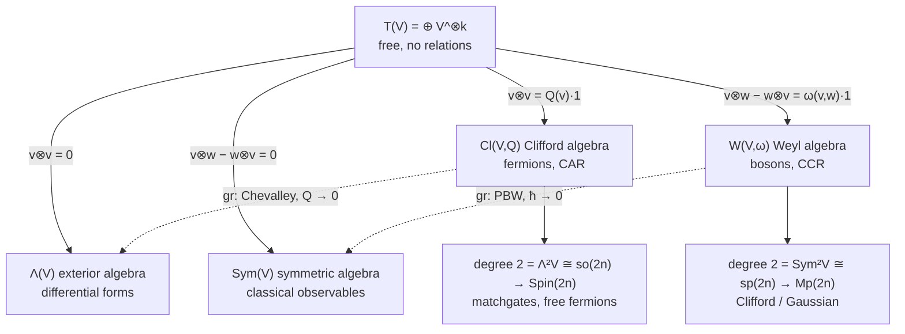
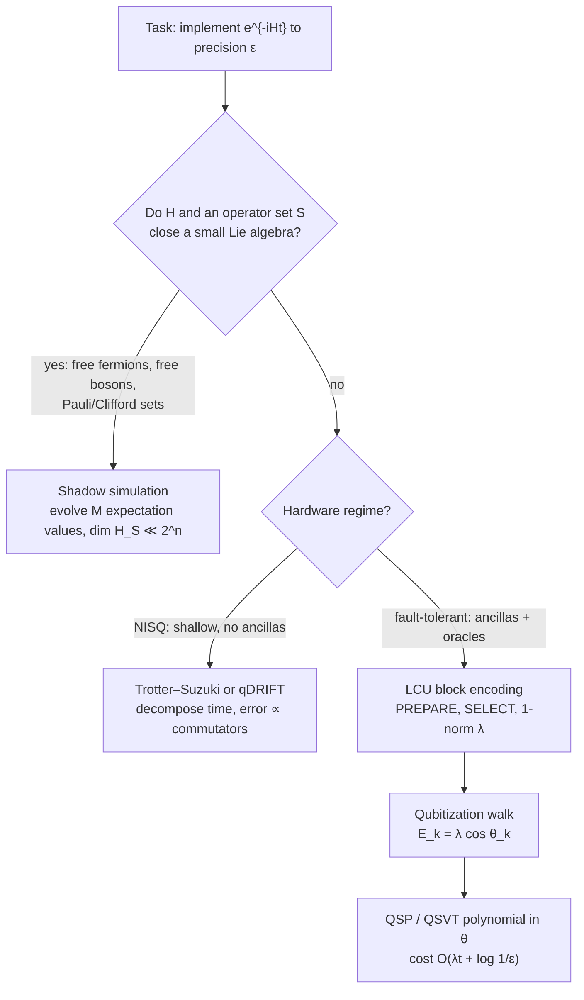
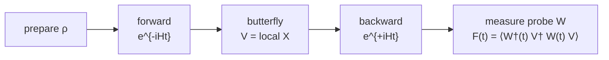

# Quantum Information Science

Alexander Del Toro Barba, PhD. [Google Scholar](https://scholar.google.com/citations?hl=en&user=fddyK-wAAAAJ) $\cdot$ [LinkedIn](https://www.linkedin.com/in/deltorobarba/)

 

1. Heisenberg-Weyl
> Every quantum gate is a time evolution U = e^{-i\hat Ht}. The physical and information-theoretic complexity of the gate is determined by the polynomial degree of the generator \hat H in the phase-space operators \hat Q, \hat P, and the criterion behind the ladder is whether that degree still closes under the commutator. Degree 1: displacements (Pauli / Heisenberg-Weyl). Degree 2: Gaussian / Clifford, classically simulable. Degree \geq 3: non-Gaussian / non-Clifford, universal, quantum advantage.
> 
1.1 The Quantum Harmonic Oscillator as Source of All Operators
Why the QHO is the starting point. Analytically, every smooth potential near a minimum is quadratic (Taylor expansion), so the QHO is the universal local model of any bound physical system. Algebraically, \hat Q^2 + \hat P^2 is the canonical degree-2 element of the Weyl algebra (\mathrm{Sym}^2 V \cong \mathfrak{sp}), the bosonic counterpart of the Dirac operator. Everything below is this one single generator, read at different polynomial degrees.
 * Time evolution = swap kinetic \leftrightarrow potential. At t=0 the state sits in Q; after a quarter period t = \frac{\pi}{2\omega} it has rotated 90° into P. That quarter turn is the QFT. In \hat U(t) = e^{-i\hat Ht/\hbar} the exponent is dimensionless: time is fundamentally an angle. States do not move along classical trajectories; their phase rotates, in an energy eigenstate at the angular frequency \omega = E/\hbar.
 * Why complex numbers. \hat a \propto \hat Q + i\hat P: the real axis represents position, the imaginary axis represents momentum, and the rotation e^{i\omega t} represents time evolution. Two real canonical coordinates merge into one complex amplitude \alpha = x + ip; unitary phase rotation preserves its magnitude.
 * ⚠️ Position basis = computational basis. \vert{}k\rangle are eigenstates of \hat Q. Hence Z (diagonal phase) is a function of position, while X (permutation / shift) is a function of momentum.
 * ⚠️ Two families of states, not gates:
   * Coherent states \vert{}\alpha\rangle = \hat D(\alpha)\vert{}0\rangle (eigenstates of the annihilation operator \hat a, overcomplete, generated as a degree-1 output).
   * Fock states \vert{}n\rangle (eigenstates of the number operator \hat n, orthonormal, forming the eigenbasis of the quadratic degree-2 generator).
Exponentiation produces the gates. Every unitary gate takes the form:
Here, e^{-i\theta} guarantees unitarity, \hat G is the Hermitian generator of the transformation, and \theta scales it. If \hat G = \hat H, then \theta = t/\hbar, meaning \hat H is time evolution itself. The generator is built directly from \hat Q, \hat P for continuous variables (CV) or from X, Z \pmod d for discrete qudits, grounded on the canonical commutation relations (CCR) [\hat x,\hat p] = i\hbar.
 * Gaussian (linear): Generator of degree \leq 2. ⚠️ "Linear" refers strictly to the Heisenberg action U^\dagger \hat r U = S\hat r + d, not to the generator itself. Symplectic phase-space structure is preserved.
 * Non-Gaussian (non-linear): Generator of degree \geq 3. The Heisenberg action itself becomes nonlinear (e.g., \hat p \to \hat p - 3\gamma t \hat q^2), and the Wigner function develops negative regions.
The conjugate relation. An operator generates the translation of its canonically conjugate variable. This mechanism enables the reciprocal basis change X \leftrightarrow Z via Fourier transform and underlies the Weyl displacement operator D_{q,p} = \tau^{qp} X^q Z^p.
 * Continuous: [\hat x, \hat p] = i\hbar.
 * Discrete: Weyl relation ZX = \zeta_d XZ.
Notation: \zeta_d = e^{2\pi i/d} is the primitive d-th root of unity; \tau = e^{i\pi/d} is the half-phase satisfying \tau^2 = \zeta_d. ⚠️ Many texts write \omega for \zeta_d, but here \omega is reserved exclusively for the oscillator frequency and the symplectic form.
Dictionary: from energy term to gate. The physical energy terms are quadratic, but the elementary gates exponentiate the linear field operators \hat P and \hat Q.
| Feature | Kinetic energy \hat P^2 | Potential energy \hat Q^2 |
|---|---|---|
| CV observable | \hat P = \frac{i}{\sqrt2}(\hat a^\dagger - \hat a), derivative \approx i(X^\dagger - X) | \hat Q = \frac{1}{\sqrt2}(\hat a + \hat a^\dagger), real eigenvalues (location k) |
| Lattice term | Hopping / Laplacian \approx X + X^\dagger (Google OTOC) | On-site potential (diagonal) |
| Qudit gate | Shift X^a\vert{}j\rangle = \vert{}j+a \bmod d\rangle, real off-diagonal permutation of 0s and 1s, eigenvalues powers of \zeta_d | Clock Z^b\vert{}k\rangle = \zeta_d^{bk}\vert{}k\rangle, diagonal phase gradient on the unit circle; for d>2 unitary but not Hermitian |
| Qubit gate | Pauli X, bit flip, \zeta_2 = -1 | Pauli Z, phase flip, (-1)^j; unitary and Hermitian, so directly observable |
| Matrix form | Real, off-diagonal permutation matrix | Diagonal matrix of complex phases |
| Gate as exponential | X \approx e^{-i\hat P\delta} | Z \approx e^{i\hat Q\delta} |
| Conjugation twist | X represents momentum but generates a position shift: D_{q,0} \sim X^q | Z represents position but generates a momentum kick: D_{0,p} \sim Z^p |
In the momentum basis, the spatial shift operator becomes diagonal and acts identically to the clock operator.
1.2 The Degree Ladder: from Heisenberg-Weyl Algebra to Quantum Gates
| Property | Degree 1: Displacements | Degree 2: Gaussian / Clifford | Degree \geq 3: Non-Gaussian / Non-Clifford |
|---|---|---|---|
| Generator | \hat H = q\hat P - p\hat Q | \hat Q^2 + \hat P^2, \hat Q^2 - \hat P^2, \hat Q_1\hat P_2 | \hat Q^3, \hat n^2 \sim (\hat Q^2 + \hat P^2)^2, many-body interactions |
| Lie algebra | ✅ Heisenberg \mathfrak{h}_n, \dim 2n+1, [\hat Q,\hat P] is central | ✅ Symplectic \mathfrak{sp}(2n,\mathbb{R}); combined with degree 1: semidirect product \mathfrak{sp}(2n) \ltimes \mathfrak{h}_n | ❌ Does not close: cubic \to quartic \to quintic \to \dots, generating an infinite-dimensional algebra |
| Action on phase space | Rigid slide to (q,p): no rotation, no volume/shape deformation | Linear symplectic map U^\dagger \hat r U = S\hat r with S \in \mathrm{Sp}(2n): rotations, shears, squeezing, entanglement | Phase space is curved nonlinearly; falls completely out of \mathrm{Sp}(2n) |
| Continuous variables (CV) | Displacement operator \hat D(\alpha) = e^{\alpha\hat a^\dagger - \alpha^*\hat a} | Metaplectic group \mathrm{Mp}(2n): phase rotator, squeezer, beam splitter, shear | Cubic phase gate e^{i\gamma\hat Q^3}, Kerr non-linearity e^{i\chi\hat n^2} |
| Discrete systems | Heisenberg-Weyl group: D_{q,p} = \tau^{qp}X^qZ^p; for d=2: Pauli group \mathcal{P} | Clifford group \mathcal{C} = \{U : U\mathcal{P}U^\dagger = \mathcal{P}\}, quotient \mathcal{C}/\mathcal{P} \cong \mathrm{Sp}(2n,\mathbb{Z}_d): QFT, Hadamard, S, C-SUM/CNOT | T, qudit T_d, Toffoli, CS. Contained in M_d(\mathbb{C}), but lies outside both HW and Clifford groups |
| Hierarchy classification | Level \mathcal{C}_1: forms an orthogonal operator basis of state space | Level \mathcal{C}_2: Gottesman–Knill theorem applies; efficient tracking of 2n\times 2n symplectic S instead of 2^n amplitudes | Levels \mathcal{C}_k for k\geq 3 are no longer groups; Clifford +T is dense in U(2^n): universal, magic begins here |
| Fermionic mirror | None. Degree 1 closes only under the anticommutator; fermionic parity superselection forbids odd Hamiltonians | Free fermions / matchgates (Valiant): \mathfrak{so}(2n) \to \mathrm{Spin}(2n), same theorem as Gottesman–Knill with SO/Spin in place of Sp/Mp | Degree 3 missing due to parity constraints; classical non-simulability begins strictly at degree 4 (e.g. Hubbard interaction n_\uparrow n_\downarrow) |
Degree 1 Notes
 * The phase factor \tau^{qp} in D_{q,p} = \tau^{qp}X^qZ^p is required because X and Z do not commute; it represents an Aharonov–Bohm geometric phase effect directly on discrete phase space.
 * ⚠️ Pauli Y is not independent: \sigma_y = i\sigma_x\sigma_z is merely the (1,1) grid point on the discrete phase space. For d=3, none of XZ, XZ^2, X^2Z, \dots is uniquely "Y"; they simply represent the generic displacement operators D_{q,p} with q,p \neq 0.
Degree 2 Notes
Gaussian continuous gates and discrete Clifford gates represent the exact same algebraic generators viewed through continuous versus discrete lenses:
| CV (Gaussian) | Generator | Action | Discrete (Clifford) |
|---|---|---|---|
| Rotator R(\theta) = e^{-i\theta\hat n} | \hat Q^2 + \hat P^2 | Phase rotation; at \theta = \pi/2 this is the Fourier transform | QFT \vert{}j\rangle \to \frac{1}{\sqrt d}\sum_k \zeta_d^{jk}\vert{}k\rangle, fulfilling WXW^\dagger = Z; Hadamard for d=2 |
| Squeezer \hat S(r) | \hat Q^2 - \hat P^2 | Anisotropic scaling: Q \to e^{-r}Q, P \to e^{r}P | — |
| Shear | \hat Q^2 | Momentum translation dependent on position: P \to P + Q | Phase gate S = \mathrm{diag}(1,i,\dots): maps X \to Y \sim XZ, imparts quadratic phase k^2 |
| Beam splitter \hat B(\theta) | \hat Q_1\hat P_2 - \hat Q_2\hat P_1 | Passive energy-preserving mode rotation; \theta = \pi/4 yields 50:50 ratio | — |
| Squeezer + beam splitter | — | Ellipse rotated by 45°: noise correlated across canonical axes = entanglement | C-SUM / CNOT = e^{-i\hat Q_1\hat P_2}: maps \vert{}c\rangle\vert{}t\rangle \to \vert{}c\rangle\vert{}t\oplus c\rangle |
 * ➕ Gottesman–Knill, quantitatively: A stabilizer state on n qubits is uniquely specified by n independent, commuting Pauli operators. This state is represented by an n\times 2n binary tableau plus phases. The CHP simulator (Aaronson, Gottesman, PRA 2004) updates this structure in O(n) time per Clifford gate and O(n^2) time per measurement. The underlying tracked group is strictly finite:
   Contrasting this with an \epsilon-net covering the full unitary space U(2^n) of size \exp(\Theta(4^n\log(1/\epsilon))), that polynomial-to-double-exponential ratio is the formal simulability statement: only polynomially many classical bits are needed to characterize the entire reachable Clifford sub-manifold.
Degree \geq 3 Notes
 * Cubic phase transforms a circular Gaussian coherent state into a non-Gaussian "banana" distribution exhibiting negative Wigner quasi-probability regions—the canonical signature of quantum non-classicality.
 * Kerr non-linearity (quartic, degree 4) creates superposition cat states, serving as the physical foundation for continuous-variable bosonic quantum error-correcting codes.
 * T gate (e^{-i\frac{\pi}{8}\hat Z}) is the discrete cubic phase mod 2. Its qudit analogue T_d\vert{}k\rangle = \zeta_d^{k^3}\vert{}k\rangle matches the continuous cubic potential V(\gamma) = e^{i\gamma\hat x^3}.
 * ⚠️ The Heisenberg-Weyl operator basis remains formally valid (a T gate can be expressed as a linear combination of Pauli operators), but the number of operator terms blows up exponentially under nested commutators/conjugations. This branching expansion is the exact mathematical locus where efficient classical simulation breaks down.
 * ➕ The Clifford hierarchy, defined:
   The T gate belongs to level \mathcal{C}_3. Operationally, any gate residing in \mathcal{C}_k can be implemented via gate teleportation utilizing a dedicated resource state accompanied solely by feed-forward Clifford corrections drawn from level k-1. This inductive property is why the T gate is the canonical "one step beyond" stabilizer circuits. For k\geq 3, the sets \mathcal{C}_k are no longer groups (closure under operator products fails), mirroring the non-closing Lie brackets of degree \geq 3 generators.
 * ➕ Classical simulation overhead of magic: The stabilizer rank \chi of \vert{}T\rangle^{\otimes t} is defined as the minimal number of pure stabilizer states required to express that tensor product state. Bravyi & Gosset (PRL 2016) established \chi \lesssim 2^{0.47t}, refined to \approx 2^{0.396t} by Bravyi, Browne, Calpin, Campbell, Gosset, and Howard (Quantum 2019). The simulation runtime scale is strictly polynomial in the qubit count n and linear/polynomial in \chi, meaning the simulation cost is exponential only in the count of non-Clifford magic gates, not in the physical qubit number.
 * Continuous-variable mirror: Gaussian circuits are classically simulable in polynomial time (Bartlett, Sanders, Braunstein, Nemoto, PRL 2002). Classical simulation via quasiprobability sampling (Pashayan, Wallman, Bartlett, PRL 2015) scales exponentially with the total integrated Wigner negativity, which acts as the continuous non-Gaussian resource budget.
 * Magic state distillation (Bravyi, Kitaev, PRA 2005) is the fault-tolerant inverse: consuming multiple noisy copies of magic states \vert{}T\rangle via strictly transversal Clifford operations purifies them into high-fidelity target states. Consequently, the T-count serves as the universal computational cost currency for fault-tolerant quantum compilers.
Structural Trajectory of the Framework
The polynomial degree of a generator in the phase-space operators \hat Q, \hat P (or X, Z \pmod d) serves as the unifying organizational principle across the theory:
 * Degree \leq 2 closes under the commutator algebra, preserving symplectic phase space geometry and remaining efficiently simulable classically.
 * Degree \geq 3 breaks algebraic closure, producing operator growth that unlocks universality, quantum magic, and genuine computational advantage.
 * Chapter 1 derives this entire ladder from the quantum harmonic oscillator and the Weyl tensor algebra.
 * Chapter 2 encounters this ladder again as the foundational exception enabling cheap Hamiltonian simulation (shadow simulation, fast-forwarding of linear/quadratic models) and identifies degree \geq 3 as the root driver of chaotic scrambling dynamics (out-of-time-ordered correlators, OTOCs).
 * Chapter 3 leverages this hierarchy as the tunable magic dial for learnable quantum state classes, using the degree-1 Heisenberg-Weyl displacements D_{q,p} as the operator basis through which two-copy Bell measurements reconstruct unknown quantum spectra.

  

## 1. Heisenberg-Weyl

> Every quantum gate is a time evolution $U = e^{-i\hat Ht}$. The physical and information-theoretic complexity of the gate is set by the **polynomial degree of the generator $\hat H$ in the phase-space operators $\hat Q, \hat P$**, and the criterion behind the ladder is whether that degree still **closes under the commutator**. Degree 1: displacements (Pauli / Heisenberg-Weyl). Degree 2: Gaussian / Clifford, classically simulable. Degree $\geq 3$: non-Gaussian / non-Clifford, universal, quantum advantage.

### 1.1 The harmonic oscillator as the source of all operators

$$\hat H \propto \hat P^2 + \hat Q^2 = \hbar\omega\left(\hat a^\dagger\hat a + \tfrac12\right) = \hbar\omega(\hat n + \tfrac12)$$

**Why the QHO is *the* starting point.** Analytically, every smooth potential near a minimum is quadratic (Taylor), so the QHO is the universal local model of any bound system. Algebraically, $\hat Q^2 + \hat P^2$ is *the* canonical degree-2 element of the Weyl algebra ($\mathrm{Sym}^2 V \cong \mathfrak{sp}$), the bosonic counterpart of the Dirac operator. Everything below is this one generator, read at different degrees.

* **Time evolution swaps kinetic and potential.** At $t=0$ the state sits in $Q$; after $t = \pi/2\omega$ it has rotated $90°$ into $P$. **That quarter turn is the QFT.** In $\hat U(t) = e^{-i\hat Ht/\hbar}$ the exponent is dimensionless: time is an angle, states do not move along trajectories, their phase rotates at $\omega = E/\hbar$.
* **Why complex numbers.** $\hat a \propto \hat Q + i\hat P$: real axis position, imaginary axis momentum, rotation $e^{i\omega t}$ time. Two real numbers become one complex amplitude; rotation preserves magnitude (unitary).
* ⚠️ **Position basis = computational basis.** $|k\rangle$ are eigenstates of $\hat Q$, so $Z$ (diagonal) is a function of position and $X$ (permutation) a function of momentum.
* ⚠️ **Two families of *states*, not gates:** coherent states $|\alpha\rangle = \hat D(\alpha)|0\rangle$ (eigenstates of $\hat a$, overcomplete, degree-1 output) vs. Fock states $|n\rangle$ (eigenstates of $\hat n$, orthonormal, eigenbasis of the degree-2 generator).

**Exponentiation produces the gates.** $\hat U = e^{-i\hat G\theta}$: $\hat G$ is the transformation, $\theta$ scales it, and if $\hat G = \hat H$ then $\theta = t/\hbar$, so $\hat H$ *is* time evolution. The generator is built from $\hat Q, \hat P$ for continuous variables or from $X, Z$ mod $d$ for qudits, on top of the CCR $[\hat x,\hat p] = i\hbar$. **Gaussian** means degree $\leq 2$; ⚠️ "linear" refers to the *Heisenberg action* $U^\dagger \hat r U = S\hat r + d$, not to the generator. **Non-Gaussian** means degree $\geq 3$: the Heisenberg action itself becomes nonlinear ($\hat p \to \hat p - 3\gamma t \hat q^2$) and the Wigner function goes negative.

**The conjugate relation.** An operator generates the translation of its conjugate variable. This is what allows the basis change $X \leftrightarrow Z$ via Fourier transform, and underlies $D_{q,p} = \tau^{qp} X^q Z^p$. Continuous: $[\hat x, \hat p] = i\hbar$. Discrete: Weyl relation $ZX = \zeta_d XZ$. *Notation:* $\zeta_d = e^{2\pi i/d}$ is the primitive $d$-th root of unity, $\tau = e^{i\pi/d}$ the half-phase with $\tau^2 = \zeta_d$ (⚠️ many texts write $\omega$ for $\zeta_d$; here $\omega$ is the oscillator frequency and the symplectic form).

**Dictionary: from energy term to gate.** The energy terms are quadratic, but the **gates** exponentiate the *linear* parts $\hat P$ and $\hat Q$.

| | **Kinetic energy $\hat P^2$** | **Potential energy $\hat Q^2$** |
| --- | --- | --- |
| **CV observable** | $\hat P = \frac{i}{\sqrt2}(\hat a^\dagger - \hat a)$, derivative $\approx i(X^\dagger - X)$ | $\hat Q = \frac{1}{\sqrt2}(\hat a + \hat a^\dagger)$, real eigenvalues (location $k$) |
| **Qudit gate** | **Shift** $X^a\vert{}j\rangle = \vert{}j+a \bmod d\rangle$, real permutation, eigenvalues powers of $\zeta_d$ | **Clock** $Z^b\vert{}k\rangle = \zeta_d^{bk}\vert{}k\rangle$, diagonal phase gradient; for $d>2$ unitary but not Hermitian |
| **Qubit gate** | **Pauli $X$**, bit flip, $\zeta_2 = -1$ | **Pauli $Z$**, phase flip, $(-1)^j$; unitary *and* Hermitian, so directly observable |
| **Gate as exponential** | $X \approx e^{-i\hat P\delta}$ | $Z \approx e^{i\hat Q\delta}$ |
| **Conjugation twist** | $X$ *represents* momentum but *generates* a position shift: $D_{q,0} \sim X^q$ | $Z$ *represents* position but *generates* a momentum kick: $D_{0,p} \sim Z^p$ |

$X = \mathrm{DFT}^\dagger\, Z\, \mathrm{DFT}$: in the momentum basis the shift is diagonal and looks like the clock.

### 1.2 The degree ladder: from Heisenberg-Weyl algebra to quantum gates

| | **Degree 1: Displacements** | **Degree 2: Gaussian / Clifford** | **Degree $\geq 3$: Non-Gaussian / Non-Clifford** |
| --- | --- | --- | --- |
| **Generator** | $\hat H = q\hat P - p\hat Q$ | $\hat Q^2 + \hat P^2$, $\hat Q^2 - \hat P^2$, $\hat Q_1\hat P_2$ | $\hat Q^3$, $\hat n^2 \sim (\hat Q^2 + \hat P^2)^2$, many-body |
| **Lie algebra** | ✅ Heisenberg $\mathfrak{h}_n$, $\dim 2n+1$, $[\hat Q,\hat P]$ central | ✅ Symplectic $\mathfrak{sp}(2n,\mathbb{R})$, with degree 1: $\mathfrak{sp}(2n) \ltimes \mathfrak{h}_n$ | ❌ Does not close: cubic $\to$ quartic $\to$ quintic $\to \dots$, infinite-dimensional |
| **Action on phase space** | *Slide* to $(q,p)$, no rotation, no shape change | *Linear* map $U^\dagger \hat r U = S\hat r$, $S \in \mathrm{Sp}(2n)$: rotations, shears, entanglement | *Curved* nonlinearly, falls out of $\mathrm{Sp}(2n)$ |
| **CV** | $\hat D(\alpha) = e^{\alpha\hat a^\dagger - \alpha^*\hat a}$ | Metaplectic $\mathrm{Mp}(2n)$: rotator, squeezer, beam splitter, shear | Cubic phase $e^{i\gamma\hat Q^3}$, Kerr $e^{i\chi\hat n^2}$ |
| **Discrete** | HW group: $D_{q,p} = \tau^{qp}X^qZ^p$; $d=2$: Pauli group $\mathcal{P}$ | Clifford $\mathcal{C} = \{U : U\mathcal{P}U^\dagger = \mathcal{P}\}$, $\mathcal{C}/\mathcal{P} \cong \mathrm{Sp}(2n,\mathbb{Z}_d)$: QFT, Hadamard, $S$, C-SUM/CNOT | $T$, qudit $T_d$, Toffoli, CS. In $M_d(\mathbb{C})$ but in neither HW nor Clifford |
| **Hierarchy** | $\mathcal{C}_1$, orthogonal basis of operator space | $\mathcal{C}_2$, **Gottesman–Knill**: track $2n\times 2n$ symplectic $S$ instead of $2^n$ amplitudes | $\mathcal{C}_k$ for $k\geq 3$ no longer groups; Clifford $+T$ dense in $U(2^n)$: **universal, magic starts here** |
| **Fermionic mirror** | **None.** Degree 1 closes only under the *anti*commutator; parity superselection forbids odd Hamiltonians | **Free fermions / matchgates** (Valiant): $\mathfrak{so}(2n) \to \mathrm{Spin}(2n)$, same theorem as Gottesman–Knill with $SO$/Spin instead of $Sp$/Mp | **Degree 3 missing** (parity). Non-simulability starts at **degree 4**, e.g. Hubbard $n_\uparrow n_\downarrow$ |

**Degree 1.** The phase factor $\tau^{qp}$ in $D_{q,p}$ is required because $X$ and $Z$ do not commute (an Aharonov–Bohm effect in phase space). ⚠️ **Pauli $Y$ is not independent**: $\sigma_y = i\sigma_x\sigma_z$ is the $(1,1)$ point on the grid; for $d=3$ none of $XZ, XZ^2, X^2Z, \dots$ is uniquely "$Y$".

**Degree 2.** The Gaussian gates and their discrete Clifford twins are the same generators read in two settings:

| CV (Gaussian) | Generator | Action | Discrete (Clifford) |
| --- | --- | --- | --- |
| **Rotator** $R(\theta) = e^{-i\theta\hat n}$ | $\hat Q^2 + \hat P^2$ | Rotation; at $\theta = \pi/2$ **is** the Fourier transform | **QFT** $\vert{}j\rangle \to \frac{1}{\sqrt d}\sum_k \zeta_d^{jk}\vert{}k\rangle$, $WXW^\dagger = Z$; **Hadamard** for $d=2$ |
| **Squeezer** $\hat S(r)$ | $\hat Q^2 - \hat P^2$ | $Q \to e^{-r}Q$, $P \to e^{r}P$ | |
| **Shear** | $\hat Q^2$ | $P \to P + Q$ | **Phase gate $S$** $= \mathrm{diag}(1,i,\dots)$: $X \to Y \sim XZ$, quadratic phase $k^2$ |
| **Squeezer + beam splitter** $\hat B(\theta)$ | $\hat Q_1\hat P_2 - \hat Q_2\hat P_1$ | Ellipse rotated $45°$: noise correlated between axes = **entanglement** | **C-SUM / CNOT** $= e^{-i\hat Q_1\hat P_2}$: $\vert{}c\rangle\vert{}t\rangle \to \vert{}c\rangle\vert{}t\oplus c\rangle$ |

*Gottesman–Knill, quantitatively.* A stabilizer state on $n$ qubits is fixed by $n$ commuting Paulis, stored as an $n\times 2n$ binary tableau plus phases, updated in $O(n)$ per Clifford gate and $O(n^2)$ per measurement (Aaronson, Gottesman, PRA 2004). The tracked group is finite, $|\mathcal{C}_n/\mathcal{P}_n| = |\mathrm{Sp}(2n,\mathbb{Z}_2)| \approx 2^{2n^2+n}$, against an $\epsilon$-net of $U(2^n)$ of size $\exp(\Theta(4^n\log(1/\epsilon)))$. That ratio *is* the simulability statement: polynomially many bits describe the reachable set.

**Degree $\geq 3$.** A **cubic phase** turns a coherent-state circle into a "banana" with negative Wigner regions; **Kerr** (quartic) builds cat states, the basis of bosonic codes. The **$T$ gate** $= e^{-i\frac{\pi}{8}Z}$ is the cubic phase mod 2, with qudit analogue $T_d|k\rangle = \zeta_d^{k^3}|k\rangle$, exactly like $V(\gamma) = e^{i\gamma\hat x^3}$. ⚠️ The HW language stays formally valid ($T$ *can* be written as a Pauli sum), but the number of terms grows under nesting; that is precisely where classical simulation breaks down.

* **The Clifford hierarchy** (Gottesman, Chuang, Nature 1999): $\mathcal{C}_1 = \mathcal{P}$, $\mathcal{C}_k = \{U : U P U^\dagger \in \mathcal{C}_{k-1}\ \forall P\in\mathcal{P}\}$. $T \in \mathcal{C}_3$, and a $\mathcal{C}_k$ gate can be teleported with a resource state plus level-$(k-1)$ corrections, the operational reason $T$ is the canonical "one step beyond". For $k\geq 3$ the sets are not groups, matching the non-closing Lie bracket.
* **Cost of a $T$ gate, classically.** The **stabilizer rank** of $|T\rangle^{\otimes t}$ is bounded by $\approx 2^{0.396t}$ (Bravyi, Gosset, PRL 2016; Bravyi et al., Quantum 2019), so simulation cost is exponential only in the *count of magic gates*, not in the qubit number. The CV mirror is quasiprobability sampling at a cost exponential in the total Wigner negativity (Pashayan, Wallman, Bartlett, PRL 2015). **Magic state distillation** (Bravyi, Kitaev, PRA 2005) is the fault-tolerant inverse, which is why $T$-count is the accounting unit of fault-tolerant compilers.

*The polynomial degree of a generator in the phase-space operators $\hat Q, \hat P$ (or $X, Z$ mod $d$). Degree $\leq 2$ closes under the commutator and is classically simulable; degree $\geq 3$ does not close, and that is where universality, magic and quantum advantage begin. Chapter 1 derives this ladder from the harmonic oscillator and the tensor algebra. Chapter 2 meets it again as the exception that makes Hamiltonian simulation cheap (shadow simulation, fast-forwarding) and as the reason chaotic dynamics are hard (OTOCs). Chapter 3 meets it as the magic dial of learnable state classes, and uses the degree-1 operators, the Heisenberg-Weyl displacements $D_{q,p}$, as the basis in which two-copy Bell measurements read out a spectrum.*

### 1.3 Tensor algebra $T(V)$: one recipe, four algebras

*The recipe: quotient the tensor algebra by a two-sided ideal generated in degree 2. The knob: the **parity of the bilinear form** in that ideal (symmetric $Q$ or antisymmetric $\omega$), plus whether you switch its value on at all.*

*Solid arrows: quotient by the ideal on the label (upper two homogeneous, lower two inhomogeneous, i.e. quantized). Dashed arrows: the associated-graded functor, dequantization. Note the parity crossing: the symmetric form lands in the exterior square, the antisymmetric form in the symmetric square.*

| | **Symmetric form $Q$** | **Antisymmetric form $\omega$** |
| :--- | :--- | :--- |
| **Form off** (classical) | $\Lambda(V)$, exterior | $\mathrm{Sym}(V)$, symmetric |
| **Form on** (quantized) | $\mathrm{Cl}(V,Q)$, **fermions**, CAR | $W(V,\omega)$, **bosons**, CCR |

**Step 0, the source.** $T(V) = \bigoplus_k V^{\otimes k}$: associative, non-commutative, no relations. All four algebras are $T(V)/I$ and differ only in the ideal $I$.

**Step 1, homogeneous ideal (degree 2 $= 0$).** $\Lambda(V) = T(V)/\langle v\otimes v\rangle$ gives $v\wedge w = -w\wedge v$: differential forms, cohomology. $\mathrm{Sym}(V) = T(V)/\langle v\otimes w - w\otimes v\rangle$ gives $vw = wv$: polynomials, classical observables on phase space. The $\mathbb{Z}$-grading survives.

**Step 2, switch the form on (the right-hand side becomes a number: this is quantization).** $\mathrm{Cl}(V,Q) = T(V)/\langle v\otimes v - Q(v)\mathbf{1}\rangle$ gives $vw + wv = 2Q(v,w)$: a vector squares to its length. $W(V,\omega) = T(V)/\langle v\otimes w - w\otimes v - \omega(v,w)\mathbf{1}\rangle$ gives $[v,w] = \omega(v,w)$: the commutator is a number, $[\hat q,\hat p] = i\hbar\mathbf{1}$. ⚠️ The ideal is now **inhomogeneous** (degree 2 mixed with degree 0), so the $\mathbb{Z}$-grading collapses to a **filtration**: *grading $\to$ filtration is what quantization means algebraically.* The deformation changes the product, not the space: PBW monomials $\hat q^a\hat p^b$ are a basis of both $\mathrm{Sym}$ and $W$.

**⚠️ The twist: parity flips between input and output.** A symmetric input $g$ builds $\mathrm{Cl}(V,g)$, whose degree-2 part is the **exterior** square $\mathfrak{so} \cong \Lambda^2 V$ (via $\frac14[e_i,e_j]$) $\to$ Spin $\to$ **fermions**. An antisymmetric input $\omega$ builds $W(V,\omega)$, whose degree-2 part is the **symmetric** square $\mathfrak{sp} \cong \mathrm{Sym}^2 V$ (via $\frac12\{\hat r_i,\hat r_j\}$) $\to$ metaplectic $\to$ **bosons**. In supersymmetry both are one construction on $\mathbb{Z}_2$-graded spaces.

**Step 3, the way back ($\mathrm{gr}$).** Dequantization keeps only the top-degree part of each relation: $\mathrm{gr}\,\mathrm{Cl}(V,Q) \cong \Lambda(V)$ (**Chevalley**, $Q \to 0$) and $\mathrm{gr}\,W(V,\omega) \cong \mathrm{Sym}(V)$ (**PBW**, $\hbar \to 0$). ⚠️ These are **one theorem**: super-PBW on $\mathbb{Z}_2$-graded spaces *is* Chevalley. The Lie route has the same shape of ideal, $U(\mathfrak{g}) = T(\mathfrak{g})/\langle x\otimes y - y\otimes x - [x,y]\rangle$: bosonic $A_n = U(\mathfrak{h}_n)/(Z-1)$, fermionic $\mathrm{Cl}(V,Q) = U(\mathfrak{h}^{\mathrm{super}})/(Z-1)$ with anticommutator bracket.

| | **Fermions: $\mathrm{Cl}(V,Q)$** | **Bosons: $W(V,\omega)$** |
| --- | --- | --- |
| **Statistics** | CAR $\{a_i,a_j^\dagger\} = \delta_{ij}$, $\{\gamma_\mu,\gamma_\nu\} = 2g_{\mu\nu}$ | CCR $[a_i,a_j^\dagger] = \delta_{ij}$, $[\hat x,\hat p] = i\hbar$ |
| **Size** | $\dim = 2^n$, the relation truncates powers | $\dim = \infty$; **no finite-dimensional rep**: $\mathrm{tr}[A,B] = 0$ but $\mathrm{tr}(i\hbar\mathbf{1}) \neq 0$ |
| **Uniqueness** | Unique spinor module | **Stone–von Neumann** |
| **Symmetry tower** | $\mathrm{O}(V,g) \supset \mathfrak{so}(n)$, $\dim \frac{n(n-1)}{2}$, cover $\mathrm{Spin}(n)$ | $\mathrm{Sp}(2n) \supset \mathfrak{sp}(2n)$, $\dim n(2n+1)$, cover $\mathrm{Mp}(2n)$ |
| **QC bridge** | Matchgates / free fermions = rotor in $\mathrm{Spin}(2n)$; non-free from **degree 4** | Clifford / Gaussian = symplectic action; magic from **degree 3** |

⚠️ The QC bridge is **structurally one theorem**, once for $SO$/Spin, once for $Sp$/Mp. The sharpest difference is size: bosons need unbounded operators on infinite-dimensional space, fermions act on a finite spinor space.

### 1.4 From Weyl algebra to Heisenberg-Weyl: how bosons reach actual qudits

| | **Continuous** | **Discrete** |
| --- | --- | --- |
| **Additive** (Lie bracket) | Weyl algebra $A_n = W(V,\omega)$: all polynomials in $\hat q,\hat p$, home of Hamiltonians and the degree filter | ⚠️ **Does not exist.** Trace argument: $\mathrm{Tr}([\hat q,\hat p]) = 0$ but $\mathrm{Tr}(i\hbar\mathbf{1}) = i\hbar d \neq 0$ |
| **Multiplicative** (operator product) | Heisenberg group $H_n$ / CCR $C^*$-algebra: $W(z)W(z') = e^{-\frac{i}{2}\omega(z,z')}W(z+z')$ | HW algebra $M_d(\mathbb{C}) \cong \mathbb{C}_\omega[\mathbb{Z}_d \times \mathbb{Z}_d]$, spanned by the $d^2$ matrices $X^qZ^p$ |

**Trace vs. determinant.** At group level the test uses $\det$: $\det(ZXZ^{-1}X^{-1}) = 1$ must equal $\det(\zeta_d\mathbf{1}) = \zeta_d^d = 1$ ✓. The additive constraint is *unsatisfiable*, the multiplicative one *automatically satisfied*. That is why $ZX = \zeta_d XZ$ exists in exact $d\times d$ matrices, and that is the whole route from Weyl algebra to Heisenberg-Weyl. Between the boxes: up by $\exp$ (BCH terminates because $[\hat Q,\hat P]$ is central), down by differentiating at the identity, sideways by the group algebra (span, ⚠️ not $\exp$). The limit $d \to \infty$ turns $ZX = \zeta_d XZ$ back into $[\hat Q,\hat P] = i\hbar\mathbf{1}$.

**Stone–von Neumann.** Every irreducible, strongly continuous unitary representation of the Weyl relations for *finitely many* degrees of freedom is unitarily equivalent to the Schrödinger representation on $L^2(\mathbb{R}^n)$: position and momentum representations are the same physics in different coordinates, with the Fourier transform as intertwiner, and $M_d(\mathbb{C})$ likewise has one irreducible representation of $ZX = \zeta_d XZ$, which is why "the" qudit clock and shift are canonical. ⚠️ The theorem **fails** for infinitely many degrees of freedom (quantum field theory, thermodynamic limit): inequivalent representations exist, which is Haag's theorem and the origin of superselection sectors.

### 1.5 The symplectic form

A **form** evaluates to a scalar ($0$-form function, $1$-form covector, $2$-form bilinear form) and integrates over oriented submanifolds without coordinates. The **symplectic form $\omega$** is a $2$-form that is **alternating** (pointwise antisymmetric), **closed** ($d\omega = 0$, no local curvature invariants) and **non-degenerate** (forces **even dimension** $2n$, positions paired with momenta, and yields the **Liouville volume form** $\omega^n$).

Two consequences used elsewhere in this document. *Darboux:* locally every symplectic manifold looks like $(\mathbb{R}^{2n},\sum_i dq_i\wedge dp_i)$, so the only structure a Gaussian/Clifford operation can preserve is $\omega$ itself; that is why $\mathrm{Sp}(2n)$ (continuous) and $\mathrm{Sp}(2n,\mathbb{Z}_d)$ (discrete, $\omega(z,z') = qp' - q'p \bmod d$) are the structure groups of degree 2. *Liouville:* $\omega^n$ is preserved by Hamiltonian flow, and its quantum shadow is unitarity; a Wigner function is a density on this volume form, and Hudson's theorem says that degree $\leq 2$ dynamics keep it a probability density.

## 2. Quantum Dynamics

> Every simulation technique in chemistry and physics sits on three axes: **Model** (classical vs. quantum), **Type** (static vs. dynamic), **Computing** (classical vs. quantum). *Quantum dynamics* is the cell "quantum model, dynamic type", and its hard core is propagating $|\psi(t)\rangle = e^{-iHt}|\psi(0)\rangle$ in a $2^n$-dimensional Hilbert space. Static problems are **optimized** (variational principle); dynamic problems must be **propagated** (no forward theorem). On a quantum computer, propagation follows one of three structural strategies: decompose *time* (Trotter), transform the *spectrum* (Qubitization / QSVT), or shrink the *space* (Shadow Simulation).

### 2.1 The map: three axes

| Model / Computing | **Static** (state, ground state) | **Dynamic** (time evolution) |
| --- | --- | --- |
| **Classical / Classical** | **Docking, energy minimization:** geometric fitting (AutoDock, Rosetta) | **Molecular dynamics:** $F = ma$, atoms as mass points with force fields (GROMACS, NAMD, AMBER) |
| **Quantum / Classical** | **HF, DFT, Post-HF:** $\hat H\vert{}\psi\rangle = E\vert{}\psi\rangle$. HF ignores correlation, DFT approximates it via density $\rho$, Post-HF (CC, CI) is exact but exponential in $N$ | **TD-DFT:** excitations, spectra, fluorescence. Exact $e^{-i\hat Ht/\hbar}\vert{}\Psi(0)\rangle$ scales exponentially in $N$ |
| **Quantum / Quantum** | **VQE (NISQ):** correlation energy via entanglement, $\delta\langle H\rangle = 0$ | **Hamiltonian simulation:** exponentiation in $2^n$-dim Hilbert space via Trotter, Qubitization/QSVT, or Shadow Simulation |

Classical models treat atoms as spheres connected by springs; quantum models bring electrons, orbitals and correlation into play. Static means the eigenvalue problem $\hat H|\psi\rangle = E|\psi\rangle$, dynamic the time evolution $i\hbar\,\partial_t\Psi = \hat H\Psi$. *Perspective, not part of quantum dynamics:* quantum computers for *classical* dynamics (Navier–Stokes via HHL, weather on a fine grid). Same hardware, different application.

**Static vs. dynamic.** If $\psi$ is an eigenstate, time evolution is trivial, $\Psi(t) = \psi e^{-iEt/\hbar}$, and finding binding energies is a search for minima in an energy landscape (Rayleigh–Ritz, VQE). Dynamics has no variational principle and no forward theorem: reaction dynamics, bond breaking, excitations and quantum chaos cannot be optimized, they must be propagated. **Fundamental axiom:** in static problems the quantum computer *stores* information. In full dynamical evolution it stores nothing: **it *is* the Hilbert space.**

### 2.2 Static quantum chemistry: the approximation stack

The Schrödinger equation is exactly solvable only for the one-electron hydrogen atom; a second electron adds Coulomb repulsion, a non-integrable three-body problem. Everything else is a stack: **Born–Oppenheimer** (nuclei fixed on electronic timescales, giving the potential energy surface), **Rayleigh–Ritz** (minimize $\langle\psi|H|\psi\rangle$), and then the actual difficulty, the **correlation energy**:

| Method | Correlation | Cost |
| --- | --- | --- |
| **Hartree–Fock** | Mean field, ignores correlation | Cheap |
| **DFT** | Approximated via functionals of the electron density $\rho$ (correct functional must be assumed) | Cheap |
| **Post-HF** (Coupled Cluster, CI) | Exact | Exponential in $N$, small systems only |
| **VQE** (quantum, NISQ) | Found directly through entanglement | Central role for larger molecules where classical cost explodes |

**Numbers and the fault-tolerant counterpart.** *Chemical accuracy* is 1 kcal/mol $\approx 1.6$ mHa, the precision at which room-temperature reaction rates come out right to within an order of magnitude; it fixes the $\epsilon$ in every resource estimate. Full CI scales as $\binom{M}{N}$ in orbitals $M$ and electrons $N$; CCSD(T) at $O(N^7)$ is the classical gold standard and fails for strongly correlated (multi-reference) systems, the regime the quantum case is built on. The fault-tolerant analogue of VQE is **quantum phase estimation** on a block-encoded $H$: prepare a state with non-negligible ground-state overlap and read $E_0$ off as a phase, Heisenberg-limited in oracle calls. The reference estimates for FeMoco (Reiher et al., PNAS 2017; Lee et al., PRX Quantum 2021) are on the order of $10^6$ physical qubits and days of runtime, and have fallen by orders of magnitude mainly through better Hamiltonian representations (lower 1-norm $\lambda$), not better hardware assumptions. ⚠️ The catch is the overlap: with exponentially small overlap between guiding state and ground state, QPE is no better than classical methods, the *guided local Hamiltonian* thread of Section 3.7.

### 2.3 Dynamic simulation on a quantum computer

**The problem.** The physical system evolves under all its forces simultaneously, but hardware applies a discrete set of gates sequentially, and since $[A,B] \neq 0$, $e^{-i(A+B)t} \neq e^{-iAt}e^{-iBt}$.

| Strategy | Method | What is decomposed | Regime |
| --- | --- | --- | --- |
| **Decompose time** | Trotter–Suzuki | $t$ into $r$ slices | NISQ |
| **Transform spectrum** | Qubitization / QSVT | Energy into angle, $E_k = \lambda\cos\theta_k$ | Fault-tolerant |
| **Shrink space** | Shadow Simulation | $2^n$ amplitudes into $M$ expectation values | Both |

*Shrink the space if the algebra allows it, otherwise choose between slicing time and transforming the spectrum according to the hardware regime.*

**2.3.1 Trotterization: walk through time.**

$$e^{-iHt} \approx \Big(\prod_j e^{-iH_j t/r}\Big)^r$$

Split $H = \sum_j H_j$ into easily exponentiable terms and interleave them in $r$ slices. **The error is a commutator:** first order leaves $\mathcal{O}(t^2/r)$, bounded by $\sum_{j<k}\|[H_j,H_k]\|$; higher-order Suzuki formulas suppress it at the price of deeper circuits. Hardware-native, no ancillas, no oracles; the weakness is polynomial scaling in $1/\epsilon$. The sharper theory bounds the $p$-th order error by nested commutators, which for local Hamiltonians scales as $O(n)$ rather than a power of the number of terms (Childs, Su, Tran, Wiebe, Zhu, PRX 2021). **qDRIFT** (Campbell, PRL 2019) samples terms with probability $\alpha_j/\lambda$ instead of ordering them: gate count $O(\lambda^2 t^2/\epsilon)$, independent of the number of terms and of commutators, at a worse $\epsilon$ dependence. Many small terms and modest precision favor qDRIFT; few large terms or high precision favor high-order Suzuki.

**2.3.2 Qubitization: walk through the eigenvalues.** Write $H = \sum_l \alpha_l U_l$ with 1-norm $\lambda = \sum_l|\alpha_l|$ and embed $H/\lambda$ as the top-left block of a unitary $U_H$ via PREPARE and SELECT oracles (LCU, block encoding). Adding a reflection $R$ turns $W = R\cdot U_H$ into a 2D rotation on invariant subspaces with eigenvalues $e^{\pm i\arccos(E_k/\lambda)}$:

$$E_k = \lambda\cos\theta_k$$

Scalar energy becomes phase information, and time evolution is a polynomial in these angles via **QSP / QSVT** (Low, Chuang, PRL 2017 and Quantum 2019; Gilyén, Su, Low, Wiebe, STOC 2019), not a slicing of time. The query count $\mathcal{O}(\lambda t + \log(1/\epsilon))$ is optimal: the linear-in-$t$ part is the no-fast-forwarding theorem (Berry et al. 2007; Atia, Aharonov, Nat. Commun. 2017), the additive $\log(1/\epsilon)$ the polynomial approximation degree. The price: ancilla registers, controlled oracle calls, and $\lambda$ in the gate count. ⚠️ Fast-forwarding *is* possible for special $H$ (commuting terms, quadratic fermionic, i.e. degree $\leq 2$ again), the same exception that makes shadow simulation work.

**2.3.3 Shadow simulation: shrink the space** (Somma et al. 2024/25). Instead of evolving $|\psi(t)\rangle$ in $2^n$ dimensions, evolve a compressed **shadow state** whose amplitudes are the expectation values of an operator set $S = \{O_1,\dots,O_M\}$ (1-RDM, 2-RDM, Pauli strings):

$$|\rho(t);S\rangle = \frac{1}{\sqrt A}\sum_{m=1}^M \langle O_m(t)\rangle\,|m\rangle$$

If $H$ and $S$ satisfy the closed Lie-algebra condition $[H, O_m] = -\sum_{m'} h_{mm'}O_{m'}$, the shadow state **itself obeys a Schrödinger equation** with an effective matrix $H_S$ (Theorem 1). The condition holds exactly for the degree-2 algebras of the operator ladder:

| System | Algebra | Operator set $S$ | Gain |
| --- | --- | --- | --- |
| Free fermions | $\mathfrak{so}(2n)$ | Majorana pairs $c_jc_k$ | $N = 2^r$ modes on $\mathcal{O}(\log N)$ qubits |
| Free bosons | $\mathfrak{sp}(2n)$ | $P_j, Q_j$ | $2^n$ coupled oscillators (generalizes Babbush et al., BQP-complete) |
| Qubits | Pauli strings, Clifford hierarchy | All $P_{ij}$ | $\vert{}\rho;S\rangle = V_S(\vert{}\psi\rangle\otimes\vert{}\bar\psi\rangle)$ via Bell-basis rotation |

Since $\dim H_S \ll 2^n$ and $H_S$ is often very sparse, its block encoding is exponentially more compact than for $H$. The Heisenberg picture comes for free: an operator $Z(t) = \sum_m z_m(t)O_m$ becomes a state $|Z(t)\rangle \propto \sum_m z_m(t)|m\rangle$, two-time correlators encode as amplitude tensors (Theorem 2), and Hamming weights $\langle Z(t)|W|Z(t)\rangle$ give **operator spreading / OTOCs** without ever instantiating the $2^n$ space.

**2.3.4 Open systems: non-unitary dynamics.** Coupling to a bath dissipates energy and destroys phase coherence (**decoherence**); evolution on $\mathcal{H}_S$ becomes a **CPTP channel**. Under Born–Markov:

$$\frac{d\rho}{dt} = -i[H,\rho] + \sum_k \gamma_k\Big(L_k\rho L_k^\dagger - \tfrac12\{L_k^\dagger L_k,\rho\}\Big)$$

The first term is coherent dynamics, the dissipator carries **jump operators** $L_k$ for spin flips, photon loss, dephasing ($T_1$ amplitude damping, $T_2$ phase damping). This is the Gorini–Kossakowski–Sudarshan–Lindblad equation (1976), the most general generator of a *Markovian* CPTP semigroup; every CPTP map has a **Kraus form** $\mathcal{E}(\rho) = \sum_k K_k\rho K_k^\dagger$, which the Stinespring dilation makes unitary on system plus environment. On hardware: NISQ via quantum trajectories (stochastic collapses, mid-circuit resets); fault-tolerant via non-unitary block encoding, with Cleve, Wang (ICALP 2017) at $O(t\,\mathrm{polylog}(t/\epsilon))$, matching the Hamiltonian case up to logarithms. ⚠️ Non-Markovian baths fall outside this equation entirely.

### 2.4 Chaos, scrambling and OTOCs

> A local operator under chaotic dynamics in the Heisenberg picture, $W(t) = e^{iHt}We^{-iHt}$, grows in three directions, each with its own metric and its own bound: **rate** $\lambda_L$ (time), **reach** $v_B$ (space), **depth** $K(t)$ (operator space). Without the Schrödinger solution $e^{-iHt}$ there is no $W(t)$ and no OTOC: chaos diagnostics *are* quantum dynamics.

**Model system.** Mixed-field Ising $H = \sum Z_iZ_{i+1} + h_x\sum X_i + h_z\sum Z_i$. The longitudinal field $h_z$ breaks integrability: $h_z = 0$ gives Poincaré recurrence and ballistic echoes, $h_z \neq 0$ gives scrambling. The notebook simulates exactly this: the OTOC of a $Z$ probe on every site against an $X$ butterfly on the first, on a Trotterized chain, ordered ($h_z = 0$, ballistic spread) against chaotic ($h_z = 0.5$, diffusive scrambling).

**2.4.1 The object: OTOC as four-point function.**

$$C(t) = \big\langle[W(t),V(0)]^\dagger[W(t),V(0)]\big\rangle = 2\big(1 - \mathrm{Re}\,F(t)\big), \qquad F(t) = \langle W^\dagger(t)V^\dagger W(t)V\rangle$$

$C(t)$ measures how strongly two initially commuting operators **fail to commute** after time $t$; scrambling means $F(t) \to 0$. $W(t)$ starts local, grows into a non-local Pauli string, reaches the site of $V$, and the commutator lifts off zero. The contour runs $t \to 0 \to t \to 0$, hence *out of time order*; ordinary two-point functions decay at $t_{\text{therm}}$ and are blind to scrambling. **Measurement (Loschmidt echo):** forward $e^{-iHt}$, butterfly perturbation $V$ (an $X$ gate), backward $e^{+iHt}$, overlap with probe $W$. On fault-tolerant hardware "backward" is literally the inverse qubitization walk, since time is an angle.

**The 2025 hardware result.** Google's "Quantum Echoes" (Abanin et al., Nature, October 2025) measured a second-order OTOC on a 65-qubit Willow processor and reported a $\sim\!13{,}000\times$ speedup over the best classical simulation on Frontier, framed as the first *verifiable* quantum advantage: unlike random circuit sampling, the OTOC value is a physical quantity that a second device can reproduce, and the companion experiment ties it to an NMR molecular-structure observable. The signal is extracted against a decoherence baseline, because a bare $F(t)\to 0$ cannot distinguish scrambling from damping (2.4.5).

**2.4.2 Three directions of growth.**

| Direction | Metric | Growth law | Bound / universality |
| --- | --- | --- | --- |
| **Rate** (time) | Lyapunov exponent $\lambda_L$ | $C(t) \sim \frac{1}{N}e^{\lambda_L t}$; operator size $n(t) \sim e^{\lambda_L t}$ | **MSS:** $\lambda_L \leq 2\pi/\beta$ |
| **Reach** (space) | Butterfly velocity $v_B$ | Light cone $C(t,x) \sim \frac1N\exp[\lambda_L(t - x/v_B)]$ | **Lieb–Robinson:** $\lVert[A(t),B]\rVert \leq Ce^{-\mu(d - v_{LR}t)}$, $v_B \leq v_{LR}$ |
| **Depth** (operator space) | Krylov complexity $K(t)$ | Free: $K \sim t$; integrable: $K \sim t^2$; chaotic: $K \sim e^{2\alpha t}$ | **UOGH:** $b_n \sim \alpha n$, $\alpha \leq \pi/\beta$ |

* **Rate.** Semiclassically (Larkin, Ovchinnikov 1969) the commutator becomes a Poisson bracket, $-\langle[x(t),p]^2\rangle \to \hbar^2 e^{2\lambda_{cl}t}$, so $\lambda_L$ is the quantum descendant of the classical Lyapunov exponent. Time scales: $t_{\text{therm}} \sim \mathcal{O}(1) < t_* \sim \lambda_L^{-1}\ln N$ (fast scrambling; Sekino, Susskind 2008) $< t_K \sim e^S$ (recurrence). ⚠️ A clean exponential window needs $N \gg 1$; in short qubit chains $v_B$ is far more reliably extracted than $\lambda_L$.
* **Reach.** $v_{LR}$ is a state-independent operator-norm bound (Lieb, Robinson 1972); $v_B$ is state- and temperature-dependent. The speed limit shows up as the OTOC light-cone slope, as minimal circuit depth for global entanglement ($d \sim n$ in 1D, $\sqrt n$ in 2D, $\log n$ all-to-all), and in random circuits as a ballistic front with KPZ broadening and entanglement velocity $v_E \leq v_B$ (Nahum, Vijay, Haah, PRX 2018; Mezei, Stanford, JHEP 2017).
* **Depth.** Liouville–Lanczos tridiagonalizes $\mathcal{L} = [H,\cdot]$ on the Krylov chain $\mathrm{span}\{W, [H,W], [H,[H,W]],\dots\}$; $K(t) = \sum_n n|\varphi_n(t)|^2$ is the mean position on the chain (Parker, Cao, Avdoshkin, Scaffidi, Altman, PRX 2019).

**2.4.3 The logical stack of bounds: KMS ⇒ UOGH ⇒ MSS.**

$$\text{KMS analyticity in } 0 \leq \mathrm{Im}(t) \leq \beta \;\implies\; \alpha \leq \frac{\pi}{\beta} \;\implies\; \lambda_L \leq \frac{2\pi k_BT}{\hbar}$$

The chaos bound is Maldacena, Shenker, Stanford (JHEP 2016). The **SYK model** ($N$ Majorana fermions, random four-body coupling; Kitaev 2015; Maldacena, Stanford, PRD 2016) is solvable at large $N$, dual to JT gravity, and **saturates** the bound: black holes are the fastest scramblers in nature.

**2.4.4 Static fingerprints.** *ETH* (Srednicki): $A_{mn} = \mathcal{A}(\bar E)\delta_{mn} + e^{-S(\bar E)/2}f_A(\bar E,\omega)R_{mn}$, a *single* chaotic eigenstate looks locally thermal while the global state stays pure; chaotic → ETH, integrable → GGE, many-body localized → no thermalization. *Random matrix theory* (BGS conjecture): chaotic spectra show Wigner–Dyson level repulsion ($\langle r\rangle \approx 0.53$), integrable ones Poisson ($\langle r\rangle \approx 0.39$); the spectral form factor shows dip–ramp–plateau at $t > t_*$, where the OTOC has already saturated.

**2.4.5 Scrambling vs. decoherence.**

| | **Unitary scrambling** | **Lindblad decoherence** |
| --- | --- | --- |
| Information | Delocalized reversibly into non-local entanglement, globally reconstructible | Dissipated irreversibly into the environment |
| Entropy | Local entropy grows, global state pure | $S_{\text{vN}}(\rho)$ grows non-unitarily |
| OTOC | $F(t) \to 0$ from genuine chaos | $F(t)$ also decays: can fake a **false $\lambda_L$** |

Error-mitigated protocols and damping corrections are essential for quantitative diagnostics; quantifying CPTP effects on OTOC measurements is an open front.

**2.4.6 Consequences: black holes ↔ quantum computing.**

* **Scrambling as resource** (Hayden, Preskill, JHEP 2007). Information thrown into a scrambler can be decoded from few early radiation qubits in time $\mathcal{O}(\ln N)$; the Yoshida–Kitaev decoder has fidelity $\propto$ OTOC and works optimally at maximal scrambling (supported by two-copy Bell sampling, Chapter 3).
* **Scrambling as obstacle** (barren plateaus; McClean et al., Nat. Commun. 2018; review Larocca et al., Nat. Rev. Phys. 2025). Full scrambling produces $t$-designs on $U(2^n)$ and flattens the gradient landscape to $\mathrm{Var}[\partial_\theta E] \sim 2^{-n}$: untrained VQAs become unoptimizable.
* **Random circuit sampling.** The Porter–Thomas distribution $P(p) \approx Ne^{-Np}$ is the static fingerprint of Haar-random unitaries; the depth to reach it is the geometric scrambling time, the Lieb–Robinson light cone traversing the processor.

## 3. Quantum Learning

> The data source decides, not the hardware. Quantum learning means learning from copies of an unknown quantum object, a state $\rho$, a channel $\mathcal{E}$ or a Hamiltonian $H$, produced by nature, a sensor or a quantum device: *which* properties can a learner extract, at *what* cost in copies, classical time and memory, and how do quantum resources (quantum memory, entangled measurements, adaptivity) change these costs?

### 3.1 Separation: classical and quantum data

| | Classical Learners | Quantum Enhanced Learners |
| --- | --- | --- |
| **Classical data** | classical ML | "QML on classical data": feature maps, variational classifiers, quantum kernels |
| **Quantum data**  (copies of $\rho$ / channels) | **Measurement protocol + classical statistics: shadows, Bell sampling + classical decoders** | Quantum-memory protocols: coherent two-/multi-copy measurements |

In the top row, advantage claims are fragile: classical ML with enough training data catches up with quantum models on classical tasks (Huang et al., *Power of Data*, Nat. Commun. 2021). In the bottom row stand the *proven* exponential separations, including hardware demonstration. Three litmus tests separate the rows: where does the unknown live (density operator vs. dataset); is the number of copies a meaningful cost (quantum data cannot be cloned); do the information bounds bind. The bounds are **no-cloning** (no CPTP map sends $\rho \mapsto \rho\otimes\rho$; copies become a budget), **Holevo** ($n$ qubits carry at most $n$ bits of accessible classical information; caps what one shot reveals), and **gentle measurement** (Winter 1999; Aaronson 2004: a measurement that accepts with probability $\geq 1-\epsilon$ disturbs the state by only $O(\sqrt{\epsilon})$; the loophole that lets many near-deterministic questions share the same copies). None of them applies to a CSV file. Measurement theory answers the single-shot question of what a measurement does to a state; learning theory asks the inverse, statistical question. The Born rule turns the state into a sampling oracle, and learning is the inverse problem.

### 3.2 Three budgets: sample, time, memory

Every protocol is charged in three budgets that scale independently. **Access** (sample or query): copies of $\rho$ under sampling access, oracle calls to the preparation circuit under query access; efficient means $\mathrm{poly}(n, \log M, 1/\epsilon)$ copies, and under query access the precision term improves to $1/\epsilon$ (Heisenberg rate). **Time** (classical): $\mathrm{poly}(n, M, 1/\epsilon)$ post-processing, polynomial in $M$ since $M$ values must at least be written down. **Memory** (classical): $\mathrm{poly}(n)$ bits for the learned representation; a $d \times d$ hypothesis already breaks it.

**Thesis.** The field has charted the *sample boundary* in detail: exponential separations by quantum memory, adaptivity and conjugate access are proven and partly demonstrated in hardware. The *computational boundary* is almost uncharted, although most sample-efficient protocols fail there. The reason is proof technology: sample lower bounds come from information theory (Holevo, packing arguments) and are unconditional; time lower bounds need cryptographic assumptions (LWE, pseudorandom states) and are rare. One map is dense, the other nearly empty.

### 3.3 Three task types: searching, estimating, identifying

* **Searching** (observables are *output*). Given copies of $\rho$ and a promise about the spectrum, typically sparsity; returned the addresses $(q,p)$ that carry the weight, then their values. Like a GWAS: first find which loci matter, then measure their effect. The error factorizes into localization and estimation, which is why searching is harder than estimating, and it is the column in which LWE hardness sits. The sample side is settled: Bell sampling on conjugate pairs estimates all $d^2$ squared magnitudes with $O(\log d/\epsilon^4)$ copies at constant quantum memory (King, Wan, McClean 2024). On the time side, efficient decoders exist exactly under a promise (a subgroup support falls to Gaussian elimination, a polynomial dictionary reduces search to estimation, locality reduces Hamiltonian structure learning to a dictionary) or under query access (Goldreich–Levin, sparse FFT). Without a promise and with sampling access alone, localization is LWE-hard: a real-diagonal displacement state whose Bell outcomes are LWE samples has a sparse, visible spectrum whose support cannot be located in polynomial time. The classical mirror is Learning Parity with Noise.
* **Estimating** (observables are *input*). Given copies and a list of $M$ observables; returned the $M$ expectation values to precision $\epsilon$. Like a panel of predefined SNPs; full tomography is the limit $M = d^2$. The best-charted column, almost entirely on the sample side: full tomography costs $\Theta(d^2/\epsilon^2)$ copies entangled and $\Theta(d^3/\epsilon^2)$ single-copy, adaptivity included; shadow tomography answers $M$ questions with $\mathrm{poly}(\log M, n, 1/\epsilon)$ copies; classical shadows do it with single-copy random measurements, cheap for local observables and exponential for global ones. Two-copy memory closes that gap, $\Theta(n)$ copies for all Pauli expectations against $2^{\Omega(n)}$ without, the strongest proven separation in the field. Time and memory fail for general shadow tomography and for PAC and online learning of states, because the hypothesis is a $2^n\times 2^n$ matrix.
* **Identifying** (candidate *states* or a class are *input*). Given copies and $M$ candidates or a class $\mathcal{C}$; returned one index, one object, or one bit. $M = 2$ is state discrimination (Helstrom for minimum error, unambiguous discrimination for zero error with abstention), general $M$ hypothesis selection ($O(\log M)$ copies via threshold search), a class with a promise is learning that class, without the promise agnostic tomography, one bit is property testing, $M = 1$ certification. A catalogue of classes is learnable in polynomial time by exploiting the structure that defines it (stabilizer states, $t$ non-Clifford gates at cost $2^t$, Gaussian states, matrix product states, shallow-circuit states, phase states, juntas, low-degree objects). Outside it, pseudorandom states, bounded gate complexity and circuit output distributions are statistically learnable yet computationally hard. Identifying behaves like estimating as long as the list is polynomial; once the class is exponentially large and parametrized, it shades into searching.

**Representative rows.** Glyph order: copies · time · memory.

| Protocol or class | Task type: given → returned | Copies or queries (access) | Time | Memory | Status & condition |
| --- | --- | --- | --- | --- | --- |
| **Sparse displacement spectra from Bell samples** (this project) | Searching: sparsity promise → support and values of the spectrum | Sample: $O(\log d/\epsilon^4)$ | Generic localization LWE-hard | $O(k \log d)$ bits, the sparse list | 🟢 🔴 🟢; search too hard, **this project's cell** |
| **LWE from i.i.d. samples** (Regev 2005) and its displacement instance | Searching: noisy linear samples → the secret $\mathbf{s}$ | Sample: poly | Hard under LWE; classical mirror LPN, best known $2^{O(n/\log n)}$ (Blum–Kalai–Wasserman 2003) | poly | 🟢 🔴 🟢; the theorem behind this project's cell |
| **Stabilizer states** (Montanaro 2017) | Searching: subgroup promise → the stabilizer group | Sample: $O(n)$ | $O(n^3)$, Gaussian elimination on Bell differences | $O(n^2)$, the tableau | 🟢 🟢 🟢; subgroup promise |
| **Heavy Fourier coefficients**: Goldreich–Levin, Kushilevitz–Mansour, sparse FFT | Searching: threshold $\tau$ → all coefficients above $\tau$ | Query: $\mathrm{poly}(n, 1/\tau)$ evaluations at chosen points | poly | $O(k)$ | 🟢 🟢 🟢; query access |
| **Full QST** | Estimating, $M = d^2$ → density matrix $\rho$ | Sample: $\Theta(d^2/\epsilon^2)$ entangled, $\Theta(d^3/\epsilon^2)$ single-copy | $\mathrm{poly}(d)$ | $d^2$ entries | 🔴 🔴 🔴; baseline |
| **Shadow tomography, general** (Aaronson 2018; Bădescu–O'Donnell 2021) | Estimating: list of $M$ observables → $M$ values | Sample: $\mathrm{poly}(\log M, n, 1/\epsilon)$ | $\exp(n)$: MMW over a $2^n \times 2^n$ hypothesis | $\exp(n)$ | 🟢 🔴 🔴; hypothesis too large |
| **Classical shadows, $k$-local Paulis** (Huang, Kueng, Preskill 2020) | Estimating: $M$ local observables, chosen after measurement → values | Sample: $O(\log M \cdot 3^k/\epsilon^2)$ | poly | $O(Nn)$ | 🟢 🟢 🟢; locality promise |
| **All $4^n$ Pauli observables, two-copy** (King, Gosset, Kothari, Babbush 2024) | Estimating: all Paulis → any value on demand | Sample: $\mathrm{poly}(n)$, two copies at a time; $2^{\Omega(n)}$ with single copies (Chen, Cotler, Huang, Li 2021) | $\mathrm{poly}(n)$ | $\mathrm{poly}(n)$ | 🟢 🟢 🟢; two-copy memory |
| **Displacement amplitudes over a dictionary, conjugate pairs** (King, Wan, McClean 2024) | Estimating: list of $M$ candidate $(q,p)$ → magnitudes of $y_{q,p}$, signs by the adaptive eigenprobe | Sample on $\rho\otimes\rho^*$: $O(\log d/\epsilon^4)$; $\Omega(\sqrt d)$ without the conjugate copy | $\mathrm{poly}(M)$ | $O(M)$ | 🟢 🟢 🟢; conjugate access plus dictionary promise |
| **Pseudorandom states** (Ji, Liu, Song 2018) | Identifying: pseudorandom or Haar-random → one bit | Sample: poly, information-theoretically learnable | No polynomial-time distinguisher from Haar | poly | 🟢 🔴 🟢; hard by construction |
| **Clifford plus few non-Clifford gates** (Grewal, Iyer, Kretschmer, Liang 2023; Leone, Oliviero, Hamma 2024) | Identifying against a class: at most $t$ non-Clifford gates → the state | Sample: $\mathrm{poly}(n, 2^t)$ | $\mathrm{poly}(n, 2^t)$, polynomial for $t = O(\log n)$ | poly | 🟢 🟢 🟢 up to logarithmic magic; magic is the hardness dial |
| **Bounded gate complexity** (Zhao, Lewis, Kannan, Quek, Huang, Caro 2023) | Identifying against a class: at most $G$ gates → an approximation | Sample: $\tilde\Theta(G)$ | Hard under cryptographic assumptions, already for polynomial $G$ | poly | 🟢 🔴 🟢; the thesis of this chapter in one theorem |
| **Bernstein–Vazirani** | Identifying: the class of $2^n$ linear functions → the label $\mathbf{s}$ | Query: one superposition query | $O(n)$ | $O(n)$ | 🟢 🟢 🟢; the noiseless limit of LWE |

**Reading the table.** Every 🟢 🟢 🟢 row under sampling access names a promise (locality, subgroup, class structure, Gaussianity, bond dimension, light cone, low degree, a gapped phase) or a resource (two-copy memory, an entangled ancilla); every 🟢 🟢 🟢 row under query access names the access itself. Time efficiency is never free. The memory column separates **two ways to fail**: *hypothesis too large* (shadow tomography keeps a $2^n \times 2^n$ matrix; exponential memory forces exponential time; a representation problem, which sparse surrogates solve) and *search too hard* (the sparse list fits in $O(k \log d)$ bits, yet time is LWE-hard regardless; a decoder problem, which no representation solves). The implication runs one way only, and the project's row is the only one in which memory holds and time still fails.

### 3.4 Measurement primitives and the access ladder

Everything is a *protocol over measurements*, built from four primitives, one per rung of the access ladder and one for the far end of the memory axis: **single-copy randomized measurements** (rung 1; random Pauli or Clifford basis per copy, the engine of classical shadows, cost set by the shadow norm: $3^k$ for a $k$-local Pauli, $\Theta(2^n)$ for a global one in either ensemble), **Bell sampling on two copies** (rung 2; one Pauli or displacement operator per shot, and Bell *difference* sampling from four copies behind stabilizer learning, stabilizer testing and agnostic tomography; the primitive of this project), **collective Schur sampling** (all $N$ copies at once in the Schur–Weyl basis; spectrum estimation and sample-optimal tomography live here, which is why those optimal rates are not hardware rates), and **oracle calls** (rung 3; uses of the preparation circuit, of $e^{-iHt}$, or of a channel on chosen inputs; the precision rate improves to $1/\epsilon$ and the search problems become polynomial).

**Bell sampling, the mechanism.** The $2n$-qubit Bell basis is the joint eigenbasis of all commuting $P\otimes\bar P$, and a transversal Bell measurement across two copies draws one Pauli string per shot

$$P \sim \frac{|\langle\bar\psi|P|\psi\rangle|^2}{2^n}$$

A single shot carries information about the *entire* Pauli spectrum. **Subtlety:** on $\psi\otimes\psi$ one samples against the *conjugate* state; the clean spectrum $\mathrm{Tr}(P\rho)^2/2^n$ requires the pair $(\rho, \bar\rho)$, and on qudits with two identical copies the draw can even be uniform and carry nothing (Allcock, Doriguello, Ivanyos, Santha 2024), the reason this project uses conjugate pairs. **Consequences:** purity and overlap via SWAP tests without tomography; stabilizer states from $O(n)$ Bell samples; and above all **Pauli shadow tomography with $\Theta(n)$ copies given two-copy memory vs. $2^{\Omega(n)}$ without** (Chen, Cotler, Huang, Li, FOCS 2021; Huang et al., Science 2022, with a 40-qubit Sycamore demonstration; King, Wan, McClean 2024 for $(\rho,\rho^*)$ at constant memory). Two is the sweet spot: almost all known gain arrives at $k=2$, and the same shape recurs for purity testing and for Pauli channel estimation with an entangled ancilla (Chen, Zhou, Seif, Jiang, PRA 2022). The general framework is **QUALM** (Aharonov, Cotler, Qi, Nat. Commun. 2022): the separations are statements about access, not about the model class.

**Why Fourier sampling finds heavy Boolean coefficients and Bell sampling does not find heavy displacement coefficients.** For a pure state the Bell distribution on $\rho\otimes\rho^*$ is $P(z) = |y_z|^2/d$, the squared spectrum itself (Gross, Nezami, Walter 2021). But $\sum_z |y_z|^2 = d$, so a coefficient of size $\Theta(1)$ has probability $\Theta(1/d)$ and is invisible in $\mathrm{poly}(n)$ shots; the character mean $\sum_z P(z)\chi_u(z)$ uses every shot for every coefficient and reaches $|y_u|^2$ with $O(1/\epsilon^4)$ shots, which is why the Fourier step is essential and localization remains a search over $d^2$ addresses. In the Boolean case $\sum_S \hat f(S)^2 = 1$, a heavy coefficient has probability $\tau^2$, and Fourier sampling returns it directly (Bshouty, Jackson 1998). That normalization is the whole difference between DNF learning and the LWE wall. The notebook's Bell-protocol diagnosis runs this pipeline: inject a displacement signal at $(q_0,p_0)$ into $\rho = \frac1d(\mathbb{1} + \epsilon\,\text{signal})$, measure $\rho\otimes\rho^*$ in the Bell basis, reconstruct $|y_{q,p}|^2$ by the character mean, and compare against $\mathrm{Tr}(D_{q,p}\rho)$.

**The access ladder.**

| Rung | Access type | Boundary crossed | What it enables |
| --- | --- | --- | --- |
| **1. Copies of $\rho$** | Sample | Starting point | Classical shadows, single-copy tomography; Bell sampling on $\rho\otimes\rho$, clean spectrum only for real amplitudes |
| **2. Copies of $\rho$ and $\rho^*$** | Sample | **Sample boundary:** $\Omega(\sqrt d)$ without the conjugate copy, $O(\log d/\epsilon^4)$ with it, at constant quantum memory | Clean spectrum $\vert{}\mathrm{Tr}(D_{q,p}\rho)\vert{}^2$ for every $d$ |
| **3. White-box circuit** | Query | **Computational boundary:** LWE-hard localization becomes polynomial | Amplitude estimation at the Heisenberg rate $1/\epsilon$; superposition queries; $\rho^*$ by conjugating every gate |

This project stands on rung 2: past the sample boundary, in front of the computational one. Rung 3 contains rung 2; rung 2 does not contain rung 3, since conjugate pairs still arrive as i.i.d. draws. The line that decides *computational* hardness runs between sampling and query access, and the same dichotomy is thirty years old in Boolean learning: with membership queries, Goldreich–Levin (1989) finds all heavy Fourier coefficients in polynomial time; with random examples only, the same task is Learning Parity with Noise, best known $2^{O(n/\log n)}$ (Blum–Kalai–Wasserman 2003). LWE is its lattice generalization and Bell sampling its quantum instance. ⚠️ **Adaptivity is not query access:** adaptive settings change the POVM on the next copy, but every copy is still an i.i.d. draw. Phase 2 of the own protocol chooses probes adaptively and stays on the sampling side.

**The access-by-task quadrant.** All four cells are efficient in copies or queries; the quadrant maps only the computational boundary.

| | **Estimating / Identifying** (a list is given) | **Searching** (observables are output) |
| --- | --- | --- |
| **Sampling access** (i.i.d. copies, rungs 1–2) | Shadow tomography, classical shadows; with conjugate pairs the character mean over a dictionary of size $M$. Time $\mathrm{poly}(M)$ for an explicit list, $\exp(n)$ for a dense hypothesis. *Regime 1.* | Structure learning from Bell samples. **This project.** Copies $O(\log d/\epsilon^4)$; time generically **LWE-hard**, polynomial under a subgroup promise; memory $O(k \log d)$ bits. *Regime 2 where provable.* |
| **Query access** (white-box circuit, rung 3) | Amplitude estimation at $O(1/\epsilon)$ queries; time and memory poly. | Goldreich–Levin, sparse FFT; Bernstein–Vazirani / QFT against LWE. Time poly, memory $O(k)$. *Regime 3, not available at rung 2.* |

Three statements carry the synthesis. **Only one cell is hard, and it is hard in time alone:** the information is there and the sparse list fits, so the hardness is a decoder problem, not a representation problem. **The hard cell is left to the left only by a promise, and never downward:** a dictionary promise moves the task to Regime 1, a subgroup promise turns decoding into linear algebra, and query access is not what nature hands over; the conjecture of this project claims that a *uniformly random* top-$k$ support is a third promise that suffices. **Adaptivity does not change the row.** The classical instance of the same quadrant is Goldreich–Levin against Learning Parity with Noise.

### 3.5 Where the bounds come from

**Sample lower bounds are unconditional.** *Holevo and packing:* a hypothesis class with $2^{\Theta(N)}$ well-separated members needs $\Omega(N)$ copies, giving $\Omega(n)$ for stabilizer states, $\Omega(d^2/\epsilon^2)$ for full tomography, and $\Omega(d_{\mathrm{VC}}/\epsilon)$ for PAC learning from quantum examples (Arunachalam, de Wolf, JMLR 2018: quantum examples buy nothing in samples for classical concept classes). *The tree method for bounded memory:* a learner without quantum memory induces a tree of single-copy outcomes, and bounding likelihood ratios along every path gives $2^{\Omega(n)}$ for Pauli shadow tomography, purity testing and channel learning, and $\Omega(d^3/\epsilon^2)$ for single-copy tomography even with adaptivity (Chen, Huang, Li, Liu, Sellke, FOCS 2023). *Group theory:* Schur–Weyl duality for the unitary group gives the optimal tomography rates; for the Clifford group (Gross, Nezami, Walter 2021) it explains why four copies expose a stabilizer group. **Sample upper bounds** come from Hoeffding plus a union bound, median of means and the shadow norm, gentle measurement (the same lemma as differential privacy; Aaronson, Rothblum, STOC 2019), threshold search (Bădescu, O'Donnell, STOC 2021), matrix multiplicative weights, and Fourier sampling or coset differencing finished by Gaussian elimination.

**Time lower bounds are conditional.** Every known one is a reduction from a cryptographic assumption: LWE for the displacement instance of this project; LPN for output distributions with a single $T$ gate (Hinsche et al., PRL 2023); one-way functions for pseudorandom states (Ji, Liu, Song, CRYPTO 2018) and from them for bounded gate complexity (Zhao et al., PRX Quantum 2024) and pseudoentanglement (Aaronson et al., ITCS 2024). No unconditional time lower bound for a natural quantum learning task is known. **Time upper bounds** each name the structure they use: linear algebra for subgroups, enumeration for dictionaries, the noncommutative Bohnenblust–Hille inequality for low-degree objects (Volberg, Zhang 2023), light cones for shallow circuits (Huang et al., STOC 2024), cluster expansions for Gibbs-state Hamiltonian learning (Haah, Kothari, Tang 2022; Bakshi, Liu, Moitra, Tang 2024), and graph colorings for triply efficient shadow tomography (King, Gosset, Kothari, Babbush 2024). The learned decoder of this project is an attempt to obtain such a bound empirically where no structure has been named.

**Average case vs. worst case.** Huang, Kueng, Preskill (PRL 2021): for predicting $\mathrm{Tr}(O\,\mathcal{E}(\rho_x))$ on inputs drawn from a distribution, a classical learner with measurement data needs only polynomially more samples than a fully quantum one in the *average-case* prediction error, while the *worst-case* gap can be exponential. Most "quantum advantage in learning" claims live on the worst-case axis.

**Machine-learned decoders.** Neural-network tomography (Torlai et al., Nat. Phys. 2018), provable generalization bounds for ML on shadow data (Huang, Kueng, Torlai, Albert, Preskill, Science 2022), prediction of ground-state properties within a phase down to $O(\log n)$ training states (Lewis et al., Nat. Commun. 2024), and Google's **AlphaQubit** (Bausch et al., Nature 2024), a transformer decoder trained on syndrome data that outperforms matching decoders on surface-code hardware experiments: the existence proof that a learned decoder can beat hand-built combinatorics on real data.

## Dequantization & QML on classical data

The top row of the matrix in 3.1 has its own map. **Guiding principle:** quantum advantage survives exactly when no efficient classical representation captures the computation, and there are four mutually independent places where a classical shortcut can lurk. "Dequantization" means the same thing everywhere, namely finding that shortcut.

| Axis | dequantizable / simulable | resistant / genuine advantage | Tool or limit | Status of resistance |
| --- | --- | --- | --- | --- |
| **1 Access model** (QSVT) | low rank + sample-and-query access | high effective rank (sparse HHL) | $\ell^2$-sampling (Tang, STOC 2019; Chia et al., STOC 2020) | unconditional |
| **2 Precision** (QSVT) | coarse relative precision | inverse-poly precision, BQP-complete (guided local Hamiltonian) | Monte Carlo (Gharibian, Le Gall, STOC 2022) | unconditional |
| **3 Hardness assumption** (Fourier) | decoding classically solvable, or no structure | structure plus hard decoding (Shor, DQI, Liu–Arunachalam–Temme, Nat. Phys. 2021) | coding theory, lattices | **conditional** |
| **4 Circuit structure** | Clifford / Gaussian / free, degree $\leq 2$ | magic plus entanglement, degree $\geq 3$ | stabilizer, matchgate (Gottesman–Knill, Valiant) | unconditional |

Axis 4 is the degree ladder of Chapter 1 read as a simulability criterion; axes 1 and 2 are two of the four caveats of Aaronson's "Read the fine print" (Nat. Phys. 2015) turned into theorems, and only their *conjunction*, high rank plus fine precision, resists. **The unification: tractability is low rank** in some decomposition (matrix rank, stabilizer rank, Schmidt rank, fermionic Gaussian rank); "low rank ⇒ easy" is a theorem everywhere, "high rank in all known decompositions ⇒ advantage" is not. Advantage is also resource-relative: Tang dequantizes *time* in the queryable model, while Zhao, Zlokapa, Neven, Babbush, Preskill, McClean, Huang (2026) prove an exponential *memory* advantage in the streaming model on natural data, because amplitude encoding packs an $N$-dimensional vector into $\log N$ qubits. The fragility of the top row therefore holds for the sample and time lenses, not for memory. What remains for QML on classical data: the exponential time speedup for low-rank problems via QRAM is closed; provable advantages exist in structured learning (Lewis, Gilboa, McClean, Nat. Commun. 2026) and in streaming memory; and a trainable variational model on classical data is, with the currently known exceptions, classically surrogatable (Schreiber, Eisert, Meyer, PRL 2023; Cerezo, Larocca et al. 2023). The map's boundary is the access model, not the technique: classical shadows or Bell measurements on a *self-prepared* state are readout of one's own model and shift nothing.

## 5. Open frontiers

* **Mapping the decodable classes.** Between "subgroup-easy" and "LWE-hard" lies uncharted territory; the same state moves from easy to hard by turning up a noise parameter. Does the hardness reduction transfer from the tensor-product basis to the cyclic single-qudit basis?
* **What learned decoders implicitly find.** A decoder that works on a class with no known efficient algorithm may have found one: ML as algorithm discovery. Missing is a metric that predicts generalization across state distributions.
* **Hardware realism with two copies.** The separations assume ideal Bell measurements; robustness to preparation, crosstalk and readout errors is the practically decisive axis (first empirical evaluation of a two-copy triply efficient scheme: arXiv:2508.11744, 2025).
* **Average case instead of worst case.** The hardness constructions are adversarial; natural states (ground and Gibbs states of local Hamiltonians) could be generically decodable.
* **Memory between zero and two.** Sample complexity interpolates smoothly with $k$ memory qubits (Chen, Cotler, Huang, Li); the protocol side for a fixed small memory budget is missing.
* **Precision and magic thresholds.** Shadow tomography sits at $1/\epsilon^4$ against a $1/\epsilon^2$ lower bound; $t = O(\log n)$ non-Clifford gates is the frontier of polynomial time.

**Surveys.** Anshu, Arunachalam (Nat. Rev. Phys. 2024) on state-learning complexity · Gebhart et al. (Nat. Rev. Phys. 2023) on learning dynamics · Elben et al. (Nat. Rev. Phys. 2023) on randomized measurements · Kliesch, Roth (PRX Quantum 2021) on certification · Montanaro, de Wolf (2016) on property testing · Arunachalam, de Wolf (SIGACT 2017) on quantum PAC learning.
