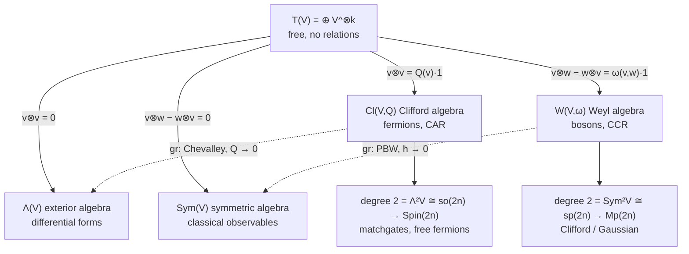
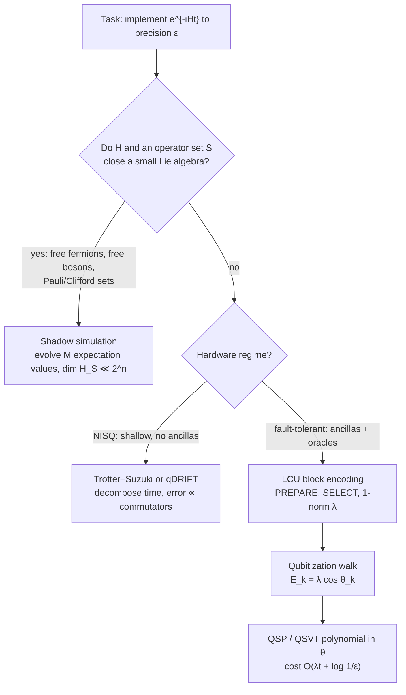
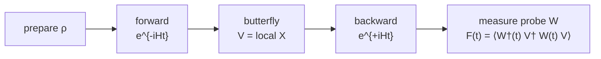
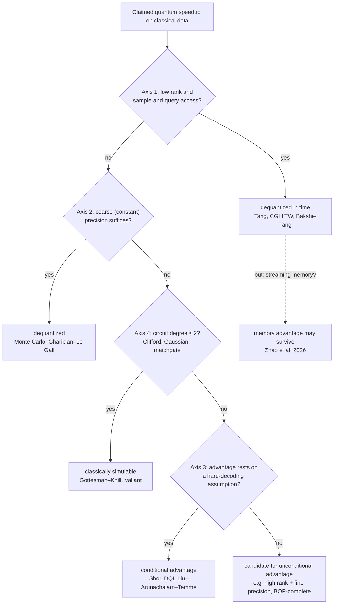

# Quantum Information Science

Alexander Del Toro Barba, PhD. [Google Scholar](https://scholar.google.com/citations?hl=en&user=fddyK-wAAAAJ) $\cdot$ [LinkedIn](https://www.linkedin.com/in/deltorobarba/)


<br>

## 1. Heisenberg-Weyl

> Every quantum gate is a time evolution $U = e^{-i\hat Ht}$. The physical and information-theoretic complexity of the gate is determined by the **polynomial degree of the generator $\hat H$ in the phase-space operators $\hat Q, \hat P$**, and the criterion behind the ladder is whether that degree still **closes under the commutator**. Degree 1: displacements (Pauli / Heisenberg-Weyl). Degree 2: Gaussian / Clifford, classically simulable. Degree $\geq 3$: non-Gaussian / non-Clifford, universal, quantum advantage.

---

### Physics: Quantum Harmonic Oscillator as Source of All Operators


$$\hat H \propto \hat P^2 + \hat Q^2 = \hbar\omega\left(\hat a^\dagger\hat a + \tfrac12\right) = \hbar\omega(\hat n + \tfrac12)$$

**Why the QHO is *the* starting point.** Analytically, every smooth potential near a minimum is quadratic (Taylor expansion), so the QHO is the universal local model of any bound physical system. Algebraically, $\hat Q^2 + \hat P^2$ is *the* canonical degree-2 element of the Weyl algebra ($\mathrm{Sym}^2 V \cong \mathfrak{sp}$), the bosonic counterpart of the Dirac operator. Everything below is this one single generator, read at different polynomial degrees.

* **Time evolution = swap kinetic $\leftrightarrow$ potential.** At $t=0$ the state sits in $Q$; after a quarter period $t = \frac{\pi}{2\omega}$ it has rotated $90°$ into $P$. **That quarter turn is the QFT.** In $\hat U(t) = e^{-i\hat Ht/\hbar}$ the exponent is dimensionless: time is fundamentally an angle. States do not move along classical trajectories; their phase rotates, in an energy eigenstate at the angular frequency $\omega = E/\hbar$.
* **Why complex numbers.** $\hat a \propto \hat Q + i\hat P$: the real axis represents position, the imaginary axis represents momentum, and the rotation $e^{i\omega t}$ represents time evolution. Two real canonical coordinates merge into one complex amplitude $\alpha = x + ip$; unitary phase rotation preserves its magnitude.
* ⚠️ **Position basis = computational basis.** $\vert{}k\rangle$ are eigenstates of $\hat Q$. Hence $Z$ (diagonal phase) is a function of position, while $X$ (permutation / shift) is a function of momentum.
* ⚠️ **Two families of *states*, not gates:**
* Coherent states $\vert{}\alpha\rangle = \hat D(\alpha)\vert{}0\rangle$ (eigenstates of the annihilation operator $\hat a$, overcomplete, generated as a degree-1 output).
* Fock states $\vert{}n\rangle$ (eigenstates of the number operator $\hat n$, orthonormal, forming the eigenbasis of the quadratic degree-2 generator).


**Exponentiation produces the gates.** Every unitary gate takes the form:

$$\hat U = e^{-i\hat G\theta}$$

Here, $e^{-i\theta}$ guarantees unitarity, $\hat G$ is the Hermitian generator of the transformation, and $\theta$ scales it. If $\hat G = \hat H$, then $\theta = t/\hbar$, meaning $\hat H$ *is* time evolution itself. The generator is built directly from $\hat Q, \hat P$ for continuous variables (CV) or from $X, Z \pmod d$ for discrete qudits, grounded on the canonical commutation relations (CCR) $[\hat x,\hat p] = i\hbar$.

* **Gaussian (linear):** Generator of degree $\leq 2$. ⚠️ "Linear" refers strictly to the *Heisenberg action* $U^\dagger \hat r U = S\hat r + d$, not to the generator itself. Symplectic phase-space structure is preserved.
* **Non-Gaussian (non-linear):** Generator of degree $\geq 3$. The Heisenberg action itself becomes nonlinear (e.g., $\hat p \to \hat p - 3\gamma t \hat q^2$), and the Wigner function develops negative regions.

**The conjugate relation.** An operator generates the translation of its canonically conjugate variable. This mechanism enables the reciprocal basis change $X \leftrightarrow Z$ via Fourier transform and underlies the Weyl displacement operator $D_{q,p} = \tau^{qp} X^q Z^p$.

* Continuous: $[\hat x, \hat p] = i\hbar$.
* Discrete: Weyl relation $ZX = \zeta_d XZ$.

*Notation:* $\zeta_d = e^{2\pi i/d}$ is the primitive $d$-th root of unity; $\tau = e^{i\pi/d}$ is the half-phase satisfying $\tau^2 = \zeta_d$. ⚠️ Many texts write $\omega$ for $\zeta_d$, but here $\omega$ is reserved exclusively for the oscillator frequency and the symplectic form.

**Dictionary: from energy term to gate.** The physical energy terms are quadratic, but the **elementary gates** exponentiate the *linear* field operators $\hat P$ and $\hat Q$.

| Feature | Kinetic energy $\hat P^2$ | Potential energy $\hat Q^2$ |
| --- | --- | --- |
| **CV observable** | $\hat P = \frac{i}{\sqrt2}(\hat a^\dagger - \hat a)$, derivative $\approx i(X^\dagger - X)$ | $\hat Q = \frac{1}{\sqrt2}(\hat a + \hat a^\dagger)$, real eigenvalues (location $k$) |
| **Lattice term** | Hopping / Laplacian $\approx X + X^\dagger$ (Google OTOC) | On-site potential (diagonal) |
| **Qudit gate** | **Shift** $X^a\vert{}j\rangle = \vert{}j+a \bmod d\rangle$, real off-diagonal permutation of 0s and 1s, eigenvalues powers of $\zeta_d$ | **Clock** $Z^b\vert{}k\rangle = \zeta_d^{bk}\vert{}k\rangle$, diagonal phase gradient on the unit circle; for $d>2$ unitary but not Hermitian |
| **Qubit gate** | **Pauli $X$**, bit flip, $\zeta_2 = -1$ | **Pauli $Z$**, phase flip, $(-1)^j$; unitary *and* Hermitian, so directly observable |
| **Matrix form** | Real, off-diagonal permutation matrix | Diagonal matrix of complex phases |
| **Gate as exponential** | $X \approx e^{-i\hat P\delta}$ | $Z \approx e^{i\hat Q\delta}$ |
| **Conjugation twist** | $X$ *represents* momentum but *generates* a position shift: $D_{q,0} \sim X^q$ | $Z$ *represents* position but *generates* a momentum kick: $D_{0,p} \sim Z^p$ |

$$X = \mathrm{DFT}^\dagger\, Z\, \mathrm{DFT}$$

In the momentum basis, the spatial shift operator becomes diagonal and acts identically to the clock operator.

---

### 1.2 The Degree Ladder: from Heisenberg-Weyl Algebra to Quantum Gates

| Property | Degree 1: Displacements | Degree 2: Gaussian / Clifford | Degree $\geq 3$: Non-Gaussian / Non-Clifford |
| --- | --- | --- | --- |
| **Generator** | $\hat H = q\hat P - p\hat Q$ | $\hat Q^2 + \hat P^2$, $\hat Q^2 - \hat P^2$, $\hat Q_1\hat P_2$ | $\hat Q^3$, $\hat n^2 \sim (\hat Q^2 + \hat P^2)^2$, many-body interactions |
| **Lie algebra** | ✅ Heisenberg $\mathfrak{h}_n$, $\dim 2n+1$, $[\hat Q,\hat P]$ is central | ✅ Symplectic $\mathfrak{sp}(2n,\mathbb{R})$; combined with degree 1: semidirect product $\mathfrak{sp}(2n) \ltimes \mathfrak{h}_n$ | ❌ Does not close: cubic $\to$ quartic $\to$ quintic $\to \dots$, generating an infinite-dimensional algebra |
| **Action on phase space** | Rigid *slide* to $(q,p)$: no rotation, no volume/shape deformation | *Linear* symplectic map $U^\dagger \hat r U = S\hat r$ with $S \in \mathrm{Sp}(2n)$: rotations, shears, squeezing, entanglement | Phase space is *curved* nonlinearly; falls completely out of $\mathrm{Sp}(2n)$ |
| **Continuous variables (CV)** | Displacement operator $\hat D(\alpha) = e^{\alpha\hat a^\dagger - \alpha^*\hat a}$ | Metaplectic group $\mathrm{Mp}(2n)$: phase rotator, squeezer, beam splitter, shear | Cubic phase gate $e^{i\gamma\hat Q^3}$, Kerr non-linearity $e^{i\chi\hat n^2}$ |
| **Discrete systems** | Heisenberg-Weyl group: $D_{q,p} = \tau^{qp}X^qZ^p$; for $d=2$: Pauli group $\mathcal{P}$ | Clifford group $\mathcal{C} = \{U : U\mathcal{P}U^\dagger = \mathcal{P}\}$, quotient $\mathcal{C}/\mathcal{P} \cong \mathrm{Sp}(2n,\mathbb{Z}_d)$: QFT, Hadamard, $S$, C-SUM/CNOT | $T$, qudit $T_d$, Toffoli, CS. Contained in $M_d(\mathbb{C})$, but lies outside both HW and Clifford groups |
| **Hierarchy classification** | Level $\mathcal{C}_1$: forms an orthogonal operator basis of state space | Level $\mathcal{C}_2$: **Gottesman–Knill theorem** applies; efficient tracking of $2n\times 2n$ symplectic $S$ instead of $2^n$ amplitudes | Levels $\mathcal{C}_k$ for $k\geq 3$ are no longer groups; Clifford $+T$ is dense in $U(2^n)$: **universal, magic begins here** |
| **Fermionic mirror** | **None.** Degree 1 closes only under the *anti*commutator; fermionic parity superselection forbids odd Hamiltonians | **Free fermions / matchgates** (Valiant): $\mathfrak{so}(2n) \to \mathrm{Spin}(2n)$, same theorem as Gottesman–Knill with $SO$/Spin in place of $Sp$/Mp | **Degree 3 missing** due to parity constraints; classical non-simulability begins strictly at **degree 4** (e.g. Hubbard interaction $n_\uparrow n_\downarrow$) |

#### Degree 1 Notes

* The phase factor $\tau^{qp}$ in $D_{q,p} = \tau^{qp}X^qZ^p$ is required because $X$ and $Z$ do not commute; it represents an Aharonov–Bohm geometric phase effect directly on discrete phase space.
* ⚠️ **Pauli $Y$ is not independent:** $\sigma_y = i\sigma_x\sigma_z$ is merely the $(1,1)$ grid point on the discrete phase space. For $d=3$, none of $XZ, XZ^2, X^2Z, \dots$ is uniquely "$Y$"; they simply represent the generic displacement operators $D_{q,p}$ with $q,p \neq 0$.

#### Degree 2 Notes

Gaussian continuous gates and discrete Clifford gates represent the exact same algebraic generators viewed through continuous versus discrete lenses:

| CV (Gaussian) | Generator | Action | Discrete (Clifford) |
| --- | --- | --- | --- |
| **Rotator** $R(\theta) = e^{-i\theta\hat n}$ | $\hat Q^2 + \hat P^2$ | Phase rotation; at $\theta = \pi/2$ this **is** the Fourier transform | **QFT** $\vert{}j\rangle \to \frac{1}{\sqrt d}\sum_k \zeta_d^{jk}\vert{}k\rangle$, fulfilling $WXW^\dagger = Z$; **Hadamard** for $d=2$ |
| **Squeezer** $\hat S(r)$ | $\hat Q^2 - \hat P^2$ | Anisotropic scaling: $Q \to e^{-r}Q$, $P \to e^{r}P$ | — |
| **Shear** | $\hat Q^2$ | Momentum translation dependent on position: $P \to P + Q$ | **Phase gate $S$** $= \mathrm{diag}(1,i,\dots)$: maps $X \to Y \sim XZ$, imparts quadratic phase $k^2$ |
| **Beam splitter** $\hat B(\theta)$ | $\hat Q_1\hat P_2 - \hat Q_2\hat P_1$ | Passive energy-preserving mode rotation; $\theta = \pi/4$ yields 50:50 ratio | — |
| **Squeezer + beam splitter** | — | Ellipse rotated by $45°$: noise correlated across canonical axes = **entanglement** | **C-SUM / CNOT** $= e^{-i\hat Q_1\hat P_2}$: maps $\vert{}c\rangle\vert{}t\rangle \to \vert{}c\rangle\vert{}t\oplus c\rangle$ |

* **➕ Gottesman–Knill, quantitatively:** A stabilizer state on $n$ qubits is uniquely specified by $n$ independent, commuting Pauli operators. This state is represented by an $n\times 2n$ binary tableau plus phases. The CHP simulator (Aaronson, Gottesman, PRA 2004) updates this structure in $O(n)$ time per Clifford gate and $O(n^2)$ time per measurement. The underlying tracked group is strictly finite:
$$\vert{}\mathcal{C}_n/\mathcal{P}_n\vert{} = \vert{}\mathrm{Sp}(2n,\mathbb{Z}_2)\vert{} = 2^{n^2}\prod_{j=1}^n(4^j-1) \approx 2^{2n^2+n}$$


Contrasting this with an $\epsilon$-net covering the full unitary space $U(2^n)$ of size $\exp(\Theta(4^n\log(1/\epsilon)))$, that polynomial-to-double-exponential ratio *is* the formal simulability statement: only polynomially many classical bits are needed to characterize the entire reachable Clifford sub-manifold.

#### Degree $\geq 3$ Notes

* **Cubic phase** transforms a circular Gaussian coherent state into a non-Gaussian "banana" distribution exhibiting negative Wigner quasi-probability regions—the canonical signature of quantum non-classicality.
* **Kerr non-linearity** (quartic, degree 4) creates superposition cat states, serving as the physical foundation for continuous-variable bosonic quantum error-correcting codes.
* **$T$ gate** ($e^{-i\frac{\pi}{8}\hat Z}$) is the discrete cubic phase mod 2. Its qudit analogue $T_d\vert{}k\rangle = \zeta_d^{k^3}\vert{}k\rangle$ matches the continuous cubic potential $V(\gamma) = e^{i\gamma\hat x^3}$.
* ⚠️ The Heisenberg-Weyl operator basis remains formally valid (a $T$ gate *can* be expressed as a linear combination of Pauli operators), but the number of operator terms blows up exponentially under nested commutators/conjugations. This branching expansion is the exact mathematical locus where efficient classical simulation breaks down.
* **➕ The Clifford hierarchy, defined:**
$$\mathcal{C}_1 = \mathcal{P}, \quad \mathcal{C}_k = \{U : U P U^\dagger \in \mathcal{C}_{k-1}\ \forall P\in\mathcal{P}\} \quad \text{(Gottesman, Chuang, Nature 1999)}$$


The $T$ gate belongs to level $\mathcal{C}_3$. Operationally, any gate residing in $\mathcal{C}_k$ can be implemented via gate teleportation utilizing a dedicated resource state accompanied solely by feed-forward Clifford corrections drawn from level $k-1$. This inductive property is why the $T$ gate is the canonical "one step beyond" stabilizer circuits. For $k\geq 3$, the sets $\mathcal{C}_k$ are no longer groups (closure under operator products fails), mirroring the non-closing Lie brackets of degree $\geq 3$ generators.
* **➕ Classical simulation overhead of magic:** The **stabilizer rank** $\chi$ of $\vert{}T\rangle^{\otimes t}$ is defined as the minimal number of pure stabilizer states required to express that tensor product state. Bravyi & Gosset (PRL 2016) established $\chi \lesssim 2^{0.47t}$, refined to $\approx 2^{0.396t}$ by Bravyi, Browne, Calpin, Campbell, Gosset, and Howard (Quantum 2019). The simulation runtime scale is strictly polynomial in the qubit count $n$ and linear/polynomial in $\chi$, meaning the simulation cost is exponential *only in the count of non-Clifford magic gates*, not in the physical qubit number.
* **Continuous-variable mirror:** Gaussian circuits are classically simulable in polynomial time (Bartlett, Sanders, Braunstein, Nemoto, PRL 2002). Classical simulation via quasiprobability sampling (Pashayan, Wallman, Bartlett, PRL 2015) scales exponentially with the total integrated Wigner negativity, which acts as the continuous non-Gaussian resource budget.
* **Magic state distillation** (Bravyi, Kitaev, PRA 2005) is the fault-tolerant inverse: consuming multiple noisy copies of magic states $\vert{}T\rangle$ via strictly transversal Clifford operations purifies them into high-fidelity target states. Consequently, the **$T$-count** serves as the universal computational cost currency for fault-tolerant quantum compilers.

---

### Structural Trajectory of the Framework

The polynomial degree of a generator in the phase-space operators $\hat Q, \hat P$ (or $X, Z \pmod d$) serves as the unifying organizational principle across the theory:

* **Degree $\leq 2$** closes under the commutator algebra, preserving symplectic phase space geometry and remaining efficiently simulable classically.
* **Degree $\geq 3$** breaks algebraic closure, producing operator growth that unlocks universality, quantum magic, and genuine computational advantage.
* **Chapter 1** derives this entire ladder from the quantum harmonic oscillator and the Weyl tensor algebra.
* **Chapter 2** encounters this ladder again as the foundational exception enabling cheap Hamiltonian simulation (shadow simulation, fast-forwarding of linear/quadratic models) and identifies degree $\geq 3$ as the root driver of chaotic scrambling dynamics (out-of-time-ordered correlators, OTOCs).
* **Chapter 3** leverages this hierarchy as the tunable magic dial for learnable quantum state classes, using the degree-1 Heisenberg-Weyl displacements $D_{q,p}$ as the operator basis through which two-copy Bell measurements reconstruct unknown quantum spectra.

<br><br>

Hier ist die vollständige Zusammenführung beider Texte mit maximalem Informationsgehalt, ohne inhaltliche Kürzungen und ohne redundante Wiederholungen:

---

### Tensor Algebra $T(V)$: One Recipe, Four Algebras

*The recipe: quotient the tensor algebra by a two-sided ideal generated in degree 2. The knob: the **parity of the bilinear form** in that ideal (symmetric $Q$ or antisymmetric $\omega$), plus whether you switch its value on at all.*



*Solid arrows: quotient by the ideal on the label (upper two homogeneous, lower two inhomogeneous, i.e. quantized). Dashed arrows: the associated-graded functor, dequantization. Note the parity crossing: the symmetric form lands in the exterior square, the antisymmetric form in the symmetric square.*

|  | **Symmetric form $Q$** | **Antisymmetric form $\omega$** |
| --- | --- | --- |
| **Form off** (classical) | $\Lambda(V)$, exterior | $\mathrm{Sym}(V)$, symmetric |
| **Form on** (quantized) | $\mathrm{Cl}(V,Q)$, **fermions**, CAR | $W(V,\omega)$, **bosons**, CCR |

* **Step 0, the source.** $T(V) = \bigoplus_k V^{\otimes k}$: associative, non-commutative, no relations. Every relation below is introduced by hand as the generator of an ideal; all four algebras are $T(V)/I$ and differ only in the ideal $I$.
* **Step 1, homogeneous ideal (degree 2 $= 0$).**
* $\Lambda(V) = T(V)/\langle v\otimes v\rangle \implies v\wedge w = -w\wedge v$: differential forms, cohomology.
* $\mathrm{Sym}(V) = T(V)/\langle v\otimes w - w\otimes v\rangle \implies vw = wv$: polynomials, classical observables on phase space.
* The $\mathbb{Z}$-grading survives; these correspond to $\mathrm{Cl}$ with $Q=0$ and $W$ with $\omega = 0$.


* **Step 2, switch the form on (the right-hand side becomes a number: this is quantization).**
* $\mathrm{Cl}(V,Q) = T(V)/\langle v\otimes v - Q(v)\mathbf{1}\rangle \implies vw + wv = 2Q(v,w)$: a vector squares to its length.
* $W(V,\omega) = T(V)/\langle v\otimes w - w\otimes v - \omega(v,w)\mathbf{1}\rangle \implies [v,w] = \omega(v,w)$: the commutator is a number, $[\hat q,\hat p] = i\hbar\mathbf{1}$.
* ⚠️ The ideal is now **inhomogeneous** (degree 2 mixed with degree 0), so the $\mathbb{Z}$-grading collapses to a **filtration**: *grading $\to$ filtration is what quantization means algebraically.*
* ⚠️ The deformation changes the product, not the space: $\Lambda(\mathbb{R}^2)$ and $\mathrm{Cl}(\mathbb{R}^2,Q)$ share the vector space basis $\{1, e_1, e_2, e_1e_2\}$ with different multiplication tables; PBW monomials $\hat q^a\hat p^b$ form a common basis of both $\mathrm{Sym}$ and $W$.


* **⚠️ The twist: parity flips between input and output.**
* A symmetric input $g$ builds $\mathrm{Cl}(V,g)$, whose degree-2 part is the **exterior** square $\mathfrak{so} \cong \Lambda^2 V$ (via $\frac14[e_i,e_j]$) $\to$ Spin $\to$ **fermions**.
* An antisymmetric input $\omega$ builds $W(V,\omega)$, whose degree-2 part is the **symmetric** square $\mathfrak{sp} \cong \mathrm{Sym}^2 V$ (via $\frac12\{\hat r_i,\hat r_j\}$) $\to$ metaplectic $\to$ **bosons**.
* The labels cross. In supersymmetry both unify into one single construction on $\mathbb{Z}_2$-graded spaces.


* **Step 3, the way back ($\mathrm{gr}$).** Dequantization keeps only the top-degree part of each relation: $\mathrm{gr}\,\mathrm{Cl}(V,Q) \cong \Lambda(V)$ (**Chevalley**, $Q \to 0$) and $\mathrm{gr}\,W(V,\omega) \cong \mathrm{Sym}(V)$ (**PBW**, $\hbar \to 0$). ⚠️ These are **one theorem**: super-PBW on $\mathbb{Z}_2$-graded spaces *is* Chevalley.
* **Second road, the Lie route.** $U(\mathfrak{g}) = T(\mathfrak{g})/\langle x\otimes y - y\otimes x - [x,y]\rangle$ has the identical shape of ideal (hence "PBW deformation").
* Bosonic: $A_n = U(\mathfrak{h}_n)/(Z-1)$, where the universal enveloping algebra $U(\mathfrak{h}_n)$ supplies the products that the Lie algebra $\mathfrak{h}_n$ alone lacks.
* Fermionic: $\mathrm{Cl}(V,Q) = U(\mathfrak{h}^{\mathrm{super}})/(Z-1)$ with anticommutator bracket.


#### What each side becomes

| Property | Fermions: $\mathrm{Cl}(V,Q)$ | Bosons: $W(V,\omega)$ |
| --- | --- | --- |
| **Statistics** | CAR $\{a_i,a_j^\dagger\} = \delta_{ij}$, $\{\gamma_\mu,\gamma_\nu\} = 2g_{\mu\nu}$ | CCR $[a_i,a_j^\dagger] = \delta_{ij}$, $[\hat x,\hat p] = i\hbar$ |
| **Size** | $\dim = 2^n$, the relation truncates powers | $\dim = \infty$, nothing truncates. **No finite-dimensional rep**: $\mathrm{tr}[A,B] = 0$ but $\mathrm{tr}(i\hbar\mathbf{1}) \neq 0$ |
| **Uniqueness** | Unique spinor module | **Stone–von Neumann** |
| **Canonical degree-2 square** | Dirac $\nabla = d + \delta$, $\nabla^2 = \Delta$ | Oscillator $H = \frac12(\hat p^2 + \hat q^2)$; Moyal star product |
| **Symmetry tower** | $\mathrm{O}(V,g) \supset \mathfrak{so}(n)$, $\dim \frac{n(n-1)}{2}$, Cartan types $B_n/D_n$, cover $\mathrm{Spin}(n)$ | $\mathrm{Sp}(2n) \supset \mathfrak{sp}(2n)$, $\dim n(2n+1)$, Cartan type $C_n$, cover $\mathrm{Mp}(2n)$ |
| **QC bridge** | Matchgates / free fermions = rotor in $\mathrm{Spin}(2n)$; non-free from **degree 4** | Clifford / Gaussian = symplectic action; magic from **degree 3** |

⚠️ The QC bridge is **structurally one theorem**, once for $SO$/Spin, once for $Sp$/Mp. The size asymmetry is the sharpest physical difference: bosons require unbounded operators on infinite-dimensional Hilbert spaces, while fermions act naturally on a finite spinor space.

---

### From Weyl Algebra to Heisenberg-Weyl: How Bosons Reach Actual Qubits / Qudits

| Level | Continuous | Discrete |
| --- | --- | --- |
| **Additive** (Lie bracket) | Weyl algebra $A_n = W(V,\omega)$: all polynomials in $\hat q,\hat p$, home of Hamiltonians and the degree filter | ⚠️ **Does not exist.** Trace argument: $\mathrm{Tr}([\hat q,\hat p]) = 0$ but $\mathrm{Tr}(i\hbar\mathbf{1}) = i\hbar d \neq 0$ |
| **Multiplicative** (operator product) | Heisenberg group $H_n$ / CCR $C^*$-algebra: $W(z)W(z') = e^{-\frac{i}{2}\omega(z,z')}W(z+z')$, linked to $A_n$ by Stone–von Neumann | HW algebra $M_d(\mathbb{C}) \cong \mathbb{C}_\omega[\mathbb{Z}_d \times \mathbb{Z}_d]$, spanned by the $d^2$ matrices $X^qZ^p$ |

**Why exponentiating rescues what the additive box forbids: trace vs. determinant.** At the group level the test uses $\det$: $\det(ZXZ^{-1}X^{-1}) = 1$ must equal $\det(\zeta_d\mathbf{1}) = \zeta_d^d = 1$ ✓. The additive constraint is *unsatisfiable* in finite dimensions, but the multiplicative one is *automatically satisfied*. That is why the discrete Weyl relation $ZX = \zeta_d XZ$ exists in exact $d\times d$ complex matrices, providing the complete pathway from the continuous Weyl algebra to the discrete Heisenberg-Weyl algebra.

**Moving between the boxes.**

* **Up:** $\mathfrak{h}_n \xrightarrow{\exp} H_n$ (BCH series terminates cleanly because $[\hat Q,\hat P]$ is central; the additive Lie bracket maps into a multiplicative phase factor).
* **Down:** Differentiate at the identity along one-parameter subgroups.
* **Sideways:** $G \xrightarrow{\mathrm{span}} M_d(\mathbb{C})$ via the group algebra (linear span of group elements, ⚠️ *not* by $\exp$; algebras themselves are not exponentiated).
* **Limit:** The asymptotic regime $d \to \infty$ turns $ZX = \zeta_d XZ$ continuously back into $[\hat Q,\hat P] = i\hbar\mathbf{1}$.

**➕ Stone–von Neumann, stated.** Every irreducible, strongly continuous unitary representation of the Weyl relations

$$W(z)W(z') = e^{-\frac i2\omega(z,z')}W(z+z')$$

for *finitely many* degrees of freedom is unitarily equivalent to the Schrödinger representation on $L^2(\mathbb{R}^n)$.

*Consequences:*

1. Position and momentum representations describe identical physics in different coordinates, with the Fourier transform serving as the intertwining operator.
2. The discrete analogue is unique in precisely the same way: $M_d(\mathbb{C})$ has, up to unitary equivalence, exactly one irreducible representation of $ZX = \zeta_d XZ$, explaining why "the" qudit clock and shift operators are canonical.
3. ⚠️ The theorem **fails** for infinitely many degrees of freedom (quantum field theory, thermodynamic limit): inequivalent representations exist, which is Haag's theorem and the structural origin of superselection sectors. Finite-$n$ uniqueness is what makes phase-space methods and the operator degree ladder unambiguous.

---

### Appendix: Symplectic Form

A **form** evaluates to a scalar:

* $0$-form = scalar function
* $1$-form = covector field
* $2$-form = bilinear form

Differential forms $\Omega^k(M) = \Gamma(\Lambda^k T^*M)$ integrate intrinsically over oriented submanifolds without coordinate choices ($1$-forms over curves yield work; $2$-forms over surfaces yield flux).

The **symplectic form $\omega$** is a differential $2$-form defined by three properties:

* **Alternating:** Pointwise antisymmetric, $\omega(u,v) = -\omega(v,u)$.
* **Closed:** $d\omega = 0$, guaranteeing the absence of local curvature invariants (Darboux's theorem).
* **Non-degenerate:** Forces an **even dimension** $2n$ (coordinates naturally pair into positions $q_i$ and momenta $p_i$) and produces the nowhere-vanishing **Liouville volume form** $\omega^n$.

**➕ Two consequences used elsewhere in this document.**

* **Darboux's Theorem:** Locally, every symplectic manifold is symplectomorphic to standard phase space $(\mathbb{R}^{2n}, \sum_{i=1}^n dq_i \wedge dp_i)$. Because there are no local invariants, the only geometric structure a Gaussian/Clifford operation can preserve is $\omega$ itself. This is why $\mathrm{Sp}(2n)$ (continuous) and $\mathrm{Sp}(2n,\mathbb{Z}_d)$ (discrete, with symplectic product $\omega(z,z') = qp' - q'p \pmod d$) act as the universal structure groups of degree 2.
* **Liouville's Theorem:** The phase-space volume $\omega^n$ is invariant under Hamiltonian flows, and its quantum shadow is unitarity. The Wigner function utilized in quantum learning is precisely a quasi-probability density evaluated against this Liouville volume form, and Hudson's theorem dictates that dynamics generated by Hamiltonians of degree $\leq 2$ preserve the non-negativity of Gaussian Wigner distributions.

<br><br>
## 2. Quantum Dynamics

> Every simulation technique in chemistry and physics sits on three axes: **Model** (classical vs. quantum), **Type** (static vs. dynamic), and **Computing** (classical vs. quantum). *Quantum dynamics* is the cell "quantum model, dynamic type", and its hard core is propagating $\vert{}\psi(t)\rangle = e^{-iHt}\vert{}\psi(0)\rangle$ in a $2^n$-dimensional Hilbert space. Static problems are **optimized** (variational principle); dynamic problems must be **propagated** (no forward theorem). On a quantum computer, propagation follows one of three structural strategies: decompose *time* (Trotter), transform the *spectrum* (Qubitization / QSVT), or shrink the *space* (Shadow Simulation).

---

### 2.1 The Map: Three Axes

* **Model:** Classical models ignore electrons and treat atoms as spheres connected by springs (empirical force fields). Quantum models explicitly bring electrons, orbitals, and many-body correlation into play.
* **Type:** Static (ground state, eigenvalue problem $\hat H\vert{}\psi\rangle = E\vert{}\psi\rangle$) vs. dynamic (time evolution $i\hbar\,\partial_t\Psi = \hat H\Psi$).
* **Computing:** Classical hardware vs. quantum hardware.

| Model / Computing | **Static** (state, ground state) | **Dynamic** (time evolution) |
| --- | --- | --- |
| **Classical / Classical** | **Docking, energy minimization:** geometric fitting (AutoDock, Rosetta) | **Molecular dynamics:** $F = ma$, atoms as classical mass points with empirical force fields (GROMACS, NAMD, AMBER) |
| **Quantum / Classical** | **HF, DFT, Post-HF:** $\hat H\vert{}\psi\rangle = E\vert{}\psi\rangle$. HF ignores correlation, DFT approximates it via electron density $\rho$, Post-HF (CC, CI) is exact but scales exponentially in electron number $N$ | **TD-DFT:** excitations, spectra, fluorescence. Exact propagation $e^{-i\hat Ht/\hbar}\vert{}\Psi(0)\rangle$ scales exponentially in $N$ |
| **Quantum / Quantum** | **VQE (NISQ):** correlation energy via parametrized entanglement, optimization condition $\delta\langle H\rangle = 0$ | **Hamiltonian simulation:** coherent unitary exponentiation in a $2^n$-dimensional Hilbert space via Trotter, Qubitization/QSVT, or Shadow Simulation |

*Perspective, not part of quantum dynamics:* Quantum computers used for *classical* dynamics—such as solving the Navier–Stokes equations via the HHL algorithm for linear systems, or weather forecasting on a fine 100 m grid. Same quantum hardware, entirely different computational application.

#### Static vs. Dynamic: The Core Difference

* **Static = Energy optimization.** If $\psi$ is an eigenstate of $\hat H$, time evolution is strictly stationary: $\Psi(t) = \psi e^{-iEt/\hbar}$, and the probability density $\vert{}\Psi(t)\vert{}^2$ remains constant over time. Finding binding energies reduces to searching for global minima across an energy landscape using the Rayleigh–Ritz variational principle or NISQ-era VQE.
* **Dynamic = Propagation.** Dynamical problems feature no general variational principle and no forward-in-time shortcut theorem. Simulating non-equilibrium chemical reaction dynamics, bond breaking during atomic collisions, non-adiabatic electronic excitations, and quantum chaotic scrambling cannot be framed as an optimization task; states must be explicitly propagated under $e^{-iHt}$.
* **Fundamental Axiom.** In static problems, the quantum computer merely *stores* and updates state information. In full dynamical evolution, it stores nothing: **it *is* the physical Hilbert space.**

---

### 2.2 Static Quantum Chemistry: The Approximation Stack

**Why only tiny systems are solvable analytically.** The Schrödinger equation is analytically solvable only for the one-electron hydrogen atom. Introducing a second electron adds Coulomb repulsion, producing a non-integrable quantum three-body problem. Every electronic structure method is an approximation stack built upon foundational simplifications:

1. **Born–Oppenheimer Approximation:** Nuclei are treated as clamped on electronic timescales due to large mass differences, defining the classical potential energy surface (PES).
2. **Rayleigh–Ritz Variational Principle:** Minimizing the energy expectation value $\langle\psi\vert{}H\vert{}\psi\rangle$ yields upper bounds on the true ground-state energy.
3. **Correlation Energy:** The remaining central difficulty of modern quantum chemistry:

| Method | Correlation Treatment | Computational Cost |
| --- | --- | --- |
| **Hartree–Fock (HF)** | Mean-field approximation, neglects electron correlation entirely | Cheap: polynomial scaling ($O(N^4)$ down to $O(N^3)$) |
| **Density Functional Theory (DFT)** | Approximated via exchange-correlation functionals of the electron density $\rho$ (the exact universal functional is unknown and must be approximated) | Cheap: favorable polynomial scaling |
| **Post-HF (Coupled Cluster, CI)** | Systematically exact recovery of electronic correlation | Exponential scaling in electron number $N$; restricted to small molecular systems |
| **Variational Quantum Eigensolver (VQE)** | Captured directly on hardware through multi-qubit entanglement | Central NISQ method targeting larger molecules where classical Post-HF methods fail |

* **Chemical Model Frameworks:** Valence Bond Theory (orbital hybridization, localized electron-pair bonds) vs. Molecular Orbital (MO) Theory (spatial delocalization, HOMO/LUMO frontiers, Linear Combination of Atomic Orbitals / LCAO). Electron spin ($m_s = \pm\frac12$) does not emerge from the non-relativistic Schrödinger equation (which yields only quantum numbers $n, l, m_l$), but arises from unifying quantum mechanics with special relativity via the Dirac equation (1928).
* **➕ Numbers and the Fault-Tolerant Counterpart:**
* **Chemical Accuracy** is defined as $1\text{ kcal/mol} \approx 1.6\text{ mHa} \approx 43\text{ meV}$, the energetic precision required to predict room-temperature chemical reaction rates to within one order of magnitude. This threshold fixes the target error $\epsilon$ in all quantum resource estimates.
* **Classical Scaling Limits:** Full Configuration Interaction (FCI) is numerically exact within a chosen basis set but scales combinatorially as $\binom{M}{N}$ in spin-orbitals $M$ and electrons $N$. Coupled Cluster with single, double, and perturbative triple excitations—$\text{CCSD(T)}$, the classical "gold standard"—scales as $O(N^7)$ and breaks down in strongly correlated, multi-reference systems (e.g., transition metal complexes, bond-breaking pathways), precisely the regime targeted for quantum advantage.
* **Fault-Tolerant QPE:** The fault-tolerant successor to VQE is **Quantum Phase Estimation (QPE)** applied to a block-encoded Hamiltonian $H$. By preparing an initial guiding state with non-negligible ground-state overlap, $E_0$ is read out as an eigenvalue phase with Heisenberg-limited precision in oracle queries.
* **FeMoco Resource Estimates:** Benchmark quantum resource studies focus on the catalytic iron-molybdenum cofactor of nitrogenase (FeMoco). Initial estimates by Reiher et al. (PNAS 2017) and tensor hypercontraction implementations by Lee et al. (PRX Quantum 2021) established requirements on the order of $10^6$ physical qubits and multiple days of runtime. These estimates have dropped by orders of magnitude primarily through advanced Hamiltonian representations with reduced 1-norms $\lambda$, rather than through relaxed hardware assumptions.
* ⚠️ **The Overlap Bottleneck:** If the overlap between the classically prepared guiding state $\vert{}\phi\rangle$ and the true ground state $\vert{}\psi_0\rangle$ is exponentially suppressed ($\lvert\langle\phi\vert{}\psi_0\rangle\rvert^2 \leq 2^{-\Omega(n)}$), QPE requires exponentially many repetitions, eliminating quantum speedup over classical heuristics (the *guided local Hamiltonian* problem).


---

### 2.3 Dynamic Simulation on a Quantum Computer

**The Problem.** In nature, a physical system evolves under all governing Hamiltonian terms simultaneously. In contrast, quantum computing hardware executes discrete elementary quantum gates sequentially. Because non-commuting Hamiltonian terms satisfy $[A, B] \neq 0$, the Lie product formula does not factorize trivially:

$$e^{-i(A+B)t} \neq e^{-iAt}e^{-iBt}$$

| Strategy | Method | Decomposed Entity | Target Hardware Regime |
| --- | --- | --- | --- |
| **Decompose Time** | Trotter–Suzuki product formulas, qDRIFT | Physical duration $t$ discretized into $r$ time slices | NISQ (shallow depth, zero ancillas) |
| **Transform Spectrum** | Qubitization / Quantum Singular Value Transformation (QSVT) | Continuous energy spectrum mapped into discrete rotation angles: $E_k = \lambda\cos\theta_k$ | Fault-Tolerant (ancilla-assisted block encodings) |
| **Shrink Space** | Shadow Simulation | Full state space ($2^n$ complex amplitudes) projected into $M$ operator expectation values | Both NISQ and Fault-Tolerant regimes |



*The three strategies as an operational decision tree: shrink the state space if algebraic closure permits; otherwise, choose between slicing time or mapping the spectrum based on available hardware fault tolerance.*

---

#### 2.3.1 Trotterization: Walk Through Time

$$e^{-iHt} \approx \Big(\prod_j e^{-iH_j t/r}\Big)^r$$

* **Mechanism:** Decompose $H = \sum_{j=1}^L H_j$ into simple, individually exponentiable terms (e.g., local Pauli strings) and interleave them across $r$ small time slices.
* **Commutator Scaling:** Operator non-commutativity sets the error budget. First-order Trotterization leaves an algorithmic error of $\mathcal{O}(t^2/r)$, bounded by the sum of pairwise operator commutators:
$$\epsilon \le \frac{t^2}{2r} \sum_{j < k} \Vert{}[H_j, H_k]\Vert{}$$


Higher-order symmetric Suzuki formulas systematically eliminate lower-order error terms at the cost of increasing circuit depth.
* **Hardware Profile:** Structurally native to hardware; requires zero ancilla qubits and no coherent oracle circuits. Its primary computational limitation is a polynomial error scaling in $1/\epsilon$.
* **➕ Commutator Bounds and Randomized Product Formulas:**
* **Nested Commutator Scaling:** Childs, Su, Tran, Wiebe, and Zhu (PRX 2021) demonstrated that the asymptotic error of a $p$-th order formula is rigorously bounded by nested commutators of the form $\sum \Vert{}[H_{j_{p+1}}, \dots, [H_{j_2}, H_{j_1}]]\Vert{}$. For geometrically local lattice Hamiltonians, this bound scales as $O(n)$ with system size rather than the loose, naive scaling in the number of terms $L^{p+1}$. This explains why high-order product formulas remain competitive in realistic gate-level resource benchmarks (Childs, Maslov, Nam, Ross, Su, PNAS 2018).
* **Randomized Compilation via qDRIFT:** Campbell (PRL 2019) introduced quantum Stochastic Drift Protocol (qDRIFT), which avoids deterministic term orderings by stochastically sampling individual terms $H_j$ with probability $p_j = \alpha_j / \lambda$ (where $\lambda = \sum_j \alpha_j$). The gate count scales as $O(\lambda^2 t^2 / \epsilon)$, completely independent of the total term count $L$ and free from operator commutators, though at the expense of an $\epsilon^{-1}$ error overhead.
* **Application Rule of Thumb:** Hamiltonians with numerous small-norm interaction terms and modest precision targets favor qDRIFT; systems composed of fewer, dominant terms or demanding high precision favor high-order Suzuki product formulas.


---

#### 2.3.2 Qubitization: Walk Through the Eigenvalues

* **Linear Combinations of Unitaries (LCU) & Block Encoding:** Express the system Hamiltonian as a linear combination of unitaries:
$$H = \sum_{l=1}^L \alpha_l U_l \quad \text{with 1-norm } \lambda = \sum_{l=1}^L \vert{}\alpha_l\vert{}$$


Using coherent $\text{PREPARE}$ and $\text{SELECT}$ subroutines, embed the normalized Hamiltonian operator $H/\lambda$ as the upper-left diagonal block of an expanded unitary matrix $U_H$:
$$U_H = \begin{pmatrix} H/\lambda & \cdot \\ \cdot & \cdot \end{pmatrix}$$


* **Quantum Walk: Energy to Angle:** Introducing a state reflection operator $R = 2\vert{}\bar{0}\rangle\langle\bar{0}\vert{} - \mathbb{1}$ transforms the composite quantum walk operator $W = R \cdot U_H$ into an exact 2D planar rotation on invariant subspaces spanned by the eigenstates of $H$, possessing eigenvalues $e^{\pm i \arccos(E_k / \lambda)}$:
$$E_k = \lambda\cos\theta_k$$


Scalar energies are translated into geometric rotation angles. Time evolution is synthesized not by slicing time, but by executing an optimal polynomial transformation of these phases via **Quantum Signal Processing (QSP)** and the **Quantum Singular Value Transformation (QSVT)** using Jacobi–Anger and Chebyshev expansions (Low & Chuang, PRL 2017, Quantum 2019; Gilyén, Su, Low, & Wiebe, STOC 2019).
* **Performance Profile:** Achieves an asymptotically optimal query complexity of:
$$\mathcal{O}\left(\lambda t + \log(1/\epsilon)\right)$$


The physical trade-off involves coherent ancilla registers, multi-qubit controlled oracle calls, and an algorithmic dependency on the Hamiltonian 1-norm $\lambda$.
* **Scrambling & OTOC Diagnostics:** By inverting the quantum walk sequence (reversing the reflection operators and oracle circuits), operator scrambling and out-of-time-ordered correlators (OTOCs) can be measured directly via relative phase shifts on the ancilla register.
* **➕ Fundamental Query Bounds & Fast-Forwarding:** The linear query dependence on time $t$ is tight and matches the fundamental **no-fast-forwarding theorem** for generic quantum Hamiltonians (Berry, Ahokas, Cleve, Sanders 2007; Atia & Aharonov, Nat. Commun. 2017). The additive $\log(1/\epsilon)$ term reflects the optimal polynomial degree required to approximate trigonometric time evolution functions.
* ⚠️ **Fast-Forwarding Exceptions:** Sub-linear or constant-time fast-forwarding ($t \ll \Vert{}H\Vert{}t$) remains physically possible for specific structured Hamiltonians (e.g., mutually commuting terms, non-interacting quadratic fermionic systems belonging to degree $\leq 2$ of the operator ladder)—the exact algebraic exception enabling shadow simulation.

---

#### 2.3.3 Shadow Simulation: Shrink the Space

Proposed by Somma et al. (2024/2025), shadow simulation circumvents the exponential $2^n$-dimensional Hilbert space by tracking the dynamics of an observable subspace. It maps the evolution of $\vert{}\psi(t)\rangle$ into a compressed **shadow quantum state** whose amplitudes correspond to the expectation values of an operator set $S = \{O_1, \dots, O_M\}$ (e.g., 1-RDMs, 2-RDMs, or structured Pauli strings):

$$\vert{}\rho(t);S\rangle = \frac{1}{\sqrt A}\sum_{m=1}^M \langle O_m(t)\rangle\,\vert{}m\rangle$$

* **Algebraic Invariance (Theorem 1):** If the Hamiltonian $H$ and the operator basis $S$ satisfy a closed Lie algebra commutator relation:
$$[H, O_m] = -\sum_{m'=1}^M h_{mm'} O_{m'}$$


the shadow state **itself satisfies an exact effective Schrödinger equation**:
$$\frac{d}{dt}\vert{}\rho(t);S\rangle = -iH_S\vert{}\rho(t);S\rangle$$


where $H_S$ is an effective $M \times M$ matrix governed by the structure coefficients $h_{mm'}$.
* **Domains of Exact Closure:** This condition holds rigorously for systems generated by degree-2 operators on the canonical operator ladder:

| System | Lie Algebra | Operator Basis $S$ | Complexity Gain |
| --- | --- | --- | --- |
| **Free Fermions** | $\mathfrak{so}(2n)$ | Majorana quadratic pairs $c_j c_k$ | $N = 2^r$ physical modes simulated using only $\mathcal{O}(\log N)$ qubits |
| **Free Bosons** | $\mathfrak{sp}(2n)$ | Canonical variables $\hat P_j, \hat Q_j$ | Simulates $2^n$ coupled harmonic oscillators (generalizing Babbush et al.; BQP-complete dynamics) |
| **Qubit Systems** | Pauli strings / Clifford hierarchy | Operator pairs $P_{ij}$ | Direct state realization $\vert{}\rho;S\rangle = V_S(\vert{}\psi\rangle\otimes\vert{}\bar\psi\rangle)$ achieved via transversal Bell-basis rotations |

* **Computational Efficiency:** The effective matrix $H_S$ is propagated using QSP block-encoding techniques. Because $\dim H_S = M \ll 2^n$ and $H_S$ is typically highly sparse, its block encoding is exponentially more compact than that of the original physical Hamiltonian $H$.
* **Heisenberg Picture Representation:** Two-time correlation functions $\langle O_1(t) O_2(t')\rangle$ are directly mapped to quantum amplitude tensors (Theorem 2). A time-dependent operator $Z(t) = \sum_m z_m(t) O_m$ is encoded as a state vector $\vert{}Z(t)\rangle \propto \sum_m z_m(t)\vert{}m\rangle$. Evaluating Hamming-weight projections $\langle Z(t)\vert{}W\vert{}Z(t)\rangle$ yields operator spreading dynamics and **OTOC scrambling rates** without ever constructing the underlying $2^n$-dimensional state vector.

---

#### 2.3.4 Open Systems: Non-Unitary Dynamics

Coupling a quantum system to an unobserved thermal environment or measurement apparatus introduces energy dissipation and phase decoherence. The state evolution on the primary Hilbert space $\mathcal{H}_S$ ceases to be unitary and is described by a completely positive trace-preserving (**CPTP**) dynamical map ($\mathcal{E} \otimes \mathcal{I}_n \geq 0$).

Under the standard Born–Markov approximations (weak coupling, memoryless bath), the open dynamics obey the **Gorini–Kossakowski–Sudarshan–Lindblad (GKSL) master equation** (1976):

$$\frac{d\rho}{dt} = -i[H,\rho] + \sum_k \gamma_k\Big(L_k\rho L_k^\dagger - \tfrac12\{L_k^\dagger L_k,\rho\}\Big)$$

* **Coherent vs. Dissipative Terms:** The first term accounts for unitary evolution generated by $H$. The second term captures environmental dissipation via **Lindblad jump operators** $L_k$, which model processes such as spontaneous photon emission and spin flips ($T_1$ energy relaxation / amplitude damping) as well as elastic scattering and dephasing ($T_2$ phase damping).
* **Mathematical Structure:** The GKSL equation is the most general generator of a Markovian CPTP dynamical semigroup. Globally, any CPTP map admits an operator-sum **Kraus representation**:
$$\mathcal{E}(\rho) = \sum_k K_k\rho K_k^\dagger \quad \text{with} \quad \sum_k K_k^\dagger K_k = \mathbb{1}$$


The **Stinespring dilation theorem** embeds this non-unitary process into a higher-dimensional unitary evolution acting jointly across the system and an auxiliary environment.
* **Hardware Implementations:**
* **NISQ:** Simulated via the Monte-Carlo Wavefunction (MCWF) / quantum trajectory formalism, implementing continuous coherent drive punctuated by stochastic wavefunction collapses and mid-circuit ancilla resets.
* **Fault-Tolerant:** Implemented by block-encoding non-unitary Kraus and jump operators into unitary matrices using LCU methods or Stinespring ancilla registers. Cleve and Wang (ICALP 2017) demonstrated that Lindblad dynamics can be simulated fault-tolerantly in time:
$$\mathcal{O}\big(t\,\mathrm{polylog}(t/\epsilon)\big)$$


matching the optimal time scaling of closed-system Hamiltonian simulation up to poly-logarithmic factors.


* ⚠️ **Non-Markovian Dynamics:** Environments exhibiting memory effects, structured environmental spectral densities, or strong system-bath entanglement fall completely outside the Lindblad framework and represent a primary frontier for quantum simulation algorithms.
<br><br>

### 2.4 Chaos, Scrambling and OTOCs

> A local operator under chaotic dynamics in the Heisenberg picture, $W(t) = e^{iHt}We^{-iHt}$, grows in three directions, each with its own metric and its own bound: **rate** $\lambda_L$ (time), **reach** $v_B$ (space), and **depth** $K(t)$ (operator space). Without the Schrödinger solution $e^{-iHt}$ there is no $W(t)$ and no OTOC: chaos diagnostics *are* quantum dynamics.

**Model system.** Mixed-field Ising model:

$$H = \sum_i Z_iZ_{i+1} + h_x\sum_i X_i + h_z\sum_i Z_i$$

The longitudinal field $h_z$ breaks integrability:

* $h_z = 0$: Integrable; yields Poincaré recurrence, ballistic echoes, and non-scrambling dynamics.
* $h_z \neq 0$ (e.g., $h_z = 0.5$): Non-integrable and chaotic; produces diffusive operator scrambling.
* **Simulation setup:** The OTOC of a local $Z$ probe on every site against an $X$ butterfly perturbation on the first site on a Trotterized spin chain directly contrasts ballistic spread ($h_z = 0$) against chaotic, diffusive scrambling ($h_z = 0.5$).

---

#### 2.4.1 The Object: OTOC as a Four-Point Function

$$C(t) = \big\langle[W(t),V(0)]^\dagger[W(t),V(0)]\big\rangle = 2\big(1 - \mathrm{Re}\,F(t)\big), \qquad F(t) = \langle W^\dagger(t)V^\dagger W(t)V\rangle$$

* **Physical meaning:** Measures how strongly two operators that initially commute at $t=0$ ($[W(0), V(0)] = 0$) **fail to commute** after time evolution. Scrambling corresponds to the decay $F(t) \to 0$.
* **Mechanism:** $W(t)$ starts as a strictly local observable, expands under the Heisenberg dynamics into an extensive, non-local superposition of Pauli strings, reaches the spatial support of $V$, and causes the commutator norm to lift off zero.
* **Why out-of-time-order:** The operator sequence traverses the contour $t \to 0 \to t \to 0$. Standard time-ordered two-point functions decay on the thermalization timescale $t_{\text{therm}}$ and are blind to information scrambling.
* **Measurement via Loschmidt Echo:**
1. Forward propagation under $e^{-iHt}$.
2. Butterfly perturbation $V$ (e.g., a local $X$ gate).
3. Backward propagation under $e^{+iHt}$.
4. Projective overlap measurement with probe observable $W$.




*The Loschmidt-echo protocol for an OTOC: only the non-commutativity of $W(t)$ and $V$ survives the forward-backward unitary cancellation. On fault-tolerant hardware, "backward" is implemented directly as the exact inverse quantum walk (reversing reflection and oracle phases), exploiting the fact that time evolution is synthesized as an angle.*

* **Experimental Verifications & The 2025 Hardware Milestone:** Verified across NMR platforms, trapped-ion processors, and superconducting circuits. In Google's "Quantum Echoes" (Abanin et al., *Nature*, October 2025), a second-order OTOC was measured on the 65-qubit Willow processor, demonstrating a $\sim\!13{,}000\times$ speedup over state-of-the-art classical tensor network and HPC simulations on the Frontier supercomputer. This was framed as the first *verifiable* quantum advantage: unlike random circuit cross-entropy benchmarking, the OTOC is a deterministic physical observable that an independent quantum platform can reproduce, and its companion experiment maps the echo decay directly to an NMR molecular-structure observable. The constructive-interference signal is extracted against an explicit decoherence baseline, because bare decay $F(t) \to 0$ cannot distinguish unitary scrambling from environmental damping.

---

#### 2.4.2 Three Directions of Operator Growth

| Direction | Metric | Growth Law | Bound / Universality |
| --- | --- | --- | --- |
| **Rate** (time) | Quantum Lyapunov exponent $\lambda_L$ | $C(t) \sim \frac{1}{N}e^{\lambda_L t}$; operator size $n(t) \sim e^{\lambda_L t}$ | **MSS Bound:** $\lambda_L \leq \frac{2\pi k_B T}{\hbar} = \frac{2\pi}{\beta}$ |
| **Reach** (space) | Butterfly velocity $v_B$ | Operator front light cone: $C(t,x) \sim \frac1N\exp[\lambda_L(t - x/v_B)]$ | **Lieb–Robinson Bound:** $\Vert{}[A(t),B]\Vert{} \leq C e^{-\mu(d - v_{LR}t)}$, with $v_B \leq v_{LR}$ |
| **Depth** (operator space) | Krylov complexity $K(t)$ | Free systems: $K \sim t$<br>

<br>Integrable: $K \sim t^2$<br>

<br>Chaotic: $K \sim e^{2\alpha t}$ | **UOGH Hypothesis:** Lanczos coefficients grow as $b_n \sim \alpha n$, where $\alpha \leq \frac{\pi}{\beta}$ |

* **Rate (Time):** Semiclassically (Larkin & Ovchinnikov 1969), the quantum commutator maps to a classical Poisson bracket:
$$-\langle[x(t), p(0)]^2\rangle \;\longrightarrow\; \hbar^2 \{x(t), p(0)\}_{\text{PB}}^2 \sim \hbar^2 e^{2\lambda_{cl}t}$$


Thus, $\lambda_L$ is the direct quantum descendant of the classical Lyapunov exponent.
*Hierarchical timescales:*
$$t_{\text{therm}} \sim \mathcal{O}(1) \quad < \quad t_* \sim \lambda_L^{-1}\ln N \quad < \quad t_K \sim e^S$$


where $t_{\text{therm}}$ is local dissipation, $t_*$ is the Hayden–Preskill / Sekino–Susskind scrambling time, and $t_K$ is the Poincaré recurrence time.
⚠️ Extracting a clean exponential window requires a large-system limit ($N \gg 1$); in finite 1D qubit chains, spatial butterfly velocity $v_B$ is extracted far more reliably than $\lambda_L$.
* **Reach (Space):** The Lieb–Robinson velocity $v_{LR}$ is a state-independent operator-norm bound setting a strict relativistic-like speed limit in non-relativistic lattice systems (Lieb & Robinson 1972). In contrast, the butterfly velocity $v_B$ is state- and temperature-dependent. This spatial limit dictates:
1. The slope of the OTOC light-cone wavefront.
2. The minimum circuit depth required to generate global entanglement across $n$ qubits ($d \sim n$ in 1D, $d \sim \sqrt{n}$ on 2D architectures, $d \sim \log n$ in all-to-all connectivity).
3. Front dynamics in random circuits: operator spreading forms a ballistic front governed by Kardar–Parisi–Zhang (KPZ) fluctuations with front broadening $\sigma(t) \sim t^{1/3}$ (Nahum, Vijay, Haah, PRX 2018; von Keyserlingk et al., PRX 2018), and entanglement entropy grows as $S(t) = v_E t$ with entanglement velocity bounded by $v_E \leq v_B$ (Mezei & Stanford, JHEP 2017).


* **Depth (Operator Space):** The Liouvillian superoperator $\mathcal{L} = [H, \cdot]$ acts on the operator Hilbert space equipped with the Frobenius/Wightman inner product. The Liouville–Lanczos algorithm tridiagonalizes $\mathcal{L}$ over the Krylov chain:
$$\mathcal{K} = \text{span}\{W, [H,W], [H,[H,W]], \dots\}$$


governed by the recurrence $\mathcal{L}\vert{}O_n) = b_{n+1}\vert{}O_{n+1}) + b_n\vert{}O_{n-1})$. The **Krylov complexity** measures the mean operator position along this chain:
$$K(t) = \sum_{n} n\,\vert{}\varphi_n(t)\vert{}^2$$


(Parker, Cao, Avdoshkin, Scaffidi, Altman, PRX 2019).

---

#### 2.4.3 The Logical Stack of Bounds: KMS $\implies$ UOGH $\implies$ MSS

$$\text{KMS thermal analyticity in strip } 0 \leq \mathrm{Im}(t) \leq \beta \;\implies\; \alpha \leq \frac{\pi}{\beta} \;\implies\; \lambda_L \leq \frac{2\pi k_BT}{\hbar}$$

* **Universal Operator Growth Hypothesis (UOGH):** In chaotic many-body systems at finite temperature, the Lanczos sequence $b_n$ grows maximally linearly ($b_n \sim \alpha n$ with $\alpha \leq \pi/\beta$), setting an upper bound on operator complexity growth.
* **Maldacena–Shenker–Stanford (MSS) Bound:** Analyticity of out-of-time-ordered four-point correlation functions under Kubo–Martin–Schwinger (KMS) thermal boundary conditions bounds the growth rate by $\lambda_L \leq 2\pi k_B T / \hbar$ (JHEP 2016).
* **Sachdev–Ye–Kitaev (SYK) Model:** $N$ Majorana fermions with all-to-all random four-body interactions (Kitaev 2015; Maldacena & Stanford, PRD 2016). Exactly solvable in the large-$N$ limit and holographically dual to Jackiw–Teitelboim (JT) gravity in $\mathrm{AdS}_2$. It **saturates the MSS bound** ($\lambda_L = 2\pi/\beta$), demonstrating that black holes behave as the fastest and most efficient information scramblers in nature.

**➕ Reference Stack:**

* Lieb–Robinson bound: Lieb, Robinson, *Commun. Math. Phys.* (1972).
* Semiclassical OTOC foundation: Larkin, Ovchinnikov, *JETP* (1969).
* Fast scrambling conjecture: Sekino, Susskind, *JHEP* (2008).
* Chaos bound: Maldacena, Shenker, Stanford, *JHEP* (2016).
* SYK model: Kitaev, KITP talks (2015); Maldacena, Stanford, *PRD* (2016).
* Krylov complexity & UOGH: Parker, Cao, Avdoshkin, Scaffidi, Altman, *PRX* (2019).
* Random-circuit operator spreading & KPZ universality: Nahum, Vijay, Haah, *PRX* (2018); von Keyserlingk, Rakovszky, Pollmann, Sondhi, *PRX* (2018).
* Entanglement velocity bound: Mezei, Stanford, *JHEP* (2017).
* Information retrieval: Hayden, Preskill, *JHEP* (2007); Yoshida, Kitaev, *arXiv:1710.03363*.
* Barren plateaus in variational circuits: McClean, Boixo, Smelyanskiy, Babbush, Neven, *Nat. Commun.* (2018); review Larocca et al., *Nat. Rev. Phys.* (2025).

---

#### 2.4.4 Static Fingerprints: ETH and Spectral Statistics

* **Eigenstate Thermalization Hypothesis (ETH, Srednicki):**
$$A_{mn} = \mathcal{A}(\bar E)\delta_{mn} + e^{-S(\bar E)/2}f_A(\bar E,\omega)R_{mn}$$


A *single* chaotic energy eigenstate behaves locally like a microcanonical thermal ensemble. The global system remains pure while local subsystems thermalize via entanglement with the rest of the spectrum.
* *Chaotic dynamics:* Satisfy ETH $\implies$ local thermalization.
* *Integrable systems:* Constrained by extensive local conserved quantities $\implies$ Generalized Gibbs Ensemble (GGE).
* *Many-Body Localization (MBL):* Strong disorder preserves local integrals of motion (LIOMs / $l$-bits) $\implies$ breakdown of thermalization.


* **Random Matrix Theory (BGS Conjecture / Bohigas–Giannoni–Schmit):**
* Chaotic quantum spectra display Wigner–Dyson energy-level repulsion characterized by Dyson ensembles with mean adjacent gap ratio $\langle r\rangle \approx 0.53$.
* Integrable spectra lack level repulsion and exhibit Poissonian statistics with $\langle r\rangle \approx 0.39$.


* **Spectral Form Factor (SFF):**
$$K(\tau) = \langle\vert{}\mathrm{Tr}(e^{-iHt})\vert{}^2\rangle$$


Exhibits a diagnostic **dip–ramp–plateau** profile at late times $t > t_*$, revealing discrete energy level correlations long after the spatial OTOC has fully saturated.

---

#### 2.4.5 Scrambling vs. Decoherence

| Diagnostic Feature | Unitary Scrambling | Lindblad Open Decoherence |
| --- | --- | --- |
| **Information Dynamics** | Delocalized reversibly into non-local multi-party entanglement; reconstructible from global operators | Dissipated irreversibly into external bath degrees of freedom |
| **Entropy Scaling** | Local subsystem entanglement entropy grows; global state remains strictly pure ($S_{\text{vN}}(\rho_{\text{global}}) = 0$) | Global von Neumann entropy $S_{\text{vN}}(\rho)$ increases non-unitarily |
| **OTOC Response** | $F(t) \to 0$ driven by true non-commutative many-body operator growth | $F(t) \to 0$ driven by environment-induced dephasing and amplitude damping |
| **Diagnostic Risk** | Reflects intrinsic many-body quantum chaos | Can mimic operator spreading and generate a **false Lyapunov exponent $\lambda_L$** |

Quantitative experimental extraction requires error-mitigated echo protocols and baseline normalization to decouple unitary scrambling from non-unitary CPTP channel noise. Modeling and bounding non-Markovian and CPTP noise impacts on OTOCs, alongside fault-tolerant simulation of open-system Lindbladians, remains an active research frontier.

---

#### 2.4.6 Consequences: Black Holes $\longleftrightarrow$ Quantum Computing

* **Scrambling as a Resource (Hayden–Preskill Protocol):** A black hole acts as an optimal information mirror. An unknown quantum state thrown into a scrambling black hole after its Page time can be reconstructed from a few emitted Hawking radiation quanta collected alongside the historical radiation in time $\mathcal{O}(\ln N)$. The **Yoshida–Kitaev decoding circuit** achieves a state-reconstruction fidelity directly proportional to the OTOC value and operates with maximum efficiency at the theoretical chaos bound (experimentally verifiable via two-copy Bell state sampling).
* **Scrambling as an Obstacle (Barren Plateaus):** Deep parametrized quantum circuits that scramble rapidly form approximate unitary $t$-designs on $U(2^n)$. Haar integration concentrates observable gradients exponentially with qubit count:
$$\mathrm{Var}_{\theta}[\partial_\theta \langle H \rangle] \sim 2^{-n}$$


(McClean et al. 2018). As a consequence, randomly initialized variational quantum algorithms (VQAs) encounter flat cost landscapes that are classically and quantumly untrainable. In Hamiltonian simulation, scrambling dynamics also impose an algorithmic complexity bound scaling as $\mathcal{O}(nt\cdot\mathrm{polylog}(1/\epsilon))$.
* **Random Circuit Sampling (RCS):** The Porter–Thomas distribution:
$$P(p) \approx N e^{-Np}$$


acts as the static fingerprint of Haar-random state generation. The circuit depth required to enter the Porter–Thomas regime corresponds precisely to the geometric scrambling time ($d \sim n$ in 1D architectures, $d \sim \sqrt{n}$ on 2D planar chips), reflecting the time needed for the Lieb–Robinson light cone to traverse the physical processor.
<br><br>

## 3. Quantum Learning: Dequantization vs. Genuine Quantum Advantage

### 3.1 Separation: Classical vs. Quantum Data

|  | Classical Learners | Quantum-Enhanced Learners |
| --- | --- | --- |
| **Classical Data** | Classical ML (deep learning, classical kernels, boosting) | **"QML on classical data":** feature maps, variational quantum classifiers (VQCs), quantum kernels |
| **Quantum Data**<br>

<br>(copies of unknown $\rho$ / quantum channels) | **Measurement protocol + classical statistics:** classical shadows, randomized benchmarking, Bell sampling + classical decoders | **Quantum-memory protocols:** coherent multi-copy / two-copy joint measurements, quantum principal component analysis |

* **Fragility of the Top Row (Classical Data):** Advantage claims are fragile. Classical ML equipped with sufficient training data catches up with quantum-enhanced models on classical tasks, even when the underlying label-generating process is not classically simulable in polynomial time (Huang et al., *Power of Data*, Nat. Commun. 2021).
* **Proven Separations in the Bottom Row (Quantum Data):** Proven, unconditional exponential separations reside exclusively in the bottom row (Huang et al., *Science* 2022), complete with direct experimental hardware demonstrations.

#### Three Litmus Tests Separating the Rows

1. **Locus of the Unknown:** Does the target entity live as a discrete classical dataset (CSV file, bitstring table) or as a physical density operator $\rho$ in an unobserved Hilbert space?
2. **Copy Complexity as Physical Cost:** Can the data be duplicated freely at zero marginal cost, or does nature charge an explicit physical budget for every copy consumed?
3. **Binding Information-Theoretic Bounds:**
* **No-Cloning Theorem:** No completely positive trace-preserving (CPTP) map can perform the transformation $\rho \mapsto \rho \otimes \rho$. Available copies act as a consumable, non-renewable resource budget.
* **Holevo's Theorem:** An $n$-qubit state can convey at most $n$ classical bits of accessible information to any measurement apparatus, strictly bounding what a single measurement shot can extract.
* **Gentle Measurement Lemma** (Winter 1999; Aaronson 2004): An operation that accepts a quantum state with probability $\geq 1 - \epsilon$ perturbs the underlying state by at most $O(\sqrt{\epsilon})$ in trace distance. This allows an ensemble of near-deterministic questions to be evaluated sequentially on the same physical copies.


None of these physical constraints bind classical datasets. Classical measurement theory addresses the single-shot physical perturbation of a measurement on a state; quantum learning theory solves the inverse statistical problem: the Born rule turns the quantum state into a sampling oracle, and learning is the reconstruction of the generator from measurement statistics.

---

### 3.2 Dequantization vs. Genuine Advantage: A Decision Framework

*Core theses on QML for classical data. Status: September 2026.*

> **Guiding Principle:** Quantum advantage survives exactly when no efficient classical representation captures the underlying computation. Classical shortcuts can emerge along four mutually independent axes: input access, numerical precision, cryptographic problem hardness, or circuit algebraic structure. "Dequantization" denotes finding that exact shortcut.

**Scope and Boundary:** This framework governs the *top row* of the data-versus-learner matrix (classical data processed by classical or quantum-enhanced learners). Learning from quantum data (copies of $\rho$, black-box unitaries, unknown dynamics) is governed by separate information-theoretic bounds. The defining boundary is the **access model**, not the algorithmic technique: an investigation belongs to the top row if the underlying ground truth is classical, data replication is free, and No-Cloning/Holevo bounds do not limit learning. Performing classical shadows or Bell-basis measurements on a *self-prepared* state represents the readout of one's own model and does not elevate a problem into the bottom row.



*Every "yes" constitutes a theorem-grade dequantization, except on Axis 3, where a "yes" downgrades the claim from unconditional to conditional. The dashed branch highlights that an algorithm dequantized in time can retain an exponential quantum advantage in streaming memory.*

---

### 3.3 Tang's Finding: Speedups Rooted in the Input Model

Whenever a quantum algorithm achieves exponential speedup over classical algorithms by exploiting low-rank matrix structure under quantum RAM (QRAM) state preparation, an equivalent classical algorithm with **sample-and-query (SQ) access** (the classical analogue of QRAM data loading) can solve the problem in polynomial time. QRAM-based QML speedups (recommendation systems, PCA, SVMs, semidefinite programming, low-rank matrix inversion) were artifacts of the input loading model rather than quantum propagation:

* **Tang (STOC 2019):** Dequantized the Kerenidis–Prakash recommendation algorithm, establishing the $\ell^2$-norm randomized sampling technique.
* **Tang (PRL 2021):** Demonstrated that quantum PCA and low-rank clustering owe their apparent exponential speedups entirely to state-preparation assumptions.
* **Chia, Gilyén, Li, Lin, Tang, Wang / CGLLTW (STOC 2020 / JACM 2022):** Formulated a classical analogue of the Quantum Singular Value Transformation (QSVT) using randomized sublinear matrix arithmetic, dequantizing the entire low-rank QSVT class simultaneously.
* **Bakshi & Tang (SODA 2024):** Derived the quantitatively optimal classical singular value transformation, reducing classical query and runtime bounds down to small polynomial overheads.
* **➕ Precursors and Structural Roots:** The primary algorithm dequantized along this track is HHL (Harrow, Hassidim, Lloyd, PRL 2009) and its low-rank variant by Kerenidis & Prakash (ITCS 2017). Tang formalized the caveats identified in Aaronson's "Read the fine print" (Nat. Phys. 2015): state preparation, state readout, matrix condition number $\kappa$, and precision $\epsilon$ represent four loci where exponential speedups evaporate. Tang’s Axes 1 and 2 turn two of Aaronson’s four caveats into rigorous no-go theorems.

---

### 3.4 The Four Axes: Where the Shortcut Lurks

| Axis | Dequantizable / Simulable Regime | Resistant / Genuine Advantage Regime | Primary Analytical Tool or Limit | Status of Resistance |
| --- | --- | --- | --- | --- |
| **1: Access Model** (QSVT family) | Low rank + Sample-and-Query (SQ) access | High effective matrix rank (sparse HHL framework) | $\ell^2$-norm matrix sampling (Tang, CGLLTW, Bakshi–Tang) | **Unconditional** (theorem) |
| **2: Precision** (QSVT family) | Coarse relative precision ($\epsilon = O(1)$) | Inverse-polynomial fine precision; BQP-complete instances | Classical Monte Carlo methods (Gharibian & Le Gall) | **Unconditional** (BQP-completeness) |
| **3: Hardness Assumption** (Fourier family) | Classically decodable structures or featureless random landscapes | Hidden algebraic structure coupled with classically hard decoding (Shor, DQI) | Algebraic coding theory, lattice cryptography, Pontryagin duality | **Conditional** (conjectured cryptographic hardness) |
| **4: Circuit Structure** (Operator ladder) | Degree $\leq 2$ generators: Clifford, Gaussian, free fermions | Degree $\geq 3$ generators: magic gates, non-Gaussianity, $T$-count | Stabilizer tableau, matchgate Pfaffians (Gottesman–Knill, Valiant) | **Unconditional** (theorem) |

Axes 1 and 2 govern linear-algebraic workflows (the QSVT family); Axis 3 governs representation theory (the Fourier family); Axis 4 governs the intrinsic algebraic generator degree of the quantum circuit.

#### Necessary and Sufficient Conditions (Axes 1 & 2)

* High rank is necessary but insufficient on its own (sparse matrices with coarse precision remain classically simulable via Monte Carlo sampling).
* Fine precision is necessary but insufficient on its own (low-rank systems with fine precision are solvable via classical randomized SVD sketches).
* Only the **conjunction of high effective rank and fine numerical precision** is sufficient to resist classical dequantization, reaching full BQP-completeness in the **guided local Hamiltonian problem** (Gharibian & Le Gall, STOC 2022). This quantum hardness holds even for 2-local Hamiltonians and with guiding state overlaps up to $1 - 1/\mathrm{poly}(n)$. Thus, even a nearly perfect guiding state cannot rescue classical simulators; the speedup resides in fine spectral transformations rather than state preparation alone.

#### Distinct Logic of Axis 3

Shor's algorithm and Decoded Quantum Interferometry (DQI; Jordan et al., Nature 2025) share an underlying mathematical skeleton: a representation-theoretic transformation (the Quantum Fourier Transform, QFT) maps a globally hidden algebraic invariant onto a dual support that can be sampled (hidden subgroup and Pontryagin duality for Shor; linear codes for DQI). The computational advantage rests on the classical intractability of decoding that algebraic structure.

Unlike Circuit Magic (Axis 4), Axis 3 exhibits two distinguishing properties:

1. **Non-Monotonicity (The Goldilocks Dilemma):** Too little algebraic structure yields unlearnable, featureless landscapes; excessive algebraic structure renders the problem classically decodable (Anschuetz, Gamarnik, Lu, *DQI requires structure*, 2025).
2. **Conditional Hardness:** Advantage rests on computational complexity conjectures (e.g., hardness of discrete logarithms, Shortest Vector Problem) rather than unconditional structural theorems. Hence, while a Clifford circuit remains classically simulable under all circumstances, DQI's advantage fluctuates with classical decoding advances.

* **➕ The QML Archetype of Axis 3:** Liu, Arunachalam, and Temme (Nat. Phys. 2021) constructed a supervised classification task based on the discrete logarithm problem. They designed an efficiently computable quantum kernel that classifies data provably faster than any classical learner (operating on data, without an oracle), unless the classical learner can efficiently compute discrete logs. This provides an existence proof for a top-row quantum learning advantage while illustrating the Goldilocks limitation: the algebraic symmetry is synthetically planted, and no natural dataset is known to exhibit this structure. Lewis, Gilboa, and McClean (Nat. Commun. 2026) initiated the transition from planted algebraic constructions to natural data distributions.

---

### 3.5 Two Levels of Analysis: Circuit vs. Problem Interface

* **Level 1: Circuit-Internal (Simulation-Based Dequantization):** Direct simulation of the unitary dynamics using structural representations (stabilizer binary tableaus, Gaussian covariance matrices, matchgate fermionic Pfaffians).
*Three Pillars of Quantumness:*
* **Entanglement:** Quantified by Schmidt rank and matrix product state (MPS) bond dimension (Schrödinger picture).
* **Magic:** Quantified by stabilizer rank $\chi$ and extent (Heisenberg picture).
* **Fermionic Magic:** Quantified by non-Gaussian parity-violating operations.


Magic and fermionic magic follow the same algebraic generator degree ladder: quadratic generators are free; degree $\geq 3$ constitutes the non-simulable resource. Entanglement is an exception governed by tensor product factorization rather than polynomial degree, which explains why no single scalar parameter characterizes quantum complexity.
* **Level 2: Problem Interface (Algorithmic Dequantization):** Re-architecting the mathematical solution from the outside without simulating circuit trajectories (e.g., Tang’s $\ell^2$-sampling constructs low-rank matrix approximations without tracking quantum state vectors).

The levels are **complementary rather than nested:** QRAM-based QML algorithms often feature high entanglement and high magic, yet Tang dequantized the underlying *problems*. Being low on any pillar renders a model classically simulable; being high on all pillars still does not guarantee quantum advantage.

```
       Circuit Level (Level 1)               Problem Interface (Level 2)
  [Entanglement + Magic + Non-Gaussian]   ≠   [High Rank + Fine Precision + Hard Decoding]
       (Circuit-Simulable if Low)                    (Algorithmic Dequantization if Low)

```

#### Results Constraining Level 1 Variational Models

* **Classical Surrogates** (Schreiber, Eisert, Meyer, PRL 2023): For standard data-re-uploading variational models, the expressible function class is a trigonometric polynomial whose frequency spectrum is fixed by the data encoding. Consequently, once trained, a classical surrogate model can reproduce the quantum model's predictions; the quantum processor serves at most as a training heuristic, never as an indispensable inference engine.
* **Barren Plateaus Imply Classical Simulability** (Cerezo, Larocca et al., 2023): The structural architectural traits that provably prevent barren plateaus (e.g., small dynamical Lie algebras, shallow circuit depth, strictly local cost observables) simultaneously enable polynomial-time classical simulation of the loss landscape, provided classical training data is acquired from the processor.

Trainable variational quantum models on classical data are generally classically surrogatable. This aligns Axis 4 with optimization landscapes and directs surviving quantum advantage avenues away from standard variational frameworks.

---

### 3.6 Unified Theory: Tractability as Low Rank

| Theoretical Framework | Rank Metric | Low Rank $\implies$ Efficient Simulation (Theorem) |
| --- | --- | --- |
| **Axis 1 / Algorithmic (Tang)** | Matrix rank (Singular Value Decomposition) | $\ell^2$-norm subspace sampling (CGLLTW, Bakshi–Tang) |
| **Magic / Axis 4 (Qubits)** | Stabilizer rank $\chi$ | Stabilizer decompositions (Bravyi–Gosset, Bravyi et al. 2019) |
| **Entanglement / Tensor Networks** | Schmidt rank / Tensor bond dimension $D$ | Matrix Product States & Tree Tensor Networks (Vidal, Jozsa) |
| **Fermionic Magic (Fermions)** | Fermionic Gaussian rank | Pfaffian matchgate contractions (Valiant) |

These obstructions operate independently because they quantify low rank in distinct mathematical bases. For instance, QRAM-based algorithms are low in matrix rank but can be high in stabilizer rank; all configurations in the "Magic $\times$ Matrix Sketchability" parameter space can be realized.

$$\text{Low Rank in Any Decomposition} \implies \text{Classically Tractable (Proven Theorem)}$$

$$\text{High Rank Across Known Decompositions} \implies \text{Quantum Advantage (Open Conjecture)}$$

The reverse direction is not a theorem because an unknown, efficiently contractible classical basis decomposition may exist.

---

### 3.7 Three Physical Resources, Three Control Knobs

Advantage is relative to the constrained resource:

| Resource Constraint | Mathematical Discriminator | Regime of Genuine Advantage | Formal Status | Landmark Reference |
| --- | --- | --- | --- | --- |
| **Time** | Matrix rank | High rank combined with fine precision (batch, queryable input) | **Theorem** (unconditional) | Tang; CGLLTW; Gharibian & Le Gall |
| **Memory** | Output dimension | Streaming data model; high-dimensional coherent state | **Theorem** (unconditional) | Zhao, Zlokapa, Neven, Babbush, Preskill, McClean, Huang (2026) |
| **Samples / Prediction** | Geometric difference $g_{CQ}$, effective dimension $d$ | High geometric distance $g$, small sample size $N$; advantage diminishes as $N \to \infty$ | Empirical / Kernel theory | Huang et al., *Power of Data* (2021) |

#### Reconciling Time and Memory: Tang vs. Preskill

Tang dequantizes computational *time* in the queryable input model, whereas Zhao et al. (2026) establish an exponential quantum advantage in *memory* within the streaming data model. Both analyze low-rank tasks like PCA, but under different resource constraints:

* In memory, quantum processors hold an advantage even in low-rank regimes because amplitude encoding stores an $N$-dimensional vector across $\log N$ qubits—a property of state space dimension rather than matrix rank.
* In time complexity, the governing question is: *"Does an $\ell^2$ sample suffice?"* In space complexity, the governing question is: *"Can a classical linear sketch (Johnson–Lindenstrauss) compress the stream?"*
* Zhao et al. prove that every super-quadratic quantum query separation implies an exponential quantum memory advantage in streaming. As a result, algorithms dequantized in time remain viable targets for exponential memory advantages.

#### Dual Origins of Quantum Memory Advantage

1. **State Complexity:** Classically exponential memory is required to store highly entangled or high-magic quantum states (quantum dynamical simulation; Axis 4; Feynman 1981).
2. **Coherent Data Compression:** Coherently sketching incoming classical data streams directly into an $n$-qubit register (oracle sketching) eliminates QRAM. Because the processor never stores the raw classical dataset, Holevo's bound does not restrict the intermediate computational state.

*Note on Axis 3:* Cryptographic hidden subgroup algorithms provide no memory advantage; Shor's algorithm requires only $O(n)$ qubits, which is already polynomial.

#### Samples vs. Memory: Resolving Top-Row Fragility

* **Batch Sample Perspective** (*Power of Data*, 2021): Given a sufficiently large classical training set $N$, classical learners catch up to quantum learners on classical data, even when class labels are generated by classically intractable circuits. The quantum advantage had to be engineered and decayed as $N \to \infty$.
* **Streaming Memory Perspective** (*Massive Classical Data*, 2026): This classical convergence implicitly assumes unbounded classical memory. Classical learners restricted to realistic memory bounds require *superpolynomially* more samples and time on real-world datasets (e.g., IMDb sentiment, PBMC single-cell RNA sequencing), and the advantage persists as $N \to \infty$.

$$\text{Top-Row Fragility Holds for Time and Sample Budgets} \quad \centernot\implies \quad \text{Holds Under Memory Constraints}$$

| Feature | *Power of Data* (Huang et al. 2021) | *Massive Classical Data* (Zhao et al. 2026) |
| --- | --- | --- |
| **Primary Metric** | Generalization prediction error at fixed sample size $N$ | Classical machine memory footprint at fixed task performance |
| **Input Architecture** | Batch access model | Streaming data model |
| **Separation Type** | Empirical; demonstrated on synthetically engineered labels | **Theorem-grade, unconditional; demonstrated on natural data** |
| **Asymptotic Limit ($N \to \infty$)** | Advantage narrows and vanishes | **Quantum memory advantage persists unconditionally** |

---

### 3.8 Viable Pathways for QML on Classical Data

| Proposed Direction | Current Theoretical Status |
| --- | --- |
| **Exponential Time Speedup for Low-Rank ML via QRAM** | **Closed.** Dequantized by Tang, CGLLTW, and Bakshi–Tang. Even fault-tolerant physical QRAM hardware does not reopen this door, as classical $\ell^2$-sampling matches quantum runtimes within the idealized QRAM model. |
| **Hidden Algebraic Structures (Axis 3)** | **Open.** Provable time advantages exist in the Quantum Statistical Query (QSQ) model for specific structured function classes (Lewis, Gilboa, McClean 2026); applies to specialized algebraic tasks rather than generic tabular data. |
| **Memory Advantages in Streaming Regimes** | **Open.** Provable, unconditional exponential memory advantage on real data distributions (Zhao et al. 2026); streaming runtime remains classical $\tilde{O}(N)$. |
| **Learning from Quantum Data** | **Open.** Unconditional exponential separations in sample and time complexity (Huang et al., *Science* 2022); operates outside the top-row classical data constraint. |

#### Structural Bottlenecks for Large Language Models (LLMs) on Quantum Hardware

1. **I/O and State Preparation Bottleneck:** Loading billions of classical token parameters into quantum amplitudes requires polynomial or linear circuit depth, dissipating prospective speedups before computation begins.
2. **Nonlinear Activation Functions:** Unitary gates are strictly linear transformations. Implementing nonlinear activations (e.g., Softmax, GELU, SwiGLU) requires complex multi-ancilla block encodings or measurement-driven non-unitary subroutines that introduce significant sampling overheads.
3. **High Effective Matrix Rank:** Attention matrices and dense weight transformations in trained foundation models are generically full-rank, which prevents low-rank tensor decompositions and QSP optimizations.

Every proposed quantum advantage on classical data must pass three formal checks:

* **The Input Check:** Is input data preparation resistant to efficient classical sampling sketches?
* **The Readout Check:** Can target properties be extracted without an exponential number of projective measurement shots?
* **The Complexity Check:** Is the feature space or kernel structure classically intractable to approximate?

The readout check constrains computational time speedups, but does not eliminate coherent memory advantages in streaming environments.

---

### 3.9 Summary of Core Principles

1. **Computational Incompressibility:** Quantum advantage survives if and only if no efficient classical representation (tensor network, stabilizer tableau, or low-rank sketch) can model the system.
2. **Tractability Equals Low Rank:** Efficient classical simulation is guaranteed by low rank in some representation (matrix rank, stabilizer rank, or Schmidt rank). Advantage requires irreducibly high rank across all compatible representations.
3. **Status of Resistance:** Resistance to dequantization along Axes 1, 2, and 4 is unconditional (theorems). Resistance along Axis 3 is conditional (cryptographic conjectures).
4. **Separation of Resource Knobs:** Time advantage is governed by matrix rank, memory advantage is governed by state-space dimension, and sample advantage is governed by geometric kernel difference.
5. **Status of Classical QML:** Exponential time speedups for low-rank problems via QRAM are ruled out. Provable advantages survive in structured algebraic learning (time) and streaming data compression (memory).
6. **Domain-Specific Fragility:** The classical catch-up phenomenon applies to sample and time complexity, but does not apply under strict memory bounds.
7. **Model-Centric Definition:** The operational boundary of this framework is set by the data access model, not the quantum algorithms employed.

---

### 3.10 Open Research Frontiers

* **Matrix Rank vs. Stabilizer Rank Unified Algebra:** A unified mathematical framework connecting SVD matrix sketchability (Level 2) and stabilizer rank decompositions (Level 1).
* **Guided Local Hamiltonian Phase Diagram:** Mapping the complexity boundaries of the guided local Hamiltonian problem across the parameter space of relative precision, guiding state overlap, and interaction locality, specifically targeting constant additive error (chemical accuracy) in high-rank domains.
* **Space-Complexity Audit of Dequantized Algorithms:** Systematically determining which time-dequantized algorithms (e.g., SVMs, recommendation engines) maintain an exponential memory advantage in streaming environments, and which can be matched by classical linear sketches (e.g., Johnson–Lindenstrauss).
* **Memory-Bounded Generalization Theory:** Formulating a mathematical framework that bridges kernel geometric difference metrics (Huang et al. 2021) and streaming communication complexity (Zhao et al. 2026).

---

### 3.11 Key Literature

* E. Tang, *"A quantum-inspired classical algorithm for recommendation systems"*, STOC 2019. [arXiv:1807.04271](https://arxiv.org/abs/1807.04271?utm_source=gemini).
* E. Tang, *"Quantum PCA only achieves an exponential speedup because of its state preparation assumptions"*, PRL 127, 060503 (2021). [arXiv:1811.00414](https://arxiv.org/abs/1811.00414?utm_source=gemini).
* N.-H. Chia, A. Gilyén, T. Li, H.-H. Lin, E. Tang, C. Wang, *"Sampling-based sublinear low-rank matrix arithmetic framework for dequantizing QML"*, STOC 2020 / JACM 2022. [arXiv:1910.06151](https://arxiv.org/abs/1910.06151?utm_source=gemini).
* A. Bakshi, E. Tang, *"An improved classical singular value transformation for QML"*, SODA 2024. [arXiv:2303.01492](https://arxiv.org/abs/2303.01492?utm_source=gemini).
* S. Gharibian, F. Le Gall, *"Dequantizing the QSVT: hardness and applications to quantum chemistry and the quantum PCP conjecture"*, STOC 2022. [arXiv:2111.09079](https://arxiv.org/abs/2111.09079?utm_source=gemini).
* S. Jordan et al., *"Optimization by Decoded Quantum Interferometry"*, Nature (2025). [arXiv:2408.08292](https://arxiv.org/abs/2408.08292?utm_source=gemini). Critique: Anschuetz, Gamarnik, Lu, *"DQI requires structure"*, [arXiv:2509.14509](https://arxiv.org/abs/2509.14509?utm_source=gemini).
* S. Bravyi, D. Gosset, *"Improved classical simulation of quantum circuits dominated by Clifford gates"*, PRL 116, 250501 (2016).
* L. G. Valiant, *"Quantum circuits that can be simulated classically in polynomial time"*, SIAM J. Comput. 31(4), 1229–1254 (2002).
* S. Aaronson, A. Ambainis, *"Forrelation: a new push towards quantum advantage"*, STOC 2015.
* H.-Y. Huang, M. Broughton, M. Mohseni, R. Babbush, S. Boixo, H. Neven, J. R. McClean, *"Power of data in quantum machine learning"*, Nat. Commun. 12, 2631 (2021). [arXiv:2011.01938](https://arxiv.org/abs/2011.01938?utm_source=gemini).
* H. Zhao, A. Zlokapa, H. Neven, R. Babbush, J. Preskill, J. R. McClean, H.-Y. Huang, *"Exponential quantum advantage in processing massive classical data"*, [arXiv:2604.07639](https://arxiv.org/abs/2604.07639?utm_source=gemini) (2026).
* L. Lewis, D. Gilboa, J. R. McClean, *"Quantum advantage for learning shallow neural networks with natural data distributions"*, Nat. Commun. 17, 1341 (2026). [arXiv:2503.20879](https://arxiv.org/abs/2503.20879?utm_source=gemini).
* J. Cotler, H.-Y. Huang, J. R. McClean, *"Revisiting dequantization and quantum advantage in learning tasks"*, [arXiv:2112.00811](https://arxiv.org/abs/2112.00811?utm_source=gemini) (2021).
* A. W. Harrow, A. Hassidim, S. Lloyd, *"Quantum algorithm for linear systems of equations"*, PRL 103, 150502 (2009).
* S. Aaronson, *"Read the fine print"*, Nat. Phys. 11, 291–293 (2015).
* Y. Liu, S. Arunachalam, K. Temme, *"A rigorous and robust quantum speed-up in supervised machine learning"*, Nat. Phys. 17, 1013–1017 (2021). [arXiv:2010.02174](https://arxiv.org/abs/2010.02174?utm_source=gemini).
* H.-Y. Huang, R. Kueng, J. Preskill, *"Information-theoretic bounds on quantum advantage in machine learning"*, PRL 126, 190505 (2021). [arXiv:2101.02464](https://arxiv.org/abs/2101.02464?utm_source=gemini).
* H.-Y. Huang et al., *"Quantum advantage in learning from experiments"*, Science 376, 1182–1186 (2022).
* F. J. Schreiber, J. Eisert, J. J. Meyer, *"Classical surrogates for quantum learning models"*, PRL 131, 100803 (2023). [arXiv:2206.11740](https://arxiv.org/abs/2206.11740?utm_source=gemini).
* M. Cerezo, M. Larocca, D. García-Martín et al., *"Does provable absence of barren plateaus imply classical simulability?"*, [arXiv:2312.09121](https://arxiv.org/abs/2312.09121?utm_source=gemini) (2023).
* S. Bravyi, D. Browne, P. Calpin, E. Campbell, D. Gosset, M. Howard, *"Simulation of quantum circuits by low-rank stabilizer decompositions"*, Quantum 3, 181 (2019).


<br><br>

# Quantum Learning: Learning from Quantum Experiments

Alexander Del Toro Barba, PhD. [Google Scholar](https://scholar.google.com/citations?hl=en&user=fddyK-wAAAAJ&utm_source=gemini) $\cdot$ [LinkedIn](https://www.linkedin.com/in/deltorobarba/?utm_source=gemini)

> **Guiding Principle.** In quantum machine learning, the data source decides, not the hardware. When learning from classical data (top row), quantum speedups are fragile: classical models with sufficient data systematically catch up (*Power of Data*). When learning directly from **quantum data** (bottom row: physical copies of states $\rho$, channels $\mathcal{E}$, or Hamiltonians $H$), **unconditional exponential separations** exist and have been demonstrated in hardware. Here, quantum state copies cannot be cloned, information is capped by Holevo's bound, and the Born rule turns physical states into statistical sampling oracles.

---

## 1. Foundations: Separation, Objectives & Measurement Primitives

### 1.1 The Data-vs-Learner Separation

|  | Classical Learners | Quantum-Enhanced Learners |
| --- | --- | --- |
| **Classical Data** | Classical ML (deep nets, kernels, SVMs) | "QML on classical data": variational circuits, quantum kernels |
| **Quantum Data**<br>

<br>(copies of $\rho$, channels $\mathcal{E}$) | **Measurement protocol + classical statistics:** classical shadows, Bell sampling + decoders | **Quantum-memory protocols:** coherent multi-copy joint measurements, quantum PCA |

#### Three Litmus Tests Separating the Rows

1. **Locus of the unknown:** Does the ground truth live as a classical dataset or as an unobserved density operator $\rho$ / channel $\mathcal{E}$?
2. **Copy complexity as an irreducible cost:** Classical data can be replicated freely; quantum copies cannot be cloned ($\rho \not\mapsto \rho \otimes \rho$), turning physical copies into a strictly consumable budget.
3. **Binding information bounds:**
* **No-Cloning Theorem:** Linearity forbids universal state cloning, enforcing a sample budget.
* **Holevo Bound:** $n$ qubits convey at most $n$ bits of accessible classical information ($I(X{:}Y) \le n$), bounding single-shot extraction.
* **Gentle Measurement Lemma** (Winter 1999; Aaronson 2004): A measurement accepting $\rho$ with probability $\ge 1-\epsilon$ perturbs the state by at most $O(\sqrt{\epsilon})$ in trace distance—the loophole enabling shadow tomography to answer multiple questions using shared copies.


### 1.2 The Triply Efficient Objective

Every learning protocol is charged against three independent budgets:

* **Sample / Query Budget:** Physical copies of $\rho$ (sample access) or black-box oracle calls to preparation/evolution circuits (query access). Efficient means $\mathrm{poly}(n, \log M, 1/\epsilon)$ copies, improving to the Heisenberg scaling $1/\epsilon$ under query access.
* **Time Budget:** Classical post-processing runtime. Efficient means $\mathrm{poly}(n, M, 1/\epsilon)$ steps.
* **Memory Budget:** Classical storage for the hypothesis. Efficient means $\mathrm{poly}(n)$ bits, which rules out dense $2^n \times 2^n$ operators.

> **The Core Asymmetry.** The *sample boundary* is thoroughly charted: exponential separations enabled by quantum memory, adaptivity, and conjugate pairs are proven and hardware-verified. The *computational boundary* remains largely open. Sample lower bounds are unconditional (information theory, Holevo packing); computational time bounds require cryptographic assumptions (LWE, pseudorandom states, LPN).

```
                      [Quantum Experiment / Unknown State ρ]
                                        │
                         Transversal Bell Measurement
                                        │
                                        ▼
    ┌───────────────────────────────────────────────────────────────────────┐
    │ Sample Budget: 🟢 O(log d / ε⁴) copies (Conjugate Pairs)              │
    │ Classical Memory: 🟢 O(k log d) bits (Sparse List Representation)     │
    └───────────────────────────────────────────────────────────────────────┘
                                        │
                           Classical Decoder Challenge
                                        ▼
          ┌─────────────────────────────┴─────────────────────────────┐
          │                                                           │
          ▼                                                           ▼
   [Unstructured / Generic]                                   [Algebraic Promise]
   Time: 🔴 LWE-Cryptographically Hard                        Time: 🟢 Poly-Time Decodable
   (LPN / Average-Case Barrier)                               (Subgroups, Dicts, Juntas)

```

---

### 1.3 Four Measurement Primitives

1. **Single-Copy Randomized Measurements:** Random Pauli/Clifford basis draws per copy (the engine of classical shadows). Single-copy, NISQ-ready, but exponential in shot count for global observables.
2. **Bell Sampling on Two Copies:** Transversal Bell basis measurements across $\rho \otimes \bar{\rho}$. A single shot samples the global Pauli spectrum with probability $P(P) \propto \vert{}\mathrm{Tr}(P\rho)\vert{}^2$. Resolves all $4^n$ Pauli expectations with $\Theta(n)$ copies instead of $2^{\Omega(n)}$.
3. **Collective Schur Sampling:** Joint measurements across all $N$ copies simultaneously in the Schur–Weyl basis. Enables sample-optimal spectrum estimation and tomography, but requires $k=N$ coherent quantum memory.
4. **Oracle Queries:** Coherent access to $U$, $U^\dagger$, or real-time dynamics $e^{-iHt}$. Replaces statistical $1/\epsilon^2$ shot noise with $1/\epsilon$ Heisenberg-limited precision scaling.

---

## 2. The Three Learning Archetypes: Searching, Estimating & Identifying

The learning universe divides into three distinct tasks based on how observables and hypotheses are provided:

```
  SEARCHING                  ESTIMATING                 IDENTIFYING
  (Observables are OUTPUT)   (Observables are INPUT)    (Candidate States are INPUT)

  Given: copies of ρ         Given: copies of ρ         Given: copies of ρ
  Target: find which         Target: compute M          Target: match against
  observables carry weight   expectation values         candidate list / class
  (Support Recovery)         (Property Estimation)      (Discrimination / Testing)

```

### 2.1 Searching (Observables are Output)

* **Definition:** The learner receives copies of $\rho$ without a candidate list and must find the sparse addresses $(q,p)$ carrying spectral weight, followed by their values.
* **The Normalization Bottleneck:** For unitaries $U = \sum_P u_P P$, the Pauli spectrum is unit-normalized ($\sum_P \vert{}u_P\vert{}^2 = 1$). Bell sampling on the Choi state yields heavy terms with probability $\ge \tau^2$ directly. For pure states $\rho$, $\sum_z \vert{}y_z\vert{}^2 = d$, meaning a magnitude-1 coefficient appears with probability $1/d$, rendering raw frequency detection invisible in $\mathrm{poly}(n)$ shots.
* **The Computational Barrier:** While conjugate Bell pairs reduce the *sample* complexity to $O(\log d / \epsilon^4)$, decoding arbitrary sparse displacement spectra without algebraic structure is **LWE-hard** (Learning With Errors).

| Protocol / Class | Object | Access | Copies / Queries | Classical Time | Classical Memory | Status & Complexity Regime |
| --- | --- | --- | --- | --- | --- | --- |
| **Sparse Displacement Spectra** *(This Project)* | State | Sample ($\rho \otimes \rho^*$) | $O(\log d / \epsilon^4)$ | Generic: **LWE-hard**; Struct: $\mathrm{poly}$ | $O(k \log d)$ | 🟢 🔴 🟢 (Search bottleneck) |
| **LWE from i.i.d. Samples** (Regev 2005) | Function / State | Sample | $\mathrm{poly}(n)$ | $2^{O(n / \log n)}$ (LPN barrier) | $\mathrm{poly}(n)$ | 🟢 🔴 🟢 (Cryptographic baseline) |
| **Stabilizer States** (Montanaro 2017) | State | Sample ($\rho \otimes \rho$) | $O(n)$ | $O(n^3)$ (Gaussian elimination) | $O(n^2)$ | 🟢 🟢 🟢 (Subgroup promise) |
| **Quantum Juntas** (Chen et al. 2023) | Unitary | Sample (Choi) | $O(k/\epsilon + 4^k/\epsilon^2)$ | $\mathrm{poly}(n, 4^k)$ | $O(k \log n)$ | 🟢 🟢 🟢 (Locality promise) |
| **Heavy Unitary Paulis** (Montanaro–Osborne) | Unitary | Sample (Choi) | $O(\tau^{-2}\log(1/\tau\delta))$ | $\mathrm{poly}(1/\tau)$ | $O(\tau^{-2})$ | 🟢 🟢 🟢 (Unit-normalized spectrum) |
| **Hamiltonian Structure Learning** (Bakshi et al. 2024) | Hamiltonian | Query ($e^{-iHt}$) | $T \sim O(\log n / \epsilon)$ | $\mathrm{poly}(n)$ | $\mathrm{poly}(n)$ | 🟢 🟢 🟢 (Heisenberg-limited query) |

---

### 2.2 Estimating (Observables are Input)

* **Definition:** Given copies of $\rho$ and an input list of $M$ observables, estimate all expectation values $\mathrm{Tr}(O_i \rho)$ to precision $\pm\epsilon$.
* **Full Tomography vs. Shadows:** Standard quantum state tomography requires $\Theta(4^n/\epsilon^2)$ copies. Shadow tomography avoids this by answering $M$ questions using $\mathrm{poly}(\log M, n, 1/\epsilon)$ copies via gentle measurement.
* **The Memory-Assisted Gap:** Classical shadows using single-copy measurements require $3^k/\epsilon^2$ shots for $k$-local observables (scaling exponentially as $3^n$ for global operators). Adding **two-copy quantum memory** allows Bell measurements to estimate *all* $4^n$ Pauli observables with $\Theta(n)$ copies, bypassing the single-copy lower bound of $2^{\Omega(n)}$.

| Protocol / Class | Object | Access | Copies / Queries | Classical Time | Classical Memory | Status & Complexity Regime |
| --- | --- | --- | --- | --- | --- | --- |
| **Full State Tomography** | State | Sample | $\Theta(d^2/\epsilon^2)$ (entangled)$\Theta(d^3/\epsilon^2)$ (single) | $\mathrm{poly}(d)$ | $d^2 = 4^n$ | 🔴 🔴 🔴 (Dimensional baseline) |
| **Shadow Tomography** (Aaronson 2018) | State | Sample | $\tilde{O}(\log^2 M \log d / \epsilon^4)$ | $\exp(n)$ (MMW update) | $\exp(n)$ | 🟢 🔴 🔴 (Dense hypothesis) |
| **Classical Shadows ($k$-local)** (HKP 2020) | State | Sample (single-copy) | $O(3^k \log M / \epsilon^2)$ | $\mathrm{poly}(M, n)$ | $O(Nn)$ | 🟢 🟢 🟢 (Locality promise) |
| **All $4^n$ Paulis via Two-Copy** (King et al. 2024) | State | Sample ($\rho \otimes \rho$) | $\mathrm{poly}(n)$ (vs. $2^{\Omega(n)}$ 1-copy) | $\mathrm{poly}(n)$ | $\mathrm{poly}(n)$ | 🟢 🟢 🟢 (2-copy memory advantage) |
| **Conjugate-Pair Dictionary** (King et al. 2024) | State | Sample ($\rho \otimes \rho^*$) | $O(\log d / \epsilon^4)$ | $\mathrm{poly}(M)$ | $O(M)$ | 🟢 🟢 🟢 (Conjugate + Dict promise) |
| **Gibbs Hamiltonian Learning** (Bakshi et al. 2024) | Hamiltonian | Sample (Gibbs state) | $\mathrm{poly}(n, 1/\epsilon)$ | $\mathrm{poly}(n)$ at any $T>0$ | $\mathrm{poly}(n)$ | 🟢 🟢 🟢 (Thermal equilibrium) |
| **Heisenberg Hamiltonian Learning** (Huang 2023) | Hamiltonian | Query ($e^{-iHt}$) | $T \sim 1/\epsilon$ | $\mathrm{poly}(n)$ | $\mathrm{poly}(n)$ | 🟢 🟢 🟢 (Optimal query rate) |

---

### 2.3 Identifying (Candidate States are Input)

* **Definition:** Given copies of $\rho$ and an ensemble of $M$ candidate states (or an algebraic class promise $\mathcal{C}$), output an index, matching state, or property verification bit.
* **Discrimination vs. Class Testing:** Distinguishing two known states ($M=2$) is bounded by the Helstrom trace distance limit and the quantum Chernoff exponent ($\xi_{\mathrm{QCB}}$). Testing purity ($\rho$ pure vs. maximally mixed) requires $O(1)$ copies via a two-copy SWAP test, but requires $\Omega(2^{n/2})$ copies using single-copy measurements.
* **The Computational Barrier:** Identifying states with bounded gate complexity $G$ requires only $\tilde{\Theta}(G)$ copies information-theoretically, but is computationally intractable under standard cryptographic assumptions (pseudorandom quantum states).

| Protocol / Class | Object | Access | Copies / Queries | Classical Time | Classical Memory | Status & Complexity Regime |
| --- | --- | --- | --- | --- | --- | --- |
| **Pseudorandom States (PRS)** (Ji et al. 2018) | State | Sample | $\mathrm{poly}(n)$ (info-tight) | Cryptographically hard | $\mathrm{poly}(n)$ | 🟢 🔴 🟢 (Hard by construction) |
| **Purity / Mixedness Testing** (Chen et al. 2021) | State | Sample | $O(1)$ (2-copy SWAP)<br>

<br>$\Omega(2^{n/2})$ (1-copy) | $O(1)$ | $O(n)$ | 🟢 🟢 🟢 (Memory-enabled separation) |
| **Stabilizer Testing** (Gross et al. 2021) | State | Sample | $O(1)$ (6 copies) | $O(n^3)$ | $O(n^2)$ | 🟢 🟢 🟢 (Bell difference sampling) |
| **Clifford $+ t$ Non-Clifford** (Grewal et al. 2023) | State | Sample | $\mathrm{poly}(n, 2^t)$ | $\mathrm{poly}(n, 2^t)$ | $\mathrm{poly}(n)$ | 🟢 🟢 🟢 (Magic as hardness dial) |
| **Constant-Depth Shallow Circuits** (Huang 2024) | State / Unitary | Sample | $\mathrm{poly}(n)$ | $\mathrm{poly}(n)$ (Local inversion) | $\mathrm{poly}(n)$ | 🟢 🟢 🟢 (Light-cone confinement) |
| **Bounded Gate Complexity** (Zhao et al. 2024) | State | Sample | $\tilde{\Theta}(G)$ copies | Cryptographically hard | $\mathrm{poly}(n)$ | 🟢 🔴 🟢 (Computational barrier) |
| **Circuit Output Distributions** (Hinsche 2023) | Distribution | Sample (classical) | $\mathrm{poly}(n)$ | Hard under LPN ($+1\ T$ gate) | $\mathrm{poly}(n)$ | 🟢 🔴 🟢 (Single-magic transition) |

---

## 3. Structural Synthesis & Research Positioning

### 3.1 Two Structural Ways Classical Algorithms Fail

```
  FAILURE MODE 1: Dense Hypothesis Size          FAILURE MODE 2: Classical Decoder Bottleneck
  (Representation Problem)                       (Cryptographic Problem)

  ┌────────────────────────────────────────┐     ┌────────────────────────────────────────┐
  │ Classical Memory: 🔴 exp(n)             │     │ Classical Memory: 🟢 poly(n)            │
  │ Classical Time:   🔴 exp(n)            │     │ Classical Time:   🔴 exp(n)            │
  └────────────────────────────────────────┘     └────────────────────────────────────────┘
  Matrix Multiplicative Weights (MMW) touches    Displacement spectra need O(k log d) bits,
  a 2ⁿ × 2ⁿ matrix. Exponential memory           yet decoding unconstrained i.i.d. draws is
  forces exponential runtime.                    LWE-hard (unresolvable by compression).

```

### 3.2 The Access-by-Task Landscape

```
                      ESTIMATING / IDENTIFYING                SEARCHING
                   (Explicit / Structured Input)       (Observables are Output)
                ┌──────────────────────────────────┬──────────────────────────────────┐
  SAMPLING      │ Classical Shadows                │ Sparse Displacement Spectra      │
  ACCESS        │ Copies: 🟢 poly(log M, n, 1/ε)   │ Copies: 🟢 O(log d / ε⁴)         │
  (Rungs 1 & 2) │ Time:   🟢 poly(M) (Explicit)    │ Time:   🔴 LWE-Hard (Generic)    │
                │ Memory: 🟢 O(M)                  │ Memory: 🟢 O(k log d)            │
                ├──────────────────────────────────┼──────────────────────────────────┤
  QUERY         │ Amplitude Estimation             │ Quantum Sparse FFT / QFT         │
  ACCESS        │ Queries: 🟢 O(1/ε) (Heisenberg)  │ Queries: 🟢 poly(n, 1/τ)         │
  (Rung 3)      │ Time:    🟢 poly                 │ Time:    🟢 poly                 │
                │ Memory:  🟢 poly                 │ Memory:  🟢 O(k)                 │
                └──────────────────────────────────┴──────────────────────────────────┘

```

* **The Single Hard Cell:** Only the **Sampling-Searching quadrant** is intractable. The sample complexity is logarithmic ($O(\log d / \epsilon^4)$) and memory is bounded ($O(k \log d)$), but classical decoding encounters the LWE barrier.
* **Escaping the Hard Cell:**
1. **Move Left via Promises:** Add a dictionary or subgroup structure (turning decoding into Gaussian elimination over $\mathbb{F}_2$).
2. **Move Down via Queries:** Access state-preparation circuits to enable coherent superposition queries.
3. **Hardware Realism:** Two-copy conjugate pairs $(\rho, \rho^*)$ supply clean displacement spectra for qudits where identical-copy Bell sampling fails.


---

### 3.3 Strategic Positioning: Machine-Learned Decoders for Quantum Data

* **Core Focus:** Establishing verifiable quantum learning advantages with minimal quantum resources—specifically operating at **rung 2 (two-copy quantum memory)**.
* **Algorithmic Decoupling:** Every protocol decomposes into:
1. A *quantum frontend* (transversal Bell measurements on conjugate pairs $\rho \otimes \rho^*$).
2. A *classical decoder* (solving support localization and sign estimation).


* **Bridging the LWE Gap with Learned Decoders:** Where worst-case cryptographic proofs dictate hardness, machine-learned neural decoders (convolutional folds, transformer syndrome decoders like *AlphaQubit*) act as heuristics. They exploit structural regularities in natural physical states (Hamiltonian ground states, bounded-energy continuous-variable modes) to make structure learning tractable without requiring explicit, pre-defined algebraic promises.