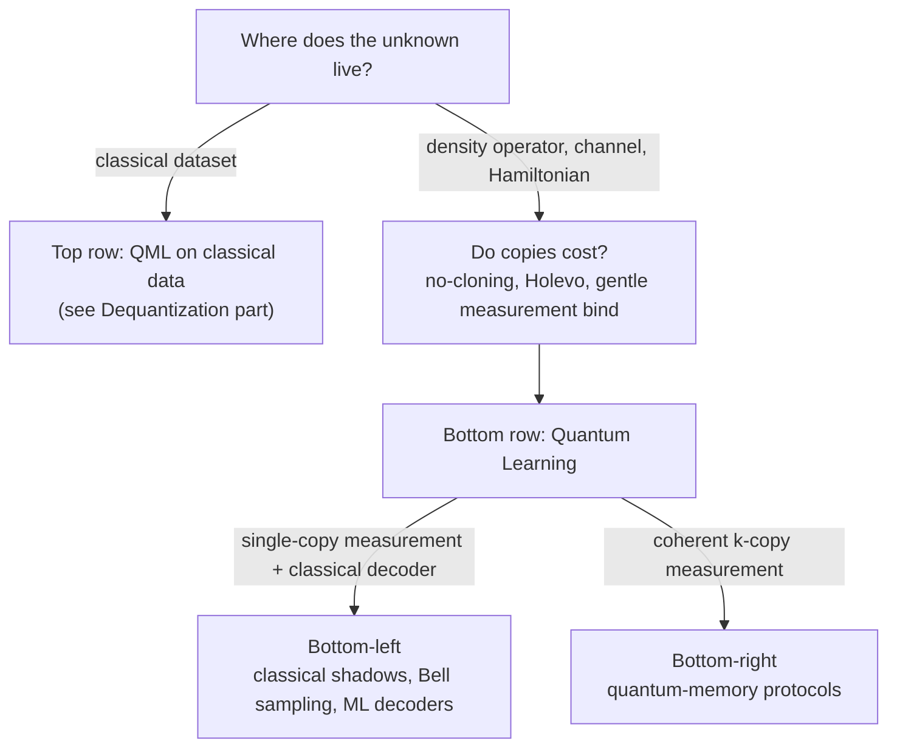
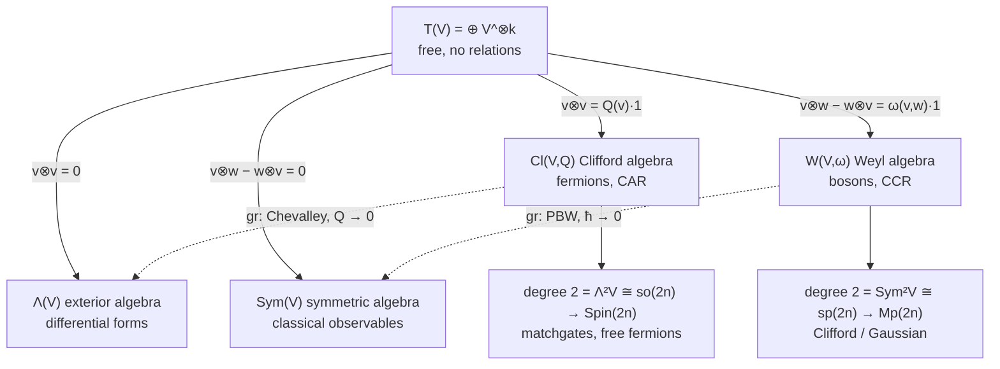
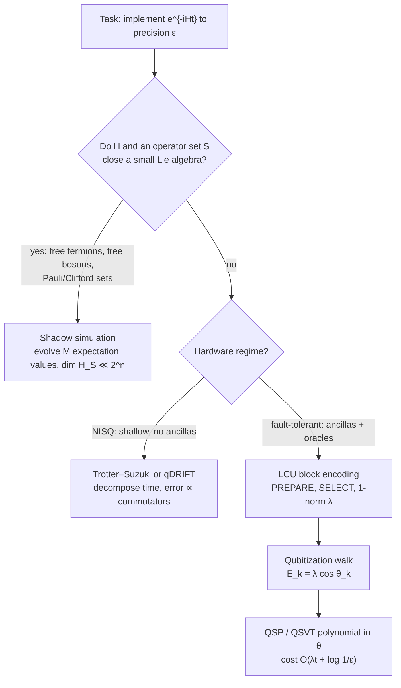
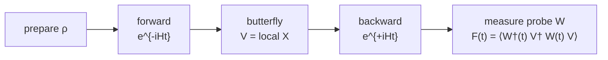
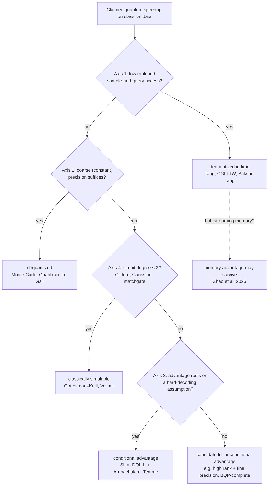

# Quantum Information Theory

Alexander Del Toro Barba, PhD. [Google Scholar](https://scholar.google.com/citations?hl=en&user=fddyK-wAAAAJ) $\cdot$ [LinkedIn](https://www.linkedin.com/in/deltorobarba/)

## Contents

**Part I · Quantum Learning**

- [Quantum Learning (Learning from Quantum Experiments)](#quantum-learning-learning-from-quantum-experiments)
  - [The data source decides, not the hardware](#the-data-source-decides-not-the-hardware)
- [2. Perspectives on the Field](#2-perspectives-on-the-field)
  - [2.1 By resources](#21-by-resources)
  - [2.2 By task: estimating vs. searching](#22-by-task-estimating-vs-searching)
  - [2.3 Three budgets, always separate](#23-three-budgets-always-separate)
  - [2.4 Positioning of the own project](#24-positioning-of-the-own-project)
- [3. The Protocols: Technique and Literature](#3-the-protocols-technique-and-literature)
  - [3.1 State discrimination: Helstrom vs. USD](#31-state-discrimination-helstrom-vs-usd)
  - [3.2 Full QST: the exponential baseline](#32-full-qst-the-exponential-baseline)
  - [3.3 Shadow tomography and classical shadows (observables as input)](#33-shadow-tomography-and-classical-shadows-observables-as-input)
  - [3.4 Two copies: Bell sampling, conjugate pairs, quantum memory](#34-two-copies-bell-sampling-conjugate-pairs-quantum-memory)
  - [3.5 Structure learning (observables as output)](#35-structure-learning-observables-as-output)
  - [3.6 Computational lens: hardness and pseudorandomness](#36-computational-lens-hardness-and-pseudorandomness)
  - [3.7 Learning dynamics: Hamiltonians, channels, circuits](#37-learning-dynamics-hamiltonians-channels-circuits)
  - [3.8 Machine-learned decoders](#38-machine-learned-decoders)
  - [3.9 Surveys and timeline](#39-surveys-and-timeline)
- [4. Open Frontiers](#4-open-frontiers)
- [5. Technique: Displacement Operators and Conjugate Pairs](#5-technique-displacement-operators-and-conjugate-pairs)
  - [5.1 Heisenberg-Weyl operators](#51-heisenberg-weyl-operators)
  - [5.2 Why ρ ⊗ ρ* and not ρ ⊗ ρ](#52-why-rho-otimes-rho-and-not-rho-otimes-rho)
  - [5.3 Bell basis as Fourier access](#53-bell-basis-as-fourier-access)
  - [5.4 Physical reading: interferometer in phase space](#54-physical-reading-interferometer-in-phase-space)
  - [5.5 Phase space as the complex plane](#55-phase-space-as-the-complex-plane)
- [Excursus: Types of Conjugation](#excursus-types-of-conjugation)

**Part II · Heisenberg-Weyl**

- [1. Physics: the Quantum Harmonic Oscillator as Source of All Operators](#1-physics-the-quantum-harmonic-oscillator-as-source-of-all-operators)
  - [Exponentiation produces the gates](#exponentiation-produces-the-gates)
  - [The conjugate relation](#the-conjugate-relation)
  - [Dictionary: from energy term to gate](#dictionary-from-energy-term-to-gate)
- [2. Groups: the Degree Ladder from Heisenberg-Weyl Algebra to Quantum Gates](#2-groups-the-degree-ladder-from-heisenberg-weyl-algebra-to-quantum-gates)
  - [Degree 1 notes](#degree-1-notes)
  - [Degree 2 notes](#degree-2-notes)
  - [Degree ≥ 3 notes](#degree-geq-3-notes)
- [3. Tensor Algebra T(V): One Recipe, Four Algebras](#3-tensor-algebra-tv-one-recipe-four-algebras)
  - [What each side becomes](#what-each-side-becomes)
- [4. From Weyl Algebra to Heisenberg-Weyl: How Bosons Reach Actual Qubits](#4-from-weyl-algebra-to-heisenberg-weyl-how-bosons-reach-actual-qubits)
- [5. The Symplectic Form](#5-the-symplectic-form)

**Part III · Quantum Dynamics (Simulation)**

- [1. The Map: Three Axes](#1-the-map-three-axes)
  - [Static vs. dynamic: the core difference](#static-vs-dynamic-the-core-difference)
- [2. Static Quantum Chemistry: the Approximation Stack](#2-static-quantum-chemistry-the-approximation-stack)
- [3. Dynamic Quantum Simulation on a Quantum Computer](#3-dynamic-quantum-simulation-on-a-quantum-computer)
  - [3.1 Trotterization: walk through time](#31-trotterization-walk-through-time)
  - [3.2 Qubitization: walk through the eigenvalues](#32-qubitization-walk-through-the-eigenvalues)
  - [3.3 Shadow Simulation: shrink the space (Somma et al. 2024/25)](#33-shadow-simulation-shrink-the-space-somma-et-al-202425)
  - [3.4 Open systems: non-unitary dynamics](#34-open-systems-non-unitary-dynamics)
- [4. Chaos, Scrambling and OTOCs](#4-chaos-scrambling-and-otocs)
  - [4.1 The object: OTOC as four-point function](#41-the-object-otoc-as-four-point-function)
  - [4.2 Three directions of growth](#42-three-directions-of-growth)
  - [4.3 The logical stack of bounds: KMS ⇒ UOGH ⇒ MSS](#43-the-logical-stack-of-bounds-kms--uogh--mss)
  - [4.4 Static fingerprints: ETH and spectral statistics](#44-static-fingerprints-eth-and-spectral-statistics)
  - [4.5 Scrambling vs. decoherence](#45-scrambling-vs-decoherence)
  - [4.6 Consequences: black holes ↔ quantum computing](#46-consequences-black-holes--quantum-computing)

**Part IV · Dequantization vs. Genuine Quantum Advantage**

- [1. Tang's Finding: The Speedup Sat in the Input Model](#1-tangs-finding-the-speedup-sat-in-the-input-model)
- [2. The Four Axes: Where the Shortcut Can Lurk](#2-the-four-axes-where-the-shortcut-can-lurk)
- [3. Two Levels: Circuit vs. Problem](#3-two-levels-circuit-vs-problem)
- [4. The Unification: Tractability Is Low Rank](#4-the-unification-tractability-is-low-rank)
- [5. Three Resources, Three Knobs](#5-three-resources-three-knobs)
- [6. What Remains for QML?](#6-what-remains-for-qml)
- [7. Core Principles](#7-core-principles)
- [Open Frontiers (Selection)](#open-frontiers-selection)
- [References (Core)](#references-core)

---

## Quantum Learning (Learning from Quantum Experiments)

**Measurement theory vs. learning theory.** Measurement theory answers the single-shot question: What does a measurement do to a state, and which statistics does it produce? Learning theory asks the inverse, statistical question: *What can be learned about an unknown $\rho$ from many measurements, and at what cost?* The Born rule turns the state into a sampling oracle; learning is the inverse problem.

**Definition.** Given access to copies of an unknown quantum object (state $\rho$, channel $\mathcal{E}$, Hamiltonian $H$), produced by nature, a sensor, or a quantum device: *Which* properties can a learner extract, at *what* cost in copies, classical time, and memory, and how do quantum resources (quantum memory, entangled measurements, adaptivity) change these costs?

### The data source decides, not the hardware

The field is the **bottom row** of the data-vs-learner matrix:

| | Classical Learners | Quantum Enhanced Learners |
| --- | --- | --- |
| **Classical data** | classical ML | "QML on classical data": feature maps, variational classifiers, quantum kernels |
| **Quantum data** (copies of $\rho$ / channels) | **Measurement protocol + classical statistics: shadows, Bell sampling + classical decoders** | Quantum-memory protocols: coherent two-/multi-copy measurements |

Three litmus tests separate the rows sharply:

1. **Where does the unknown live?** Density operator/channel vs. classical dataset.
2. **Is "number of copies" a meaningful cost?** Quantum data cannot be cloned, every copy costs. Classical data can be copied at will.
3. **Do the information bounds bind?** No-cloning, Holevo, and gentle measurement are what make learning from quantum data nontrivial. They do not apply to a CSV file.

**➕ The three bounds, stated.** *No-cloning:* no CPTP map sends $\rho \mapsto \rho\otimes\rho$ for all $\rho$ (linearity forbids it). *Holevo:* $n$ qubits carry at most $n$ bits of accessible classical information, $I(X{:}Y) \leq S(\bar\rho) - \sum_x p_x S(\rho_x) \leq n$. *Gentle measurement* (Winter 1999; Aaronson 2004): if a two-outcome measurement accepts $\rho$ with probability $\geq 1-\epsilon$, the post-measurement state is within trace distance $O(\sqrt{\epsilon})$ of $\rho$. The first makes copies a budget, the second caps what one shot can reveal, the third is the loophole that lets many near-deterministic questions share the same copies (shadow tomography, §3.3).

**Why the separation matters (Power of Data).** In the top row, advantage claims are fragile: classical ML with enough training data catches up with quantum models on classical tasks (Huang et al., Nat. Commun. 2021). In the bottom row stand the *proven* exponential separations, including hardware demonstration.

**Gray zones.** (a) *Engineered states:* Whether $\rho$ comes from a molecule or a processor is irrelevant; device characterization and noise learning belong natively to the field. (b) *Simulators:* The access model remains that of a quantum experiment; sample complexity is simulator-invariant. (c) *Hybrids:* A neural network that decodes quantum measurement data sits bottom-left.

## 2. Perspectives on the Field

### 2.1 By resources

| Axis | Spectrum | Key Separation / Benchmark |
| --- | --- | --- |
| **Quantum Memory** | $1 \to 2 \to k$ copies coherent | Pauli spectrum: $\Theta(n)$ copies (2-copy) vs. $2^{\Omega(n)}$ (1-copy) |
| **Adaptivity** | Fixed $\leftrightarrow$ dynamic settings | Exponential sample savings for non-local property testing |
| **Conjugate Access** | $\rho$ only $\leftrightarrow (\rho, \rho^*)$ | Clean spectrum $\mathrm{Tr}(P\rho)^2$ via conjugate pairs; constant memory |
| **Budgets** | Samples / Time / Memory | Sample-efficient with exponential classical decoders is the default |
| **Data Access** | i.i.d. draws $\leftrightarrow$ active queries | LWE-hardness: states can be sample-learnable but computationally hidden |

The last two axes are the current frontier: Almost all separations are *sample* statements. Whether the data can also be *processed efficiently* is far less charted. The sample-vs-query gap is fundamental, not technical: Under standard cryptographic assumptions there is no generic conversion.

| Access type | Status under LWE | Cause |
| --- | --- | --- |
| **Sampling Access** | **Hard (Post-Quantum)** | No control over $\mathbf{a}_i$; algebraic elimination leads to error accumulation that destroys the signal |
| **Query Access (Superposition)** | **Easy (Bernstein-Vazirani / QFT)** | Targeted superpositions enable interference via QFT; noise stays isolated |

**➕ The classical mirror of the sample-vs-query gap.** The same dichotomy is thirty years old in Boolean learning: with *membership queries*, Goldreich–Levin (1989) finds all heavy Fourier coefficients of a function in polynomial time; with *random examples only*, the same task becomes Learning Parity with Noise, for which the best known algorithm (Blum–Kalai–Wasserman 2003) runs in $2^{O(n/\log n)}$ and whose hardness is a standard cryptographic assumption. LWE is the lattice generalization of LPN. Bell sampling hands you random examples of the Pauli spectrum, never queries; that is exactly why the decoder, not the measurement, is the hard half (§3.5).

### 2.2 By task: estimating vs. searching

The role of the observables separates the tasks most sharply:

* **Full Tomography:** "Give me all $d^2$ parameters." Like sequencing the whole genome.
* **Estimating** (observables are *input*): "Give me the values of these $M$ observables." Like a panel of predefined SNPs.
* **Searching** (observables are *output*): "Find which observables are relevant at all, then their values." Like a GWAS. Genuinely harder: The estimation guarantees do not cover it, and this is where LWE hardness sits.

| Task | Observables | Target Output | Sample Complexity ($n$ qubits, $d=2^n$) |
| --- | --- | --- | --- |
| **Full QST** | All | Full density matrix $\rho$ | $\Theta(d^2/\epsilon^2)$ (entangled) / $\Theta(d^3/\epsilon^2)$ (single-copy) |
| **Shadow Tomography** | Input list ($M$ given) | $M$ expectation values $\mathrm{Tr}(O_i\rho)$ | $\mathrm{poly}(\log M, n, 1/\epsilon)$ |
| **Classical Shadows** | Chosen post-measurement | Arbitrary small shadow-norm $\langle O\rangle$ | $O(\log M \cdot 3^k/\epsilon^2)$ for $k$-local Paulis |
| **Bell / Pauli Sampling** | Sampled dynamically | Draws $P \sim \vert{}\langle\bar\psi\vert{}P\vert{}\psi\rangle\vert{}^2/2^n$ | $O(n)$ two-copy shots (stabilizer support) |
| **Structure Learning** | Discovered (output) | Support + values of sparse spectrum | $\mathrm{poly}(n)$ samples; classical decoding often hard |
| **State Discrimination** | 2 candidates $(\rho_0, \rho_1)$ | Identity index | Helstrom (min error) vs. USD (zero error + abort) |
| **Hypothesis Selection** | List given | One index | $O(\log M)$ copies |

**➕ Two entries the table implies but does not name.**
* **Agnostic tomography** (in the timeline for 2023–2026): given copies of an *arbitrary* $\rho$ and a class $\mathcal{C}$ (stabilizer states, product states, low-degree phase states), output $\sigma\in\mathcal{C}$ with $F(\rho,\sigma) \geq \max_{\tau\in\mathcal{C}} F(\rho,\tau) - \epsilon$. It is the learning-theoretic analogue of agnostic PAC learning: no promise that $\rho$ lies in the class. Grewal–Iyer–Kretschmer–Liang (2024) and Chen–Gong–Ye–Zhang ("stabilizer bootstrapping", 2024) give polynomial-time algorithms for stabilizer and near-stabilizer classes, both driven by Bell difference sampling.
* **Hypothesis selection** at $O(\log M)$ copies comes from the *threshold search* primitive of Bădescu–O'Donnell (STOC 2021), the same tool that improved shadow tomography to $\tilde O(\log^2 M \cdot \log d/\epsilon^4)$.

**➕ Where there is provably no advantage.** For PAC learning a *classical* concept class from quantum examples $\sum_x \sqrt{D(x)}\,|x, c(x)\rangle$, Arunachalam–de Wolf (JMLR 2018) showed the sample complexity is $\Theta(d_{\mathrm{VC}}/\epsilon + \log(1/\delta)/\epsilon)$, identical to the classical bound up to constants. Quantum examples buy nothing in samples for classical targets; the advantages in this document all sit in the bottom row or in *time*, never in PAC sample complexity for classical functions.

### 2.3 Three budgets, always separate

Copies (sample complexity), classical time, and classical memory scale independently. Sample-efficient protocols with exponential decoders are the norm; **triple efficiency** is the exception.

### 2.4 Positioning of the own project

* **Field:** Quantum advantages in learning physical systems from measurement data, with minimal quantum memory (never more than two copies).
* **Approach:** *Machine-learned decoders for quantum measurement data.* A trained model replaces hand-built combinatorics (graph coloring, matrix multiplicative weights) and exploits the structure of the state class. Transfers to Hamiltonian learning, noise characterization, error-correction decoders.
* **Contribution:** Computationally efficient **structure learning** of sparse displacement spectra from two-copy Bell measurements. Triply efficient, posed as a promise problem, with provable instances (dictionary and subgroup classes) and a provable limit (LWE hardness of generic localization).
* **Structure:** Every protocol splits into a *quantum frontend* (which measurement on how many copies) and a *classical decoder*. The error factorizes into localization and estimation. Conjugate Bell pairs in front, learned CNN decoder plus sequential sign integrator behind.

## 3. The Protocols: Technique and Literature

Everything here is a *protocol over measurements*, not a new measurement type. They sort along two axes: copies per shot ($1, 2, k$) and observables as input or output.

### 3.1 State discrimination: Helstrom vs. USD

Given $\rho_0, \rho_1$ with priors $p_0, p_1$: Which one is present? Two strategies with different notions of error.

* **Helstrom (minimum error):** Answer in every run, average error minimized. Projective measurement onto the sign spectrum of $p_0\rho_0 - p_1\rho_1$:

$$P_{\text{err}}^{\min} = \tfrac{1}{2}\Big(1 - \big\|p_0\rho_0 - p_1\rho_1\big\|_1\Big)$$

* **USD (unambiguous):** Third outcome "undecided", decided answers never wrong. Requires a genuine POVM; the price is the abstention probability, minimally $|\langle\psi_0|\psi_1\rangle|$.

**➕ Many copies and the distance zoo.** With $n$ copies the Helstrom error decays exponentially, $P_{\mathrm{err}} \sim e^{-n\,\xi_{\mathrm{QCB}}}$ with the **quantum Chernoff exponent** $\xi_{\mathrm{QCB}} = -\log\min_{0\leq s\leq 1}\mathrm{Tr}(\rho_0^s\rho_1^{1-s})$ (Audenaert et al., PRL 2007). The single-shot quantity is the trace distance $D = \frac12\|\rho_0-\rho_1\|_1$; it is sandwiched by the fidelity via Fuchs–van de Graaf, $1 - F \leq D \leq \sqrt{1-F^2}$, which is why tomography guarantees are quoted interchangeably in either metric. ⚠️ For *learning* (many hypotheses, not two) the relevant quantity is not $D$ but the packing number of the hypothesis class in $D$; that is where the $d^2$ of full tomography comes from.

### 3.2 Full QST: the exponential baseline

Reconstructs all $d^2$ parameters from an informationally complete measurement set (DV: all $3^n$ Pauli bases or a single SIC-POVM; CV: homodyne scan and inverse Radon transform to the Wigner function). Cost $\Theta(d^2/\epsilon^2) = \Theta(4^n/\epsilon^2)$ even with entangled measurements. Everything else exists to escape this scaling.

* **Haah et al. / O'Donnell–Wright (STOC 2016):** $\Theta(d^2/\epsilon^2)$ optimal entangled tomography.
* **Chen et al. (2022):** $\Theta(d^3/\epsilon^2)$ single-copy lower bound, proves the gap to entangled measurements.

**➕ Structured escapes before shadows.** Two routes beat $d^2$ by *assuming* structure rather than by changing the question: **compressed-sensing tomography** (Gross, Liu, Flammia, Becker, Eisert, PRL 2010) recovers a rank-$r$ state from $O(r\,d\log^2 d)$ random Pauli expectation values via nuclear-norm minimization, and **MPS tomography** (Cramer et al., Nat. Commun. 2010) reconstructs 1D states of bounded bond dimension from local reduced density matrices in $\mathrm{poly}(n)$. Both are the tomographic analogue of the "low rank ⇒ easy" theme of the Dequantization part: the exponential baseline is a worst-case statement over *all* states.

### 3.3 Shadow tomography and classical shadows (observables as input)

* **Shadow tomography (Aaronson):** $M$ observables to $\pm\epsilon$ with $\mathrm{poly}(\log M, n, 1/\epsilon)$ copies, $M$ may be exponential. The engine is the gentle-measurement lemma: Near-deterministic estimates damage the state only by $O(\sqrt{\epsilon})$, so the same copies answer many questions. Sample-efficient, but compute- and memory-intensive.
* **Classical shadows (Huang–Kueng–Preskill):** "Randomize first, ask later." Per copy, draw a random $U$ (Pauli basis per qubit or Clifford), measure, store the snapshot:

$$\hat\rho = \mathcal{M}^{-1}\big(U^\dagger|b\rangle\langle b|U\big), \qquad \mathbb{E}[\hat\rho] = \rho$$

  Afterwards estimate arbitrary observables via median-of-means: $O(\log M \cdot 3^k/\epsilon^2)$ shots for $k$-local Paulis. Single-copy, NISQ-ready, the workhorse of practice. The gap: *global* observables ($k \sim n$) cost $3^n$ shots. Exactly this gap is closed by two-copy measurements.
* **Triple efficiency:** Sample *and* time efficiency with $O(1)$-copy quantum memory.

Literature:
* **Aaronson (STOC 2018):** Shadow tomography via gentle measurements, $\tilde{O}(\log^4 M)$ copies.
* **Huang, Kueng, Preskill (Nat. Phys. 2020):** Classical shadows.
* **King, Gosset, Kothari, Babbush (2024):** Triply efficient shadow tomography for local fermionic and Pauli observables.

**➕ The variance bound that decides the ensemble.** The shot count of classical shadows is governed by the **shadow norm** $\|O\|_{\mathrm{shadow}}^2$, which depends on the unitary ensemble: for random single-qubit Pauli measurements, $\|P\|_{\mathrm{shadow}}^2 = 3^{k}$ for a $k$-local Pauli $P$ (local observables cheap, global ones exponential); for random $n$-qubit Cliffords, $\|O\|_{\mathrm{shadow}}^2 \leq 3\,\mathrm{Tr}(O^2)$, so *fidelity* with any pure state costs $O(1/\epsilon^2)$ shots independent of $n$, while a global Pauli still costs $\Theta(2^n)$. Neither ensemble handles global Paulis; that is the gap two-copy Bell measurements close. Two follow-ups worth knowing: **derandomization** (Huang, Kueng, Preskill, PRL 2021) picks the measurement bases greedily against a fixed observable list and beats random shadows by constant factors in practice; **Bădescu–O'Donnell** (STOC 2021) brought shadow tomography proper down to $\tilde O(\log^2 M\cdot\log d/\epsilon^4)$ copies.

### 3.4 Two copies: Bell sampling, conjugate pairs, quantum memory

**Mechanism.** The $2n$-qubit Bell basis $\{(P\otimes\mathbb{1})|\Phi^+\rangle^{\otimes n}\}$ is the joint eigenbasis of all commuting $P\otimes\bar P$. A transversal Bell measurement across two copies draws one Pauli string per shot

$$P \sim \frac{|\langle\bar\psi|P|\psi\rangle|^2}{2^n}$$

A single shot carries information about the *entire* Pauli spectrum. **Subtlety:** On $\psi\otimes\psi$ one samples against the *conjugate* state $\bar\psi$. The clean spectrum $\mathrm{Tr}(P\rho)^2/2^n$ requires the pair $(\rho, \bar\rho)$. For real amplitudes both coincide (which is why demos like GHZ states).

**Consequences.** Purity and overlap $\mathrm{Tr}(\rho\sigma)$ via SWAP tests without tomography. Stabilizer states learnable from $O(n)$ Bell samples. Above all: **Pauli shadow tomography with $\Theta(n)$ copies given two-copy memory vs. $2^{\Omega(n)}$ without.** One of the strongest proven exponential quantum advantages, demonstrated in hardware. Two is the sweet spot: Almost all known gain arrives already at $k=2$.

Literature:
* **Bubeck, Chen, Li (FOCS 2020):** Entanglement necessary for optimal property testing.
* **Chen, Cotler, Huang, Li (FOCS 2021):** $\Theta(n)$ vs. $2^{\Omega(n)}$ separation with quantum memory.
* **Huang et al. (Science 2022):** Flagship separations and Sycamore demo with 40 qubits.
* **King, Wan, McClean (2024):** Exponential advantage via $(\rho, \rho^*)$ with constant memory.
* **Chen, Gong, Zhang (2024):** Separations for adaptive multi-copy shadow tomography.

**➕ Two more separations of the same shape.** *Purity testing* (is $\rho$ pure or maximally mixed?) needs $O(1)$ copies with two-copy memory (a SWAP test) but $\Omega(2^{n/2})$ without (Chen, Cotler, Huang, Li, FOCS 2021); the memory-free lower bound also kills any single-copy route to $\mathrm{Tr}(\rho^2)$. *Pauli channel estimation*: learning all $4^n$ Pauli eigenvalues of a channel to $\pm\epsilon$ takes roughly $O(n/\epsilon^2)$ uses with ancilla-assisted entangled inputs versus $2^{\Omega(n)}$ without (Chen, Zhou, Seif, Jiang, PRA 2022), the channel version of the shadow-tomography separation. The general framework in which all of these live is **QUALM** (Aharonov, Cotler, Qi, Nat. Commun. 2022): a learner is a quantum algorithm with coherent or incoherent access to the lab, and the separations are statements about access, not about the model class.

### 3.5 Structure learning (observables as output)

**Task inversion:** First *find* the few observables that carry the support of a sparse Pauli/displacement spectrum, then estimate their values (first the edges, then the weights, as in learning graphical models). Sampling is the easy half: Bell sampling concentrates the draws on the support. **Decoding is the hard half:** Turning i.i.d. samples into the support is sparse recovery *without choosable queries*, generically cryptographically hard (LWE-type). Subgroup/stabilizer symmetries are the tractable exception.

* **Montanaro (2017):** Stabilizer states from $O(n)$ Bell samples via linear algebra.
* **Grewal, Iyer, Kretschmer, Liang (2023):** Bell difference sampling, states with few non-Clifford gates.
* **Hangleiter, Gullans (PRL 2024):** Bell sampling as a universal diagnostic framework.

**➕ Where Bell difference sampling comes from.** The distribution behind stabilizer learning, $p(x) \propto \sum_y \hat p_\psi(y)\,\hat p_\psi(x+y)$ over $\mathbb{F}_2^{2n}$ with $\hat p_\psi(x) = 2^{-n}|\langle\psi|P_x|\psi\rangle|^2$ the **characteristic distribution**, is a corollary of the **Schur–Weyl duality for the Clifford group** (Gross, Nezami, Walter, Commun. Math. Phys. 2021): the commutant of $U^{\otimes 4}$ over Cliffords is spanned by stabilizer codes, which is why four copies (two Bell pairs, differenced) expose the stabilizer group. This is the group-theoretic reason "subgroup/stabilizer symmetries are the tractable exception": the support of $\hat p_\psi$ for a stabilizer state is a Lagrangian subspace, and linear algebra over $\mathbb{F}_2$ recovers a subspace from $O(n)$ random elements.

### 3.6 Computational lens: hardness and pseudorandomness

Pseudorandom states (PRS) show: States can be statistically learnable yet computationally indistinguishable from Haar-random ones.

* **Regev (2005):** Learning With Errors, foundation of average-case hardness.
* **Ji, Liu, Song (CRYPTO 2018):** Pseudorandom quantum states.
* **Kretschmer (TQC 2021):** Quantum pseudorandomness and classical learning hardness.
* **Huang, Broughton et al. (Nat. Commun. 2021):** *Power of data*: classical data closes quantum advantages in learning classical functions.

**➕ The average-case counterpart.** Huang, Kueng, Preskill, "Information-theoretic bounds on quantum advantage in machine learning" (PRL 2021): for predicting $\mathrm{Tr}(O\,\mathcal{E}(\rho_x))$ on inputs drawn from a distribution, a classical learner with measurement data needs only polynomially more samples than a fully quantum one in the *average-case* prediction error, while for *worst-case* prediction the gap can be exponential. Read together with PRS: computational indistinguishability and average-case learnability are different axes, and most "quantum advantage in learning" claims live on the worst-case one.

### 3.7 Learning dynamics: Hamiltonians, channels, circuits

Unknown terms and coupling graphs from Gibbs states or real-time dynamics up to the Heisenberg limit; Pauli noise in channels; shallow circuits in polynomial time.

* **Flammia, Wallman (TQC 2020):** Efficient Pauli channel estimation.
* **Anshu et al. (Nat. Phys. 2021) / Haah et al. (FOCS 2022):** Optimal sample complexity for Gibbs-state Hamiltonian learning.
* **Huang et al. (PRL 2023):** Heisenberg-limited Hamiltonian learning from real-time evolution.
* **Huang et al. (STOC 2024):** Polynomial-time reconstruction of shallow circuits.

**➕ Two practical anchors.** *Heisenberg limit* means total evolution time $T \sim 1/\epsilon$ for precision $\epsilon$ on a coupling, versus the standard quantum limit $T \sim 1/\epsilon^2$ of incoherent repetition; the PRL 2023 protocol reaches it with product-state inputs plus a decoupling pulse sequence, no entangled probes. On the noise side, the field-standard protocols are **randomized benchmarking** (Emerson et al. 2005; Magesan et al. 2011), which extracts an average gate fidelity from the exponential decay of survival probability under random Cliffords, and **gate set tomography** (Blume-Kohout et al. 2013; Nielsen et al. 2021), the self-consistent full characterization; Flammia–Wallman's Pauli channel estimation is the sparse, scalable middle ground and the one that maps onto the noise-learning transfer named in §2.4.

### 3.8 Machine-learned decoders

Classical neural decoders on shadow data (bottom-left quadrant) as empirical heuristics for classically hard decoding tasks.

* **Torlai et al. (Nat. Phys. 2018):** Neural-network QST.
* **Huang, Kueng, Torlai, Albert, Preskill (Science 2022):** Provable generalization bounds for ML on shadow data.
* **Huang, Preskill, Soleimanifar (2024):** State certification via single-qubit shadow relaxations.

**➕ Representation side and the decoding target.** The representational cousin of a learned decoder is the **neural quantum state** (Carleo, Troyer, Science 2017): a network as the ansatz $\psi_\theta(s)$, trained variationally rather than from measurement data. The two meet in Torlai et al. (2018), where the network is fit to measurement statistics. On the transfer to error correction promised in §2.4: Google's **AlphaQubit** (Bausch et al., Nature 2024) is a transformer decoder trained on syndrome data that outperforms tensor-network and matching decoders on Sycamore surface-code experiments, the existence proof that a learned decoder can beat hand-built combinatorics on real hardware data.

### 3.9 Surveys and timeline

* **Anshu, Arunachalam (Nat. Rev. Phys. 2024):** Canonical survey on state-learning complexity.
* **Gebhart et al. (Nat. Rev. Phys. 2023):** Review on learning quantum dynamics in experiments.
* **Arunachalam, de Wolf (SIGACT 2017):** Quantum PAC learning.

| Period | Milestones |
| --- | --- |
| 1998–2007 | Quantum PAC (Bshouty–Jackson) · LWE (Regev) · State PAC learnability (Aaronson) |
| 2016 | Sample-optimal tomography $\Theta(d^2/\epsilon^2)$ |
| 2017–2018 | Shadow tomography · Stabilizer Bell sampling · PRS |
| 2020 | Classical shadows · Entanglement lower bounds |
| 2021–2022 | Memory separations · Sycamore demo · Shallow circuit learning |
| 2023–2024 | Heisenberg Hamiltonian learning · Triply efficient shadows · Conjugate pairs · Agnostic tomography |
| 2025–2026 | Agnostic tomography · Noise-robust 2-copy hardware · Physical average-case decodability |

## 4. Open Frontiers

* **Mapping the decodable classes.** Between "subgroup-easy" (linear algebra) and "LWE-hard" lies uncharted territory. The same state moves from the easy to the hard regime by turning up a noise parameter. Open: Does the hardness reduction transfer from the tensor-product basis to the cyclic single-qudit basis?
* **What learned decoders implicitly find.** If a decoder works on a class with no known efficient algorithm, it may have found one. ML as a tool for algorithm discovery; what is missing is a metric that predicts generalization across state distributions.
* **Hardware realism with two copies.** Approximate matched filters (probe gain $\kappa < 1$, overhead $\kappa^{-2}$) make protocols graceful against preparation, crosstalk, and measurement errors. The practically most relevant axis.
* **Average case instead of worst case.** The hardness results are adversarial. Natural states (ground states of local Hamiltonians, thermal states) could be generically decodable: from the cryptography perspective to the physics perspective.
* **➕ Memory between zero and two.** The separations are stated at $k=0$ versus $k=2$ copies. Chen–Cotler–Huang–Li also treat a learner with $k$ qubits of quantum memory and find that the sample complexity interpolates smoothly; what is missing is the *protocol* side: which structured tasks become tractable at a fixed small memory budget short of a full second copy, e.g. with a few ancilla qubits per shot as in the Pauli-channel case.

## 5. Technique: Displacement Operators and Conjugate Pairs

Core of the paper [arXiv:2403.03469](https://arxiv.org/abs/2403.03469) (King, Wan, McClean): shadow tomography on the set of **displacement operators** of a qudit, target $\mathrm{Tr}(D_{q,p}\rho) \pm \varepsilon$ for all $(q,p)$.

### 5.1 Heisenberg-Weyl operators

$$D_{q,p} = e^{i\pi qp/d}\, X^q Z^p, \qquad X|k\rangle = |k+1\rangle, \quad Z|k\rangle = \omega^k|k\rangle, \quad \omega = e^{2\pi i/d}$$

* Commutation: $D_{q',p'} D_{q,p} = e^{i 2\pi (qp' - q'p)/d} D_{q,p} D_{q',p'}$
* Phase-space symmetries: $D_{q,p}^T = D_{-q,p}$, $\;D_{q,p}^* = D_{q,-p}$, $\;D_{q,p}^\dagger = D_{q,p}^{-1} = D_{-q,-p}$

### 5.2 Why $\rho \otimes \rho^*$ and not $\rho \otimes \rho$

Two problems on a single copy:

1. $D_{q,p}$ is **not Hermitian** for $d>2$: complex eigenvalues, not directly measurable.
2. Different $D_{q,p}$ **do not commute**: not simultaneously measurable.

Solution: The joint operator $O_{q,p} = D_{q,p} \otimes D_{-q,p}$ is Hermitian, and all $O_{q,p}$ commute with each other. Their joint eigenbasis is the generalized Bell basis $\{|\Phi_{a,b}\rangle\}$. On the conjugate pair the expectation value yields exactly the square:

$$E = \mathrm{Tr}(D_{q,p}\rho)\cdot\mathrm{Tr}(D_{-q,p}\rho^*) = \mathrm{Tr}(D_{q,p}\rho)\cdot\mathrm{Tr}(D_{q,p}^T\rho^*) = \mathrm{Tr}(D_{q,p}\rho)^2 = y_{q,p}^2$$

**The decisive step** is not a property of $D$ but of $\rho$: Because $\rho$ is Hermitian, $\rho^* = (\rho^\dagger)^T = \rho^T$. Hence

$$\mathrm{Tr}(D^T\rho^*) = \mathrm{Tr}(D^T\rho^T) = \mathrm{Tr}((\rho D)^T) = \mathrm{Tr}(\rho D) = \mathrm{Tr}(D\rho)$$

With two identical copies $\rho\otimes\rho$ this fails: $\mathrm{Tr}(D_{-q,p}\rho) \neq \mathrm{Tr}(D_{q,p}\rho)$. Complex conjugation is used here as a **physical resource**: Instead of estimating $y_{q,p}$ and squaring classically (statistically expensive), the hardware delivers the squared modulus directly.

### 5.3 Bell basis as Fourier access

The Bell measurement on $\rho\otimes\rho^*$ yields probabilities $p_{a,b} = \mathrm{Tr}[\Pi_{a,b}(\rho\otimes\rho^*)]$. Every Bell state $|\Phi_{a,b}\rangle$ is an eigenstate of $D_{q,p}\otimes D_{-q,p}$ with eigenvalue equal to the **Fourier character** $\chi_{q,p}(a,b) = e^{i\frac{2\pi}{d}(ap - bq)}$. The $(a,b)$ live in the dual space to $(q,p)$, like time to frequency. Fourier inversion returns the spectrum:

$$y_{q,p}^2 \approx \sum_{a,b} p_{a,b}\, e^{i\frac{2\pi}{d}(ap - bq)}$$

One measures in the Bell basis because it gives access to the spectrum of the hidden displacement operator.

**➕ Normalization check.** Since $\{D_{q,p}/\sqrt d\}$ is an orthonormal basis of $M_d(\mathbb{C})$ in the Hilbert–Schmidt inner product, $\sum_{q,p}|\mathrm{Tr}(D_{q,p}\rho)|^2 = d\,\mathrm{Tr}(\rho^2)$ (Parseval). For a pure state this equals $d$, so $|y_{q,p}|^2/d$ is a genuine probability distribution over the $d^2$ phase-space points: Bell sampling on $(\rho,\rho^*)$ *samples* it. For a mixed state the mass $\mathrm{Tr}(\rho^2) < 1$ leaks into the "no information" outcome, which is exactly how the SWAP-test purity estimate of §3.4 arises from the same measurement.

### 5.4 Physical reading: interferometer in phase space

* $D_{q,p}$ **displaces** the state by $(q,p)$ in phase space; $y_{q,p} = \langle\psi|D_{q,p}|\psi\rangle$ is the **overlap** with its displaced self (autocorrelation). High overlap means the state "resonates" at this frequency.
* $y_{q,p} = r e^{i\theta}$ is complex. **Magnitude** $r$: strength of self-similarity. **Sign**: sign of the real part $\mathrm{Re}[y] = \mathrm{Tr}(A\rho)$ with $A = \tfrac12(D + D^\dagger) \sim \cos(q\hat P - p\hat Q)$. Constructive or destructive?
* The map $(q,p) \mapsto y_{q,p}$ is the **characteristic function** $\chi(q,p)$ of the state. Its Fourier transform is the **Wigner function**. A displacement map is thus a correlation map, not a spatial map.
* For energy eigenstates, $\langle n|D(\alpha)|n\rangle = L_n(|\alpha|^2)e^{-|\alpha|^2/2}$ with **Laguerre polynomials**, positive or negative depending on the radius. Excited states respond differently from the ground state.
* **Analogy to IR spectroscopy:** Vibrational spectroscopy measures single transitions ($v=0\to1$) on a 1D axis. Displacement operators measure the *shape* in 2D phase space, including Wigner negativity, many modes simultaneously.

### 5.5 Phase space as the complex plane

The $q$-axis plays the real part, the $p$-axis the imaginary part ($z = q + ip$). Complex conjugation of the operator is a reflection across the $q$-axis: $X$ is a real permutation matrix ($X^* = X$), $Z$ carries the roots of unity ($Z^* = Z^{-1}$), hence

$$D_{q,p}^* \propto X^q (Z^{-1})^p = X^q Z^{-p} \propto D_{q,-p}$$

Physically this is **time reversal**: position stays, momentum flips (the $i$ sits in $\hat p = -i\hbar\,\partial_q$). The state $\rho^*$ is the "time-reversed twin". Because $D_{q,p}\otimes D_{q,p}^*$ commute, the pairing circumvents the Heisenberg uncertainty between $q$ and $p$.

**➕ Discrete Wigner function and the bridge to the degree ladder.** For odd $d$ the discrete Wigner function $W_\rho(a,b) = \frac1d\sum_{q,p} \chi_{q,p}(a,b)^*\,\mathrm{Tr}(D_{q,p}\rho)$ is the symplectic Fourier transform of the characteristic function above; it is real, normalized, and its marginals are the Born probabilities in the $X$ and $Z$ bases. **Discrete Hudson theorem** (Gross, J. Math. Phys. 2006): a pure state has $W_\rho \geq 0$ everywhere iff it is a stabilizer state. **Wigner negativity is therefore magic**: Veitch, Ferrie, Gross, Emerson (NJP 2012) show negativity is a monotone under Clifford operations and stabilizer measurements, and Howard–Campbell (PRL 2017) turn it into a resource measure (robustness of magic) for distillation cost. In the language of the Heisenberg-Weyl part: degree $\leq 2$ generators map the positive Wigner cone to itself; degree $\geq 3$ is exactly what pushes $W$ negative. The displacement spectrum you measure via Bell sampling is the *same* object whose Fourier dual decides classical simulability.

## Excursus: Types of Conjugation

| Type | Map | Idea | Role in the project |
| --- | --- | --- | --- |
| **A: Group conjugation** | $x \mapsto gxg^{-1}$ | Change of basis, inner automorphism. Trace, determinant, spectrum invariant | Clifford group $UPU^\dagger = P'$; rotors $RvR^\dagger$ |
| **B: Complex conjugation / adjoint** | $z\mapsto\bar z$, $A\mapsto A^\dagger$ | Reflection, involution, time reversal, contravariant functor | **The conjugate-pairs paper:** $\rho^*$ as physical resource |
| **C: Canonical conjugation** | $[\hat Q,\hat P] = i\hbar$, $ZX = \omega XZ$ | Duality, Fourier pairing, Pontryagin duality, Stone–von Neumann | Position/momentum, clock/shift of qudits |

All three meet in the quantum Fourier transform $W$:

$$W X W^\dagger = Z^\dagger$$

Type C ($X$ on the left, $Z$ on the right as canonical pair), type A (the conjugation $W(\cdot)W^\dagger$ rotates phase space by $90^\circ$), type B (the dagger reflects the eigenvalues along the complex axis).

**Why "Clifford group"?** Historical accident plus structural analogy (Gottesman, 1990s). In mathematics the Clifford/Lipschitz group is the normalizer of the generating vectors inside the Clifford algebra; the quantum Clifford group is the normalizer of the Pauli group. Same defining figure, same name. For a single qubit it even fits geometrically ($SU(2)\cong\mathrm{Spin}(3)$). For several qubits the correct structure group is $Sp(2n,\mathbb{Z}_d)$, symplectic. No Clifford algebra involved.

# Heisenberg-Weyl

> **Core message.** Every quantum gate is a time evolution $U = e^{-i\hat Ht}$. The physical and information-theoretic complexity of the gate is determined by the **polynomial degree of the generator $\hat H$ in the phase-space operators $\hat Q, \hat P$**, and the criterion behind the ladder is whether that degree still **closes under the commutator**. Degree 1: displacements (Pauli / Heisenberg-Weyl). Degree 2: Gaussian / Clifford, classically simulable. Degree $\geq 3$: non-Gaussian / non-Clifford, universal, quantum advantage.

## 1. Physics: the Quantum Harmonic Oscillator as Source of All Operators

$$\hat H \propto \hat P^2 + \hat Q^2 = \hbar\omega\left(\hat a^\dagger\hat a + \tfrac12\right) = \hbar\omega(\hat n + \tfrac12)$$

**Why the QHO is *the* starting point.** Analytically, every smooth potential near a minimum is quadratic (Taylor), so the QHO is the universal local model of any bound system. Algebraically, $\hat Q^2 + \hat P^2$ is *the* canonical degree-2 element of the Weyl algebra ($\mathrm{Sym}^2 V \cong \mathfrak{sp}$), the bosonic counterpart of the Dirac operator. Everything below is this one generator, read at different degrees.

* **Time evolution = swap kinetic $\leftrightarrow$ potential.** At $t=0$ the state sits in $Q$; after $t = \frac{\pi}{2\omega}$ it has rotated $90°$ into $P$. **That quarter turn is the QFT.**
* **Why complex numbers.** $\hat a \propto \hat Q + i\hat P$: real axis = position, imaginary axis = momentum, rotation $e^{i\omega t}$ = time. Two real numbers become one complex amplitude $\alpha = x + ip$; rotation preserves magnitude (unitary).
* ⚠️ **Position basis = computational basis.** $|k\rangle$ are eigenstates of $\hat Q$. Hence $Z$ (diagonal) is a function of position, $X$ (permutation) a function of momentum.
* **Time is an angle.** In $\hat U(t) = e^{-i\hat Ht/\hbar}$ the exponent is dimensionless. States do not move along trajectories; their phase rotates, in an eigenstate at $\omega = E/\hbar$.
* ⚠️ **Two families of *states*, not gates:** coherent states $|\alpha\rangle = \hat D(\alpha)|0\rangle$ (eigenstates of $\hat a$, overcomplete, degree-1 output) vs. Fock states $|n\rangle$ (eigenstates of $\hat n$, orthonormal, eigenbasis of the degree-2 generator).

### Exponentiation produces the gates

$$\hat U = e^{-i\hat G\theta}$$

$e^{i\theta}$ keeps it unitary, $\hat G$ is the transformation, $\theta$ scales it. If $\hat G = \hat H$, then $\theta = t/\hbar$: $\hat H$ *is* time evolution. The generator is built from $\hat Q, \hat P$ for CV, or from $X, Z$ mod $d$ for qudits, on top of the CCR $[\hat x,\hat p] = i\hbar$.

* **Gaussian (linear)**: generator of degree $\leq 2$. ⚠️ "Linear" refers to the *Heisenberg action* $U^\dagger \hat r U = S\hat r + d$, not to the generator. Symplectic structure preserved.
* **Non-Gaussian (non-linear)**: degree $\geq 3$. The Heisenberg action itself becomes nonlinear ($\hat p \to \hat p - 3\gamma t \hat q^2$), the Wigner function goes negative.

### The conjugate relation

An operator generates the translation of its conjugate variable. This is what allows the basis change $X \leftrightarrow Z$ via Fourier transform, and underlies $D_{q,p} = \tau^{qp} X^q Z^p$. Continuous: $[\hat x, \hat p] = i\hbar$. Discrete: Weyl relation $ZX = \zeta_d XZ$.

**Notation.** $\zeta_d = e^{2\pi i/d}$ is the primitive $d$-th root of unity; $\tau = e^{i\pi/d}$ is the half-phase, $\tau^2 = \zeta_d$. ⚠️ Many texts write $\omega$ for $\zeta_d$, but $\omega$ is already the oscillator frequency and the symplectic form here.

### Dictionary: from energy term to gate

The energy terms are quadratic, but the **gates** exponentiate the *linear* parts $\hat P$ and $\hat Q$.

| | **Kinetic energy $\hat P^2$** | **Potential energy $\hat Q^2$** |
| --- | --- | --- |
| **CV observable** | $\hat P = \frac{i}{\sqrt2}(\hat a^\dagger - \hat a)$, derivative $\approx i(X^\dagger - X)$ | $\hat Q = \frac{1}{\sqrt2}(\hat a + \hat a^\dagger)$, real eigenvalues (location $k$) |
| **Lattice term** | Hopping / Laplacian $\approx X + X^\dagger$ (Google OTOC) | On-site potential (diagonal) |
| **Qudit gate** | **Shift** $X^a\vert{}j\rangle = \vert{}j+a \bmod d\rangle$, eigenvalues powers of $\zeta_d$ | **Clock** $Z^b\vert{}k\rangle = \zeta_d^{bk}\vert{}k\rangle$, phase gradient on the unit circle |
| **Qubit gate** | **Pauli $X$**, bit flip, $\zeta_2 = -1$ | **Pauli $Z$**, phase flip, $(-1)^j$. Unitary *and* Hermitian, so directly observable |
| **Matrix** | Real, off-diagonal permutation of 0s and 1s | Diagonal, complex phases; for $d>2$ unitary but not Hermitian |
| **Gate as exponential** | $X \approx e^{-i\hat P\delta}$ | $Z \approx e^{i\hat Q\delta}$ |
| **Conjugation twist** | $X$ *represents* momentum but *generates* a position shift: $D_{q,0} \sim X^q$ | $Z$ *represents* position but *generates* a momentum kick: $D_{0,p} \sim Z^p$ |

$X = \mathrm{DFT}^\dagger\, Z\, \mathrm{DFT}$: in the momentum basis the shift is diagonal and looks like the clock.

## 2. Groups: the Degree Ladder from Heisenberg-Weyl Algebra to Quantum Gates

| | **Degree 1: Displacements** | **Degree 2: Gaussian / Clifford** | **Degree $\geq 3$: Non-Gaussian / Non-Clifford** |
| --- | --- | --- | --- |
| **Generator** | $\hat H = q\hat P - p\hat Q$ | $\hat Q^2 + \hat P^2$, $\hat Q^2 - \hat P^2$, $\hat Q_1\hat P_2$ | $\hat Q^3$, $\hat n^2 \sim (\hat Q^2 + \hat P^2)^2$, many-body |
| **Lie algebra** | ✅ Heisenberg $\mathfrak{h}_n$, $\dim 2n+1$, $[\hat Q,\hat P]$ central | ✅ Symplectic $\mathfrak{sp}(2n,\mathbb{R})$, with degree 1: $\mathfrak{sp}(2n) \ltimes \mathfrak{h}_n$ | ❌ Does not close: cubic $\to$ quartic $\to$ quintic $\to \dots$, infinite-dimensional |
| **Action on phase space** | *Slide* to $(q,p)$, no rotation, no shape change | *Linear* map $U^\dagger \hat r U = S\hat r$, $S \in \mathrm{Sp}(2n)$: rotations, shears, entanglement | *Curved* nonlinearly, falls out of $\mathrm{Sp}(2n)$ |
| **CV** | $\hat D(\alpha) = e^{\alpha\hat a^\dagger - \alpha^*\hat a}$ | Metaplectic $\mathrm{Mp}(2n)$: rotator, squeezer, beam splitter, shear | Cubic phase $e^{i\gamma\hat Q^3}$, Kerr $e^{i\chi\hat n^2}$ |
| **Discrete** | HW group: $D_{q,p} = \tau^{qp}X^qZ^p$; $d=2$: Pauli group $\mathcal{P}$ | Clifford $\mathcal{C} = \{U : U\mathcal{P}U^\dagger = \mathcal{P}\}$, $\mathcal{C}/\mathcal{P} \cong \mathrm{Sp}(2n,\mathbb{Z}_d)$: QFT, Hadamard, $S$, C-SUM/CNOT | $T$, qudit $T_d$, Toffoli, CS. In $M_d(\mathbb{C})$ but in neither HW nor Clifford |
| **Hierarchy** | $\mathcal{C}_1$, orthogonal basis of operator space | $\mathcal{C}_2$, **Gottesman–Knill**: track $2n\times 2n$ symplectic $S$ instead of $2^n$ amplitudes | $\mathcal{C}_k$ for $k\geq 3$ no longer groups; Clifford $+T$ dense in $U(2^n)$: **universal, magic starts here** |
| **Fermionic mirror** | **None.** Degree 1 closes only under the *anti*commutator; parity superselection forbids odd Hamiltonians | **Free fermions / matchgates** (Valiant): $\mathfrak{so}(2n) \to \mathrm{Spin}(2n)$, same theorem as Gottesman–Knill with $SO$/Spin instead of $Sp$/Mp | **Degree 3 missing** (parity). Non-simulability starts at **degree 4**, e.g. Hubbard $n_\uparrow n_\downarrow$ |

### Degree 1 notes

* The phase factor $\tau^{qp}$ in $D_{q,p}$ is required because $X$ and $Z$ do not commute (Aharonov–Bohm effect in phase space).
* ⚠️ **Pauli $Y$ is not independent**: $\sigma_y = i\sigma_x\sigma_z$, the $(1,1)$ point on the grid. For $d=3$ none of $XZ, XZ^2, X^2Z, \dots$ is uniquely "$Y$"; they are just the $D_{q,p}$ with $q,p \neq 0$.

### Degree 2 notes

| CV (Gaussian) | Generator | Action | Discrete (Clifford) |
| --- | --- | --- | --- |
| **Rotator** $R(\theta) = e^{-i\theta\hat n}$ | $\hat Q^2 + \hat P^2$ | Rotation; at $\theta = \pi/2$ **is** the Fourier transform | **QFT** $\vert{}j\rangle \to \frac{1}{\sqrt d}\sum_k \zeta_d^{jk}\vert{}k\rangle$, $WXW^\dagger = Z$; **Hadamard** for $d=2$ |
| **Squeezer** $\hat S(r)$ | $\hat Q^2 - \hat P^2$ | $Q \to e^{-r}Q$, $P \to e^{r}P$ | |
| **Shear** | $\hat Q^2$ | $P \to P + Q$ | **Phase gate $S$** $= \mathrm{diag}(1,i,\dots)$: $X \to Y \sim XZ$, quadratic phase $k^2$ |
| **Beam splitter** $\hat B(\theta)$ | $\hat Q_1\hat P_2 - \hat Q_2\hat P_1$ | Passive rotation between modes; $\pi/4$ = 50:50 | |
| **Squeezer + beam splitter** | | Ellipse rotated $45°$: noise correlated between axes = **entanglement** | **C-SUM / CNOT** $= e^{-i\hat Q_1\hat P_2}$: $\vert{}c\rangle\vert{}t\rangle \to \vert{}c\rangle\vert{}t\oplus c\rangle$ |

**➕ Gottesman–Knill, quantitatively.** A stabilizer state on $n$ qubits is fixed by $n$ independent commuting Paulis, stored as an $n\times 2n$ binary tableau plus phases. The CHP simulator (Aaronson, Gottesman, PRA 2004) updates it in $O(n)$ per Clifford gate and $O(n^2)$ per measurement. The group being tracked is finite: $|\mathcal{C}_n/\mathcal{P}_n| = |\mathrm{Sp}(2n,\mathbb{Z}_2)| = 2^{n^2}\prod_{j=1}^n(4^j-1) \approx 2^{2n^2+n}$, against an $\epsilon$-net of $U(2^n)$ of size $\exp(\Theta(4^n\log(1/\epsilon)))$. That ratio *is* the simulability statement: polynomially many bits describe the reachable set.

### Degree $\geq 3$ notes

* **Cubic phase** turns a coherent-state circle into a "banana" with negative Wigner regions, the signature of non-classicality. **Kerr** (quartic) builds cat states, the basis of bosonic codes.
* **$T$ gate** $= e^{-i\frac{\pi}{8}\hat Z}$ is the cubic phase mod 2. Qudit analogue $T_d|k\rangle = \zeta_d^{k^3}|k\rangle$, exactly like $V(\gamma) = e^{i\gamma\hat x^3}$.
* ⚠️ The HW language stays formally valid (one *can* write $T$ as a Pauli sum), but the number of terms grows under nesting. That is precisely where classical simulation breaks down.
* **➕ The Clifford hierarchy, defined.** $\mathcal{C}_1 = \mathcal{P}$, $\mathcal{C}_k = \{U : U P U^\dagger \in \mathcal{C}_{k-1}\ \forall P\in\mathcal{P}\}$ (Gottesman, Chuang, Nature 1999). $T \in \mathcal{C}_3$, and a gate in $\mathcal{C}_k$ can be teleported using a resource state plus Clifford corrections from level $k-1$, which is the operational reason $T$ is the canonical "one step beyond". For $k\geq 3$ the sets are not groups (closure under products fails), matching the non-closing Lie bracket in the table above.
* **➕ How expensive is a $T$ gate, classically?** The **stabilizer rank** $\chi$ of $|T\rangle^{\otimes t}$ is the minimal number of stabilizer states in a decomposition; Bravyi–Gosset (PRL 2016) gave $\chi \lesssim 2^{0.47t}$, improved to $\approx 2^{0.396t}$ by Bravyi, Browne, Calpin, Campbell, Gosset, Howard (Quantum 2019). Simulation cost is polynomial in $n$ and in $\chi$, so exponential only in the *count of magic gates*, not in the qubit number. The CV mirror: Gaussian circuits are simulable (Bartlett, Sanders, Braunstein, Nemoto, PRL 2002), and quasiprobability sampling (Pashayan, Wallman, Bartlett, PRL 2015) costs exponential in the total Wigner negativity, i.e. in the non-Gaussian budget. **Magic state distillation** (Bravyi, Kitaev, PRA 2005) is the fault-tolerant inverse: many noisy $|T\rangle$ states plus Clifford operations yield a cleaner one, which is why $T$-count is the resource accounting unit of fault-tolerant compilers.

## 3. Tensor Algebra $T(V)$: One Recipe, Four Algebras

*The recipe: quotient the tensor algebra by a two-sided ideal generated in degree 2. The knob: the **parity of the bilinear form** in that ideal (symmetric $Q$ or antisymmetric $\omega$), plus whether you switch its value on at all.*

*Solid arrows: quotient by the ideal on the label (upper two homogeneous, lower two inhomogeneous, i.e. quantized). Dashed arrows: the associated-graded functor, dequantization. Note the parity crossing: the symmetric form lands in the exterior square, the antisymmetric form in the symmetric square.*

| | **Symmetric form $Q$** | **Antisymmetric form $\omega$** |
| :--- | :--- | :--- |
| **Form off** (classical) | $\Lambda(V)$, exterior | $\mathrm{Sym}(V)$, symmetric |
| **Form on** (quantized) | $\mathrm{Cl}(V,Q)$, **fermions**, CAR | $W(V,\omega)$, **bosons**, CCR |

**Step 0, the source.** $T(V) = \bigoplus_k V^{\otimes k}$, associative, non-commutative, no relations. Every relation below is introduced by hand as the generator of an ideal; all four algebras are $T(V)/I$ and differ only in $I$.

**Step 1, homogeneous ideal (degree 2 $= 0$).**
* $\Lambda(V) = T(V)/\langle v\otimes v\rangle \Rightarrow v\wedge w = -w\wedge v$: differential forms, cohomology.
* $\mathrm{Sym}(V) = T(V)/\langle v\otimes w - w\otimes v\rangle \Rightarrow vw = wv$: polynomials, classical observables on phase space.
* The $\mathbb{Z}$-grading survives; these are $\mathrm{Cl}$ with $Q=0$ and $W$ with $\omega = 0$.

**Step 2, switch the form on (right-hand side becomes a number: this is quantization).**
* $\mathrm{Cl}(V,Q) = T(V)/\langle v\otimes v - Q(v)\mathbf{1}\rangle \Rightarrow vw + wv = 2Q(v,w)$: a vector squares to its length.
* $W(V,\omega) = T(V)/\langle v\otimes w - w\otimes v - \omega(v,w)\mathbf{1}\rangle \Rightarrow [v,w] = \omega(v,w)$: the commutator is a number, $[\hat q,\hat p] = i\hbar\mathbf{1}$.
* ⚠️ The ideal is now **inhomogeneous** (degree 2 mixed with degree 0), so the $\mathbb{Z}$-grading collapses to a **filtration**. *Grading $\to$ filtration is what quantization means algebraically.*
* ⚠️ The deformation changes the product, not the space: $\Lambda(\mathbb{R}^2)$ and $\mathrm{Cl}(\mathbb{R}^2,Q)$ share the basis $\{1, e_1, e_2, e_1e_2\}$ with different multiplication tables; PBW monomials $\hat q^a\hat p^b$ are a basis of both $\mathrm{Sym}$ and $W$.

**⚠️ The twist: parity flips between input and output.**
* Symmetric input $g$ builds $\mathrm{Cl}(V,g)$, whose degree-2 part is the **exterior** square $\mathfrak{so} \cong \Lambda^2 V$ (via $\frac14[e_i,e_j]$) $\to$ Spin $\to$ **fermions**.
* Antisymmetric input $\omega$ builds $W(V,\omega)$, whose degree-2 part is the **symmetric** square $\mathfrak{sp} \cong \mathrm{Sym}^2 V$ (via $\frac12\{\hat r_i,\hat r_j\}$) $\to$ metaplectic $\to$ **bosons**.
* The labels cross. In supersymmetry both are one construction on $\mathbb{Z}_2$-graded spaces.

**Step 3, the way back ($\mathrm{gr}$): dequantization keeps only the top-degree part of each relation.** $\mathrm{gr}\,\mathrm{Cl}(V,Q) \cong \Lambda(V)$ (**Chevalley**, $Q \to 0$) and $\mathrm{gr}\,W(V,\omega) \cong \mathrm{Sym}(V)$ (**PBW**, $\hbar \to 0$). ⚠️ These are **one theorem**: super-PBW on $\mathbb{Z}_2$-graded spaces *is* Chevalley.

**Second road, the Lie route.** $U(\mathfrak{g}) = T(\mathfrak{g})/\langle x\otimes y - y\otimes x - [x,y]\rangle$ has the same shape of ideal (hence "PBW deformation"). Bosonic: $A_n = U(\mathfrak{h}_n)/(Z-1)$, where $U(\mathfrak{h}_n)$ supplies the products that the Lie algebra $\mathfrak{h}_n$ alone lacks. Fermionic: $\mathrm{Cl}(V,Q) = U(\mathfrak{h}^{\mathrm{super}})/(Z-1)$ with anticommutator bracket.

### What each side becomes

| | **Fermions: $\mathrm{Cl}(V,Q)$** | **Bosons: $W(V,\omega)$** |
| --- | --- | --- |
| **Statistics** | CAR $\{a_i,a_j^\dagger\} = \delta_{ij}$, $\{\gamma_\mu,\gamma_\nu\} = 2g_{\mu\nu}$ | CCR $[a_i,a_j^\dagger] = \delta_{ij}$, $[\hat x,\hat p] = i\hbar$ |
| **Size** | $\dim = 2^n$, the relation truncates powers | $\dim = \infty$, nothing truncates. **No finite-dimensional rep**: $\mathrm{tr}[A,B] = 0$ but $\mathrm{tr}(i\hbar\mathbf{1}) \neq 0$ |
| **Uniqueness** | Unique spinor module | **Stone–von Neumann** |
| **Canonical degree-2 square** | Dirac $\nabla = d + \delta$, $\nabla^2 = \Delta$ | Oscillator $H = \frac12(\hat p^2 + \hat q^2)$; Moyal star product |
| **Symmetry tower** | $\mathrm{O}(V,g) \supset \mathfrak{so}(n)$, $\dim \frac{n(n-1)}{2}$, $B_n/D_n$, cover $\mathrm{Spin}(n)$ | $\mathrm{Sp}(2n) \supset \mathfrak{sp}(2n)$, $\dim n(2n+1)$, $C_n$, cover $\mathrm{Mp}(2n)$ |
| **QC bridge** | Matchgates / free fermions = rotor in $\mathrm{Spin}(2n)$; non-free from **degree 4** | Clifford / Gaussian = symplectic action; magic from **degree 3** |

⚠️ The QC bridge is **structurally one theorem**, once for $SO$/Spin, once for $Sp$/Mp. The size asymmetry is the sharpest difference: bosons need unbounded operators on infinite-dimensional space, fermions act on a finite spinor space.

## 4. From Weyl Algebra to Heisenberg-Weyl: How Bosons Reach Actual Qubits

| | **Continuous** | **Discrete** |
| --- | --- | --- |
| **Additive** (Lie bracket) | Weyl algebra $A_n = W(V,\omega)$: all polynomials in $\hat q,\hat p$, home of Hamiltonians and the degree filter | ⚠️ **Does not exist.** Trace argument: $\mathrm{Tr}([\hat q,\hat p]) = 0$ but $\mathrm{Tr}(i\hbar\mathbf{1}) = i\hbar d \neq 0$ |
| **Multiplicative** (operator product) | Heisenberg group $H_n$ / CCR $C^*$-algebra: $W(z)W(z') = e^{-\frac{i}{2}\omega(z,z')}W(z+z')$, linked to $A_n$ by Stone–von Neumann | HW algebra $M_d(\mathbb{C}) \cong \mathbb{C}_\omega[\mathbb{Z}_d \times \mathbb{Z}_d]$, spanned by the $d^2$ matrices $X^qZ^p$ |

**Why exponentiating rescues what the additive box forbids: trace vs. determinant.** At group level the test uses $\det$: $\det(ZXZ^{-1}X^{-1}) = 1$ must equal $\det(\zeta_d\mathbf{1}) = \zeta_d^d = 1$ ✓. The additive constraint is *unsatisfiable*, the multiplicative one *automatically satisfied*. That is why $ZX = \zeta_d XZ$ exists in exact $d\times d$ matrices, and that is the whole route from Weyl algebra to Heisenberg-Weyl.

**Moving between the boxes.** Up: $\mathfrak{h}_n \xrightarrow{\exp} H_n$ (BCH terminates because $[\hat Q,\hat P]$ is central; the additive bracket becomes a multiplicative phase). Down: differentiate at the identity. Sideways: $G \xrightarrow{\mathrm{span}} M_d(\mathbb{C})$ (group algebra, *not* $\exp$; ⚠️ algebras are not exponentiated). Limit $d \to \infty$ turns $ZX = \zeta_d XZ$ back into $[\hat Q,\hat P] = i\hbar\mathbf{1}$.

**➕ Stone–von Neumann, stated.** Every irreducible, strongly continuous unitary representation of the Weyl relations $W(z)W(z') = e^{-\frac i2\omega(z,z')}W(z+z')$ for *finitely many* degrees of freedom is unitarily equivalent to the Schrödinger representation on $L^2(\mathbb{R}^n)$. Consequences: (i) position and momentum representations are the same physics in different coordinates, and the Fourier transform is the intertwiner; (ii) the discrete analogue is unique in the same way: $M_d(\mathbb{C})$ has, up to equivalence, one irreducible representation of $ZX = \zeta_d XZ$, which is why "the" qudit clock and shift are canonical. ⚠️ The theorem **fails** for infinitely many degrees of freedom (quantum field theory, thermodynamic limit): inequivalent representations exist, which is Haag's theorem and the origin of superselection sectors. The finite-$n$ uniqueness is what makes phase-space methods and the degree ladder unambiguous.

## 5. The Symplectic Form

A **form** evaluates to a scalar: $0$-form = function, $1$-form = covector, $2$-form = bilinear form. Differential forms $\Omega^k(M) = \Gamma(\Lambda^k T^*M)$ integrate over oriented submanifolds without coordinates ($1$-forms over curves: work; $2$-forms over surfaces: flux).

The **symplectic form $\omega$** is a $2$-form with three properties. **Alternating**: pointwise antisymmetric. **Closed** ($d\omega = 0$): no local curvature invariants (Darboux). **Non-degenerate**: forces **even dimension** $2n$ (positions paired with momenta) and yields the non-vanishing **Liouville volume form** $\omega^n$.

**➕ Two consequences used elsewhere in this document.** *Darboux:* locally every symplectic manifold looks like $(\mathbb{R}^{2n},\sum_i dq_i\wedge dp_i)$, so there are no local invariants and the only structure a Gaussian/Clifford operation can preserve is $\omega$ itself; that is why $\mathrm{Sp}(2n)$ (continuous) and $\mathrm{Sp}(2n,\mathbb{Z}_d)$ (discrete, $\omega(z,z') = qp' - q'p \bmod d$) are the structure groups of degree 2. *Liouville:* $\omega^n$ is preserved by Hamiltonian flow, and its quantum shadow is unitarity; the Wigner function of the Quantum Learning part is exactly a density on this volume form, and Hudson's theorem says that degree $\leq 2$ dynamics keep it a probability density.

# Quantum Dynamics (Simulation)

> **Core message.** Every simulation technique in chemistry and physics sits on three axes: **Model** (classical vs. quantum), **Type** (static vs. dynamic), **Computing** (classical vs. quantum). *Quantum dynamics* is the cell "quantum model, dynamic type", and its hard core is propagating $|\psi(t)\rangle = e^{-iHt}|\psi(0)\rangle$ in a $2^n$-dimensional Hilbert space. Static problems are **optimized** (variational principle); dynamic problems must be **propagated** (no forward theorem). On a quantum computer, propagation follows one of three structural strategies: decompose *time* (Trotter), transform the *spectrum* (Qubitization / QSVT), or shrink the *space* (Shadow Simulation).

## 1. The Map: Three Axes

* **Model:** Classical models ignore electrons and treat atoms as spheres connected by springs (force fields). Quantum models bring electrons, orbitals, and correlation into play.
* **Type:** Static (ground state, eigenvalue problem $\hat H|\psi\rangle = E|\psi\rangle$) vs. dynamic (time evolution $i\hbar\,\partial_t\Psi = \hat H\Psi$).
* **Computing:** Classical hardware vs. quantum hardware.

| Model / Computing | **Static** (state, ground state) | **Dynamic** (time evolution) |
| --- | --- | --- |
| **Classical / Classical** | **Docking, energy minimization:** geometric fitting (AutoDock, Rosetta) | **Molecular dynamics:** $F = ma$, atoms as mass points with force fields (GROMACS, NAMD, AMBER) |
| **Quantum / Classical** | **HF, DFT, Post-HF:** $\hat H\vert{}\psi\rangle = E\vert{}\psi\rangle$. HF ignores correlation, DFT approximates it via density $\rho$, Post-HF (CC, CI) is exact but exponential in $N$ | **TD-DFT:** excitations, spectra, fluorescence. Exact $e^{-i\hat Ht/\hbar}\vert{}\Psi(0)\rangle$ scales exponentially in $N$ |
| **Quantum / Quantum** | **VQE (NISQ):** correlation energy via entanglement, $\delta\langle H\rangle = 0$ | **Hamiltonian simulation:** exponentiation in $2^n$-dim Hilbert space via Trotter, Qubitization/QSVT, or Shadow Simulation |

*Perspective, not part of quantum dynamics:* quantum computers for *classical* dynamics, e.g. Navier–Stokes via HHL for linear systems, weather on a 100 m grid. Same hardware, different application.

### Static vs. dynamic: the core difference

* **Static = energy optimization.** If $\psi$ is an eigenstate of $\hat H$, time evolution is trivial, $\Psi(t) = \psi e^{-iEt/\hbar}$, and $|\Psi(t)|^2$ is constant. Finding binding energies is a search for global minima in an energy landscape (Rayleigh–Ritz, VQE).
* **Dynamic = propagation.** No variational principle, no forward theorem. Required for reaction dynamics, bond breaking during collisions, excitations, quantum chaos. One cannot optimize, one must propagate $e^{-iHt}$.
* **Fundamental axiom.** In static problems the quantum computer *stores* information. In full dynamical evolution it stores nothing: **it *is* the Hilbert space.**

## 2. Static Quantum Chemistry: the Approximation Stack

**Why only tiny systems are solvable analytically.** The Schrödinger equation is exactly solvable only for the one-electron hydrogen atom. A second electron adds Coulomb repulsion, a non-integrable three-body problem. Everything else is an approximation stack:

1. **Born–Oppenheimer:** nuclei fixed on electronic timescales, giving the potential energy surface.
2. **Rayleigh–Ritz:** minimize $\langle\psi|H|\psi\rangle$ for the ground-state energy.
3. **Correlation energy**, the actual difficulty:

| Method | Correlation | Cost |
| --- | --- | --- |
| **Hartree–Fock** | Mean field, ignores correlation | Cheap |
| **DFT** | Approximated via functionals of the electron density $\rho$ (correct functional must be assumed) | Cheap |
| **Post-HF** (Coupled Cluster, CI) | Exact | Exponential in $N$, small systems only |
| **VQE** (quantum, NISQ) | Found directly through entanglement | Central role for larger molecules where classical cost explodes |

**Chemical model frameworks.** Valence Bond (hybridization, localized pair bonds) vs. Molecular Orbital theory (delocalization, HOMO/LUMO, LCAO). Spin $m_s = \pm\frac12$ does not come from the Schrödinger equation (only $n, l, m_l$) but from combining QM with special relativity (Dirac, 1928).

**➕ Numbers and the fault-tolerant counterpart.** *Chemical accuracy* is 1 kcal/mol $\approx 1.6$ mHa $\approx 43$ meV, the precision at which room-temperature reaction rates come out right to within an order of magnitude; it fixes the $\epsilon$ in every resource estimate. *Full CI* is exact within a basis but scales as $\binom{M}{N}$ in orbitals $M$ and electrons $N$; coupled cluster CCSD(T) at $O(N^7)$ is the classical "gold standard" and fails for strongly correlated (multi-reference) systems, which is the regime the quantum case is built on. The fault-tolerant analogue of VQE is **quantum phase estimation** on a block-encoded $H$: prepare a state with non-negligible ground-state overlap, read $E_0$ off as a phase, Heisenberg-limited in oracle calls. The reference resource estimates are for FeMoco (the nitrogenase cofactor): Reiher et al. (PNAS 2017) and, with tensor hypercontraction, Lee et al. (PRX Quantum 2021), on the order of $10^6$ physical qubits and days of runtime; the estimates have fallen by orders of magnitude since 2017 mainly through better Hamiltonian representations (lower 1-norm $\lambda$), not through better hardware assumptions. ⚠️ The overlap requirement is the catch: with exponentially small overlap between guiding state and ground state, QPE is no better than classical methods, which is the *guided local Hamiltonian* thread picked up in the Dequantization part.

## 3. Dynamic Quantum Simulation on a Quantum Computer

**The problem.** The physical system evolves under all its forces (kinetic + potential) simultaneously, but hardware applies a discrete set of gates sequentially. Since $[A,B] \neq 0$, $e^{-i(A+B)t} \neq e^{-iAt}e^{-iBt}$.

| Strategy | Method | What is decomposed | Regime |
| --- | --- | --- | --- |
| **Decompose time** | Trotter–Suzuki | $t$ into $r$ slices | NISQ |
| **Transform spectrum** | Qubitization / QSVT | Energy into angle, $E_k = \lambda\cos\theta_k$ | Fault-tolerant |
| **Shrink space** | Shadow Simulation | $2^n$ amplitudes into $M$ expectation values | Both |

*The three strategies as a decision: shrink the space if the algebra allows it, otherwise choose between slicing time and transforming the spectrum according to the hardware regime.*

### 3.1 Trotterization: walk through time

$$e^{-iHt} \approx \Big(\prod_j e^{-iH_j t/r}\Big)^r$$

* Split $H = \sum_j H_j$ into easily exponentiable terms, interleave in $r$ small slices.
* **Error is a commutator.** First order leaves $\mathcal{O}(t^2/r)$, bounded by $\sum_{j<k}\|[H_j,H_k]\|$. Non-commutativity literally defines the error budget. Higher-order Suzuki formulas suppress it at the price of deeper circuits.
* **Profile.** Hardware-native, no ancillas, no oracles. Weakness: polynomial scaling in $1/\epsilon$.
* **➕ Sharper theory and a randomized cousin.** Childs, Su, Tran, Wiebe, Zhu, "Theory of Trotter error with commutator scaling" (PRX 2021): the $p$-th order error is bounded by nested commutators $\sum\|[H_{j_{p+1}},\dots[H_{j_2},H_{j_1}]]\|$, which for local Hamiltonians scales as $O(n)$ rather than the naive power of the number of terms $L$; this is why product formulas were competitive in the first realistic gate-count studies (Childs, Maslov, Nam, Ross, Su, PNAS 2018). **qDRIFT** (Campbell, PRL 2019) replaces the ordered product by sampling terms with probability $\alpha_j/\lambda$: gate count $O(\lambda^2 t^2/\epsilon)$, independent of $L$ and of commutators, at the price of a worse $\epsilon$ dependence. Rule of thumb: many small terms and modest precision favor qDRIFT; few large terms or high precision favor high-order Suzuki.

### 3.2 Qubitization: walk through the eigenvalues

* **LCU → Block Encoding.** Write $H = \sum_l \alpha_l U_l$ with 1-norm $\lambda = \sum_l|\alpha_l|$, embed $H/\lambda$ as the top-left block of a unitary $U_H$ via PREPARE and SELECT oracles.
* **Quantum walk, energy → angle.** Adding a reflection $R$ turns $W = R\cdot U_H$ into a 2D rotation on invariant subspaces with eigenvalues $e^{\pm i\arccos(E_k/\lambda)}$:

$$E_k = \lambda\cos\theta_k$$

  Scalar energy becomes phase information. Time evolution is then a polynomial in these angles via **QSP / QSVT** (Chebyshev, Jacobi–Anger), not a slicing of time.
* **Profile.** Optimal $\mathcal{O}(\lambda t + \log(1/\epsilon))$. Price: ancilla registers, controlled oracle calls, normalization $\lambda$ in the gate count.
* **OTOC.** Reversing the walk (invert reflections and oracles) measures scrambling directly via phase shifts.
* **➕ References and the lower bound.** Quantum signal processing: Low, Chuang, PRL 2017; qubitization: Low, Chuang, Quantum 2019; QSVT as the unifying framework: Gilyén, Su, Low, Wiebe, STOC 2019. The $O(\lambda t + \log(1/\epsilon))$ query count is optimal: the linear-in-$t$ part is the no-fast-forwarding theorem (Berry, Ahokas, Cleve, Sanders 2007; Atia, Aharonov, Nat. Commun. 2017 for the generic case), the additive $\log(1/\epsilon)$ is the polynomial approximation degree. ⚠️ Fast-forwarding *is* possible for special $H$ (commuting terms, quadratic fermionic, i.e. degree $\leq 2$ again), which is the same exception that makes shadow simulation work.

### 3.3 Shadow Simulation: shrink the space (Somma et al. 2024/25)

Instead of evolving $|\psi(t)\rangle$ in $2^n$ dimensions, evolve a compressed **shadow state** whose amplitudes are the expectation values of an operator set $S = \{O_1,\dots,O_M\}$ (1-RDM, 2-RDM, Pauli strings):

$$|\rho(t);S\rangle = \frac{1}{\sqrt A}\sum_{m=1}^M \langle O_m(t)\rangle\,|m\rangle$$

* **Invariance property (Theorem 1).** If $H$ and $S$ satisfy the closed Lie-algebra condition $[H, O_m] = -\sum_{m'} h_{mm'}O_{m'}$, the shadow state **itself obeys a Schrödinger equation** with an effective matrix $H_S$: $\frac{d}{dt}|\rho(t);S\rangle = -iH_S|\rho(t);S\rangle$.
* **Where the condition holds** (the same degree-2 algebras as in the operator ladder):

| System | Algebra | Operator set $S$ | Gain |
| --- | --- | --- | --- |
| Free fermions | $\mathfrak{so}(2n)$ | Majorana pairs $c_jc_k$ | $N = 2^r$ modes on $\mathcal{O}(\log N)$ qubits |
| Free bosons | $\mathfrak{sp}(2n)$ | $P_j, Q_j$ | $2^n$ coupled oscillators (generalizes Babbush et al., BQP-complete) |
| Qubits | Pauli strings, Clifford hierarchy | All $P_{ij}$ | $\vert{}\rho;S\rangle = V_S(\vert{}\psi\rangle\otimes\vert{}\bar\psi\rangle)$ via Bell-basis rotation |

* **Efficiency.** $H_S$ is evolved with QSP / block encoding. Since $\dim H_S \ll 2^n$ and $H_S$ is often very sparse, its block encoding is exponentially more compact than for $H$.
* **Heisenberg picture for free.** Two-time correlators $\langle O_1(t)O_2(t')\rangle$ encode as amplitude tensors (Theorem 2). An operator $Z(t) = \sum_m z_m(t)O_m$ becomes a state $|Z(t)\rangle \propto \sum_m z_m(t)|m\rangle$, and Hamming weights $\langle Z(t)|W|Z(t)\rangle$ give **operator spreading / OTOCs** without ever instantiating the $2^n$ space.

### 3.4 Open systems: non-unitary dynamics

Coupling to a bath or measurement apparatus dissipates energy and destroys phase coherence (**decoherence**). Evolution on $\mathcal{H}_S$ is no longer unitary but a **CPTP channel** ($\mathcal{E}\otimes\mathcal{I}_n \geq 0$). Under Born–Markov:

$$\frac{d\rho}{dt} = -i[H,\rho] + \sum_k \gamma_k\Big(L_k\rho L_k^\dagger - \tfrac12\{L_k^\dagger L_k,\rho\}\Big)$$

The first term is coherent dynamics, the dissipator carries **jump operators** $L_k$ for spin flips, photon loss, dephasing ($T_1$ amplitude damping, $T_2$ phase damping). On hardware: NISQ via Monte-Carlo wavefunction / quantum trajectories (stochastic collapses, mid-circuit resets); fault-tolerant via non-unitary block encoding, LCU, or Stinespring dilation ($U$ on system + environment).

**➕ Origins and cost.** The equation is the Gorini–Kossakowski–Sudarshan–Lindblad master equation (both 1976); it is the most general generator of a *Markovian* CPTP semigroup, and every CPTP map itself has a **Kraus form** $\mathcal{E}(\rho) = \sum_k K_k\rho K_k^\dagger$, $\sum_k K_k^\dagger K_k = \mathbb{1}$, which is what the Stinespring dilation makes unitary. Fault-tolerant simulation of Lindblad evolution is efficient: Cleve, Wang (ICALP 2017) achieve $O(t\,\mathrm{polylog}(t/\epsilon))$, matching the Hamiltonian case up to logarithms, by block-encoding the dissipator. ⚠️ Non-Markovian baths (structured spectral densities, strong coupling) fall outside this equation entirely and are an active target for quantum simulation in their own right.

## 4. Chaos, Scrambling and OTOCs

> A local operator under chaotic dynamics in the Heisenberg picture, $W(t) = e^{iHt}We^{-iHt}$, grows in three directions, each with its own metric and its own bound: **rate** $\lambda_L$ (time), **reach** $v_B$ (space), **depth** $K(t)$ (operator space). Without the Schrödinger solution $e^{-iHt}$ there is no $W(t)$ and no OTOC: chaos diagnostics *are* quantum dynamics.

**Model system.** Mixed-field Ising $H = \sum Z_iZ_{i+1} + h_x\sum X_i + h_z\sum Z_i$. The longitudinal field $h_z$ breaks integrability: $h_z = 0$ gives Poincaré recurrence and ballistic echoes, $h_z \neq 0$ gives scrambling.

### 4.1 The object: OTOC as four-point function

$$C(t) = \big\langle[W(t),V(0)]^\dagger[W(t),V(0)]\big\rangle = 2\big(1 - \mathrm{Re}\,F(t)\big), \qquad F(t) = \langle W^\dagger(t)V^\dagger W(t)V\rangle$$

* Measures how strongly two initially commuting operators **fail to commute** after time $t$. Scrambling means $F(t) \to 0$.
* **Mechanism.** $W(t)$ starts local, grows into a non-local Pauli string, reaches the site of $V$, and the commutator lifts off zero.
* **Why out-of-time-order.** The contour runs $t \to 0 \to t \to 0$. Ordinary two-point functions decay at $t_{\text{therm}}$ and are blind to scrambling.
* **Measurement (Loschmidt echo).** Forward $e^{-iHt}$, butterfly perturbation $V$ (an $X$ gate), backward $e^{+iHt}$, overlap with probe $W$. On fault-tolerant hardware: forward walk, $X$, inverse walk, since time is an angle. Verified in NMR, ion traps, superconducting chips; **Google "Quantum Echoes" (2025)** measured a second-order OTOC on Willow as verifiable quantum advantage.

*The Loschmidt-echo protocol for an OTOC: only the non-commutativity of $W(t)$ and $V$ survives the forward-backward cancellation. On fault-tolerant hardware "backward" is literally the inverse walk, since time is an angle.*

**➕ The 2025 hardware result, in numbers.** Google's "Quantum Echoes" (Abanin et al., Nature, October 2025) measured a second-order OTOC on a 65-qubit Willow processor and reported a $\sim\!13{,}000\times$ speedup over the best classical simulation on Frontier, framed as the first *verifiable* quantum advantage: unlike random circuit sampling, the OTOC value is a physical quantity that a second quantum device can reproduce, and the companion experiment ties it to an NMR molecular-structure observable. The error-mitigation strategy is the one §4.5 calls for: the constructive-interference signal is extracted against a decoherence baseline, because a bare $F(t)\to 0$ cannot distinguish scrambling from damping.

### 4.2 Three directions of growth

| Direction | Metric | Growth law | Bound / universality |
| --- | --- | --- | --- |
| **Rate** (time) | Lyapunov exponent $\lambda_L$ | $C(t) \sim \frac{1}{N}e^{\lambda_L t}$; operator size $n(t) \sim e^{\lambda_L t}$ | **MSS:** $\lambda_L \leq 2\pi/\beta$ |
| **Reach** (space) | Butterfly velocity $v_B$ | Light cone $C(t,x) \sim \frac1N\exp[\lambda_L(t - x/v_B)]$ | **Lieb–Robinson:** $\|[A(t),B]\| \leq Ce^{-\mu(d - v_{LR}t)}$, $v_B \leq v_{LR}$ |
| **Depth** (operator space) | Krylov complexity $K(t)$ | Free: $K \sim t$; integrable: $K \sim t^2$; chaotic: $K \sim e^{2\alpha t}$ | **UOGH:** $b_n \sim \alpha n$, $\alpha \leq \pi/\beta$ |

**Rate.** Semiclassical origin (Larkin–Ovchinnikov): commutator → Poisson bracket, $-\langle[x(t),p]^2\rangle \to \hbar^2 e^{2\lambda_{cl}t}$, so $\lambda_L$ is the quantum descendant of the classical Lyapunov exponent. Time scales: $t_{\text{therm}} \sim \mathcal{O}(1) < t_* \sim \lambda_L^{-1}\ln N$ (fast scrambling) $< t_K \sim e^S$ (recurrence). ⚠️ A clean exponential window needs $N \gg 1$; in short qubit chains $v_B$ is far more reliably extracted than $\lambda_L$.

**Reach.** $v_{LR}$ is a state-independent operator-norm bound; $v_B$ is state- and temperature-dependent. The speed limit shows up as the OTOC light-cone slope, as minimal circuit depth for global entanglement ($d \sim n$ in 1D, $\sqrt n$ in 2D, $\log n$ all-to-all), and in random circuits (Nahum–Vijay–Haah): ballistic front with KPZ broadening $\sigma(t) \sim t^{1/3}$, entanglement $S(t) = v_E t$ with $v_E \leq v_B$ (Mezei–Stanford).

**Depth.** Liouville–Lanczos tridiagonalizes $\mathcal{L} = [H,\cdot]$ on the Krylov chain $\mathrm{span}\{W, [H,W], [H,[H,W]],\dots\}$, $\mathcal{L}|O_n) = b_{n+1}|O_{n+1}) + b_n|O_{n-1})$; $K(t) = \sum_n n|\varphi_n(t)|^2$ is the mean position on the chain.

### 4.3 The logical stack of bounds: KMS ⇒ UOGH ⇒ MSS

$$\text{KMS analyticity in } 0 \leq \mathrm{Im}(t) \leq \beta \;\implies\; \alpha \leq \frac{\pi}{\beta} \;\implies\; \lambda_L \leq \frac{2\pi k_BT}{\hbar}$$

The **SYK model** ($N$ Majorana fermions, random four-body coupling) is solvable at large $N$, dual to JT gravity, and **saturates** the MSS bound. Black holes are the fastest scramblers in nature.

**➕ Reference stack for §4.2–4.3.** Lieb–Robinson bound: Lieb, Robinson, Commun. Math. Phys. 1972. Semiclassical OTOC: Larkin, Ovchinnikov, JETP 1969. Fast scrambling conjecture: Sekino, Susskind, JHEP 2008. Chaos bound: Maldacena, Shenker, Stanford, JHEP 2016. SYK: Kitaev, KITP talks 2015; Maldacena, Stanford, PRD 2016. Universal operator growth hypothesis and Krylov complexity: Parker, Cao, Avdoshkin, Scaffidi, Altman, PRX 2019. Random-circuit operator spreading with KPZ front: Nahum, Vijay, Haah, PRX 2018; von Keyserlingk, Rakovszky, Pollmann, Sondhi, PRX 2018. Entanglement velocity bound: Mezei, Stanford, JHEP 2017. Decoding: Hayden, Preskill, JHEP 2007; Yoshida, Kitaev, arXiv:1710.03363. Barren plateaus: McClean, Boixo, Smelyanskiy, Babbush, Neven, Nat. Commun. 2018; review Larocca et al., Nat. Rev. Phys. 2025.

### 4.4 Static fingerprints: ETH and spectral statistics

* **ETH (Srednicki):** $A_{mn} = \mathcal{A}(\bar E)\delta_{mn} + e^{-S(\bar E)/2}f_A(\bar E,\omega)R_{mn}$. A *single* chaotic eigenstate looks locally thermal; the system thermalizes locally while staying globally pure. Classification: chaotic → ETH, integrable → GGE, many-body localized → no thermalization.
* **Random matrix theory (BGS conjecture):** chaotic spectra show Wigner–Dyson level repulsion ($\langle r\rangle \approx 0.53$), integrable ones Poisson ($\langle r\rangle \approx 0.39$). The **spectral form factor** shows dip–ramp–plateau at late times $t > t_*$, where the OTOC has already saturated.

### 4.5 Scrambling vs. decoherence

| | **Unitary scrambling** | **Lindblad decoherence** |
| --- | --- | --- |
| Information | Delocalized reversibly into non-local entanglement, globally reconstructible | Dissipated irreversibly into the environment |
| Entropy | Local entropy grows, global state pure | $S_{\text{vN}}(\rho)$ grows non-unitarily |
| OTOC | $F(t) \to 0$ from genuine chaos | $F(t)$ also decays: can fake a **false $\lambda_L$** |

Error-mitigated protocols and damping corrections are essential for quantitative diagnostics. Open front: quantifying CPTP effects on OTOC measurements, and fault-tolerant simulation of Lindblad dynamics.

### 4.6 Consequences: black holes ↔ quantum computing

* **Scrambling as resource (Hayden–Preskill).** Information thrown into a scrambler can be decoded from few early radiation qubits in time $\mathcal{O}(\ln N)$. The **Yoshida–Kitaev decoder** has fidelity $\propto$ OTOC and works optimally at maximal scrambling (supported by two-copy Bell sampling).
* **Scrambling as obstacle (barren plateaus).** Full scrambling produces $t$-designs on $U(2^n)$, flattening the gradient landscape to $\mathrm{Var}[\partial_\theta E] \sim 2^{-n}$ (McClean et al.): untrained VQAs become unoptimizable. It also bounds Hamiltonian simulation at $\mathcal{O}(nt\cdot\mathrm{polylog}(1/\epsilon))$.
* **Random circuit sampling.** The Porter–Thomas distribution $P(p) \approx Ne^{-Np}$ is the static fingerprint of Haar-random unitaries. The depth to reach it is exactly the geometric scrambling time ($d \sim n$ in 1D, $\sqrt n$ on 2D chips): the Lieb–Robinson light cone traversing the processor.

# Dequantization vs. Genuine Quantum Advantage

*Core theses of a map for QML on classical data. Status September 2026.*

> **Guiding principle.** Quantum advantage survives exactly when no efficient classical representation captures the computation. There are several mutually independent places where a classical shortcut can lurk: in input access, in precision, in problem hardness, in circuit structure. "Dequantization" means the same thing everywhere, namely finding that shortcut.

**Scope.** The map covers the *top row* of the data-vs-learner matrix: classical data processed by classical or quantum-enhanced learners. Learning from quantum data (copies of $\rho$, channels, dynamics) lies outside; that is where the proven exponential separations live (see the Quantum Learning notes). The boundary is the access model, not the technique: A paper belongs to the top row if the unknown is classical, copies are free, and no-cloning/Holevo do not bind as learning limits. Classical shadows or Bell measurements on a *self-prepared* state are readout of one's own model and shift nothing.

*The four axes as a checklist. Every "yes" is a theorem-grade dequantization except axis 3, whose "yes" only downgrades the claim to conditional. The dashed exit records that a time-dequantized algorithm can still win in memory (§5).*

## 1. Tang's Finding: The Speedup Sat in the Input Model

Wherever a quantum algorithm exploits low-rank structure under QRAM access, a classical algorithm with sample-and-query access (SQ, the classical analogue of QRAM) can do the same in polynomial time. The QRAM-based QML speedups (recommendation, PCA, SVM, SDP, low-rank inversion) were artifacts of the input gift. Sparsity-based methods (HHL) are a different story.

* **Tang 2019:** Dequantization of Kerenidis–Prakash (recommendation), the breakthrough.
* **Tang 2021:** Quantum PCA and clustering owe their speedup only to the state-preparation assumptions.
* **Chia, Gilyén, Li, Lin, Tang, Wang (STOC 2020):** Classical analogue of the QSVT, dequantizes the entire low-rank QSVT class at once.
* **Bakshi–Tang (SODA 2024):** The quantitatively sharp version up to small polynomial overhead.
* **➕ Precursors.** The algorithm being dequantized is HHL (Harrow, Hassidim, Lloyd, PRL 2009) and its low-rank offspring Kerenidis–Prakash (ITCS 2017). The caveat list Tang made rigorous had been stated informally in Aaronson, "Read the fine print", Nat. Phys. 2015: state preparation, readout, condition number, and precision as the four places where an exponential speedup silently evaporates. Tang's axes 1 and 2 are two of Aaronson's four turned into theorems.

## 2. The Four Axes: Where the Shortcut Can Lurk

| Axis | dequantizable / simulable | resistant / genuine advantage | Tool or limit | Status of resistance |
| --- | --- | --- | --- | --- |
| **1 Access model** (QSVT) | low-rank + SQ access | high effective rank (sparse HHL) | $\ell^2$-sampling (Tang, CGLLTW) | unconditional (theorem) |
| **2 Precision** (QSVT) | coarse relative precision | inverse-poly precision, BQP-complete (guided local Hamiltonian) | Monte Carlo (Gharibian–Le Gall) | unconditional (BQP-completeness) |
| **3 Hardness assumption** (Fourier) | decoding classically solvable or no structure | structure plus hard decoding (Shor, DQI) | coding theory, lattices | **conditional** (cryptographic conjecture) |
| **4 Circuit structure** | Clifford / Gaussian / free (degree $\leq 2$) | magic plus entanglement (degree $\geq 3$) | stabilizer, matchgate (Gottesman–Knill, Valiant) | unconditional (theorem) |

Axes 1 and 2 belong to linear algebra (QSVT family), axis 3 to the Fourier family, axis 4 to the circuit itself.

**Necessary and sufficient (axes 1 and 2).** High rank is necessary but not sufficient (sparse plus coarse precision stays classical). Fine precision is necessary but not sufficient (with low rank it is cheap). Only the **conjunction** of high rank *and* fine precision is sufficient, and in the guided-local-Hamiltonian problem even BQP-complete. Gharibian–Le Gall: The hardness persists for 2-local Hamiltonians and for overlap up to $1 - 1/\mathrm{poly}(n)$. Even a nearly perfect guiding state does not rescue the classical side. The quantum core sits not in state preparation but in the fine spectral transformation.

**Axis 3 is different.** Shor and DQI share the same skeleton: A representation-theoretic transformation (QFT) maps a globally hidden algebraic invariant onto a samplable dual support (hidden subgroup, Pontryagin duality for Shor; a code for DQI). The advantage hinges solely on the classical hardness of decoding. Two differences from magic: Axis 3 is **not monotone** (Goldilocks: too much structure becomes classically easy, "DQI requires structure") and **conditional** rather than unconditional. This is why DQI's status shifts while a Clifford circuit stays simulable forever.

**➕ The QML instance of axis 3.** Liu, Arunachalam, Temme, "A rigorous and robust quantum speed-up in supervised machine learning" (Nat. Phys. 2021): a classification task built on the discrete logarithm, with a quantum kernel that is efficiently estimable while any classical learner (given the data, not an oracle) would have to break discrete log. It is the cleanest existing proof that a top-row learning advantage *can* exist, and simultaneously a demonstration of the Goldilocks problem: the structure is planted, and no natural dataset is known to carry it. Lewis–Gilboa–McClean (2026, §6) is the first move from planted to natural distributions.

## 3. Two Levels: Circuit vs. Problem

* **Level 1, circuit-internal:** simulation-based dequantization, simulate the circuit itself (stabilizer tableau, Gaussian covariance, matchgate Pfaffian). Three pillars of quantumness: **entanglement** (Schmidt rank, Schrödinger language), **magic** (stabilizer rank, Heisenberg language), and **fermionic magic** (non-Gaussianity). Magic and fermionic magic follow the same degree knob from the operator notes: quadratic core free, degree $\geq 3$ is the resource. Entanglement is the exception (tensor structure, no degree filter), which is why there is no single quantumness scalar.
* **Level 2, problem interface:** algorithmic dequantization, solve the problem differently (Tang's $\ell^2$-sampling never simulates the circuit).

The levels are **complementary, not nested.** QRAM-QML circuits are high in entanglement and magic, yet Tang dequantized the *problems*. Low on any pillar ⇒ simulable ⇒ no advantage. High on all ⇒ still no advantage.

**➕ Two results that close doors inside level 1.** *Classical surrogates* (Schreiber, Eisert, Meyer, PRL 2023): for the standard data-re-uploading variational models, the function class is a trigonometric polynomial with a spectrum fixed by the encoding, so after training one can fit a classical model that reproduces the quantum one; the quantum device is at most a training aid, never the deployed predictor. *Barren plateaus imply simulability* (Cerezo, Larocca et al., arXiv:2312.09121, 2023): the structural properties that provably prevent barren plateaus (small dynamical Lie algebras, shallow depth, local cost functions) are the same properties that give polynomial classical simulation of the loss landscape, given an initial classical data-acquisition phase on the quantum device. Together: a trainable variational model on classical data is, with the currently known exceptions, a classically surrogatable one. This is axis 4 read through the lens of trainability, and it is why the surviving doors in §6 are all outside the variational paradigm.

## 4. The Unification: Tractability Is Low Rank

| Framework | Rank | low rank ⇒ easy (theorem) |
| --- | --- | --- |
| Axis 1 / Tang | matrix rank (SVD) | $\ell^2$-sampling, CGLLTW |
| Magic / axis 4 | stabilizer rank $\chi$ | Bravyi–Gosset |
| Entanglement | Schmidt rank, bond dimension | Jozsa, Vidal |
| Fermionic magic | fermionic Gaussian rank (Pfaffian) | Valiant |

The obstructions are independent because they measure high rank in different bases. QRAM-QML is low in matrix rank but high in stabilizer rank; all four cells of the 2×2 matrix "magic × sketchability" are occupied. **The direction "low rank ⇒ easy" is a theorem everywhere. The direction "high rank in all decompositions ⇒ advantage" is not a theorem**, because an unknown decomposition could exist. That is the open frontier.

## 5. Three Resources, Three Knobs

The recent works (2021, 2026) show that "advantage" is resource-relative. The discriminator changes with the resource.

| Resource | Discriminator | Regime of advantage | Status | Reference |
| --- | --- | --- | --- | --- |
| **Time** | matrix rank | high rank plus fine precision (batch, queryable) | theorem | Tang, CGLLTW, Gharibian–Le Gall |
| **Memory** | output dimension | streaming, high-dimensional coherent object | theorem, unconditional | Zhao, Zlokapa, Neven, Babbush, Preskill, McClean, Huang 2026 |
| **Samples / Prediction** | geometric difference $g_{CQ}$, effective dimension $d$ | large $g$, small $N$; shrinks as $N \to \infty$ | empirical, kernel-theoretic | Huang et al., *Power of Data* 2021 |

**Time vs. memory (resolving the apparent contradiction "Tang kills PCA, Preskill gives PCA an advantage").** Tang dequantizes *time* in the queryable model; Zhao et al. give a *memory* advantage in the streaming model. Same task, different resource. In memory, quantum wins even at low rank, because amplitude encoding packs an $N$-dimensional vector into $\log N$ qubits: a statement about dimension, not rank. The symmetry: In time the question is "does an $\ell^2$-sample suffice?", in memory "does a classical linear sketch (Johnson–Lindenstrauss) suffice?". Zhao et al. conclude that every super-quadratic query separation implies an exponential memory advantage, which is why the algorithms Tang dequantized in time are "worth revisiting" under the space lens.

**Memory advantage has two sources.** (A) *State complexity*: classically exponential memory for entangled or magic states; that is quantum simulation, axis 4, Feynman 1981. (B) *Data compression*: sketching streaming classical data coherently into a small state (oracle sketching, replaces QRAM; the machine never stores the dataset, so the Holevo objection does not apply). Axis 3 has no memory lever: Shor needs only $O(n)$ qubits.

**Samples vs. memory (the sharpest cross-connection).** *Power of Data* says: With enough classical training data, classical ML catches up with quantum models on classical tasks, even when the label generator is not classically simulable (BPP/samp). The advantage had to be forced via engineered labels and shrinks with $N$. *Massive Classical Data* says: This convergence tacitly assumes unbounded classical memory. Classical machines below the required size need *superpolynomially* more samples and time, on natural data (IMDb, PBMC scRNA-seq), and the gap does not close with more data. **The fragility statement of the top row therefore holds for the sample and time lenses, not for the memory lens.**

| | *Power of Data* (2021) | *Massive Classical Data* (2026) |
| --- | --- | --- |
| Measured | prediction error at fixed $N$ | machine size at fixed performance |
| Model | batch | streaming |
| Separation | empirical, engineered labels | theorem, unconditional, natural data |
| $N \to \infty$ | advantage shrinks | advantage persists |

## 6. What Remains for QML?

| Door | Status |
| --- | --- |
| Exponential time speedup for low-rank ML via QRAM | **closed** (Tang, CGLLTW). The 2026 QRAM hardware result does not revive it either: Tang already matches in the idealized QRAM regime |
| Hidden structure (axis 3) | provable time advantage in the QSQ model for structured function classes (Lewis–Gilboa–McClean 2026), not generic ML |
| Memory in streaming | exponential memory advantage, unconditional, on real data (Zhao et al. 2026); time remains classical $\tilde O(N)$ |
| Learning from quantum data | proven separation (Huang et al., Science 2022), but outside the map |

**LLMs on quantum computers.** Three hurdles bite even without dequantization: I/O and readout bottleneck, nonlinearity (softmax, activations), generically high-rank matrices. Every QML advantage must pass three tests: input not cheaply samplable, output not destroyed by readout, structure genuinely classically hard. The readout test bites for the time advantage, not the memory advantage.

## 7. Core Principles

1. **Quantum advantage survives exactly when no efficient classical representation captures the computation.** Four independent places for the shortcut: input access, precision, hardness, circuit structure.
2. **Tractability = low rank in some decomposition.** Advantage = irreducibly high rank across all known decompositions, an open program, not a theorem.
3. **Axis-1/2/4 resistance is unconditional, axis-3 resistance is conditional.** This is why DQI's status shifts while Clifford stays simulable forever.
4. **Resource and model are separate dimensions.** The time knob is rank, the memory knob is output dimension, the sample knob is geometric difference. Memory advantage has two sources; for axis 3 memory plays no role.
5. **For ML:** The exponential time speedup for low-rank problems via QRAM is dead. Provable advantages exist in structured learning (time) and in memory (streaming). The critique is sharpened, not refuted.
6. **The fragility of the top row is precisely scoped:** It holds for sample and time advantages, not for memory advantages.
7. **The map's boundary is the access model, not the technique.** Bottom-row tools in top-row problems are the rule.

## Open Frontiers (Selection)

* **Bridge matrix rank ↔ stabilizer rank:** a framework that puts SVD sketchability and circuit simulability on the same stage. Sits at the intersection of the two levels, apparently unexplored.
* **Guided-local-Hamiltonian phase diagram** in (precision, overlap, locality), in particular constant additive precision (chemical accuracy) in the high-rank regime.
* **Dequantized algorithms under the space lens:** Which of the time-dequantized algorithms (PCA, SVM, recommendation) retain an exponential memory separation in streaming, and which fall to a classical linear sketch?
* **Memory-bounded Power of Data:** Kernel generalization theory (2021) and query/communication hardness (2026) speak two languages about the same task; a bridge is missing.

## References (Core)

* E. Tang, "A quantum-inspired classical algorithm for recommendation systems", STOC 2019. arXiv:1807.04271.
* E. Tang, "Quantum PCA only achieves an exponential speedup because of its state preparation assumptions", PRL 127, 060503 (2021). arXiv:1811.00414.
* N.-H. Chia, A. Gilyén, T. Li, H.-H. Lin, E. Tang, C. Wang, "Sampling-based sublinear low-rank matrix arithmetic framework for dequantizing QML", STOC 2020 / JACM 2022. arXiv:1910.06151.
* A. Bakshi, E. Tang, "An improved classical singular value transformation for QML", SODA 2024. arXiv:2303.01492.
* S. Gharibian, F. Le Gall, "Dequantizing the QSVT: hardness and applications to quantum chemistry and the quantum PCP conjecture", STOC 2022. arXiv:2111.09079.
* S. Jordan et al., "Optimization by Decoded Quantum Interferometry", Nature (2025). arXiv:2408.08292. Critique: Anschuetz–Gamarnik–Lu, "DQI requires structure", arXiv:2509.14509.
* S. Bravyi, D. Gosset, "Improved classical simulation of quantum circuits dominated by Clifford gates", PRL 116, 250501 (2016).
* L. G. Valiant, "Quantum circuits that can be simulated classically in polynomial time", SIAM J. Comput. (2002).
* S. Aaronson, A. Ambainis, "Forrelation", STOC 2015. The provable oracle skeleton of axis 3.
* H.-Y. Huang, M. Broughton, M. Mohseni, R. Babbush, S. Boixo, H. Neven, J. R. McClean, "Power of data in quantum machine learning", Nat. Commun. 12, 2631 (2021). arXiv:2011.01938.
* H. Zhao, A. Zlokapa, H. Neven, R. Babbush, J. Preskill, J. R. McClean, H.-Y. Huang, "Exponential quantum advantage in processing massive classical data", arXiv:2604.07639 (2026).
* L. Lewis, D. Gilboa, J. R. McClean, "Quantum advantage for learning shallow neural networks with natural data distributions", Nat. Commun. 17, 1341 (2026). arXiv:2503.20879.
* J. Cotler, H.-Y. Huang, J. R. McClean, "Revisiting dequantization and quantum advantage in learning tasks", arXiv:2112.00811 (2021).
* **➕** A. W. Harrow, A. Hassidim, S. Lloyd, "Quantum algorithm for linear systems of equations", PRL 103, 150502 (2009).
* **➕** S. Aaronson, "Read the fine print", Nat. Phys. 11, 291 (2015).
* **➕** Y. Liu, S. Arunachalam, K. Temme, "A rigorous and robust quantum speed-up in supervised machine learning", Nat. Phys. 17, 1013 (2021). arXiv:2010.02174.
* **➕** H.-Y. Huang, R. Kueng, J. Preskill, "Information-theoretic bounds on quantum advantage in machine learning", PRL 126, 190505 (2021). arXiv:2101.02464.
* **➕** F. J. Schreiber, J. Eisert, J. J. Meyer, "Classical surrogates for quantum learning models", PRL 131, 100803 (2023). arXiv:2206.11740.
* **➕** M. Cerezo, M. Larocca, D. García-Martín, et al., "Does provable absence of barren plateaus imply classical simulability?", arXiv:2312.09121 (2023).
* **➕** S. Bravyi, D. Browne, P. Calpin, E. Campbell, D. Gosset, M. Howard, "Simulation of quantum circuits by low-rank stabilizer decompositions", Quantum 3, 181 (2019).
