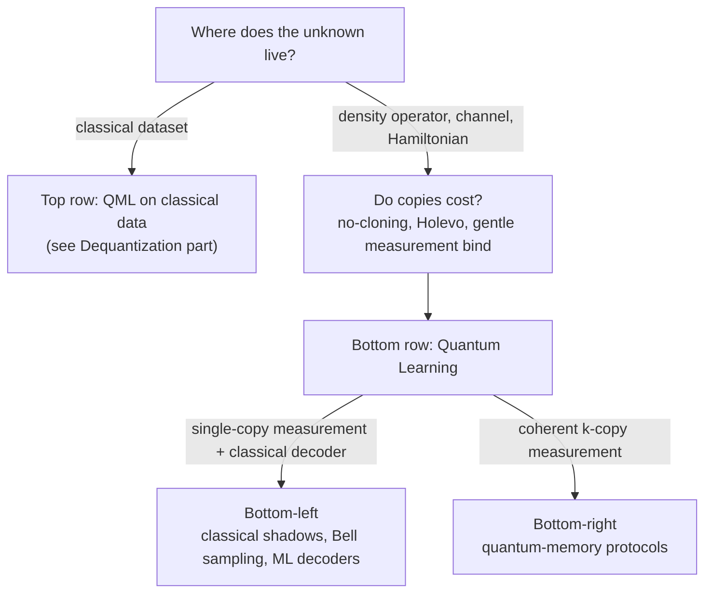

# Quantum Learning

Alexander Del Toro Barba, PhD. [Google Scholar](https://scholar.google.com/citations?hl=en&user=fddyK-wAAAAJ) $\cdot$ [LinkedIn](https://www.linkedin.com/in/deltorobarba/)

## Quantum Learning (Learning from Quantum Experiments)

**Measurement theory vs. learning theory.** Measurement theory answers the single-shot question: What does a measurement do to a state, and which statistics does it produce? Learning theory asks the inverse, statistical question: *What can be learned about an unknown $\rho$ from many measurements, and at what cost?* The Born rule turns the state into a sampling oracle; learning is the inverse problem.

**Definition.** Given access to copies of an unknown quantum object (state $\rho$, channel $\mathcal{E}$, Hamiltonian $H$), produced by nature, a sensor, or a quantum device: *Which* properties can a learner extract, at *what* cost in copies, classical time, and memory, and how do quantum resources (quantum memory, entangled measurements, adaptivity) change these costs?

### The data source decides, not the hardware

The field is the **bottom row** of the data-vs-learner matrix:

| | Classical Learners | Quantum Enhanced Learners |
| --- | --- | --- |
| **Classical data** | classical ML | "QML on classical data": feature maps, variational classifiers, quantum kernels |
| **Quantum data** (copies of $\rho$ / channels) | **Measurement protocol + classical statistics: shadows, Bell sampling + classical decoders** | Quantum-memory protocols: coherent two-/multi-copy measurements |

Three litmus tests separate the rows sharply:

1. **Where does the unknown live?** Density operator/channel vs. classical dataset.
2. **Is "number of copies" a meaningful cost?** Quantum data cannot be cloned, every copy costs. Classical data can be copied at will.
3. **Do the information bounds bind?** No-cloning, Holevo, and gentle measurement are what make learning from quantum data nontrivial. They do not apply to a CSV file.

**➕ The three bounds, stated.** *No-cloning:* no CPTP map sends $\rho \mapsto \rho\otimes\rho$ for all $\rho$ (linearity forbids it). *Holevo:* $n$ qubits carry at most $n$ bits of accessible classical information, $I(X{:}Y) \leq S(\bar\rho) - \sum_x p_x S(\rho_x) \leq n$. *Gentle measurement* (Winter 1999; Aaronson 2004): if a two-outcome measurement accepts $\rho$ with probability $\geq 1-\epsilon$, the post-measurement state is within trace distance $O(\sqrt{\epsilon})$ of $\rho$. The first makes copies a budget, the second caps what one shot can reveal, the third is the loophole that lets many near-deterministic questions share the same copies (shadow tomography, §3.3).

**Why the separation matters (Power of Data).** In the top row, advantage claims are fragile: classical ML with enough training data catches up with quantum models on classical tasks (Huang et al., Nat. Commun. 2021). In the bottom row stand the *proven* exponential separations, including hardware demonstration.

**Gray zones.** (a) *Engineered states:* Whether $\rho$ comes from a molecule or a processor is irrelevant; device characterization and noise learning belong natively to the field. (b) *Simulators:* The access model remains that of a quantum experiment; sample complexity is simulator-invariant. (c) *Hybrids:* A neural network that decodes quantum measurement data sits bottom-left.

## 2. Perspectives on the Field

### 2.1 By resources

| Axis | Spectrum | Key Separation / Benchmark |
| --- | --- | --- |
| **Quantum Memory** | $1 \to 2 \to k$ copies coherent | Pauli spectrum: $\Theta(n)$ copies (2-copy) vs. $2^{\Omega(n)}$ (1-copy) |
| **Adaptivity** | Fixed $\leftrightarrow$ dynamic settings | Exponential sample savings for non-local property testing |
| **Conjugate Access** | $\rho$ only $\leftrightarrow (\rho, \rho^*)$ | Clean spectrum $\mathrm{Tr}(P\rho)^2$ via conjugate pairs; constant memory |
| **Budgets** | Samples / Time / Memory | Sample-efficient with exponential classical decoders is the default |
| **Data Access** | i.i.d. draws $\leftrightarrow$ active queries | LWE-hardness: states can be sample-learnable but computationally hidden |

The last two axes are the current frontier: Almost all separations are *sample* statements. Whether the data can also be *processed efficiently* is far less charted. The sample-vs-query gap is fundamental, not technical: Under standard cryptographic assumptions there is no generic conversion.

| Access type | Status under LWE | Cause |
| --- | --- | --- |
| **Sampling Access** | **Hard (Post-Quantum)** | No control over $\mathbf{a}_i$; algebraic elimination leads to error accumulation that destroys the signal |
| **Query Access (Superposition)** | **Easy (Bernstein-Vazirani / QFT)** | Targeted superpositions enable interference via QFT; noise stays isolated |

**➕ The classical mirror of the sample-vs-query gap.** The same dichotomy is thirty years old in Boolean learning: with *membership queries*, Goldreich–Levin (1989) finds all heavy Fourier coefficients of a function in polynomial time; with *random examples only*, the same task becomes Learning Parity with Noise, for which the best known algorithm (Blum–Kalai–Wasserman 2003) runs in $2^{O(n/\log n)}$ and whose hardness is a standard cryptographic assumption. LWE is the lattice generalization of LPN. Bell sampling hands you random examples of the Pauli spectrum, never queries; that is exactly why the decoder, not the measurement, is the hard half (§3.5).

### 2.2 By task: estimating vs. searching

The role of the observables separates the tasks most sharply:

* **Full Tomography:** "Give me all $d^2$ parameters." Like sequencing the whole genome.
* **Estimating** (observables are *input*): "Give me the values of these $M$ observables." Like a panel of predefined SNPs.
* **Searching** (observables are *output*): "Find which observables are relevant at all, then their values." Like a GWAS. Genuinely harder: The estimation guarantees do not cover it, and this is where LWE hardness sits.

| Task | Observables | Target Output | Sample Complexity ($n$ qubits, $d=2^n$) |
| --- | --- | --- | --- |
| **Full QST** | All | Full density matrix $\rho$ | $\Theta(d^2/\epsilon^2)$ (entangled) / $\Theta(d^3/\epsilon^2)$ (single-copy) |
| **Shadow Tomography** | Input list ($M$ given) | $M$ expectation values $\mathrm{Tr}(O_i\rho)$ | $\mathrm{poly}(\log M, n, 1/\epsilon)$ |
| **Classical Shadows** | Chosen post-measurement | Arbitrary small shadow-norm $\langle O\rangle$ | $O(\log M \cdot 3^k/\epsilon^2)$ for $k$-local Paulis |
| **Bell / Pauli Sampling** | Sampled dynamically | Draws $P \sim \vert{}\langle\bar\psi\vert{}P\vert{}\psi\rangle\vert{}^2/2^n$ | $O(n)$ two-copy shots (stabilizer support) |
| **Structure Learning** | Discovered (output) | Support + values of sparse spectrum | $\mathrm{poly}(n)$ samples; classical decoding often hard |
| **State Discrimination** | 2 candidates $(\rho_0, \rho_1)$ | Identity index | Helstrom (min error) vs. USD (zero error + abort) |
| **Hypothesis Selection** | List given | One index | $O(\log M)$ copies |

**➕ Two entries the table implies but does not name.**
* **Agnostic tomography** (in the timeline for 2023–2026): given copies of an *arbitrary* $\rho$ and a class $\mathcal{C}$ (stabilizer states, product states, low-degree phase states), output $\sigma\in\mathcal{C}$ with $F(\rho,\sigma) \geq \max_{\tau\in\mathcal{C}} F(\rho,\tau) - \epsilon$. It is the learning-theoretic analogue of agnostic PAC learning: no promise that $\rho$ lies in the class. Grewal–Iyer–Kretschmer–Liang (2024) and Chen–Gong–Ye–Zhang ("stabilizer bootstrapping", 2024) give polynomial-time algorithms for stabilizer and near-stabilizer classes, both driven by Bell difference sampling.
* **Hypothesis selection** at $O(\log M)$ copies comes from the *threshold search* primitive of Bădescu–O'Donnell (STOC 2021), the same tool that improved shadow tomography to $\tilde O(\log^2 M \cdot \log d/\epsilon^4)$.

**➕ Where there is provably no advantage.** For PAC learning a *classical* concept class from quantum examples $\sum_x \sqrt{D(x)}\,|x, c(x)\rangle$, Arunachalam–de Wolf (JMLR 2018) showed the sample complexity is $\Theta(d_{\mathrm{VC}}/\epsilon + \log(1/\delta)/\epsilon)$, identical to the classical bound up to constants. Quantum examples buy nothing in samples for classical targets; the advantages in this document all sit in the bottom row or in *time*, never in PAC sample complexity for classical functions.

### 2.3 Three budgets, always separate

Copies (sample complexity), classical time, and classical memory scale independently. Sample-efficient protocols with exponential decoders are the norm; **triple efficiency** is the exception.

### 2.4 Positioning of the own project

* **Field:** Quantum advantages in learning physical systems from measurement data, with minimal quantum memory (never more than two copies).
* **Approach:** *Machine-learned decoders for quantum measurement data.* A trained model replaces hand-built combinatorics (graph coloring, matrix multiplicative weights) and exploits the structure of the state class. Transfers to Hamiltonian learning, noise characterization, error-correction decoders.
* **Contribution:** Computationally efficient **structure learning** of sparse displacement spectra from two-copy Bell measurements. Triply efficient, posed as a promise problem, with provable instances (dictionary and subgroup classes) and a provable limit (LWE hardness of generic localization).
* **Structure:** Every protocol splits into a *quantum frontend* (which measurement on how many copies) and a *classical decoder*. The error factorizes into localization and estimation. Conjugate Bell pairs in front, learned CNN decoder plus sequential sign integrator behind.

## 3. The Protocols: Technique and Literature

Everything here is a *protocol over measurements*, not a new measurement type. They sort along two axes: copies per shot ($1, 2, k$) and observables as input or output.

### 3.1 State discrimination: Helstrom vs. USD

Given $\rho_0, \rho_1$ with priors $p_0, p_1$: Which one is present? Two strategies with different notions of error.

* **Helstrom (minimum error):** Answer in every run, average error minimized. Projective measurement onto the sign spectrum of $p_0\rho_0 - p_1\rho_1$:

$$P_{\text{err}}^{\min} = \tfrac{1}{2}\Big(1 - \big\|p_0\rho_0 - p_1\rho_1\big\|_1\Big)$$

* **USD (unambiguous):** Third outcome "undecided", decided answers never wrong. Requires a genuine POVM; the price is the abstention probability, minimally $|\langle\psi_0|\psi_1\rangle|$.

**➕ Many copies and the distance zoo.** With $n$ copies the Helstrom error decays exponentially, $P_{\mathrm{err}} \sim e^{-n\,\xi_{\mathrm{QCB}}}$ with the **quantum Chernoff exponent** $\xi_{\mathrm{QCB}} = -\log\min_{0\leq s\leq 1}\mathrm{Tr}(\rho_0^s\rho_1^{1-s})$ (Audenaert et al., PRL 2007). The single-shot quantity is the trace distance $D = \frac12\|\rho_0-\rho_1\|_1$; it is sandwiched by the fidelity via Fuchs–van de Graaf, $1 - F \leq D \leq \sqrt{1-F^2}$, which is why tomography guarantees are quoted interchangeably in either metric. ⚠️ For *learning* (many hypotheses, not two) the relevant quantity is not $D$ but the packing number of the hypothesis class in $D$; that is where the $d^2$ of full tomography comes from.

### 3.2 Full QST: the exponential baseline

Reconstructs all $d^2$ parameters from an informationally complete measurement set (DV: all $3^n$ Pauli bases or a single SIC-POVM; CV: homodyne scan and inverse Radon transform to the Wigner function). Cost $\Theta(d^2/\epsilon^2) = \Theta(4^n/\epsilon^2)$ even with entangled measurements. Everything else exists to escape this scaling.

* **Haah et al. / O'Donnell–Wright (STOC 2016):** $\Theta(d^2/\epsilon^2)$ optimal entangled tomography.
* **Chen et al. (2022):** $\Theta(d^3/\epsilon^2)$ single-copy lower bound, proves the gap to entangled measurements.

**➕ Structured escapes before shadows.** Two routes beat $d^2$ by *assuming* structure rather than by changing the question: **compressed-sensing tomography** (Gross, Liu, Flammia, Becker, Eisert, PRL 2010) recovers a rank-$r$ state from $O(r\,d\log^2 d)$ random Pauli expectation values via nuclear-norm minimization, and **MPS tomography** (Cramer et al., Nat. Commun. 2010) reconstructs 1D states of bounded bond dimension from local reduced density matrices in $\mathrm{poly}(n)$. Both are the tomographic analogue of the "low rank ⇒ easy" theme of the Dequantization part: the exponential baseline is a worst-case statement over *all* states.

### 3.3 Shadow tomography and classical shadows (observables as input)

* **Shadow tomography (Aaronson):** $M$ observables to $\pm\epsilon$ with $\mathrm{poly}(\log M, n, 1/\epsilon)$ copies, $M$ may be exponential. The engine is the gentle-measurement lemma: Near-deterministic estimates damage the state only by $O(\sqrt{\epsilon})$, so the same copies answer many questions. Sample-efficient, but compute- and memory-intensive.
* **Classical shadows (Huang–Kueng–Preskill):** "Randomize first, ask later." Per copy, draw a random $U$ (Pauli basis per qubit or Clifford), measure, store the snapshot:

$$\hat\rho = \mathcal{M}^{-1}\big(U^\dagger|b\rangle\langle b|U\big), \qquad \mathbb{E}[\hat\rho] = \rho$$

  Afterwards estimate arbitrary observables via median-of-means: $O(\log M \cdot 3^k/\epsilon^2)$ shots for $k$-local Paulis. Single-copy, NISQ-ready, the workhorse of practice. The gap: *global* observables ($k \sim n$) cost $3^n$ shots. Exactly this gap is closed by two-copy measurements.
* **Triple efficiency:** Sample *and* time efficiency with $O(1)$-copy quantum memory.

Literature:
* **Aaronson (STOC 2018):** Shadow tomography via gentle measurements, $\tilde{O}(\log^4 M)$ copies.
* **Huang, Kueng, Preskill (Nat. Phys. 2020):** Classical shadows.
* **King, Gosset, Kothari, Babbush (2024):** Triply efficient shadow tomography for local fermionic and Pauli observables.

**➕ The variance bound that decides the ensemble.** The shot count of classical shadows is governed by the **shadow norm** $\|O\|_{\mathrm{shadow}}^2$, which depends on the unitary ensemble: for random single-qubit Pauli measurements, $\|P\|_{\mathrm{shadow}}^2 = 3^{k}$ for a $k$-local Pauli $P$ (local observables cheap, global ones exponential); for random $n$-qubit Cliffords, $\|O\|_{\mathrm{shadow}}^2 \leq 3\,\mathrm{Tr}(O^2)$, so *fidelity* with any pure state costs $O(1/\epsilon^2)$ shots independent of $n$, while a global Pauli still costs $\Theta(2^n)$. Neither ensemble handles global Paulis; that is the gap two-copy Bell measurements close. Two follow-ups worth knowing: **derandomization** (Huang, Kueng, Preskill, PRL 2021) picks the measurement bases greedily against a fixed observable list and beats random shadows by constant factors in practice; **Bădescu–O'Donnell** (STOC 2021) brought shadow tomography proper down to $\tilde O(\log^2 M\cdot\log d/\epsilon^4)$ copies.

### 3.4 Two copies: Bell sampling, conjugate pairs, quantum memory

**Mechanism.** The $2n$-qubit Bell basis $\{(P\otimes\mathbb{1})|\Phi^+\rangle^{\otimes n}\}$ is the joint eigenbasis of all commuting $P\otimes\bar P$. A transversal Bell measurement across two copies draws one Pauli string per shot

$$P \sim \frac{|\langle\bar\psi|P|\psi\rangle|^2}{2^n}$$

A single shot carries information about the *entire* Pauli spectrum. **Subtlety:** On $\psi\otimes\psi$ one samples against the *conjugate* state $\bar\psi$. The clean spectrum $\mathrm{Tr}(P\rho)^2/2^n$ requires the pair $(\rho, \bar\rho)$. For real amplitudes both coincide (which is why demos like GHZ states).

**Consequences.** Purity and overlap $\mathrm{Tr}(\rho\sigma)$ via SWAP tests without tomography. Stabilizer states learnable from $O(n)$ Bell samples. Above all: **Pauli shadow tomography with $\Theta(n)$ copies given two-copy memory vs. $2^{\Omega(n)}$ without.** One of the strongest proven exponential quantum advantages, demonstrated in hardware. Two is the sweet spot: Almost all known gain arrives already at $k=2$.

Literature:
* **Bubeck, Chen, Li (FOCS 2020):** Entanglement necessary for optimal property testing.
* **Chen, Cotler, Huang, Li (FOCS 2021):** $\Theta(n)$ vs. $2^{\Omega(n)}$ separation with quantum memory.
* **Huang et al. (Science 2022):** Flagship separations and Sycamore demo with 40 qubits.
* **King, Wan, McClean (2024):** Exponential advantage via $(\rho, \rho^*)$ with constant memory.
* **Chen, Gong, Zhang (2024):** Separations for adaptive multi-copy shadow tomography.

**➕ Two more separations of the same shape.** *Purity testing* (is $\rho$ pure or maximally mixed?) needs $O(1)$ copies with two-copy memory (a SWAP test) but $\Omega(2^{n/2})$ without (Chen, Cotler, Huang, Li, FOCS 2021); the memory-free lower bound also kills any single-copy route to $\mathrm{Tr}(\rho^2)$. *Pauli channel estimation*: learning all $4^n$ Pauli eigenvalues of a channel to $\pm\epsilon$ takes roughly $O(n/\epsilon^2)$ uses with ancilla-assisted entangled inputs versus $2^{\Omega(n)}$ without (Chen, Zhou, Seif, Jiang, PRA 2022), the channel version of the shadow-tomography separation. The general framework in which all of these live is **QUALM** (Aharonov, Cotler, Qi, Nat. Commun. 2022): a learner is a quantum algorithm with coherent or incoherent access to the lab, and the separations are statements about access, not about the model class.

### 3.5 Structure learning (observables as output)

**Task inversion:** First *find* the few observables that carry the support of a sparse Pauli/displacement spectrum, then estimate their values (first the edges, then the weights, as in learning graphical models). Sampling is the easy half: Bell sampling concentrates the draws on the support. **Decoding is the hard half:** Turning i.i.d. samples into the support is sparse recovery *without choosable queries*, generically cryptographically hard (LWE-type). Subgroup/stabilizer symmetries are the tractable exception.

* **Montanaro (2017):** Stabilizer states from $O(n)$ Bell samples via linear algebra.
* **Grewal, Iyer, Kretschmer, Liang (2023):** Bell difference sampling, states with few non-Clifford gates.
* **Hangleiter, Gullans (PRL 2024):** Bell sampling as a universal diagnostic framework.

**➕ Where Bell difference sampling comes from.** The distribution behind stabilizer learning, $p(x) \propto \sum_y \hat p_\psi(y)\,\hat p_\psi(x+y)$ over $\mathbb{F}_2^{2n}$ with $\hat p_\psi(x) = 2^{-n}|\langle\psi|P_x|\psi\rangle|^2$ the **characteristic distribution**, is a corollary of the **Schur–Weyl duality for the Clifford group** (Gross, Nezami, Walter, Commun. Math. Phys. 2021): the commutant of $U^{\otimes 4}$ over Cliffords is spanned by stabilizer codes, which is why four copies (two Bell pairs, differenced) expose the stabilizer group. This is the group-theoretic reason "subgroup/stabilizer symmetries are the tractable exception": the support of $\hat p_\psi$ for a stabilizer state is a Lagrangian subspace, and linear algebra over $\mathbb{F}_2$ recovers a subspace from $O(n)$ random elements.

### 3.6 Computational lens: hardness and pseudorandomness

Pseudorandom states (PRS) show: States can be statistically learnable yet computationally indistinguishable from Haar-random ones.

* **Regev (2005):** Learning With Errors, foundation of average-case hardness.
* **Ji, Liu, Song (CRYPTO 2018):** Pseudorandom quantum states.
* **Kretschmer (TQC 2021):** Quantum pseudorandomness and classical learning hardness.
* **Huang, Broughton et al. (Nat. Commun. 2021):** *Power of data*: classical data closes quantum advantages in learning classical functions.

**➕ The average-case counterpart.** Huang, Kueng, Preskill, "Information-theoretic bounds on quantum advantage in machine learning" (PRL 2021): for predicting $\mathrm{Tr}(O\,\mathcal{E}(\rho_x))$ on inputs drawn from a distribution, a classical learner with measurement data needs only polynomially more samples than a fully quantum one in the *average-case* prediction error, while for *worst-case* prediction the gap can be exponential. Read together with PRS: computational indistinguishability and average-case learnability are different axes, and most "quantum advantage in learning" claims live on the worst-case one.

### 3.7 Learning dynamics: Hamiltonians, channels, circuits

Unknown terms and coupling graphs from Gibbs states or real-time dynamics up to the Heisenberg limit; Pauli noise in channels; shallow circuits in polynomial time.

* **Flammia, Wallman (TQC 2020):** Efficient Pauli channel estimation.
* **Anshu et al. (Nat. Phys. 2021) / Haah et al. (FOCS 2022):** Optimal sample complexity for Gibbs-state Hamiltonian learning.
* **Huang et al. (PRL 2023):** Heisenberg-limited Hamiltonian learning from real-time evolution.
* **Huang et al. (STOC 2024):** Polynomial-time reconstruction of shallow circuits.

**➕ Two practical anchors.** *Heisenberg limit* means total evolution time $T \sim 1/\epsilon$ for precision $\epsilon$ on a coupling, versus the standard quantum limit $T \sim 1/\epsilon^2$ of incoherent repetition; the PRL 2023 protocol reaches it with product-state inputs plus a decoupling pulse sequence, no entangled probes. On the noise side, the field-standard protocols are **randomized benchmarking** (Emerson et al. 2005; Magesan et al. 2011), which extracts an average gate fidelity from the exponential decay of survival probability under random Cliffords, and **gate set tomography** (Blume-Kohout et al. 2013; Nielsen et al. 2021), the self-consistent full characterization; Flammia–Wallman's Pauli channel estimation is the sparse, scalable middle ground and the one that maps onto the noise-learning transfer named in §2.4.

### 3.8 Machine-learned decoders

Classical neural decoders on shadow data (bottom-left quadrant) as empirical heuristics for classically hard decoding tasks.

* **Torlai et al. (Nat. Phys. 2018):** Neural-network QST.
* **Huang, Kueng, Torlai, Albert, Preskill (Science 2022):** Provable generalization bounds for ML on shadow data.
* **Huang, Preskill, Soleimanifar (2024):** State certification via single-qubit shadow relaxations.

**➕ Representation side and the decoding target.** The representational cousin of a learned decoder is the **neural quantum state** (Carleo, Troyer, Science 2017): a network as the ansatz $\psi_\theta(s)$, trained variationally rather than from measurement data. The two meet in Torlai et al. (2018), where the network is fit to measurement statistics. On the transfer to error correction promised in §2.4: Google's **AlphaQubit** (Bausch et al., Nature 2024) is a transformer decoder trained on syndrome data that outperforms tensor-network and matching decoders on Sycamore surface-code experiments, the existence proof that a learned decoder can beat hand-built combinatorics on real hardware data.

### 3.9 Surveys and timeline

* **Anshu, Arunachalam (Nat. Rev. Phys. 2024):** Canonical survey on state-learning complexity.
* **Gebhart et al. (Nat. Rev. Phys. 2023):** Review on learning quantum dynamics in experiments.
* **Arunachalam, de Wolf (SIGACT 2017):** Quantum PAC learning.

| Period | Milestones |
| --- | --- |
| 1998–2007 | Quantum PAC (Bshouty–Jackson) · LWE (Regev) · State PAC learnability (Aaronson) |
| 2016 | Sample-optimal tomography $\Theta(d^2/\epsilon^2)$ |
| 2017–2018 | Shadow tomography · Stabilizer Bell sampling · PRS |
| 2020 | Classical shadows · Entanglement lower bounds |
| 2021–2022 | Memory separations · Sycamore demo · Shallow circuit learning |
| 2023–2024 | Heisenberg Hamiltonian learning · Triply efficient shadows · Conjugate pairs · Agnostic tomography |
| 2025–2026 | Agnostic tomography · Noise-robust 2-copy hardware · Physical average-case decodability |

## 4. Open Frontiers

* **Mapping the decodable classes.** Between "subgroup-easy" (linear algebra) and "LWE-hard" lies uncharted territory. The same state moves from the easy to the hard regime by turning up a noise parameter. Open: Does the hardness reduction transfer from the tensor-product basis to the cyclic single-qudit basis?
* **What learned decoders implicitly find.** If a decoder works on a class with no known efficient algorithm, it may have found one. ML as a tool for algorithm discovery; what is missing is a metric that predicts generalization across state distributions.
* **Hardware realism with two copies.** Approximate matched filters (probe gain $\kappa < 1$, overhead $\kappa^{-2}$) make protocols graceful against preparation, crosstalk, and measurement errors. The practically most relevant axis.
* **Average case instead of worst case.** The hardness results are adversarial. Natural states (ground states of local Hamiltonians, thermal states) could be generically decodable: from the cryptography perspective to the physics perspective.
* **➕ Memory between zero and two.** The separations are stated at $k=0$ versus $k=2$ copies. Chen–Cotler–Huang–Li also treat a learner with $k$ qubits of quantum memory and find that the sample complexity interpolates smoothly; what is missing is the *protocol* side: which structured tasks become tractable at a fixed small memory budget short of a full second copy, e.g. with a few ancilla qubits per shot as in the Pauli-channel case.

## 5. Technique: Displacement Operators and Conjugate Pairs

Core of the paper [arXiv:2403.03469](https://arxiv.org/abs/2403.03469) (King, Wan, McClean): shadow tomography on the set of **displacement operators** of a qudit, target $\mathrm{Tr}(D_{q,p}\rho) \pm \varepsilon$ for all $(q,p)$.

### 5.1 Heisenberg-Weyl operators

$$D_{q,p} = e^{i\pi qp/d}\, X^q Z^p, \qquad X|k\rangle = |k+1\rangle, \quad Z|k\rangle = \omega^k|k\rangle, \quad \omega = e^{2\pi i/d}$$

* Commutation: $D_{q',p'} D_{q,p} = e^{i 2\pi (qp' - q'p)/d} D_{q,p} D_{q',p'}$
* Phase-space symmetries: $D_{q,p}^T = D_{-q,p}$, $\;D_{q,p}^* = D_{q,-p}$, $\;D_{q,p}^\dagger = D_{q,p}^{-1} = D_{-q,-p}$

### 5.2 Why $\rho \otimes \rho^*$ and not $\rho \otimes \rho$

Two problems on a single copy:

1. $D_{q,p}$ is **not Hermitian** for $d>2$: complex eigenvalues, not directly measurable.
2. Different $D_{q,p}$ **do not commute**: not simultaneously measurable.

Solution: The joint operator $O_{q,p} = D_{q,p} \otimes D_{-q,p}$ is Hermitian, and all $O_{q,p}$ commute with each other. Their joint eigenbasis is the generalized Bell basis $\{|\Phi_{a,b}\rangle\}$. On the conjugate pair the expectation value yields exactly the square:

$$E = \mathrm{Tr}(D_{q,p}\rho)\cdot\mathrm{Tr}(D_{-q,p}\rho^*) = \mathrm{Tr}(D_{q,p}\rho)\cdot\mathrm{Tr}(D_{q,p}^T\rho^*) = \mathrm{Tr}(D_{q,p}\rho)^2 = y_{q,p}^2$$

**The decisive step** is not a property of $D$ but of $\rho$: Because $\rho$ is Hermitian, $\rho^* = (\rho^\dagger)^T = \rho^T$. Hence

$$\mathrm{Tr}(D^T\rho^*) = \mathrm{Tr}(D^T\rho^T) = \mathrm{Tr}((\rho D)^T) = \mathrm{Tr}(\rho D) = \mathrm{Tr}(D\rho)$$

With two identical copies $\rho\otimes\rho$ this fails: $\mathrm{Tr}(D_{-q,p}\rho) \neq \mathrm{Tr}(D_{q,p}\rho)$. Complex conjugation is used here as a **physical resource**: Instead of estimating $y_{q,p}$ and squaring classically (statistically expensive), the hardware delivers the squared modulus directly.

### 5.3 Bell basis as Fourier access

The Bell measurement on $\rho\otimes\rho^*$ yields probabilities $p_{a,b} = \mathrm{Tr}[\Pi_{a,b}(\rho\otimes\rho^*)]$. Every Bell state $|\Phi_{a,b}\rangle$ is an eigenstate of $D_{q,p}\otimes D_{-q,p}$ with eigenvalue equal to the **Fourier character** $\chi_{q,p}(a,b) = e^{i\frac{2\pi}{d}(ap - bq)}$. The $(a,b)$ live in the dual space to $(q,p)$, like time to frequency. Fourier inversion returns the spectrum:

$$y_{q,p}^2 \approx \sum_{a,b} p_{a,b}\, e^{i\frac{2\pi}{d}(ap - bq)}$$

One measures in the Bell basis because it gives access to the spectrum of the hidden displacement operator.

**➕ Normalization check.** Since $\{D_{q,p}/\sqrt d\}$ is an orthonormal basis of $M_d(\mathbb{C})$ in the Hilbert–Schmidt inner product, $\sum_{q,p}|\mathrm{Tr}(D_{q,p}\rho)|^2 = d\,\mathrm{Tr}(\rho^2)$ (Parseval). For a pure state this equals $d$, so $|y_{q,p}|^2/d$ is a genuine probability distribution over the $d^2$ phase-space points: Bell sampling on $(\rho,\rho^*)$ *samples* it. For a mixed state the mass $\mathrm{Tr}(\rho^2) < 1$ leaks into the "no information" outcome, which is exactly how the SWAP-test purity estimate of §3.4 arises from the same measurement.

### 5.4 Physical reading: interferometer in phase space

* $D_{q,p}$ **displaces** the state by $(q,p)$ in phase space; $y_{q,p} = \langle\psi|D_{q,p}|\psi\rangle$ is the **overlap** with its displaced self (autocorrelation). High overlap means the state "resonates" at this frequency.
* $y_{q,p} = r e^{i\theta}$ is complex. **Magnitude** $r$: strength of self-similarity. **Sign**: sign of the real part $\mathrm{Re}[y] = \mathrm{Tr}(A\rho)$ with $A = \tfrac12(D + D^\dagger) \sim \cos(q\hat P - p\hat Q)$. Constructive or destructive?
* The map $(q,p) \mapsto y_{q,p}$ is the **characteristic function** $\chi(q,p)$ of the state. Its Fourier transform is the **Wigner function**. A displacement map is thus a correlation map, not a spatial map.
* For energy eigenstates, $\langle n|D(\alpha)|n\rangle = L_n(|\alpha|^2)e^{-|\alpha|^2/2}$ with **Laguerre polynomials**, positive or negative depending on the radius. Excited states respond differently from the ground state.
* **Analogy to IR spectroscopy:** Vibrational spectroscopy measures single transitions ($v=0\to1$) on a 1D axis. Displacement operators measure the *shape* in 2D phase space, including Wigner negativity, many modes simultaneously.

### 5.5 Phase space as the complex plane

The $q$-axis plays the real part, the $p$-axis the imaginary part ($z = q + ip$). Complex conjugation of the operator is a reflection across the $q$-axis: $X$ is a real permutation matrix ($X^* = X$), $Z$ carries the roots of unity ($Z^* = Z^{-1}$), hence

$$D_{q,p}^* \propto X^q (Z^{-1})^p = X^q Z^{-p} \propto D_{q,-p}$$

Physically this is **time reversal**: position stays, momentum flips (the $i$ sits in $\hat p = -i\hbar\,\partial_q$). The state $\rho^*$ is the "time-reversed twin". Because $D_{q,p}\otimes D_{q,p}^*$ commute, the pairing circumvents the Heisenberg uncertainty between $q$ and $p$.

**➕ Discrete Wigner function and the bridge to the degree ladder.** For odd $d$ the discrete Wigner function $W_\rho(a,b) = \frac1d\sum_{q,p} \chi_{q,p}(a,b)^*\,\mathrm{Tr}(D_{q,p}\rho)$ is the symplectic Fourier transform of the characteristic function above; it is real, normalized, and its marginals are the Born probabilities in the $X$ and $Z$ bases. **Discrete Hudson theorem** (Gross, J. Math. Phys. 2006): a pure state has $W_\rho \geq 0$ everywhere iff it is a stabilizer state. **Wigner negativity is therefore magic**: Veitch, Ferrie, Gross, Emerson (NJP 2012) show negativity is a monotone under Clifford operations and stabilizer measurements, and Howard–Campbell (PRL 2017) turn it into a resource measure (robustness of magic) for distillation cost. In the language of the Heisenberg-Weyl part: degree $\leq 2$ generators map the positive Wigner cone to itself; degree $\geq 3$ is exactly what pushes $W$ negative. The displacement spectrum you measure via Bell sampling is the *same* object whose Fourier dual decides classical simulability.

## Excursus: Types of Conjugation

| Type | Map | Idea | Role in the project |
| --- | --- | --- | --- |
| **A: Group conjugation** | $x \mapsto gxg^{-1}$ | Change of basis, inner automorphism. Trace, determinant, spectrum invariant | Clifford group $UPU^\dagger = P'$; rotors $RvR^\dagger$ |
| **B: Complex conjugation / adjoint** | $z\mapsto\bar z$, $A\mapsto A^\dagger$ | Reflection, involution, time reversal, contravariant functor | **The conjugate-pairs paper:** $\rho^*$ as physical resource |
| **C: Canonical conjugation** | $[\hat Q,\hat P] = i\hbar$, $ZX = \omega XZ$ | Duality, Fourier pairing, Pontryagin duality, Stone–von Neumann | Position/momentum, clock/shift of qudits |

All three meet in the quantum Fourier transform $W$:

$$W X W^\dagger = Z^\dagger$$

Type C ($X$ on the left, $Z$ on the right as canonical pair), type A (the conjugation $W(\cdot)W^\dagger$ rotates phase space by $90^\circ$), type B (the dagger reflects the eigenvalues along the complex axis).

**Why "Clifford group"?** Historical accident plus structural analogy (Gottesman, 1990s). In mathematics the Clifford/Lipschitz group is the normalizer of the generating vectors inside the Clifford algebra; the quantum Clifford group is the normalizer of the Pauli group. Same defining figure, same name. For a single qubit it even fits geometrically ($SU(2)\cong\mathrm{Spin}(3)$). For several qubits the correct structure group is $Sp(2n,\mathbb{Z}_d)$, symplectic. No Clifford algebra involved.

