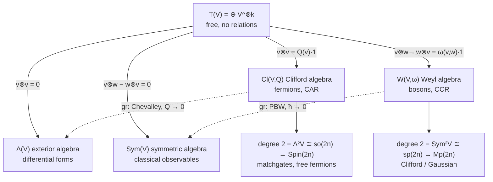

# Science

Alexander Del Toro Barba, PhD. [Google Scholar](https://scholar.google.com/citations?hl=en&user=fddyK-wAAAAJ) $\cdot$ [LinkedIn](https://www.linkedin.com/in/deltorobarba/)

 

**Quantum Algorithms**
* [Heisenberg-Weyl & Tensor Algebra](https://github.com/deltorobarba/science/blob/main/README.md) - research notes
* [Quantum Learning Theory](https://deltorobarba.github.io/science/) - research notes
* [Quantum Dynamics](https://github.com/deltorobarba/science/blob/main/dynamics.ipynb) -  research code and notes
* [Quantum Computing](https://github.com/deltorobarba/science/blob/main/quantum.ipynb) - research code

**Astrophysics**
* [Galaxies and Nebulae](https://github.com/deltorobarba/science/blob/main/galaxies.ipynb) - research code
* [Exoplanets](https://github.com/deltorobarba/science/blob/main/exoplanets.ipynb) -  research code
* [Gravitational Waves](https://github.com/deltorobarba/science/blob/main/gravitationalwaves.ipynb) - research code
* [Stars and Solar](https://github.com/deltorobarba/science/blob/main/stars.ipynb) - research code

---

 

*Study and research notes on quantum theory*

## Heisenberg-Weyl

> Every quantum gate is a time evolution $U = e^{-i\hat Ht}$. The physical and information-theoretic complexity of the gate is determined by the **polynomial degree of the generator $\hat H$ in the phase-space operators $\hat Q, \hat P$**, and the criterion behind the ladder is whether that degree still **closes under the commutator**. Degree 1: displacements (Pauli / Heisenberg-Weyl). Degree 2: Gaussian / Clifford, classically simulable. Degree $\geq 3$: non-Gaussian / non-Clifford, universal, quantum advantage.

---

### Physics: Quantum Harmonic Oscillator as Source of All Operators

**Why the QHO $\hat H \propto \hat P^2 + \hat Q^2 = \hbar\omega\left(\hat a^\dagger\hat a + \tfrac12\right) = \hbar\omega(\hat n + \tfrac12)$ is *the* starting point.** Analytically, every smooth potential near a minimum is quadratic (Taylor expansion), so the QHO is the universal local model of any bound physical system. Algebraically, $\hat Q^2 + \hat P^2$ is *the* canonical degree-2 element of the Weyl algebra ($\mathrm{Sym}^2 V \cong \mathfrak{sp}$), the bosonic counterpart of the Dirac operator. Everything below is this one single generator, read at different polynomial degrees.

* **Time evolution = swap kinetic $\leftrightarrow$ potential.** At $t=0$ the state sits in $Q$; after a quarter period $t = \frac{\pi}{2\omega}$ it has rotated $90°$ into $P$. **That quarter turn is the QFT.** In $\hat U(t) = e^{-i\hat Ht/\hbar}$ the exponent is dimensionless: time is fundamentally an angle. States do not move along classical trajectories; their phase rotates, in an energy eigenstate at the angular frequency $\omega = E/\hbar$.
* **Why complex numbers.** $\hat a \propto \hat Q + i\hat P$: the real axis represents position, the imaginary axis represents momentum, and the rotation $e^{i\omega t}$ represents time evolution. Two real canonical coordinates merge into one complex amplitude $\alpha = x + ip$; unitary phase rotation preserves its magnitude.
* ⚠️ **Position basis = computational basis.** $\vert{}k\rangle$ are eigenstates of $\hat Q$. Hence $Z$ (diagonal phase) is a function of position, while $X$ (permutation / shift) is a function of momentum.
* ⚠️ **Two families of *states*, not gates:**
* Coherent states $\vert{}\alpha\rangle = \hat D(\alpha)\vert{}0\rangle$ (eigenstates of the annihilation operator $\hat a$, overcomplete, generated as a degree-1 output).
* Fock states $\vert{}n\rangle$ (eigenstates of the number operator $\hat n$, orthonormal, forming the eigenbasis of the quadratic degree-2 generator).

**Exponentiation produces the gates.** Every unitary gate takes the form: $\hat U = e^{-i\hat G\theta}$

Here, $e^{-i\theta}$ guarantees unitarity, $\hat G$ is the Hermitian generator of the transformation, and $\theta$ scales it. If $\hat G = \hat H$, then $\theta = t/\hbar$, meaning $\hat H$ *is* time evolution itself. The generator is built directly from $\hat Q, \hat P$ for continuous variables (CV) or from $X, Z \pmod d$ for discrete qudits, grounded on the canonical commutation relations (CCR) $[\hat x,\hat p] = i\hbar$.

* **Gaussian (linear):** Generator of degree $\leq 2$. ⚠️ "Linear" refers strictly to the *Heisenberg action* $U^\dagger \hat r U = S\hat r + d$, not to the generator itself. Symplectic phase-space structure is preserved.
* **Non-Gaussian (non-linear):** Generator of degree $\geq 3$. The Heisenberg action itself becomes nonlinear (e.g., $\hat p \to \hat p - 3\gamma t \hat q^2$), and the Wigner function develops negative regions.

**The conjugate relation.** An operator generates the translation of its canonically conjugate variable. This mechanism enables the reciprocal basis change $X \leftrightarrow Z$ via Fourier transform and underlies the Weyl displacement operator $D_{q,p} = \tau^{qp} X^q Z^p$.

* Continuous: $[\hat x, \hat p] = i\hbar$.
* Discrete: Weyl relation $ZX = \zeta_d XZ$.

*Notation:* $\zeta_d = e^{2\pi i/d}$ is the primitive $d$-th root of unity; $\tau = e^{i\pi/d}$ is the half-phase satisfying $\tau^2 = \zeta_d$. ⚠️ Many texts write $\omega$ for $\zeta_d$, but here $\omega$ is reserved exclusively for the oscillator frequency and the symplectic form.

**From energy term to gate.** The physical energy terms are quadratic, but the **elementary gates** exponentiate the *linear* field operators $\hat P$ and $\hat Q$.

| Feature | Kinetic energy $\hat P^2$ | Potential energy $\hat Q^2$ |
| --- | --- | --- |
| **CV observable** | $\hat P = \frac{i}{\sqrt2}(\hat a^\dagger - \hat a)$, derivative $\approx i(X^\dagger - X)$ | $\hat Q = \frac{1}{\sqrt2}(\hat a + \hat a^\dagger)$, real eigenvalues (location $k$) |
| **Lattice term** | Hopping / Laplacian $\approx X + X^\dagger$ (Google OTOC) | On-site potential (diagonal) |
| **Qudit gate** | **Shift** $X^a\vert{}j\rangle = \vert{}j+a \bmod d\rangle$, real off-diagonal permutation of 0s and 1s, eigenvalues powers of $\zeta_d$ | **Clock** $Z^b\vert{}k\rangle = \zeta_d^{bk}\vert{}k\rangle$, diagonal phase gradient on the unit circle; for $d>2$ unitary but not Hermitian |
| **Qubit gate** | **Pauli $X$**, bit flip, $\zeta_2 = -1$ | **Pauli $Z$**, phase flip, $(-1)^j$; unitary *and* Hermitian, so directly observable |
| **Matrix form** | Real, off-diagonal permutation matrix | Diagonal matrix of complex phases |
| **Gate as exponential** | $X \approx e^{-i\hat P\delta}$ | $Z \approx e^{i\hat Q\delta}$ |
| **Conjugation twist** | $X$ *represents* momentum but *generates* a position shift: $D_{q,0} \sim X^q$ | $Z$ *represents* position but *generates* a momentum kick: $D_{0,p} \sim Z^p$ |

> $X = \mathrm{DFT}^\dagger\, Z\, \mathrm{DFT}$ - In the momentum basis, the spatial shift operator becomes diagonal and acts identically to the clock operator.

---

### From Heisenberg-Weyl Algebra to Quantum Gates ( Degree Ladder)

| Property | Degree 1: Displacements | Degree 2: Gaussian / Clifford | Degree $\geq 3$: Non-Gaussian / Non-Clifford |
| --- | --- | --- | --- |
| **Generator** | $\hat H = q\hat P - p\hat Q$ | $\hat Q^2 + \hat P^2$, $\hat Q^2 - \hat P^2$, $\hat Q_1\hat P_2$ | $\hat Q^3$, $\hat n^2 \sim (\hat Q^2 + \hat P^2)^2$, many-body interactions |
| **Lie algebra** | ✅ Heisenberg $\mathfrak{h}_n$, $\dim 2n+1$, $[\hat Q,\hat P]$ is central | ✅ Symplectic $\mathfrak{sp}(2n,\mathbb{R})$; combined with degree 1: semidirect product $\mathfrak{sp}(2n) \ltimes \mathfrak{h}_n$ | ❌ Does not close: cubic $\to$ quartic $\to$ quintic $\to \dots$, generating an infinite-dimensional algebra |
| **Action on phase space** | Rigid *slide* to $(q,p)$: no rotation, no volume/shape deformation | *Linear* symplectic map $U^\dagger \hat r U = S\hat r$ with $S \in \mathrm{Sp}(2n)$: rotations, shears, squeezing, entanglement | Phase space is *curved* nonlinearly; falls completely out of $\mathrm{Sp}(2n)$ |
| **Continuous variables (CV)** | Displacement operator $\hat D(\alpha) = e^{\alpha\hat a^\dagger - \alpha^*\hat a}$ | Metaplectic group $\mathrm{Mp}(2n)$: phase rotator, squeezer, beam splitter, shear | Cubic phase gate $e^{i\gamma\hat Q^3}$, Kerr non-linearity $e^{i\chi\hat n^2}$ |
| **Discrete systems** | Heisenberg-Weyl group: $D_{q,p} = \tau^{qp}X^qZ^p$; for $d=2$: Pauli group $\mathcal{P}$ | Clifford group $\mathcal{C} = \{U : U\mathcal{P}U^\dagger = \mathcal{P}\}$, quotient $\mathcal{C}/\mathcal{P} \cong \mathrm{Sp}(2n,\mathbb{Z}_d)$: QFT, Hadamard, $S$, C-SUM/CNOT | $T$, qudit $T_d$, Toffoli, CS. Contained in $M_d(\mathbb{C})$, but lies outside both HW and Clifford groups |
| **Hierarchy classification** | Level $\mathcal{C}_1$: forms an orthogonal operator basis of state space | Level $\mathcal{C}_2$: **Gottesman–Knill theorem** applies; efficient tracking of $2n\times 2n$ symplectic $S$ instead of $2^n$ amplitudes | Levels $\mathcal{C}_k$ for $k\geq 3$ are no longer groups; Clifford $+T$ is dense in $U(2^n)$: **universal, magic begins here** |
| **Fermionic mirror** | **None.** Degree 1 closes only under the *anti*commutator; fermionic parity superselection forbids odd Hamiltonians | **Free fermions / matchgates** (Valiant): $\mathfrak{so}(2n) \to \mathrm{Spin}(2n)$, same theorem as Gottesman–Knill with $SO$/Spin in place of $Sp$/Mp | **Degree 3 missing** due to parity constraints; classical non-simulability begins strictly at **degree 4** (e.g. Hubbard interaction $n_\uparrow n_\downarrow$) |

#### Degree 1

* The phase factor $\tau^{qp}$ in $D_{q,p} = \tau^{qp}X^qZ^p$ is required because $X$ and $Z$ do not commute; it represents an Aharonov–Bohm geometric phase effect directly on discrete phase space.
* ⚠️ **Pauli $Y$ is not independent:** $\sigma_y = i\sigma_x\sigma_z$ is merely the $(1,1)$ grid point on the discrete phase space. For $d=3$, none of $XZ, XZ^2, X^2Z, \dots$ is uniquely "$Y$"; they simply represent the generic displacement operators $D_{q,p}$ with $q,p \neq 0$.

#### Degree 2

Gaussian continuous gates and discrete Clifford gates represent the exact same algebraic generators viewed through continuous versus discrete lenses:

| CV (Gaussian) | Generator | Action | Discrete (Clifford) |
| --- | --- | --- | --- |
| **Rotator** $R(\theta) = e^{-i\theta\hat n}$ | $\hat Q^2 + \hat P^2$ | Phase rotation; at $\theta = \pi/2$ this **is** the Fourier transform | **QFT** $\vert{}j\rangle \to \frac{1}{\sqrt d}\sum_k \zeta_d^{jk}\vert{}k\rangle$, fulfilling $WXW^\dagger = Z$; **Hadamard** for $d=2$ |
| **Squeezer** $\hat S(r)$ | $\hat Q^2 - \hat P^2$ | Anisotropic scaling: $Q \to e^{-r}Q$, $P \to e^{r}P$ | — |
| **Shear** | $\hat Q^2$ | Momentum translation dependent on position: $P \to P + Q$ | **Phase gate $S$** $= \mathrm{diag}(1,i,\dots)$: maps $X \to Y \sim XZ$, imparts quadratic phase $k^2$ |
| **Beam splitter** $\hat B(\theta)$ | $\hat Q_1\hat P_2 - \hat Q_2\hat P_1$ | Passive energy-preserving mode rotation; $\theta = \pi/4$ yields 50:50 ratio | — |
| **Squeezer + beam splitter** | — | Ellipse rotated by $45°$: noise correlated across canonical axes = **entanglement** | **C-SUM / CNOT** $= e^{-i\hat Q_1\hat P_2}$: maps $\vert{}c\rangle\vert{}t\rangle \to \vert{}c\rangle\vert{}t\oplus c\rangle$ |

* **Gottesman–Knill, quantitatively:** A stabilizer state on $n$ qubits is uniquely specified by $n$ independent, commuting Pauli operators. This state is represented by an $n\times 2n$ binary tableau plus phases. The CHP simulator (Aaronson, Gottesman, PRA 2004) updates this structure in $O(n)$ time per Clifford gate and $O(n^2)$ time per measurement. The underlying tracked group is strictly finite:
$$\vert{}\mathcal{C}_n/\mathcal{P}_n\vert{} = \vert{}\mathrm{Sp}(2n,\mathbb{Z}_2)\vert{} = 2^{n^2}\prod_{j=1}^n(4^j-1) \approx 2^{2n^2+n}$$

Contrasting this with an $\epsilon$-net covering the full unitary space $U(2^n)$ of size $\exp(\Theta(4^n\log(1/\epsilon)))$, that polynomial-to-double-exponential ratio *is* the formal simulability statement: only polynomially many classical bits are needed to characterize the entire reachable Clifford sub-manifold.

#### Degree $\geq 3$

* **Cubic phase** transforms a circular Gaussian coherent state into a non-Gaussian "banana" distribution exhibiting negative Wigner quasi-probability regions—the canonical signature of quantum non-classicality.
* **Kerr non-linearity** (quartic, degree 4) creates superposition cat states, serving as the physical foundation for continuous-variable bosonic quantum error-correcting codes.
* **$T$ gate** ($e^{-i\frac{\pi}{8}\hat Z}$) is the discrete cubic phase mod 2. Its qudit analogue $T_d\vert{}k\rangle = \zeta_d^{k^3}\vert{}k\rangle$ matches the continuous cubic potential $V(\gamma) = e^{i\gamma\hat x^3}$.
* ⚠️ The Heisenberg-Weyl operator basis remains formally valid (a $T$ gate *can* be expressed as a linear combination of Pauli operators), but the number of operator terms blows up exponentially under nested commutators/conjugations. This branching expansion is the exact mathematical locus where efficient classical simulation breaks down.
* **The Clifford hierarchy, defined:**
$$\mathcal{C}_1 = \mathcal{P}, \quad \mathcal{C}_k = \{U : U P U^\dagger \in \mathcal{C}_{k-1}\ \forall P\in\mathcal{P}\} \quad \text{(Gottesman, Chuang, Nature 1999)}$$

The $T$ gate belongs to level $\mathcal{C}_3$. Operationally, any gate residing in $\mathcal{C}_k$ can be implemented via gate teleportation utilizing a dedicated resource state accompanied solely by feed-forward Clifford corrections drawn from level $k-1$. This inductive property is why the $T$ gate is the canonical "one step beyond" stabilizer circuits. For $k\geq 3$, the sets $\mathcal{C}_k$ are no longer groups (closure under operator products fails), mirroring the non-closing Lie brackets of degree $\geq 3$ generators.
* **Classical simulation overhead of magic:** The **stabilizer rank** $\chi$ of $\vert{}T\rangle^{\otimes t}$ is defined as the minimal number of pure stabilizer states required to express that tensor product state. Bravyi & Gosset (PRL 2016) established $\chi \lesssim 2^{0.47t}$, refined to $\approx 2^{0.396t}$ by Bravyi, Browne, Calpin, Campbell, Gosset, and Howard (Quantum 2019). The simulation runtime scale is strictly polynomial in the qubit count $n$ and linear/polynomial in $\chi$, meaning the simulation cost is exponential *only in the count of non-Clifford magic gates*, not in the physical qubit number.
* **Continuous-variable mirror:** Gaussian circuits are classically simulable in polynomial time (Bartlett, Sanders, Braunstein, Nemoto, PRL 2002). Classical simulation via quasiprobability sampling (Pashayan, Wallman, Bartlett, PRL 2015) scales exponentially with the total integrated Wigner negativity, which acts as the continuous non-Gaussian resource budget.
* **Magic state distillation** (Bravyi, Kitaev, PRA 2005) is the fault-tolerant inverse: consuming multiple noisy copies of magic states $\vert{}T\rangle$ via strictly transversal Clifford operations purifies them into high-fidelity target states. Consequently, the **$T$-count** serves as the universal computational cost currency for fault-tolerant quantum compilers.

**Structural Trajectory of the Framework:** The polynomial degree of a generator in the phase-space operators $\hat Q, \hat P$ (or $X, Z \pmod d$) serves as the unifying organizational principle across the theory:

* **Degree $\leq 2$** closes under the commutator algebra, preserving symplectic phase space geometry and remaining efficiently simulable classically.
* **Degree $\geq 3$** breaks algebraic closure, producing operator growth that unlocks universality, quantum magic, and genuine computational advantage.
* **Chapter 1** derives this entire ladder from the quantum harmonic oscillator and the Weyl tensor algebra.
* **Chapter 2** encounters this ladder again as the foundational exception enabling cheap Hamiltonian simulation (shadow simulation, fast-forwarding of linear/quadratic models) and identifies degree $\geq 3$ as the root driver of chaotic scrambling dynamics (out-of-time-ordered correlators, OTOCs).
* **Chapter 3** leverages this hierarchy as the tunable magic dial for learnable quantum state classes, using the degree-1 Heisenberg-Weyl displacements $D_{q,p}$ as the operator basis through which two-copy Bell measurements reconstruct unknown quantum spectra.

 

## Tensor Algebra $T(V)$ 

**Tensor Algebra is Basis for Exterior, Symmetric, Clifford and Weyl algebra**

*The recipe: quotient the tensor algebra by a two-sided ideal generated in degree 2. The knob: the **parity of the bilinear form** in that ideal (symmetric $Q$ or antisymmetric $\omega$), plus whether you switch its value on at all.*

```mermaid
flowchart TD
    T["T(V) = ⊕ V^⊗k<br/>free, no relations"]
    T -->|"v⊗v = 0"| L["Λ(V) exterior algebra<br/>differential forms"]
    T -->|"v⊗w − w⊗v = 0"| S["Sym(V) symmetric algebra<br/>classical observables"]
    T -->|"v⊗v = Q(v)·1"| Cl["Cl(V,Q) Clifford algebra<br/>fermions, CAR"]
    T -->|"v⊗w − w⊗v = ω(v,w)·1"| W["W(V,ω) Weyl algebra<br/>bosons, CCR"]
    Cl -.->|"gr: Chevalley, Q → 0"| L
    W -.->|"gr: PBW, ħ → 0"| S
    Cl --> F["degree 2 = Λ²V ≅ so(2n) → Spin(2n)<br/>matchgates, free fermions"]
    W --> B["degree 2 = Sym²V ≅ sp(2n) → Mp(2n)<br/>Clifford / Gaussian"]

```

*Solid arrows: quotient by the ideal on the label (upper two homogeneous, lower two inhomogeneous, i.e. quantized). Dashed arrows: the associated-graded functor, dequantization. Note the parity crossing: the symmetric form lands in the exterior square, the antisymmetric form in the symmetric square.*

|  | **Symmetric form $Q$** | **Antisymmetric form $\omega$** |
| --- | --- | --- |
| **Form off** (classical) | $\Lambda(V)$, exterior | $\mathrm{Sym}(V)$, symmetric |
| **Form on** (quantized) | $\mathrm{Cl}(V,Q)$, **fermions**, CAR | $W(V,\omega)$, **bosons**, CCR |

**Step 0, the source.** $T(V) = \bigoplus_k V^{\otimes k}$: 
* associative, non-commutative, no relations. Every relation below is introduced by hand as the generator of an ideal; 
* all four algebras are $T(V)/I$ and differ only in the ideal $I$.

**Step 1, homogeneous ideal (degree 2 $= 0$).**
* $\Lambda(V) = T(V)/\langle v\otimes v\rangle \implies v\wedge w = -w\wedge v$: differential forms, cohomology.
* $\mathrm{Sym}(V) = T(V)/\langle v\otimes w - w\otimes v\rangle \implies vw = wv$: polynomials, classical observables on phase space.
* The $\mathbb{Z}$-grading survives; these correspond to $\mathrm{Cl}$ with $Q=0$ and $W$ with $\omega = 0$.

**Step 2, switch the form on (the right-hand side becomes a number: this is quantization).**
* $\mathrm{Cl}(V,Q) = T(V)/\langle v\otimes v - Q(v)\mathbf{1}\rangle \implies vw + wv = 2Q(v,w)$: a vector squares to its length.
* $W(V,\omega) = T(V)/\langle v\otimes w - w\otimes v - \omega(v,w)\mathbf{1}\rangle \implies [v,w] = \omega(v,w)$: the commutator is a number, $[\hat q,\hat p] = i\hbar\mathbf{1}$.
* ⚠️ The ideal is now **inhomogeneous** (degree 2 mixed with degree 0), so the $\mathbb{Z}$-grading collapses to a **filtration**: *grading $\to$ filtration is what quantization means algebraically.*
* ⚠️ The deformation changes the product, not the space: $\Lambda(\mathbb{R}^2)$ and $\mathrm{Cl}(\mathbb{R}^2,Q)$ share the vector space basis $\{1, e_1, e_2, e_1e_2\}$ with different multiplication tables; PBW monomials $\hat q^a\hat p^b$ form a common basis of both $\mathrm{Sym}$ and $W$.
* **⚠️ The twist: parity flips between input and output.**
* A symmetric input $g$ builds $\mathrm{Cl}(V,g)$, whose degree-2 part is the **exterior** square $\mathfrak{so} \cong \Lambda^2 V$ (via $\frac14[e_i,e_j]$) $\to$ Spin $\to$ **fermions**.
* An antisymmetric input $\omega$ builds $W(V,\omega)$, whose degree-2 part is the **symmetric** square $\mathfrak{sp} \cong \mathrm{Sym}^2 V$ (via $\frac12\{\hat r_i,\hat r_j\}$) $\to$ metaplectic $\to$ **bosons**.
* The labels cross. In supersymmetry both unify into one single construction on $\mathbb{Z}_2$-graded spaces.

**Step 3, the way back ($\mathrm{gr}$).** 
* Dequantization keeps only the top-degree part of each relation: $\mathrm{gr}\,\mathrm{Cl}(V,Q) \cong \Lambda(V)$ (**Chevalley**, $Q \to 0$) and $\mathrm{gr}\,W(V,\omega) \cong \mathrm{Sym}(V)$ (**PBW**, $\hbar \to 0$). ⚠️ These are **one theorem**: super-PBW on $\mathbb{Z}_2$-graded spaces *is* Chevalley.
* **Second road, the Lie route.** $U(\mathfrak{g}) = T(\mathfrak{g})/\langle x\otimes y - y\otimes x - [x,y]\rangle$ has the identical shape of ideal (hence "PBW deformation").
* Bosonic: $A_n = U(\mathfrak{h}_n)/(Z-1)$, where the universal enveloping algebra $U(\mathfrak{h}_n)$ supplies the products that the Lie algebra $\mathfrak{h}_n$ alone lacks.
* Fermionic: $\mathrm{Cl}(V,Q) = U(\mathfrak{h}^{\mathrm{super}})/(Z-1)$ with anticommutator bracket.

#### What each side becomes

| Property | Fermions: $\mathrm{Cl}(V,Q)$ | Bosons: $W(V,\omega)$ |
| --- | --- | --- |
| **Statistics** | CAR $\{a_i,a_j^\dagger\} = \delta_{ij}$, $\{\gamma_\mu,\gamma_\nu\} = 2g_{\mu\nu}$ | CCR $[a_i,a_j^\dagger] = \delta_{ij}$, $[\hat x,\hat p] = i\hbar$ |
| **Size** | $\dim = 2^n$, the relation truncates powers | $\dim = \infty$, nothing truncates. **No finite-dimensional rep**: $\mathrm{tr}[A,B] = 0$ but $\mathrm{tr}(i\hbar\mathbf{1}) \neq 0$ |
| **Uniqueness** | Unique spinor module | **Stone–von Neumann** |
| **Canonical degree-2 square** | Dirac $\nabla = d + \delta$, $\nabla^2 = \Delta$ | Oscillator $H = \frac12(\hat p^2 + \hat q^2)$; Moyal star product |
| **Symmetry tower** | $\mathrm{O}(V,g) \supset \mathfrak{so}(n)$, $\dim \frac{n(n-1)}{2}$, Cartan types $B_n/D_n$, cover $\mathrm{Spin}(n)$ | $\mathrm{Sp}(2n) \supset \mathfrak{sp}(2n)$, $\dim n(2n+1)$, Cartan type $C_n$, cover $\mathrm{Mp}(2n)$ |
| **QC bridge** | Matchgates / free fermions = rotor in $\mathrm{Spin}(2n)$; non-free from **degree 4** | Clifford / Gaussian = symplectic action; magic from **degree 3** |

⚠️ The QC bridge is **structurally one theorem**, once for $SO$/Spin, once for $Sp$/Mp. The size asymmetry is the sharpest physical difference: bosons require unbounded operators on infinite-dimensional Hilbert spaces, while fermions act naturally on a finite spinor space.

---

### From Weyl Algebra to Heisenberg-Weyl: How Bosons Reach Actual Qubits / Qudits

| Level | Continuous | Discrete |
| --- | --- | --- |
| **Additive** (Lie bracket) | Weyl algebra $A_n = W(V,\omega)$: all polynomials in $\hat q,\hat p$, home of Hamiltonians and the degree filter | ⚠️ **Does not exist.** Trace argument: $\mathrm{Tr}([\hat q,\hat p]) = 0$ but $\mathrm{Tr}(i\hbar\mathbf{1}) = i\hbar d \neq 0$ |
| **Multiplicative** (operator product) | Heisenberg group $H_n$ / CCR $C^*$-algebra: $W(z)W(z') = e^{-\frac{i}{2}\omega(z,z')}W(z+z')$, linked to $A_n$ by Stone–von Neumann | HW algebra $M_d(\mathbb{C}) \cong \mathbb{C}_\omega[\mathbb{Z}_d \times \mathbb{Z}_d]$, spanned by the $d^2$ matrices $X^qZ^p$ |

**Why exponentiating rescues what the additive box forbids: trace vs. determinant.** At the group level the test uses $\det$: $\det(ZXZ^{-1}X^{-1}) = 1$ must equal $\det(\zeta_d\mathbf{1}) = \zeta_d^d = 1$ ✓. The additive constraint is *unsatisfiable* in finite dimensions, but the multiplicative one is *automatically satisfied*. That is why the discrete Weyl relation $ZX = \zeta_d XZ$ exists in exact $d\times d$ complex matrices, providing the complete pathway from the continuous Weyl algebra to the discrete Heisenberg-Weyl algebra.

**Moving between the boxes.**

* **Up:** $\mathfrak{h}_n \xrightarrow{\exp} H_n$ (BCH series terminates cleanly because $[\hat Q,\hat P]$ is central; the additive Lie bracket maps into a multiplicative phase factor).
* **Down:** Differentiate at the identity along one-parameter subgroups.
* **Sideways:** $G \xrightarrow{\mathrm{span}} M_d(\mathbb{C})$ via the group algebra (linear span of group elements, ⚠️ *not* by $\exp$; algebras themselves are not exponentiated).
* **Limit:** The asymptotic regime $d \to \infty$ turns $ZX = \zeta_d XZ$ continuously back into $[\hat Q,\hat P] = i\hbar\mathbf{1}$.

**Stone–von Neumann, stated.** Every irreducible, strongly continuous unitary representation of the Weyl relations

$$W(z)W(z') = e^{-\frac i2\omega(z,z')}W(z+z')$$

for *finitely many* degrees of freedom is unitarily equivalent to the Schrödinger representation on $L^2(\mathbb{R}^n)$.

*Consequences:*

1. Position and momentum representations describe identical physics in different coordinates, with the Fourier transform serving as the intertwining operator.
2. The discrete analogue is unique in precisely the same way: $M_d(\mathbb{C})$ has, up to unitary equivalence, exactly one irreducible representation of $ZX = \zeta_d XZ$, explaining why "the" qudit clock and shift operators are canonical.
3. ⚠️ The theorem **fails** for infinitely many degrees of freedom (quantum field theory, thermodynamic limit): inequivalent representations exist, which is Haag's theorem and the structural origin of superselection sectors. Finite-$n$ uniqueness is what makes phase-space methods and the operator degree ladder unambiguous.

---

### Appendix: Symplectic Form

A **form** evaluates to a scalar:

* $0$-form = scalar function
* $1$-form = covector field
* $2$-form = bilinear form

Differential forms $\Omega^k(M) = \Gamma(\Lambda^k T^*M)$ integrate intrinsically over oriented submanifolds without coordinate choices ($1$-forms over curves yield work; $2$-forms over surfaces yield flux).

The **symplectic form $\omega$** is a differential $2$-form defined by three properties:

* **Alternating:** Pointwise antisymmetric, $\omega(u,v) = -\omega(v,u)$.
* **Closed:** $d\omega = 0$, guaranteeing the absence of local curvature invariants (Darboux's theorem).
* **Non-degenerate:** Forces an **even dimension** $2n$ (coordinates naturally pair into positions $q_i$ and momenta $p_i$) and produces the nowhere-vanishing **Liouville volume form** $\omega^n$.

**Two consequences used elsewhere in this document.**

* **Darboux's Theorem:** Locally, every symplectic manifold is symplectomorphic to standard phase space $(\mathbb{R}^{2n}, \sum_{i=1}^n dq_i \wedge dp_i)$. Because there are no local invariants, the only geometric structure a Gaussian/Clifford operation can preserve is $\omega$ itself. This is why $\mathrm{Sp}(2n)$ (continuous) and $\mathrm{Sp}(2n,\mathbb{Z}_d)$ (discrete, with symplectic product $\omega(z,z') = qp' - q'p \pmod d$) act as the universal structure groups of degree 2.
* **Liouville's Theorem:** The phase-space volume $\omega^n$ is invariant under Hamiltonian flows, and its quantum shadow is unitarity. The Wigner function utilized in quantum learning is precisely a quasi-probability density evaluated against this Liouville volume form, and Hudson's theorem dictates that dynamics generated by Hamiltonians of degree $\leq 2$ preserve the non-negativity of Gaussian Wigner distributions.