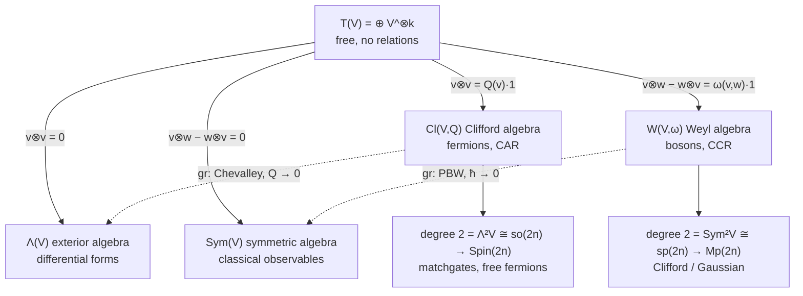

# Science 🎨

Alexander Del Toro Barba, PhD. [Google Scholar](https://scholar.google.com/citations?hl=en&user=fddyK-wAAAAJ) $\cdot$ [LinkedIn](https://www.linkedin.com/in/deltorobarba/)

 

## Quantum Computing 🪼
* https://deltorobarba.github.io/science/ 
* [Quantum Dynamics](https://github.com/deltorobarba/science/blob/main/dynamics.ipynb) - research code
* [Quantum Computing](https://github.com/deltorobarba/science/blob/main/circuit.ipynb) - research code

## Astrophysics 🔭
* [Galaxies and Nebulae](https://github.com/deltorobarba/science/blob/main/galaxies.ipynb) 🧬 research code
* [Exoplanets](https://github.com/deltorobarba/science/blob/main/exoplanets.ipynb) 🪐 research code
* [Gravitational Waves](https://github.com/deltorobarba/science/blob/main/gravitationalwaves.ipynb) 🛰️ research code
* [Stars and Solar](https://github.com/deltorobarba/science/blob/main/stars.ipynb) ✨ research code

 

*Study notes on **Heisenberg-Weyl** algebra (quantum operators from quantum harmonic oscillator, exponentiation of position and momentum), **Tensor algebra** (as basis for Exterior, Symmetric, Clifford and Weyl algebra), **Quantum Simulation** (classical and quantum), and **Quantum dynamics** (quantum chaos, scrambling OTOC):*

## Heisenberg-Weyl

### 1. Physics: Quantum Harmonic Oscillator as Source of All Operators

* **Quantum Harmonic Oscillator**
  * **Analytically:** Every smooth potential near a local minimum approximates a parabola (Taylor expansion $V(x) \approx \frac{1}{2}k x^2$). Consequently, the QHO $\hat H \propto \hat P^2 + \hat Q^2 = \hbar\omega\left(\hat a^\dagger\hat a + \tfrac12\right) = \hbar\omega(\hat n + \tfrac12)$ serves as the universal local model of any bound physical system.
  * **Algebraically:** $\hat Q^2 + \hat P^2$ is the canonical degree-2 element of the Weyl algebra ($\mathrm{Sym}^2 V \cong \mathfrak{sp}$) — the bosonic counterpart of the Dirac operator. All quantum gates and dynamical evolutions derive from this single generator evaluated at different polynomial degrees.
  * **Every quantum gate is a time evolution** $U = e^{-i\hat Ht}$. **Time evolution as phase rotation:** In $\hat U(t) = e^{-i\hat Ht/\hbar}$, the exponent is dimensionless: time is fundamentally an angle. Quantum states do not travel along classical trajectories; their phase rotates (in an energy eigenstate at angular frequency $\omega = E/\hbar$).
  * **Kinetic $\leftrightarrow$ potential swap:** At $t=0$, the state resides in $Q$; after a quarter period $t = \frac{\pi}{2\omega}$, it has rotated $90^\circ$ into $P$. **This quarter turn is Quantum Fourier Transform.**
  * **Two Fundamental State Families (States, Not Gates)** *Coherent states $\vert{}\alpha\rangle = \hat D(\alpha)\vert{}0\rangle$:* Eigenstates of the annihilation operator $\hat a$; overcomplete, generated as degree-1 displacement outputs. *Fock states $\vert{}n\rangle$:* Orthonormal eigenstates of the number operator $\hat n = \hat a^\dagger\hat a$; form the eigenbasis of the quadratic degree-2 generator.
  * **Phase Space & Why Complex Numbers**: Complex amplitude $\hat a \propto \hat Q + i\hat P$: The real axis represents position, the imaginary axis represents momentum, and unitary rotation $e^{i\omega t}$ describes time evolution. Two real canonical coordinates merge into a single complex amplitude $\alpha = x + ip$, whose magnitude is preserved under unitary phase rotations.
  * **Position basis = Computational basis:** The basis states $\vert{}k\rangle$ are eigenstates of $\hat Q$. Consequently, $Z$ (diagonal phase) is a function of position, whereas $X$ (permutation / shift) is a function of momentum.
* **Exponentiation**
  * Exponentiation generates Gates: $\hat U = e^{-i\hat G\theta}$. The factor $e^{-i\theta}$ guarantees unitarity, $\hat G$ is the Hermitian generator of the transformation, and $\theta$ scales it. When $\hat G = \hat H$, then $\theta = t/\hbar$, meaning $\hat H$ *is* time evolution itself.
  * The generator is constructed directly from $\hat Q, \hat P$ for continuous variables (CV) or from $X, Z \pmod d$ for discrete qudits, grounded in the canonical commutation relations (CCR) $[\hat x, \hat p] = i\hbar$.
  * **Gaussian (linear):** Generators of degree $\leq 2$. "Linear" refers strictly to the Heisenberg action $U^\dagger \hat r U = S\hat r + d$, not to the generator itself. Symplectic phase-space structure is preserved.
  * **Non-Gaussian (nonlinear):** Generators of degree $\geq 3$. The Heisenberg action becomes nonlinear (e.g., $\hat p \to \hat p - 3\gamma t \hat q^2$), and the Wigner quasi-probability distribution develops negative regions.
  * **From energy term to gate.** The physical energy terms are quadratic, but the **elementary gates** exponentiate the *linear* field operators $\hat P$ and $\hat Q$.
* **Conjugation**
  * An operator generates translations of its canonically conjugate variable. This mechanism enables reciprocal basis changes $X \leftrightarrow Z$ via the Fourier transform ($X = \mathrm{DFT}^\dagger \, Z \, \mathrm{DFT}$) and underlies the Weyl displacement operator: $D_{q,p} = \tau^{qp} X^q Z^p$
  * **Commutation relations:** Continuous: $[\hat x, \hat p] = i\hbar$. Discrete: Weyl relation $ZX = \zeta_d XZ$.
  * **Notation:** $\zeta_d = e^{2\pi i/d}$ is the primitive $d$-th root of unity; $\tau = e^{i\pi/d}$ is the half-phase satisfying $\tau^2 = \zeta_d$. While many texts write $\omega$ for $\zeta_d$, here $\omega$ is reserved exclusively for oscillator frequency and the symplectic form.
  * **Synthesizing elementary gates:** Physical Hamiltonian terms are quadratic ($\hat P^2, \hat Q^2$), but elementary gates exponentiate the *linear* field operators:
    * Momentum operator $\hat P$ represents momentum but generates a **position shift**: $D_{q,0} \sim X^q \implies X \approx e^{-i\hat P\delta}$ (Shift / bit-flip).
    * Position operator $\hat Q$ represents position but generates a **momentum kick**: $D_{0,p} \sim Z^p \implies Z \approx e^{i\hat Q\delta}$ (Clock / phase-flip).
  * $`X = \mathrm{DFT}^\dagger\, Z\, \mathrm{DFT}`$ - In the momentum basis, the spatial shift operator becomes diagonal and acts identically to clock operator.
* **Kinetic Energy ($\hat P^2$ / Momentum & Shifts)** - Exponentiation $X \approx e^{-i\hat P\delta}$
  * **Continuous-Variable (CV) Observable:** $\hat P = \frac{i}{\sqrt{2}}(\hat a^\dagger - \hat a)$, representing the differential derivative operator $\approx i(X^\dagger - X)$. **Lattice Term:** Corresponds to hopping / kinetic kinetic energy or the discrete Laplacian $\approx X + X^\dagger$ (as probed in OTOC experiments).
  * **Qudit Gate (Shift):** $X^a\vert{}j\rangle = \vert{}j+a \bmod d\rangle$, acting as an off-diagonal permutation of basis states with eigenvalues given by powers of $\zeta_d$. **Qubit Gate (Bit-Flip):** Pauli $X$, which flips computational basis states ($\vert{}0\rangle \leftrightarrow \vert{}1\rangle$) with root of unity $\zeta_2 = -1$.
  * **Matrix Representation:** Real, off-diagonal permutation matrix.
  * **Conjugation Relation:** While $X$ physically *represents* momentum, it *generates* a spatial translation/position shift ($D_{q,0} \sim X^q$).
  * **Fourier Dual Representation:** $X = \mathrm{DFT}^\dagger \, Z \, \mathrm{DFT}$ — transformed into the momentum basis via the discrete Fourier transform, the spatial shift operator becomes diagonal and acts identically to the clock operator.
* **Potential Energy ($\hat Q^2$ / Position & Clocks)** - Exponentiation $Z \approx e^{i\hat Q\delta}$.
  * **Continuous-Variable (CV) Observable:** $\hat Q = \frac{1}{\sqrt{2}}(\hat a + \hat a^\dagger)$, possessing continuous real eigenvalues corresponding directly to spatial position ($k$). **Lattice Term:** On-site potential (diagonal energy landscape).
  * **Qudit Gate (Clock):** $Z^b\vert{}k\rangle = \zeta_d^{bk}\vert{}k\rangle$, applying a diagonal phase gradient along the unit circle; unitary for all $d$, but non-Hermitian when $d > 2$. **Qubit Gate (Phase-Flip):** Pauli $Z$, mapping $\vert{}j\rangle \mapsto (-1)^j\vert{}j\rangle$; strictly both unitary *and* Hermitian, making it directly measurable as a physical observable.
  * **Matrix Representation:** Diagonal matrix composed of complex phase factors.
  * **Conjugation Relation:** While $Z$ physically *represents* position, it *generates* a momentum translation/kick ($D_{0,p} \sim Z^p$).

---

### 2. Degree Ladder and Quantum Operators

The physical and information-theoretic complexity of the gate is determined by the **polynomial degree of the generator $\hat H$ in the phase-space operators $\hat Q, \hat P$**, and the criterion behind the ladder is whether that degree still **closes under the commutator**. Degree 1: displacements (Pauli / Heisenberg-Weyl). Degree 2: Gaussian / Clifford, classically simulable. Degree $\geq 3$: non-Gaussian / non-Clifford, universal, quantum advantage.

| Property | Degree 1: Translations (Displacements) | Degree 2: Gaussian / Clifford | Degree $\geq 3$: Non-Gaussian / Non-Clifford |
| --- | --- | --- | --- |
| **Generators ($\hat{H}$)** | Linear: $q\hat{P} - p\hat{Q}$, $\hat{a}$, $\hat{a}^\dagger$ | Purely quadratic: $\hat{Q}^2+\hat{P}^2$, $\hat{Q}^2-\hat{P}^2$, $\hat{Q}_1\hat{P}_2$ | Nonlinear: $\hat{Q}^3$, $\hat{n}^2$, many-body interactions ($n_\uparrow n_\downarrow$) |
| **Lie Algebra Closure** | Closes in $\mathfrak{h}_n$ (Heisenberg algebra, $\dim = 2n+1$); $[\hat{Q},\hat{P}]$ is central | Closes in $\mathfrak{sp}(2n,\mathbb{R})$ (symplectic); with degree 1: $\mathfrak{sp}(2n) \ltimes \mathfrak{h}_n$ | **Does not close:** $[\hat{Q}^3, \hat{P}^2] \sim \hat{Q}^2\hat{P} \implies$ generates an infinite-dimensional Lie algebra |
| **Action on Phase Space** | Rigid shift vector $(q, p)$; no change of shape or volume | Linear symplectic map: $U^\dagger \hat{r} U = S\hat{r}$ ($S \in \mathrm{Sp}(2n)$); shear, squeezing, rotation | Bends phase space nonlinearly; the Wigner function develops negative regions |
| **Continuous-Variable (CV) Gates** | **Displacement operator:** $\hat{D}(\alpha) = e^{\alpha\hat{a}^\dagger - \alpha^*\hat{a}}$ | **Rotator:** $R(\theta) = e^{-i\theta\hat{n}}$ **Squeezer:** $\hat{S}(r) = e^{\frac{r}{2}(\hat{a}^2 - \hat{a}^{\dagger 2})}$ **Beamsplitter:** $\hat{B}(\theta) = e^{\theta(\hat{a}_1^\dagger\hat{a}_2 - \hat{a}_1\hat{a}_2^\dagger)}$ | **Cubic phase gate:** $e^{i\gamma\hat{Q}^3}$ **Kerr nonlinearity:** $e^{i\chi\hat{n}^2}$ (basis for cat states / bosonic QEC) |
| **Discrete Qudit/Qubit Gates** | **Pauli Group $\mathcal{P}$ / HW:** • $X$ (shift / bit flip) • $Z$ (clock / phase flip) • $Y = iXZ$ is not a new generator, but the lattice point $(1,1)$ | **Clifford Group $\mathcal{C}$:** • **QFT / Hadamard ($H$):** Discrete phase rotation ($90^\circ$) • **Phase ($S$):** Corresponds to a shear ($P \to P+Q$) • **CNOT / C-SUM:** Two-mode entanglement ($e^{-i\hat{Q}_1\hat{P}_2}$) | **Non-Clifford:** • $T$ gate ($e^{-i\frac{\pi}{8}Z}$, discrete cubic phase) • Qudit $T_d$ ($\vert{}k\rangle \mapsto \zeta_d^{k^3}\vert{}k\rangle$) • Toffoli, Controlled-$S$ (CS) |
| **Classification & Clifford Hierarchy** | **Level $\mathcal{C}_1$:** $\mathcal{C}_1 = \mathcal{P}$ (forms an orthogonal operator basis of the state space) | **Level $\mathcal{C}_2$:** Normalizer of the Pauli group ($\mathcal{C}/\mathcal{P} \cong \mathrm{Sp}(2n, \mathbb{Z}_d)$) | **Level $\mathcal{C}_k$ ($k \geq 3$):** $\mathcal{C}_k = \{U : U\mathcal{P}U^\dagger \subseteq \mathcal{C}_{k-1}\}$. No longer groups; Clifford+$T$ is dense in $U(2^n)$ |
| **Classical Simulability** | Exactly and efficiently simulable | **Gottesman-Knill theorem:** Polynomial in $n$ via a $2n \times 2n$ symplectic tableau / CHP algorithm | Exponential cost: Scales with the stabilizer rank $\chi \approx 2^{0.396 t}$ ($t$ = number of $T$ gates) or the Wigner negativity |
| **Fermionic Counterpart** | **None:** Parity superselection forbids odd fermionic Hamiltonians | **Matchgates / Free Fermions:** Lie algebra $\mathfrak{so}(2n) \to \mathrm{Spin}(2n)$ | **Degree 3 is missing:** Non-simulability starts strictly at **degree 4** (e.g. Hubbard interaction $U n_\uparrow n_\downarrow$) |

---

**The Gottesman-Knill Principle (Degree 2)**
* An $n$-qubit stabilizer state is determined by $n$ independent, commuting Pauli operators.
* It is represented by an $n \times 2n$ binary tableau; gate updates cost $\mathcal{O}(n)$, measurements $\mathcal{O}(n^2)$.
* The Clifford group modulo Paulis is strictly finite: $\vert{}\mathcal{C}_n / \mathcal{P}_n\vert{} = \vert{}\mathrm{Sp}(2n, \mathbb{Z}_2)\vert{} \approx 2^{2n^2+n}$. The polynomial space of this manifold explains the efficient classical simulability compared with the doubly exponential full space $U(2^n)$.

**The Origin of Quantum Advantage (Degree $\geq 3$)**
* *Operator branching:* Every gate from $\mathcal{C}_3$ (such as the $T$ gate) can formally be written as a sum of Pauli matrices, but under iterated conjugation the number of terms explodes exponentially.
* *Stabilizer rank & magic simulation:* The classical runtime scales polynomially in the number of qubits $n$, but exponentially in the number of non-Clifford gates: $\chi(\vert{}T\rangle^{\otimes t}) \lesssim 2^{0.396 t}$
* *Magic state distillation:* Universal fault-tolerant computation produces non-Clifford resources via quantum teleportation and transversal Clifford filters. The **$T$-count** thus serves as the universal currency for algorithmic computational cost.

 

## Tensor Algebra $T(V)$ 

### 1. Tensor Algebra is Basis for Exterior, Symmetric, Clifford and Weyl algebra

*The recipe: quotient the tensor algebra by a two-sided ideal generated in degree 2. The knob: the **parity of the bilinear form** in that ideal (symmetric $`Q`$ or antisymmetric $`\omega`$), plus whether you switch its value on at all.*

```mermaid
flowchart TD
    T["T(V) = ⊕ V^⊗k<br/>free, no relations"]
    T -->|"v⊗v = 0"| L["Λ(V) exterior algebra<br/>differential forms"]
    T -->|"v⊗w − w⊗v = 0"| S["Sym(V) symmetric algebra<br/>classical observables"]
    T -->|"v⊗v = Q(v)·1"| Cl["Cl(V,Q) Clifford algebra<br/>fermions, CAR"]
    T -->|"v⊗w − w⊗v = ω(v,w)·1"| W["W(V,ω) Weyl algebra<br/>bosons, CCR"]
    Cl -.->|"gr: Chevalley, Q → 0"| L
    W -.->|"gr: PBW, ħ → 0"| S
    Cl --> F["degree 2 = Λ²V ≅ so(2n) → Spin(2n)<br/>matchgates, free fermions"]
    W --> B["degree 2 = Sym²V ≅ sp(2n) → Mp(2n)<br/>Clifford / Gaussian"]

```

*Solid arrows: quotient by the ideal on the label (upper two homogeneous, lower two inhomogeneous, i.e. quantized). Dashed arrows: the associated-graded functor, dequantization. Note the parity crossing: the symmetric form lands in the exterior square, the antisymmetric form in the symmetric square.*

|  | **Symmetric form $`Q`$** | **Antisymmetric form $`\omega`$** |
| --- | --- | --- |
| **Form off** (classical) | $\Lambda(V)$, exterior | $\mathrm{Sym}(V)$, symmetric |
| **Form on** (quantized) | $\mathrm{Cl}(V,Q)$, **fermions**, CAR | $W(V,\omega)$, **bosons**, CCR |

 

**Step 0, the source.** $T(V) = \bigoplus_k V^{\otimes k}$: 
* associative, non-commutative, no relations. Every relation below is introduced by hand as the generator of an ideal; 
* all four algebras are $T(V)/I$ and differ only in the ideal $I$.

**Step 1, homogeneous ideal (degree 2 $= 0$).**
* $\Lambda(V) = T(V)/\langle v\otimes v\rangle \implies v\wedge w = -w\wedge v$: differential forms, cohomology.
* $\mathrm{Sym}(V) = T(V)/\langle v\otimes w - w\otimes v\rangle \implies vw = wv$: polynomials, classical observables on phase space.
* The $\mathbb{Z}$-grading survives; these correspond to $\mathrm{Cl}$ with $Q=0$ and $W$ with $\omega = 0$.

**Step 2, switch the form on (the right-hand side becomes a number: this is quantization).**
* $\mathrm{Cl}(V,Q) = T(V)/\langle v\otimes v - Q(v)\mathbf{1}\rangle \implies vw + wv = 2Q(v,w)$: a vector squares to its length.
* $W(V,\omega) = T(V)/\langle v\otimes w - w\otimes v - \omega(v,w)\mathbf{1}\rangle \implies [v,w] = \omega(v,w)$: the commutator is a number, $[\hat q,\hat p] = i\hbar\mathbf{1}$.
* The ideal is now **inhomogeneous** (degree 2 mixed with degree 0), so the $\mathbb{Z}$-grading collapses to a **filtration**: *grading $`\to`$ filtration is what quantization means algebraically.*
* The deformation changes the product, not the space: $\Lambda(\mathbb{R}^2)$ and $\mathrm{Cl}(\mathbb{R}^2,Q)$ share the vector space basis $`\{1, e_1, e_2, e_1e_2\}`$ with different multiplication tables; PBW monomials $\hat q^a\hat p^b$ form a common basis of both $\mathrm{Sym}$ and $W$.
* **The twist: parity flips between input and output.**
* A symmetric input $g$ builds $\mathrm{Cl}(V,g)$, whose degree-2 part is the **exterior** square $\mathfrak{so} \cong \Lambda^2 V$ (via $\frac14[e_i,e_j]$) $`\to`$ Spin $`\to`$ **fermions**.
* An antisymmetric input $`\omega`$ builds $W(V,\omega)$, whose degree-2 part is the **symmetric** square $\mathfrak{sp} \cong \mathrm{Sym}^2 V$ (via $`\frac12\{\hat r_i,\hat r_j\}`$) $`\to`$ metaplectic $`\to`$ **bosons**.
* The labels cross. In supersymmetry both unify into one single construction on $\mathbb{Z}_2$-graded spaces.

**Step 3, the way back ($\mathrm{gr}$).** 
* Dequantization keeps only the top-degree part of each relation: $`\mathrm{gr}\,\mathrm{Cl}(V,Q) \cong \Lambda(V)`$ (**Chevalley**, $Q \to 0$) and $`\mathrm{gr}\,W(V,\omega) \cong \mathrm{Sym}(V)`$ (**PBW**, $\hbar \to 0$). These are **one theorem**: super-PBW on $\mathbb{Z}_2$-graded spaces *is* Chevalley.
* **Second road, the Lie route.** $U(\mathfrak{g}) = T(\mathfrak{g})/\langle x\otimes y - y\otimes x - [x,y]\rangle$ has the identical shape of ideal (hence "PBW deformation").
* Bosonic: $A_n = U(\mathfrak{h}_n)/(Z-1)$, where the universal enveloping algebra $U(\mathfrak{h}_n)$ supplies the products that the Lie algebra $\mathfrak{h}_n$ alone lacks.
* Fermionic: $\mathrm{Cl}(V,Q) = U(\mathfrak{h}^{\mathrm{super}})/(Z-1)$ with anticommutator bracket.

The QC bridge is **structurally one theorem**, once for $SO$/Spin, once for $Sp$/Mp. The size asymmetry is the sharpest physical difference: bosons require unbounded operators on infinite-dimensional Hilbert spaces, while fermions act naturally on a finite spinor space.

| Property | Fermions: $\mathrm{Cl}(V,Q)$ | Bosons: $W(V,\omega)$ |
| --- | --- | --- |
| **Statistics** | CAR $`\{a_i,a_j^\dagger\} = \delta_{ij}`$, $`\{\gamma_\mu,\gamma_\nu\} = 2g_{\mu\nu}`$ | CCR $[a_i,a_j^\dagger] = \delta_{ij}$, $[\hat x,\hat p] = i\hbar$ |
| **Size** | $\dim = 2^n$, the relation truncates powers | $\dim = \infty$, nothing truncates. **No finite-dimensional rep**: $\mathrm{tr}[A,B] = 0$ but $\mathrm{tr}(i\hbar\mathbf{1}) \neq 0$ |
| **Uniqueness** | Unique spinor module | **Stone–von Neumann** |
| **Canonical degree-2 square** | Dirac $\nabla = d + \delta$, $\nabla^2 = \Delta$ | Oscillator $H = \frac12(\hat p^2 + \hat q^2)$; Moyal star product |
| **Symmetry tower** | $\mathrm{O}(V,g) \supset \mathfrak{so}(n)$, $\dim \frac{n(n-1)}{2}$, Cartan types $B_n/D_n$, cover $\mathrm{Spin}(n)$ | $\mathrm{Sp}(2n) \supset \mathfrak{sp}(2n)$, $\dim n(2n+1)$, Cartan type $C_n$, cover $\mathrm{Mp}(2n)$ |
| **QC bridge** | Matchgates / free fermions = rotor in $\mathrm{Spin}(2n)$; non-free from **degree 4** | Clifford / Gaussian = symplectic action; magic from **degree 3** |

---

### 2. From Weyl Algebra to Heisenberg-Weyl (How Bosons Reach Actual Qubits / Qudits)

| Level | Continuous | Discrete |
| --- | --- | --- |
| **Additive** (Lie bracket) | Weyl algebra $A_n = W(V,\omega)$: all polynomials in $\hat q,\hat p$, home of Hamiltonians and the degree filter | **Does not exist.** Trace argument: $\mathrm{Tr}([\hat q,\hat p]) = 0$ but $\mathrm{Tr}(i\hbar\mathbf{1}) = i\hbar d \neq 0$ |
| **Multiplicative** (operator product) | Heisenberg group $H_n$ / CCR $C^*$-algebra: $W(z)W(z') = e^{-\frac{i}{2}\omega(z,z')}W(z+z')$, linked to $A_n$ by Stone–von Neumann | HW algebra $M_d(\mathbb{C}) \cong \mathbb{C}_\omega[\mathbb{Z}_d \times \mathbb{Z}_d]$, spanned by the $d^2$ matrices $X^qZ^p$ |

**Why exponentiating rescues what the additive box forbids: trace vs. determinant.** At the group level the test uses $\det$: $\det(ZXZ^{-1}X^{-1}) = 1$ must equal $\det(\zeta_d\mathbf{1}) = \zeta_d^d = 1$ ✓. The additive constraint is *unsatisfiable* in finite dimensions, but the multiplicative one is *automatically satisfied*. That is why the discrete Weyl relation $ZX = \zeta_d XZ$ exists in exact $d\times d$ complex matrices, providing the complete pathway from the continuous Weyl algebra to the discrete Heisenberg-Weyl algebra.

**Moving between the boxes.**

* **Up:** $\mathfrak{h}_n \xrightarrow{\exp} H_n$ (BCH series terminates cleanly because $[\hat Q,\hat P]$ is central; the additive Lie bracket maps into a multiplicative phase factor).
* **Down:** Differentiate at the identity along one-parameter subgroups.
* **Sideways:** $G \xrightarrow{\mathrm{span}} M_d(\mathbb{C})$ via the group algebra (linear span of group elements, *not* by $\exp$; algebras themselves are not exponentiated).
* **Limit:** The asymptotic regime $d \to \infty$ turns $ZX = \zeta_d XZ$ continuously back into $[\hat Q,\hat P] = i\hbar\mathbf{1}$.

**Stone–von Neumann, stated.** Every irreducible, strongly continuous unitary representation of the Weyl relations $W(z)W(z') = e^{-\frac i2\omega(z,z')}W(z+z')$ for *finitely many* degrees of freedom is unitarily equivalent to the Schrödinger representation on $L^2(\mathbb{R}^n)$. Consequences:
1. Position and momentum representations describe identical physics in different coordinates, with the Fourier transform serving as the intertwining operator.
2. The discrete analogue is unique in precisely the same way: $M_d(\mathbb{C})$ has, up to unitary equivalence, exactly one irreducible representation of $ZX = \zeta_d XZ$, explaining why "the" qudit clock and shift operators are canonical.
3. The theorem **fails** for infinitely many degrees of freedom (quantum field theory, thermodynamic limit): inequivalent representations exist, which is Haag's theorem and the structural origin of superselection sectors. Finite-$`n`$ uniqueness is what makes phase-space methods and the operator degree ladder unambiguous.

---

### 3. Symplectic Form

A **form** evaluates to a scalar: $0$-form = scalar function, $1$-form = covector field, $2$-form = bilinear form. Differential forms $\Omega^k(M) = \Gamma(\Lambda^k T^*M)$ integrate intrinsically over oriented submanifolds without coordinate choices ($1$-forms over curves yield work; $2$-forms over surfaces yield flux). The **symplectic form $`\omega`$** is a differential $2$-form defined by three properties:

* **Alternating:** Pointwise antisymmetric, $\omega(u,v) = -\omega(v,u)$.
* **Closed:** $d\omega = 0$, guaranteeing the absence of local curvature invariants (Darboux's theorem).
* **Non-degenerate:** Forces an **even dimension** $2n$ (coordinates naturally pair into positions $q_i$ and momenta $p_i$) and produces the nowhere-vanishing **Liouville volume form** $\omega^n$.

**Two consequences used in the [quantum learning notes](https://deltorobarba.github.io/science/).**

* **Darboux's Theorem:** Locally, every symplectic manifold is symplectomorphic to standard phase space $(\mathbb{R}^{2n}, \sum_{i=1}^n dq_i \wedge dp_i)$. Because there are no local invariants, the only geometric structure a Gaussian/Clifford operation can preserve is $`\omega`$ itself. This is why $\mathrm{Sp}(2n)$ (continuous) and $\mathrm{Sp}(2n,\mathbb{Z}_d)$ (discrete, with symplectic product $\omega(z,z') = qp' - q'p \pmod d$) act as the universal structure groups of degree 2.
* **Liouville's Theorem:** The phase-space volume $\omega^n$ is invariant under Hamiltonian flows, and its quantum shadow is unitarity. The Wigner function utilized in quantum learning is precisely a quasi-probability density evaluated against this Liouville volume form, and Hudson's theorem dictates that dynamics generated by Hamiltonians of degree $\leq 2$ preserve the non-negativity of Gaussian Wigner distributions.

 

## Quantum Simulation

### 1. Classification of Simulation Methods

Every simulation method in physics and chemistry can be classified along three axes:

* **Model (Classical vs. Quantum)**
  * *Classical:* Neglects electrons; atoms are approximated as point masses connected by springs (empirical force fields).
  * *Quantum:* Explicitly accounts for electrons, orbitals, and many-body correlation.
* **Computing (Classical vs. Quantum Hardware)**
  * Computation runs either on classical hardware (CPU/GPU/supercomputer) or on qubit processors.
* **Type (Static vs. Dynamic)**
  * *Static (ground state / eigenvalue problem):* $\hat{H}\vert{}\psi\rangle = E\vert{}\psi\rangle$
    * Energy optimization: For eigenstates, $\Psi(t) = \psi e^{-iEt/\hbar}$; probability densities $\vert{}\Psi(t)\vert{}^2$ are time-invariant.
    * Solution approach: Search for global minima on energy hypersurfaces via the Rayleigh-Ritz variational principle or VQE.
  * *Dynamic (time evolution):* $i\hbar\,\partial_t\Psi = \hat{H}\Psi$
    * Propagation: No general variational principle, no forward-in-time shortcut theorem.
    * Required for non-equilibrium chemistry, bond breaking in collisions, non-adiabatic excitations, and quantum chaos.
    * *Core axiom:* For static problems, the quantum computer stores information; in dynamical evolution, *it is the physical Hilbert space*.

---

### 2. Simulation Techniques Matrix

| Model / Computing | **Static** (optimization via variational principle, states) | **Dynamic** (explicit time propagation, time evolution) |
| --- | --- | --- |
| **Classical Model / Classical Hardware** | **Docking, Energy Minimization:** Geometric fitting (AutoDock, Rosetta) | **Molecular Dynamics (MD):** $F = ma$, classical trajectories via force fields (GROMACS, NAMD, AMBER) |
| **Classical Model / Quantum Hardware** | Discrete combinatorial optimization (e.g. conformational search via QAOA / annealing) | **Linear PDE Solvers:** Navier-Stokes via the HHL algorithm, flow and weather models |
| **Quantum Model / Classical Hardware** | **HF, DFT, Post-HF:** $\hat{H}\vert{}\psi\rangle = E\vert{}\psi\rangle$ • HF ignores correlation • DFT approximates via the electron density $\rho$ • Post-HF (CC, CI) exact, but exponential in $N$ | **TD-DFT & Wave Packet Dynamics:** Excitations, spectra, fluorescence. • Exact propagation $e^{-i\hat{H}t/\hbar}\vert{}\Psi(0)\rangle$ scales exponentially in $N$ |
| **Quantum Model / Quantum Hardware** | **VQE (NISQ) & QPE (Fault-Tolerant):** Determination of the correlation energy via parametrized entanglement / phase measurement | **Hamiltonian Simulation:** Coherent time evolution $e^{-iHt}\vert{}\psi(0)\rangle$ in the $2^n$-dimensional Hilbert space via Trotter, QSVT, or Shadow Simulation |

---

### 3. Static Quantum Chemistry

* **The Correlation Problem**
  * Only the 1-electron hydrogen atom is analytically solvable; from two electrons on, the Coulomb repulsion forces approximation methods.
  * *Born-Oppenheimer approximation:* Nuclei are treated as fixed on electronic timescales $\implies$ potential energy surface (PES).
  * *Rayleigh-Ritz principle:* $\langle\psi\vert{}H\vert{}\psi\rangle \geq E_0$ yields upper bounds for the ground state.

| Method | Treatment of Electron Correlation | Computational Cost / Scaling |
| --- | --- | --- |
| **Hartree–Fock (HF)** | Mean field; neglects correlation entirely | Cheap: Polynomial ($O(N^4)$ to $O(N^3)$) |
| **Density Functional Theory (DFT)** | Approximated via exchange-correlation functionals of the density $\rho$ | Cheap: Favorable polynomial scaling |
| **Post-HF (Coupled Cluster, CI)** | Systematically exact treatment of correlation | Exponential in $N$; FCI scales combinatorially with $\binom{M}{N}$ |
| **Variational Quantum Eigensolver (VQE)** | Directly on the qubit register via many-body entanglement | NISQ heuristic; target: strongly correlated molecules |

* **Chemical Accuracy & Scaling Limits**
  * *Target precision:* $1\text{ kcal/mol} \approx 1.6\text{ mHa} \approx 43\text{ meV}$ (needed for reaction rates at room temperature to within an order of magnitude).
  * *Limits of classical methods:* The gold standard $\text{CCSD(T)}$ scales as $O(N^7)$ and fails for strong static correlation (multireference systems, transition-metal catalysis such as FeMoco).
* **Fault-Tolerant Quantum Phase Estimation (QPE)**
  * Replaces VQE on fault-tolerant hardware; uses block-encoded Hamiltonians.
  * Achieves Heisenberg-limited precision with respect to oracle queries.
  * **The Overlap Bottleneck:** If the overlap between the classical initial state $\vert{}\phi\rangle$ and the ground state $\vert{}\psi_0\rangle$ is exponentially small ($\vert{}\langle\phi\vert{}\psi_0\rangle\vert{}^2 \leq 2^{-\Omega(n)}$), QPE requires exponentially many repetitions (Guided Local Hamiltonian Problem).

---

### 4. Dynamic Simulation on Quantum Computers

* **The Fundamental Problem**
  * Nature switches on all terms simultaneously; quantum gates run sequentially.
  * Since terms do not commute ($[A, B] \neq 0$), we have: $e^{-i(A+B)t} \neq e^{-iAt}e^{-iBt}$.
* **The Three Propagation Strategies**

| Strategy | Method | Decomposed Element | Target Hardware |
| --- | --- | --- | --- |
| **Discretize Time** | Trotter-Suzuki, qDRIFT | Physical time $t$ split into $r$ time steps | **NISQ** (low depth, no ancillas) |
| **Transform the Spectrum** | Qubitization / QSVT | Continuous energy spectrum mapped to rotation angles ($E_k = \lambda\cos\theta_k$) | **Fault-Tolerant** (ancilla register, block encoding) |
| **Reduce the Space** | Shadow Simulation | Full state space ($2^n$) projected onto $M$ observable expectation values | **NISQ & Fault-Tolerant** (requires algebraic closure) |

* **Bounds & Fast-Forwarding**
  * *No-fast-forwarding theorem:* The linear dependence of the runtime on the time $t$ is strictly optimal for generic Hamiltonians; additive term $\log(1/\epsilon)$ for function approximations.
  * *Exceptions:* Fast-forwarding ($t \ll \Vert{}H\Vert{}t$) is only possible for special structures (e.g. commuting terms, quadratic fermionic systems).

---

### 5. Open Quantum Systems: Non-Unitary Dynamics

* **From Unitaries to Quantum Channels**
  * Isolated systems: Unitary evolution via the Schrödinger equation ($U^\dagger U = \mathbb{1}$, reversibility, purity is preserved).
  * Coupled systems (bath, measurement, dissipation): Non-unitary; described by **CPTP maps** (completely positive, trace-preserving maps).
  * *Kraus representation:* $\mathcal{E}(\rho) = \sum_k K_k \rho K_k^\dagger$ with $\sum_k K_k^\dagger K_k = \mathbb{1}$.
  * *Stinespring dilation:* Embeds any CPTP dynamics unitarily into a larger total space (system + ancilla environment).
* **GKSL-Lindblad Master Equation (Markovian Regime)** $\frac{d\rho}{dt} = -i[H,\rho] + \sum_k \gamma_k \left( L_k \rho L_k^\dagger - \frac{1}{2}\{L_k^\dagger L_k, \rho\} \right)$
  * *Coherent term ($-i[H,\rho]$):* Unitary evolution generated by the system Hamiltonian.
  * *Dissipative term ($L_k$):* Lindblad jump operators model relaxation processes:
    * $T_1$ (energy relaxation / amplitude damping, e.g. spontaneous emission).
    * $T_2$ (phase damping / elastic scattering).
* **Hardware Realization of Open Dynamics**
  * *NISQ:* Quantum trajectories / Monte Carlo wavefunction (MCWF) with stochastic collapses and mid-circuit resets.
  * *Fault-Tolerant:* Block encoding of Kraus and Lindblad operators via LCU methods (Linear Combinations of Unitaries); scales in time as $\mathcal{O}(t\,\mathrm{polylog}(t/\epsilon))$.
  * *Non-Markovian dynamics:* Environments with memory effects and strong entanglement fall outside the Lindblad formalism and form a current research frontier.

 

## Quantum Dynamics (Chaos, Scrambling & OTOCs)

### 1. Fundamentals & Core Concepts

* **Operator Growth in the Heisenberg Picture**
  * Time evolution: $W(t) = e^{iHt}We^{-iHt}$ spreads from a local operator into a highly non-local superposition of Pauli strings.
  * Chaos diagnostics require the exact unitary dynamics; without $e^{-iHt}$, neither $W(t)$ nor OTOCs exist.
  * Growth proceeds along three dimensions: **Rate** (time), **Reach** (space), and **Depth** (operator space).
* **Model System: Mixed-Field Ising Model (MFIM)**
  * Hamiltonian: $H = \sum_i Z_i Z_{i+1} + h_x\sum_i X_i + h_z\sum_i Z_i$.
  * Integrable limit ($h_z = 0$): Ballistic wave packets, Poincaré recurrence, no scrambling.
  * Chaotic case ($h_z \neq 0$, e.g. $0.5$): Breaks integrability, leads to diffusive operator scrambling.
  * Simulation setup: OTOC probe ($Z$ operator per lattice site) vs. butterfly perturbation ($X$ gate at the edge) for a direct comparison of ballistic spreading and chaotic decay.

---

### 2. Out-of-Time-Order Correlator (OTOC)

* **Definition as a Four-Point Function**
  * $C(t) = \big\langle [W(t), V(0)]^\dagger [W(t), V(0)] \big\rangle = 2\big(1 - \mathrm{Re}\,F(t)\big)$
  * Correlator: $F(t) = \langle W^\dagger(t) V^\dagger W(t) V \rangle$
* **Physical Meaning & Mechanism**
  * Measures the **non-commutation** of two operators that still commuted at $t = 0$ ($[W(0), V(0)] = 0$).
  * Scrambling corresponds to the decay $F(t) \to 0$.
  * As soon as the support of $W(t)$ reaches the site of $V$, the commutator grows.
* **Why "Out-of-Time-Order"?**
  * The time contour runs through $t \to 0 \to t \to 0$.
  * Standard 2-point functions already decay on the local thermalization timescale $t_{\text{therm}}$ and are blind to scrambling into many-body entanglement.
* **Measurement via the Loschmidt Echo Protocol**
  1. Forward evolution under $e^{-iHt}$.
  2. Apply the butterfly perturbation $V$ (e.g. a local Pauli-$X$).
  3. Backward evolution under $e^{+iHt}$ (implemented on quantum hardware via phase reversal).
  4. Projective overlap measurement with probe $W$.
* Only the non-commutativity survives the unitary forward-backward cancellation.

---

### 3. The Three Dimensions of Operator Growth

| Dimension | Metric | Growth Law | Bound / Universality |
| --- | --- | --- | --- |
| **Rate** (time) | Quantum Lyapunov exponent $\lambda_L$ | $C(t) \sim \frac{1}{N}e^{\lambda_L t}$ | **MSS bound:** $\lambda_L \leq \frac{2\pi k_B T}{\hbar} = \frac{2\pi}{\beta}$ |
| **Reach** (space) | Butterfly velocity $v_B$ | Front: $C(t,x) \sim \frac{1}{N}\exp[\lambda_L(t - x/v_B)]$ | **Lieb-Robinson bound:** $\Vert{}[A(t), B]\Vert{} \leq C e^{-\mu(d - v_{LR}t)}$, $v_B \leq v_{LR}$ |
| **Depth** (operator space) | Krylov complexity $K(t)$ | Free: $t$  Integrable: $t^2$   Chaotic: $e^{2\alpha t}$ | **UOGH hypothesis:** $b_n \sim \alpha n$ with $\alpha \leq \frac{\pi}{\beta}$ |

* **Rate (Time) in Detail**
  * Semiclassical limit: $-\langle[x(t), p(0)]^2\rangle \to \hbar^2 \{x(t), p(0)\}_{\text{PB}}^2 \sim \hbar^2 e^{2\lambda_{\text{cl}}t}$; $\lambda_L$ is the quantum analogue of the classical Lyapunov exponent.
  * Timescale hierarchy: $t_{\text{therm}} \sim \mathcal{O}(1) < t_* \sim \lambda_L^{-1}\ln N$ (scrambling time) $< t_K \sim e^S$ (Poincaré time).
  * In finite 1D spin chains, the spatial front $v_B$ can be measured numerically much more robustly than $\lambda_L$.
* **Reach (Space) in Detail**
  * $v_{LR}$ is a state-independent norm bound ("light cone"), whereas $v_B$ depends on the state and the temperature.
  * Determines the minimum depth of quantum circuits for generating global entanglement ($d \sim n$ in 1D, $d \sim \sqrt{n}$ in 2D, $d \sim \log n$ for all-to-all).
  * Fluctuations of the wavefront follow KPZ universality (Kardar-Parisi-Zhang) with broadening $\sigma(t) \sim t^{1/3}$; entropy growth $S(t) = v_E t$ with $v_E \leq v_B$.
* **Depth (Operator Space) in Detail**
  * The Liouvillian $\mathcal{L} = [H, \cdot]$ tridiagonalizes the Krylov space $\mathcal{K} = \text{span}\{W, [H,W], [H,[H,W]], \dots\}$ via the Lanczos coefficients $b_n$.
  * Krylov complexity: $K(t) = \sum_n n \vert{}\varphi_n(t)\vert{}^2$ measures the mean position of the operator wave on the chain.

---

### 4. Bounds, Dualities & Models

* **Logical Stack of Bounds**
  * $\text{KMS condition} \implies \text{UOGH } (\alpha \leq \pi/\beta) \implies \text{MSS bound } (\lambda_L \leq 2\pi/\beta)$.
  * **UOGH:** Maximal linear growth of the Lanczos coefficients ($b_n \sim \alpha n$) in thermal chaotic systems.
  * **MSS bound:** Follows from analyticity in the thermal strip $0 \leq \mathrm{Im}(t) \leq \beta$.
* **Sachdev-Ye-Kitaev (SYK) Model**
  * $N$ Majorana fermions with random all-to-all 4-body interactions.
  * Exactly solvable at large $N$, holographically dual to JT gravity in $\mathrm{AdS}_2$.
  * **Saturates the MSS bound** ($\lambda_L = 2\pi/\beta$): Black holes are the fastest scramblers in nature.

---

### 5. Static Signatures: ETH & Spectral Statistics

* **Eigenstate Thermalization Hypothesis (ETH)**
  * Matrix elements: $A_{mn} = \mathcal{A}(\bar{E})\delta_{mn} + e^{-S(\bar{E})/2}f_A(\bar{E},\omega)R_{mn}$.
  * A single energy eigenstate behaves like a thermal ensemble for local observables.
  * Integrable systems relax to the *Generalized Gibbs Ensemble (GGE)*; *Many-Body Localization (MBL)* prevents thermalization via local integrals of motion (LIOMs).
* **Random Matrices & Level Repulsion (BGS Conjecture)**
  * Chaos: Wigner-Dyson level repulsion with mean gap ratio $\langle r \rangle \approx 0.53$.
  * Integrability: Poisson statistics without level repulsion with $\langle r \rangle \approx 0.39$.
* **Spectral Form Factor (SFF)**
  * $K(\tau) = \langle \vert{}\mathrm{Tr}(e^{-iHt})\vert{}^2 \rangle$.
  * The characteristic **Dip–Ramp–Plateau** profile at late times ($t > t_*$) reveals discrete level correlations long after spatial OTOCs have saturated.

---

### 6. Scrambling vs. Decoherence

| Feature | Unitary Scrambling | Lindblad Decoherence (Open) |
| --- | --- | --- |
| **Information** | Reversibly delocalized into many-body entanglement; globally reconstructible | Irreversibly dissipated into bath degrees of freedom |
| **Entropy** | Local subsystem entropy rises; global state stays pure ($S_{\text{vN}} = 0$) | Global von Neumann entropy $S_{\text{vN}}(\rho)$ grows non-unitarily |
| **OTOC Response** | $F(t) \to 0$ through genuine operator growth | $F(t) \to 0$ through phase/amplitude damping |
| **Risk** | Genuine quantum chaos | Noise mimics a **false Lyapunov exponent** $\lambda_L$ |

---

### 7. Applications: Black Holes & Quantum Computing

* **Scrambling as a Resource: Hayden-Preskill & Yoshida-Kitaev**
  * Black holes act as optimal information mirrors: After the Page time, infalling quantum states can be reconstructed from a few Hawking quanta in time $\mathcal{O}(\ln N)$.
  * The Yoshida-Kitaev decoding circuit achieves a reconstruction fidelity proportional to the OTOC value.
* **Scrambling as an Obstacle: Barren Plateaus**
  * Deeply entangling quantum circuits approximate unitary $t$-designs on $U(2^n)$.
  * Haar integration leads to exponentially vanishing gradients: $\mathrm{Var}_{\theta}[\partial_\theta \langle H \rangle] \sim 2^{-n}$.
  * Makes randomly initialized variational algorithms (VQAs) untrainable.
* **Random Circuit Sampling (RCS)**
  * Entering the Porter-Thomas distribution ($P(p) \approx N e^{-Np}$) requires a minimum circuit depth that corresponds to the geometric scrambling time ($d \sim n$ in 1D, $d \sim \sqrt{n}$ in 2D).
