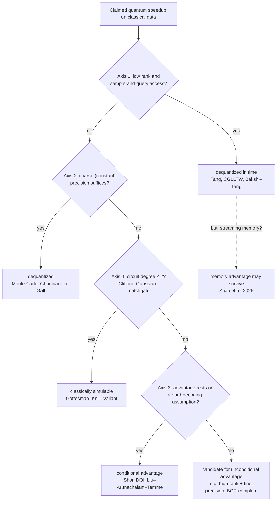

# Dequantization

Alexander Del Toro Barba, PhD. [Google Scholar](https://scholar.google.com/citations?hl=en&user=fddyK-wAAAAJ) $\cdot$ [LinkedIn](https://www.linkedin.com/in/deltorobarba/)

## Dequantization vs. Genuine Quantum Advantage

*Core theses of a map for QML on classical data. Status September 2026.*

> **Guiding principle.** Quantum advantage survives exactly when no efficient classical representation captures the computation. There are several mutually independent places where a classical shortcut can lurk: in input access, in precision, in problem hardness, in circuit structure. "Dequantization" means the same thing everywhere, namely finding that shortcut.

**Scope.** The map covers the *top row* of the data-vs-learner matrix: classical data processed by classical or quantum-enhanced learners. Learning from quantum data (copies of $\rho$, channels, dynamics) lies outside; that is where the proven exponential separations live (see the Quantum Learning notes). The boundary is the access model, not the technique: A paper belongs to the top row if the unknown is classical, copies are free, and no-cloning/Holevo do not bind as learning limits. Classical shadows or Bell measurements on a *self-prepared* state are readout of one's own model and shift nothing.

*The four axes as a checklist. Every "yes" is a theorem-grade dequantization except axis 3, whose "yes" only downgrades the claim to conditional. The dashed exit records that a time-dequantized algorithm can still win in memory (§5).*

## 1. Tang's Finding: The Speedup Sat in the Input Model

Wherever a quantum algorithm exploits low-rank structure under QRAM access, a classical algorithm with sample-and-query access (SQ, the classical analogue of QRAM) can do the same in polynomial time. The QRAM-based QML speedups (recommendation, PCA, SVM, SDP, low-rank inversion) were artifacts of the input gift. Sparsity-based methods (HHL) are a different story.

* **Tang 2019:** Dequantization of Kerenidis–Prakash (recommendation), the breakthrough.
* **Tang 2021:** Quantum PCA and clustering owe their speedup only to the state-preparation assumptions.
* **Chia, Gilyén, Li, Lin, Tang, Wang (STOC 2020):** Classical analogue of the QSVT, dequantizes the entire low-rank QSVT class at once.
* **Bakshi–Tang (SODA 2024):** The quantitatively sharp version up to small polynomial overhead.
* **➕ Precursors.** The algorithm being dequantized is HHL (Harrow, Hassidim, Lloyd, PRL 2009) and its low-rank offspring Kerenidis–Prakash (ITCS 2017). The caveat list Tang made rigorous had been stated informally in Aaronson, "Read the fine print", Nat. Phys. 2015: state preparation, readout, condition number, and precision as the four places where an exponential speedup silently evaporates. Tang's axes 1 and 2 are two of Aaronson's four turned into theorems.

## 2. The Four Axes: Where the Shortcut Can Lurk

| Axis | dequantizable / simulable | resistant / genuine advantage | Tool or limit | Status of resistance |
| --- | --- | --- | --- | --- |
| **1 Access model** (QSVT) | low-rank + SQ access | high effective rank (sparse HHL) | $\ell^2$-sampling (Tang, CGLLTW) | unconditional (theorem) |
| **2 Precision** (QSVT) | coarse relative precision | inverse-poly precision, BQP-complete (guided local Hamiltonian) | Monte Carlo (Gharibian–Le Gall) | unconditional (BQP-completeness) |
| **3 Hardness assumption** (Fourier) | decoding classically solvable or no structure | structure plus hard decoding (Shor, DQI) | coding theory, lattices | **conditional** (cryptographic conjecture) |
| **4 Circuit structure** | Clifford / Gaussian / free (degree $\leq 2$) | magic plus entanglement (degree $\geq 3$) | stabilizer, matchgate (Gottesman–Knill, Valiant) | unconditional (theorem) |

Axes 1 and 2 belong to linear algebra (QSVT family), axis 3 to the Fourier family, axis 4 to the circuit itself.

**Necessary and sufficient (axes 1 and 2).** High rank is necessary but not sufficient (sparse plus coarse precision stays classical). Fine precision is necessary but not sufficient (with low rank it is cheap). Only the **conjunction** of high rank *and* fine precision is sufficient, and in the guided-local-Hamiltonian problem even BQP-complete. Gharibian–Le Gall: The hardness persists for 2-local Hamiltonians and for overlap up to $1 - 1/\mathrm{poly}(n)$. Even a nearly perfect guiding state does not rescue the classical side. The quantum core sits not in state preparation but in the fine spectral transformation.

**Axis 3 is different.** Shor and DQI share the same skeleton: A representation-theoretic transformation (QFT) maps a globally hidden algebraic invariant onto a samplable dual support (hidden subgroup, Pontryagin duality for Shor; a code for DQI). The advantage hinges solely on the classical hardness of decoding. Two differences from magic: Axis 3 is **not monotone** (Goldilocks: too much structure becomes classically easy, "DQI requires structure") and **conditional** rather than unconditional. This is why DQI's status shifts while a Clifford circuit stays simulable forever.

**➕ The QML instance of axis 3.** Liu, Arunachalam, Temme, "A rigorous and robust quantum speed-up in supervised machine learning" (Nat. Phys. 2021): a classification task built on the discrete logarithm, with a quantum kernel that is efficiently estimable while any classical learner (given the data, not an oracle) would have to break discrete log. It is the cleanest existing proof that a top-row learning advantage *can* exist, and simultaneously a demonstration of the Goldilocks problem: the structure is planted, and no natural dataset is known to carry it. Lewis–Gilboa–McClean (2026, §6) is the first move from planted to natural distributions.

## 3. Two Levels: Circuit vs. Problem

* **Level 1, circuit-internal:** simulation-based dequantization, simulate the circuit itself (stabilizer tableau, Gaussian covariance, matchgate Pfaffian). Three pillars of quantumness: **entanglement** (Schmidt rank, Schrödinger language), **magic** (stabilizer rank, Heisenberg language), and **fermionic magic** (non-Gaussianity). Magic and fermionic magic follow the same degree knob from the operator notes: quadratic core free, degree $\geq 3$ is the resource. Entanglement is the exception (tensor structure, no degree filter), which is why there is no single quantumness scalar.
* **Level 2, problem interface:** algorithmic dequantization, solve the problem differently (Tang's $\ell^2$-sampling never simulates the circuit).

The levels are **complementary, not nested.** QRAM-QML circuits are high in entanglement and magic, yet Tang dequantized the *problems*. Low on any pillar ⇒ simulable ⇒ no advantage. High on all ⇒ still no advantage.

**➕ Two results that close doors inside level 1.** *Classical surrogates* (Schreiber, Eisert, Meyer, PRL 2023): for the standard data-re-uploading variational models, the function class is a trigonometric polynomial with a spectrum fixed by the encoding, so after training one can fit a classical model that reproduces the quantum one; the quantum device is at most a training aid, never the deployed predictor. *Barren plateaus imply simulability* (Cerezo, Larocca et al., arXiv:2312.09121, 2023): the structural properties that provably prevent barren plateaus (small dynamical Lie algebras, shallow depth, local cost functions) are the same properties that give polynomial classical simulation of the loss landscape, given an initial classical data-acquisition phase on the quantum device. Together: a trainable variational model on classical data is, with the currently known exceptions, a classically surrogatable one. This is axis 4 read through the lens of trainability, and it is why the surviving doors in §6 are all outside the variational paradigm.

## 4. The Unification: Tractability Is Low Rank

| Framework | Rank | low rank ⇒ easy (theorem) |
| --- | --- | --- |
| Axis 1 / Tang | matrix rank (SVD) | $\ell^2$-sampling, CGLLTW |
| Magic / axis 4 | stabilizer rank $\chi$ | Bravyi–Gosset |
| Entanglement | Schmidt rank, bond dimension | Jozsa, Vidal |
| Fermionic magic | fermionic Gaussian rank (Pfaffian) | Valiant |

The obstructions are independent because they measure high rank in different bases. QRAM-QML is low in matrix rank but high in stabilizer rank; all four cells of the 2×2 matrix "magic × sketchability" are occupied. **The direction "low rank ⇒ easy" is a theorem everywhere. The direction "high rank in all decompositions ⇒ advantage" is not a theorem**, because an unknown decomposition could exist. That is the open frontier.

## 5. Three Resources, Three Knobs

The recent works (2021, 2026) show that "advantage" is resource-relative. The discriminator changes with the resource.

| Resource | Discriminator | Regime of advantage | Status | Reference |
| --- | --- | --- | --- | --- |
| **Time** | matrix rank | high rank plus fine precision (batch, queryable) | theorem | Tang, CGLLTW, Gharibian–Le Gall |
| **Memory** | output dimension | streaming, high-dimensional coherent object | theorem, unconditional | Zhao, Zlokapa, Neven, Babbush, Preskill, McClean, Huang 2026 |
| **Samples / Prediction** | geometric difference $g_{CQ}$, effective dimension $d$ | large $g$, small $N$; shrinks as $N \to \infty$ | empirical, kernel-theoretic | Huang et al., *Power of Data* 2021 |

**Time vs. memory (resolving the apparent contradiction "Tang kills PCA, Preskill gives PCA an advantage").** Tang dequantizes *time* in the queryable model; Zhao et al. give a *memory* advantage in the streaming model. Same task, different resource. In memory, quantum wins even at low rank, because amplitude encoding packs an $N$-dimensional vector into $\log N$ qubits: a statement about dimension, not rank. The symmetry: In time the question is "does an $\ell^2$-sample suffice?", in memory "does a classical linear sketch (Johnson–Lindenstrauss) suffice?". Zhao et al. conclude that every super-quadratic query separation implies an exponential memory advantage, which is why the algorithms Tang dequantized in time are "worth revisiting" under the space lens.

**Memory advantage has two sources.** (A) *State complexity*: classically exponential memory for entangled or magic states; that is quantum simulation, axis 4, Feynman 1981. (B) *Data compression*: sketching streaming classical data coherently into a small state (oracle sketching, replaces QRAM; the machine never stores the dataset, so the Holevo objection does not apply). Axis 3 has no memory lever: Shor needs only $O(n)$ qubits.

**Samples vs. memory (the sharpest cross-connection).** *Power of Data* says: With enough classical training data, classical ML catches up with quantum models on classical tasks, even when the label generator is not classically simulable (BPP/samp). The advantage had to be forced via engineered labels and shrinks with $N$. *Massive Classical Data* says: This convergence tacitly assumes unbounded classical memory. Classical machines below the required size need *superpolynomially* more samples and time, on natural data (IMDb, PBMC scRNA-seq), and the gap does not close with more data. **The fragility statement of the top row therefore holds for the sample and time lenses, not for the memory lens.**

| | *Power of Data* (2021) | *Massive Classical Data* (2026) |
| --- | --- | --- |
| Measured | prediction error at fixed $N$ | machine size at fixed performance |
| Model | batch | streaming |
| Separation | empirical, engineered labels | theorem, unconditional, natural data |
| $N \to \infty$ | advantage shrinks | advantage persists |

## 6. What Remains for QML?

| Door | Status |
| --- | --- |
| Exponential time speedup for low-rank ML via QRAM | **closed** (Tang, CGLLTW). The 2026 QRAM hardware result does not revive it either: Tang already matches in the idealized QRAM regime |
| Hidden structure (axis 3) | provable time advantage in the QSQ model for structured function classes (Lewis–Gilboa–McClean 2026), not generic ML |
| Memory in streaming | exponential memory advantage, unconditional, on real data (Zhao et al. 2026); time remains classical $\tilde O(N)$ |
| Learning from quantum data | proven separation (Huang et al., Science 2022), but outside the map |

**LLMs on quantum computers.** Three hurdles bite even without dequantization: I/O and readout bottleneck, nonlinearity (softmax, activations), generically high-rank matrices. Every QML advantage must pass three tests: input not cheaply samplable, output not destroyed by readout, structure genuinely classically hard. The readout test bites for the time advantage, not the memory advantage.

## 7. Core Principles

1. **Quantum advantage survives exactly when no efficient classical representation captures the computation.** Four independent places for the shortcut: input access, precision, hardness, circuit structure.
2. **Tractability = low rank in some decomposition.** Advantage = irreducibly high rank across all known decompositions, an open program, not a theorem.
3. **Axis-1/2/4 resistance is unconditional, axis-3 resistance is conditional.** This is why DQI's status shifts while Clifford stays simulable forever.
4. **Resource and model are separate dimensions.** The time knob is rank, the memory knob is output dimension, the sample knob is geometric difference. Memory advantage has two sources; for axis 3 memory plays no role.
5. **For ML:** The exponential time speedup for low-rank problems via QRAM is dead. Provable advantages exist in structured learning (time) and in memory (streaming). The critique is sharpened, not refuted.
6. **The fragility of the top row is precisely scoped:** It holds for sample and time advantages, not for memory advantages.
7. **The map's boundary is the access model, not the technique.** Bottom-row tools in top-row problems are the rule.

## Open Frontiers (Selection)

* **Bridge matrix rank ↔ stabilizer rank:** a framework that puts SVD sketchability and circuit simulability on the same stage. Sits at the intersection of the two levels, apparently unexplored.
* **Guided-local-Hamiltonian phase diagram** in (precision, overlap, locality), in particular constant additive precision (chemical accuracy) in the high-rank regime.
* **Dequantized algorithms under the space lens:** Which of the time-dequantized algorithms (PCA, SVM, recommendation) retain an exponential memory separation in streaming, and which fall to a classical linear sketch?
* **Memory-bounded Power of Data:** Kernel generalization theory (2021) and query/communication hardness (2026) speak two languages about the same task; a bridge is missing.

## References (Core)

* E. Tang, "A quantum-inspired classical algorithm for recommendation systems", STOC 2019. arXiv:1807.04271.
* E. Tang, "Quantum PCA only achieves an exponential speedup because of its state preparation assumptions", PRL 127, 060503 (2021). arXiv:1811.00414.
* N.-H. Chia, A. Gilyén, T. Li, H.-H. Lin, E. Tang, C. Wang, "Sampling-based sublinear low-rank matrix arithmetic framework for dequantizing QML", STOC 2020 / JACM 2022. arXiv:1910.06151.
* A. Bakshi, E. Tang, "An improved classical singular value transformation for QML", SODA 2024. arXiv:2303.01492.
* S. Gharibian, F. Le Gall, "Dequantizing the QSVT: hardness and applications to quantum chemistry and the quantum PCP conjecture", STOC 2022. arXiv:2111.09079.
* S. Jordan et al., "Optimization by Decoded Quantum Interferometry", Nature (2025). arXiv:2408.08292. Critique: Anschuetz–Gamarnik–Lu, "DQI requires structure", arXiv:2509.14509.
* S. Bravyi, D. Gosset, "Improved classical simulation of quantum circuits dominated by Clifford gates", PRL 116, 250501 (2016).
* L. G. Valiant, "Quantum circuits that can be simulated classically in polynomial time", SIAM J. Comput. (2002).
* S. Aaronson, A. Ambainis, "Forrelation", STOC 2015. The provable oracle skeleton of axis 3.
* H.-Y. Huang, M. Broughton, M. Mohseni, R. Babbush, S. Boixo, H. Neven, J. R. McClean, "Power of data in quantum machine learning", Nat. Commun. 12, 2631 (2021). arXiv:2011.01938.
* H. Zhao, A. Zlokapa, H. Neven, R. Babbush, J. Preskill, J. R. McClean, H.-Y. Huang, "Exponential quantum advantage in processing massive classical data", arXiv:2604.07639 (2026).
* L. Lewis, D. Gilboa, J. R. McClean, "Quantum advantage for learning shallow neural networks with natural data distributions", Nat. Commun. 17, 1341 (2026). arXiv:2503.20879.
* J. Cotler, H.-Y. Huang, J. R. McClean, "Revisiting dequantization and quantum advantage in learning tasks", arXiv:2112.00811 (2021).
* **➕** A. W. Harrow, A. Hassidim, S. Lloyd, "Quantum algorithm for linear systems of equations", PRL 103, 150502 (2009).
* **➕** S. Aaronson, "Read the fine print", Nat. Phys. 11, 291 (2015).
* **➕** Y. Liu, S. Arunachalam, K. Temme, "A rigorous and robust quantum speed-up in supervised machine learning", Nat. Phys. 17, 1013 (2021). arXiv:2010.02174.
* **➕** H.-Y. Huang, R. Kueng, J. Preskill, "Information-theoretic bounds on quantum advantage in machine learning", PRL 126, 190505 (2021). arXiv:2101.02464.
* **➕** F. J. Schreiber, J. Eisert, J. J. Meyer, "Classical surrogates for quantum learning models", PRL 131, 100803 (2023). arXiv:2206.11740.
* **➕** M. Cerezo, M. Larocca, D. García-Martín, et al., "Does provable absence of barren plateaus imply classical simulability?", arXiv:2312.09121 (2023).
* **➕** S. Bravyi, D. Browne, P. Calpin, E. Campbell, D. Gosset, M. Howard, "Simulation of quantum circuits by low-rank stabilizer decompositions", Quantum 3, 181 (2019).
