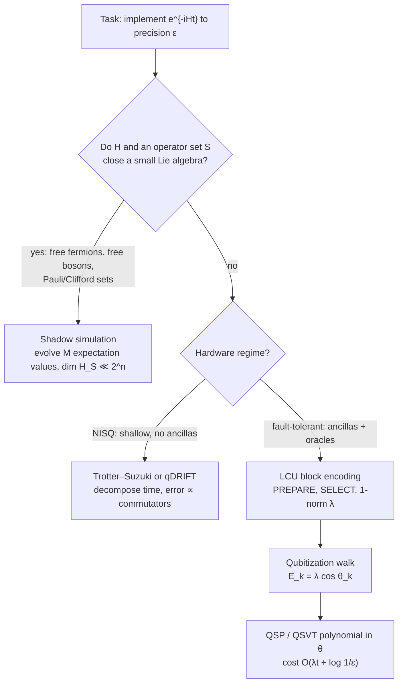
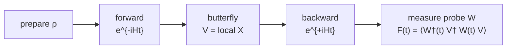
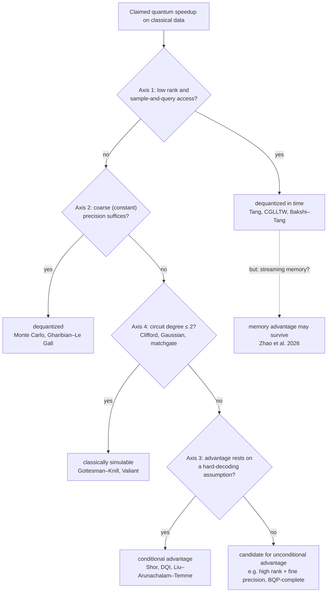

## Quantum Dynamics

> Every simulation technique in chemistry and physics sits on three axes: **Model** (classical vs. quantum), **Type** (static vs. dynamic), and **Computing** (classical vs. quantum). *Quantum dynamics* is the cell "quantum model, dynamic type", and its hard core is propagating $\vert{}\psi(t)\rangle = e^{-iHt}\vert{}\psi(0)\rangle$ in a $2^n$-dimensional Hilbert space. Static problems are **optimized** (variational principle); dynamic problems must be **propagated** (no forward theorem). On a quantum computer, propagation follows one of three structural strategies: decompose *time* (Trotter), transform the *spectrum* (Qubitization / QSVT), or shrink the *space* (Shadow Simulation).

---

### Differentiation: Model, Computation and Type

* **Model:** Classical models ignore electrons and treat atoms as spheres connected by springs (empirical force fields). Quantum models explicitly bring electrons, orbitals, and many-body correlation into play.
* **Type:** Static (ground state, eigenvalue problem $\hat H\vert{}\psi\rangle = E\vert{}\psi\rangle$) vs. dynamic (time evolution $i\hbar\,\partial_t\Psi = \hat H\Psi$).
* **Computing:** Classical hardware vs. quantum hardware.

| Model / Computing | **Static** (state, ground state) | **Dynamic** (time evolution) |
| --- | --- | --- |
| **Classical / Classical** | **Docking, energy minimization:** geometric fitting (AutoDock, Rosetta) | **Molecular dynamics:** $F = ma$, atoms as classical mass points with empirical force fields (GROMACS, NAMD, AMBER) |
| **Quantum / Classical** | **HF, DFT, Post-HF:** $\hat H\vert{}\psi\rangle = E\vert{}\psi\rangle$. HF ignores correlation, DFT approximates it via electron density $\rho$, Post-HF (CC, CI) is exact but scales exponentially in electron number $N$ | **TD-DFT:** excitations, spectra, fluorescence. Exact propagation $e^{-i\hat Ht/\hbar}\vert{}\Psi(0)\rangle$ scales exponentially in $N$ |
| **Quantum / Quantum** | **VQE (NISQ):** correlation energy via parametrized entanglement, optimization condition $\delta\langle H\rangle = 0$ | **Hamiltonian simulation:** coherent unitary exponentiation in a $2^n$-dimensional Hilbert space via Trotter, Qubitization/QSVT, or Shadow Simulation |

*Perspective, not part of quantum dynamics:* Quantum computers used for *classical* dynamics—such as solving the Navier–Stokes equations via the HHL algorithm for linear systems, or weather forecasting on a fine 100 m grid. Same quantum hardware, entirely different computational application.

#### Static vs. Dynamic

* **Static = Energy optimization.** If $\psi$ is an eigenstate of $\hat H$, time evolution is strictly stationary: $\Psi(t) = \psi e^{-iEt/\hbar}$, and the probability density $\vert{}\Psi(t)\vert{}^2$ remains constant over time. Finding binding energies reduces to searching for global minima across an energy landscape using the Rayleigh–Ritz variational principle or NISQ-era VQE.
* **Dynamic = Propagation.** Dynamical problems feature no general variational principle and no forward-in-time shortcut theorem. Simulating non-equilibrium chemical reaction dynamics, bond breaking during atomic collisions, non-adiabatic electronic excitations, and quantum chaotic scrambling cannot be framed as an optimization task; states must be explicitly propagated under $e^{-iHt}$.
* **Fundamental Axiom.** In static problems, the quantum computer merely *stores* and updates state information. In full dynamical evolution, it stores nothing: **it *is* the physical Hilbert space.**

---

### Static Quantum Chemistry: The Approximation Stack

**Why only tiny systems are solvable analytically.** The Schrödinger equation is analytically solvable only for the one-electron hydrogen atom. Introducing a second electron adds Coulomb repulsion, producing a non-integrable quantum three-body problem. Every electronic structure method is an approximation stack built upon foundational simplifications:

1. **Born–Oppenheimer Approximation:** Nuclei are treated as clamped on electronic timescales due to large mass differences, defining the classical potential energy surface (PES).
2. **Rayleigh–Ritz Variational Principle:** Minimizing the energy expectation value $\langle\psi\vert{}H\vert{}\psi\rangle$ yields upper bounds on the true ground-state energy.
3. **Correlation Energy:** The remaining central difficulty of modern quantum chemistry:

| Method | Correlation Treatment | Computational Cost |
| --- | --- | --- |
| **Hartree–Fock (HF)** | Mean-field approximation, neglects electron correlation entirely | Cheap: polynomial scaling ($O(N^4)$ down to $O(N^3)$) |
| **Density Functional Theory (DFT)** | Approximated via exchange-correlation functionals of the electron density $\rho$ (the exact universal functional is unknown and must be approximated) | Cheap: favorable polynomial scaling |
| **Post-HF (Coupled Cluster, CI)** | Systematically exact recovery of electronic correlation | Exponential scaling in electron number $N$; restricted to small molecular systems |
| **Variational Quantum Eigensolver (VQE)** | Captured directly on hardware through multi-qubit entanglement | Central NISQ method targeting larger molecules where classical Post-HF methods fail |

* **Chemical Model Frameworks:** Valence Bond Theory (orbital hybridization, localized electron-pair bonds) vs. Molecular Orbital (MO) Theory (spatial delocalization, HOMO/LUMO frontiers, Linear Combination of Atomic Orbitals / LCAO). Electron spin ($m_s = \pm\frac12$) does not emerge from the non-relativistic Schrödinger equation (which yields only quantum numbers $n, l, m_l$), but arises from unifying quantum mechanics with special relativity via the Dirac equation (1928).
* **Numbers and the Fault-Tolerant Counterpart:**
* **Chemical Accuracy** is defined as $1\text{ kcal/mol} \approx 1.6\text{ mHa} \approx 43\text{ meV}$, the energetic precision required to predict room-temperature chemical reaction rates to within one order of magnitude. This threshold fixes the target error $\epsilon$ in all quantum resource estimates.
* **Classical Scaling Limits:** Full Configuration Interaction (FCI) is numerically exact within a chosen basis set but scales combinatorially as $\binom{M}{N}$ in spin-orbitals $M$ and electrons $N$. Coupled Cluster with single, double, and perturbative triple excitations—$\text{CCSD(T)}$, the classical "gold standard"—scales as $O(N^7)$ and breaks down in strongly correlated, multi-reference systems (e.g., transition metal complexes, bond-breaking pathways), precisely the regime targeted for quantum advantage.
* **Fault-Tolerant QPE:** The fault-tolerant successor to VQE is **Quantum Phase Estimation (QPE)** applied to a block-encoded Hamiltonian $H$. By preparing an initial guiding state with non-negligible ground-state overlap, $E_0$ is read out as an eigenvalue phase with Heisenberg-limited precision in oracle queries.
* **FeMoco Resource Estimates:** Benchmark quantum resource studies focus on the catalytic iron-molybdenum cofactor of nitrogenase (FeMoco). Initial estimates by Reiher et al. (PNAS 2017) and tensor hypercontraction implementations by Lee et al. (PRX Quantum 2021) established requirements on the order of $10^6$ physical qubits and multiple days of runtime. These estimates have dropped by orders of magnitude primarily through advanced Hamiltonian representations with reduced 1-norms $\lambda$, rather than through relaxed hardware assumptions.
* ⚠️ **The Overlap Bottleneck:** If the overlap between the classically prepared guiding state $\vert{}\phi\rangle$ and the true ground state $\vert{}\psi_0\rangle$ is exponentially suppressed ($\lvert\langle\phi\vert{}\psi_0\rangle\rvert^2 \leq 2^{-\Omega(n)}$), QPE requires exponentially many repetitions, eliminating quantum speedup over classical heuristics (the *guided local Hamiltonian* problem).


---

### Dynamic Simulation on a Quantum Computer

**The Problem.** In nature, a physical system evolves under all governing Hamiltonian terms simultaneously. In contrast, quantum computing hardware executes discrete elementary quantum gates sequentially. Because non-commuting Hamiltonian terms satisfy $[A, B] \neq 0$, the Lie product formula does not factorize trivially:

$$e^{-i(A+B)t} \neq e^{-iAt}e^{-iBt}$$

| Strategy | Method | Decomposed Entity | Target Hardware Regime |
| --- | --- | --- | --- |
| **Decompose Time** | Trotter–Suzuki product formulas, qDRIFT | Physical duration $t$ discretized into $r$ time slices | NISQ (shallow depth, zero ancillas) |
| **Transform Spectrum** | Qubitization / Quantum Singular Value Transformation (QSVT) | Continuous energy spectrum mapped into discrete rotation angles: $E_k = \lambda\cos\theta_k$ | Fault-Tolerant (ancilla-assisted block encodings) |
| **Shrink Space** | Shadow Simulation | Full state space ($2^n$ complex amplitudes) projected into $M$ operator expectation values | Both NISQ and Fault-Tolerant regimes |



*The three strategies as an operational decision tree: shrink the state space if algebraic closure permits; otherwise, choose between slicing time or mapping the spectrum based on available hardware fault tolerance.*

---

### Trotterization

$$e^{-iHt} \approx \Big(\prod_j e^{-iH_j t/r}\Big)^r$$

* **Mechanism:** Decompose $H = \sum_{j=1}^L H_j$ into simple, individually exponentiable terms (e.g., local Pauli strings) and interleave them across $r$ small time slices.
* **Commutator Scaling:** Operator non-commutativity sets the error budget. First-order Trotterization leaves an algorithmic error of $\mathcal{O}(t^2/r)$, bounded by the sum of pairwise operator commutators:
$$\epsilon \le \frac{t^2}{2r} \sum_{j < k} \Vert{}[H_j, H_k]\Vert{}$$


Higher-order symmetric Suzuki formulas systematically eliminate lower-order error terms at the cost of increasing circuit depth.
* **Hardware Profile:** Structurally native to hardware; requires zero ancilla qubits and no coherent oracle circuits. Its primary computational limitation is a polynomial error scaling in $1/\epsilon$.
* **Commutator Bounds and Randomized Product Formulas:**
* **Nested Commutator Scaling:** Childs, Su, Tran, Wiebe, and Zhu (PRX 2021) demonstrated that the asymptotic error of a $p$-th order formula is rigorously bounded by nested commutators of the form $\sum \Vert{}[H_{j_{p+1}}, \dots, [H_{j_2}, H_{j_1}]]\Vert{}$. For geometrically local lattice Hamiltonians, this bound scales as $O(n)$ with system size rather than the loose, naive scaling in the number of terms $L^{p+1}$. This explains why high-order product formulas remain competitive in realistic gate-level resource benchmarks (Childs, Maslov, Nam, Ross, Su, PNAS 2018).
* **Randomized Compilation via qDRIFT:** Campbell (PRL 2019) introduced quantum Stochastic Drift Protocol (qDRIFT), which avoids deterministic term orderings by stochastically sampling individual terms $H_j$ with probability $p_j = \alpha_j / \lambda$ (where $\lambda = \sum_j \alpha_j$). The gate count scales as $O(\lambda^2 t^2 / \epsilon)$, completely independent of the total term count $L$ and free from operator commutators, though at the expense of an $\epsilon^{-1}$ error overhead.
* **Application Rule of Thumb:** Hamiltonians with numerous small-norm interaction terms and modest precision targets favor qDRIFT; systems composed of fewer, dominant terms or demanding high precision favor high-order Suzuki product formulas.

---

### Qubitization

* Qubitization: Walk Through the Eigenvalues
* **Linear Combinations of Unitaries (LCU) & Block Encoding:** Express the system Hamiltonian as a linear combination of unitaries:
$$H = \sum_{l=1}^L \alpha_l U_l \quad \text{with 1-norm } \lambda = \sum_{l=1}^L \vert{}\alpha_l\vert{}$$


Using coherent $\text{PREPARE}$ and $\text{SELECT}$ subroutines, embed the normalized Hamiltonian operator $H/\lambda$ as the upper-left diagonal block of an expanded unitary matrix $U_H$:
$$U_H = \begin{pmatrix} H/\lambda & \cdot \\ \cdot & \cdot \end{pmatrix}$$


* **Quantum Walk: Energy to Angle:** Introducing a state reflection operator $R = 2\vert{}\bar{0}\rangle\langle\bar{0}\vert{} - \mathbb{1}$ transforms the composite quantum walk operator $W = R \cdot U_H$ into an exact 2D planar rotation on invariant subspaces spanned by the eigenstates of $H$, possessing eigenvalues $e^{\pm i \arccos(E_k / \lambda)}$:
$$E_k = \lambda\cos\theta_k$$


Scalar energies are translated into geometric rotation angles. Time evolution is synthesized not by slicing time, but by executing an optimal polynomial transformation of these phases via **Quantum Signal Processing (QSP)** and the **Quantum Singular Value Transformation (QSVT)** using Jacobi–Anger and Chebyshev expansions (Low & Chuang, PRL 2017, Quantum 2019; Gilyén, Su, Low, & Wiebe, STOC 2019).
* **Performance Profile:** Achieves an asymptotically optimal query complexity of:
$$\mathcal{O}\left(\lambda t + \log(1/\epsilon)\right)$$


The physical trade-off involves coherent ancilla registers, multi-qubit controlled oracle calls, and an algorithmic dependency on the Hamiltonian 1-norm $\lambda$.
* **Scrambling & OTOC Diagnostics:** By inverting the quantum walk sequence (reversing the reflection operators and oracle circuits), operator scrambling and out-of-time-ordered correlators (OTOCs) can be measured directly via relative phase shifts on the ancilla register.
* **Fundamental Query Bounds & Fast-Forwarding:** The linear query dependence on time $t$ is tight and matches the fundamental **no-fast-forwarding theorem** for generic quantum Hamiltonians (Berry, Ahokas, Cleve, Sanders 2007; Atia & Aharonov, Nat. Commun. 2017). The additive $\log(1/\epsilon)$ term reflects the optimal polynomial degree required to approximate trigonometric time evolution functions.
* ⚠️ **Fast-Forwarding Exceptions:** Sub-linear or constant-time fast-forwarding ($t \ll \Vert{}H\Vert{}t$) remains physically possible for specific structured Hamiltonians (e.g., mutually commuting terms, non-interacting quadratic fermionic systems belonging to degree $\leq 2$ of the operator ladder)—the exact algebraic exception enabling shadow simulation.

---

### Shadow Simulation: Shrink the Space

Shadow Simulation: Shrink the Space. Proposed by Somma et al. (2024/2025), shadow simulation circumvents the exponential $2^n$-dimensional Hilbert space by tracking the dynamics of an observable subspace. It maps the evolution of $\vert{}\psi(t)\rangle$ into a compressed **shadow quantum state** whose amplitudes correspond to the expectation values of an operator set $S = \{O_1, \dots, O_M\}$ (e.g., 1-RDMs, 2-RDMs, or structured Pauli strings):

$$\vert{}\rho(t);S\rangle = \frac{1}{\sqrt A}\sum_{m=1}^M \langle O_m(t)\rangle\,\vert{}m\rangle$$

* **Algebraic Invariance (Theorem 1):** If the Hamiltonian $H$ and the operator basis $S$ satisfy a closed Lie algebra commutator relation:
$$[H, O_m] = -\sum_{m'=1}^M h_{mm'} O_{m'}$$


the shadow state **itself satisfies an exact effective Schrödinger equation**:
$$\frac{d}{dt}\vert{}\rho(t);S\rangle = -iH_S\vert{}\rho(t);S\rangle$$


where $H_S$ is an effective $M \times M$ matrix governed by the structure coefficients $h_{mm'}$.
* **Domains of Exact Closure:** This condition holds rigorously for systems generated by degree-2 operators on the canonical operator ladder:

| System | Lie Algebra | Operator Basis $S$ | Complexity Gain |
| --- | --- | --- | --- |
| **Free Fermions** | $\mathfrak{so}(2n)$ | Majorana quadratic pairs $c_j c_k$ | $N = 2^r$ physical modes simulated using only $\mathcal{O}(\log N)$ qubits |
| **Free Bosons** | $\mathfrak{sp}(2n)$ | Canonical variables $\hat P_j, \hat Q_j$ | Simulates $2^n$ coupled harmonic oscillators (generalizing Babbush et al.; BQP-complete dynamics) |
| **Qubit Systems** | Pauli strings / Clifford hierarchy | Operator pairs $P_{ij}$ | Direct state realization $\vert{}\rho;S\rangle = V_S(\vert{}\psi\rangle\otimes\vert{}\bar\psi\rangle)$ achieved via transversal Bell-basis rotations |

* **Computational Efficiency:** The effective matrix $H_S$ is propagated using QSP block-encoding techniques. Because $\dim H_S = M \ll 2^n$ and $H_S$ is typically highly sparse, its block encoding is exponentially more compact than that of the original physical Hamiltonian $H$.
* **Heisenberg Picture Representation:** Two-time correlation functions $\langle O_1(t) O_2(t')\rangle$ are directly mapped to quantum amplitude tensors (Theorem 2). A time-dependent operator $Z(t) = \sum_m z_m(t) O_m$ is encoded as a state vector $\vert{}Z(t)\rangle \propto \sum_m z_m(t)\vert{}m\rangle$. Evaluating Hamming-weight projections $\langle Z(t)\vert{}W\vert{}Z(t)\rangle$ yields operator spreading dynamics and **OTOC scrambling rates** without ever constructing the underlying $2^n$-dimensional state vector.

---

### Open Quantum Systems: Non-Unitary Dynamics

Coupling a quantum system to an unobserved thermal environment or measurement apparatus introduces energy dissipation and phase decoherence. The state evolution on the primary Hilbert space $\mathcal{H}_S$ ceases to be unitary and is described by a completely positive trace-preserving (**CPTP**) dynamical map ($\mathcal{E} \otimes \mathcal{I}_n \geq 0$).

Under the standard Born–Markov approximations (weak coupling, memoryless bath), the open dynamics obey the **Gorini–Kossakowski–Sudarshan–Lindblad (GKSL) master equation** (1976):

$$\frac{d\rho}{dt} = -i[H,\rho] + \sum_k \gamma_k\Big(L_k\rho L_k^\dagger - \tfrac12\{L_k^\dagger L_k,\rho\}\Big)$$

* **Coherent vs. Dissipative Terms:** The first term accounts for unitary evolution generated by $H$. The second term captures environmental dissipation via **Lindblad jump operators** $L_k$, which model processes such as spontaneous photon emission and spin flips ($T_1$ energy relaxation / amplitude damping) as well as elastic scattering and dephasing ($T_2$ phase damping).
* **Mathematical Structure:** The GKSL equation is the most general generator of a Markovian CPTP dynamical semigroup. Globally, any CPTP map admits an operator-sum **Kraus representation**:
$$\mathcal{E}(\rho) = \sum_k K_k\rho K_k^\dagger \quad \text{with} \quad \sum_k K_k^\dagger K_k = \mathbb{1}$$


The **Stinespring dilation theorem** embeds this non-unitary process into a higher-dimensional unitary evolution acting jointly across the system and an auxiliary environment.
* **Hardware Implementations:**
* **NISQ:** Simulated via the Monte-Carlo Wavefunction (MCWF) / quantum trajectory formalism, implementing continuous coherent drive punctuated by stochastic wavefunction collapses and mid-circuit ancilla resets.
* **Fault-Tolerant:** Implemented by block-encoding non-unitary Kraus and jump operators into unitary matrices using LCU methods or Stinespring ancilla registers. Cleve and Wang (ICALP 2017) demonstrated that Lindblad dynamics can be simulated fault-tolerantly in time:
$$\mathcal{O}\big(t\,\mathrm{polylog}(t/\epsilon)\big)$$


matching the optimal time scaling of closed-system Hamiltonian simulation up to poly-logarithmic factors.


* ⚠️ **Non-Markovian Dynamics:** Environments exhibiting memory effects, structured environmental spectral densities, or strong system-bath entanglement fall completely outside the Lindblad framework and represent a primary frontier for quantum simulation algorithms.
<br><br>

## Chaos, Scrambling and OTOCs

> A local operator under chaotic dynamics in the Heisenberg picture, $W(t) = e^{iHt}We^{-iHt}$, grows in three directions, each with its own metric and its own bound: **rate** $\lambda_L$ (time), **reach** $v_B$ (space), and **depth** $K(t)$ (operator space). Without the Schrödinger solution $e^{-iHt}$ there is no $W(t)$ and no OTOC: chaos diagnostics *are* quantum dynamics.

**Model system.** Mixed-field Ising model:

$$H = \sum_i Z_iZ_{i+1} + h_x\sum_i X_i + h_z\sum_i Z_i$$

The longitudinal field $h_z$ breaks integrability:

* $h_z = 0$: Integrable; yields Poincaré recurrence, ballistic echoes, and non-scrambling dynamics.
* $h_z \neq 0$ (e.g., $h_z = 0.5$): Non-integrable and chaotic; produces diffusive operator scrambling.
* **Simulation setup:** The OTOC of a local $Z$ probe on every site against an $X$ butterfly perturbation on the first site on a Trotterized spin chain directly contrasts ballistic spread ($h_z = 0$) against chaotic, diffusive scrambling ($h_z = 0.5$).

---

#### Object: OTOC as a Four-Point Function

$$C(t) = \big\langle[W(t),V(0)]^\dagger[W(t),V(0)]\big\rangle = 2\big(1 - \mathrm{Re}\,F(t)\big), \qquad F(t) = \langle W^\dagger(t)V^\dagger W(t)V\rangle$$

* **Physical meaning:** Measures how strongly two operators that initially commute at $t=0$ ($[W(0), V(0)] = 0$) **fail to commute** after time evolution. Scrambling corresponds to the decay $F(t) \to 0$.
* **Mechanism:** $W(t)$ starts as a strictly local observable, expands under the Heisenberg dynamics into an extensive, non-local superposition of Pauli strings, reaches the spatial support of $V$, and causes the commutator norm to lift off zero.
* **Why out-of-time-order:** The operator sequence traverses the contour $t \to 0 \to t \to 0$. Standard time-ordered two-point functions decay on the thermalization timescale $t_{\text{therm}}$ and are blind to information scrambling.
* **Measurement via Loschmidt Echo:**
1. Forward propagation under $e^{-iHt}$.
2. Butterfly perturbation $V$ (e.g., a local $X$ gate).
3. Backward propagation under $e^{+iHt}$.
4. Projective overlap measurement with probe observable $W$.



*The Loschmidt-echo protocol for an OTOC: only the non-commutativity of $W(t)$ and $V$ survives the forward-backward unitary cancellation. On fault-tolerant hardware, "backward" is implemented directly as the exact inverse quantum walk (reversing reflection and oracle phases), exploiting the fact that time evolution is synthesized as an angle.*

* **Experimental Verifications & The 2025 Hardware Milestone:** Verified across NMR platforms, trapped-ion processors, and superconducting circuits. In Google's "Quantum Echoes" (Abanin et al., *Nature*, October 2025), a second-order OTOC was measured on the 65-qubit Willow processor, demonstrating a $\sim\!13{,}000\times$ speedup over state-of-the-art classical tensor network and HPC simulations on the Frontier supercomputer. This was framed as the first *verifiable* quantum advantage: unlike random circuit cross-entropy benchmarking, the OTOC is a deterministic physical observable that an independent quantum platform can reproduce, and its companion experiment maps the echo decay directly to an NMR molecular-structure observable. The constructive-interference signal is extracted against an explicit decoherence baseline, because bare decay $F(t) \to 0$ cannot distinguish unitary scrambling from environmental damping.

---

#### Three Directions of Operator Growth

| Direction | Metric | Growth Law | Bound / Universality |
| --- | --- | --- | --- |
| **Rate** (time) | Quantum Lyapunov exponent $\lambda_L$ | $C(t) \sim \frac{1}{N}e^{\lambda_L t}$; operator size $n(t) \sim e^{\lambda_L t}$ | **MSS Bound:** $\lambda_L \leq \frac{2\pi k_B T}{\hbar} = \frac{2\pi}{\beta}$ |
| **Reach** (space) | Butterfly velocity $v_B$ | Operator front light cone: $C(t,x) \sim \frac1N\exp[\lambda_L(t - x/v_B)]$ | **Lieb–Robinson Bound:** $\Vert{}[A(t),B]\Vert{} \leq C e^{-\mu(d - v_{LR}t)}$, with $v_B \leq v_{LR}$ |
| **Depth** (operator space) | Krylov complexity $K(t)$ | Free systems: $K \sim t$<br>

<br>Integrable: $K \sim t^2$<br>

<br>Chaotic: $K \sim e^{2\alpha t}$ | **UOGH Hypothesis:** Lanczos coefficients grow as $b_n \sim \alpha n$, where $\alpha \leq \frac{\pi}{\beta}$ |

* **Rate (Time):** Semiclassically (Larkin & Ovchinnikov 1969), the quantum commutator maps to a classical Poisson bracket:
$$-\langle[x(t), p(0)]^2\rangle \;\longrightarrow\; \hbar^2 \{x(t), p(0)\}_{\text{PB}}^2 \sim \hbar^2 e^{2\lambda_{cl}t}$$


Thus, $\lambda_L$ is the direct quantum descendant of the classical Lyapunov exponent.
*Hierarchical timescales:*
$$t_{\text{therm}} \sim \mathcal{O}(1) \quad < \quad t_* \sim \lambda_L^{-1}\ln N \quad < \quad t_K \sim e^S$$


where $t_{\text{therm}}$ is local dissipation, $t_*$ is the Hayden–Preskill / Sekino–Susskind scrambling time, and $t_K$ is the Poincaré recurrence time.
⚠️ Extracting a clean exponential window requires a large-system limit ($N \gg 1$); in finite 1D qubit chains, spatial butterfly velocity $v_B$ is extracted far more reliably than $\lambda_L$.
* **Reach (Space):** The Lieb–Robinson velocity $v_{LR}$ is a state-independent operator-norm bound setting a strict relativistic-like speed limit in non-relativistic lattice systems (Lieb & Robinson 1972). In contrast, the butterfly velocity $v_B$ is state- and temperature-dependent. This spatial limit dictates:
1. The slope of the OTOC light-cone wavefront.
2. The minimum circuit depth required to generate global entanglement across $n$ qubits ($d \sim n$ in 1D, $d \sim \sqrt{n}$ on 2D architectures, $d \sim \log n$ in all-to-all connectivity).
3. Front dynamics in random circuits: operator spreading forms a ballistic front governed by Kardar–Parisi–Zhang (KPZ) fluctuations with front broadening $\sigma(t) \sim t^{1/3}$ (Nahum, Vijay, Haah, PRX 2018; von Keyserlingk et al., PRX 2018), and entanglement entropy grows as $S(t) = v_E t$ with entanglement velocity bounded by $v_E \leq v_B$ (Mezei & Stanford, JHEP 2017).


* **Depth (Operator Space):** The Liouvillian superoperator $\mathcal{L} = [H, \cdot]$ acts on the operator Hilbert space equipped with the Frobenius/Wightman inner product. The Liouville–Lanczos algorithm tridiagonalizes $\mathcal{L}$ over the Krylov chain:
$$\mathcal{K} = \text{span}\{W, [H,W], [H,[H,W]], \dots\}$$


governed by the recurrence $\mathcal{L}\vert{}O_n) = b_{n+1}\vert{}O_{n+1}) + b_n\vert{}O_{n-1})$. The **Krylov complexity** measures the mean operator position along this chain:
$$K(t) = \sum_{n} n\,\vert{}\varphi_n(t)\vert{}^2$$


(Parker, Cao, Avdoshkin, Scaffidi, Altman, PRX 2019).

---

#### Logical Stack of Bounds: KMS $\implies$ UOGH $\implies$ MSS

$$\text{KMS thermal analyticity in strip } 0 \leq \mathrm{Im}(t) \leq \beta \;\implies\; \alpha \leq \frac{\pi}{\beta} \;\implies\; \lambda_L \leq \frac{2\pi k_BT}{\hbar}$$

* **Universal Operator Growth Hypothesis (UOGH):** In chaotic many-body systems at finite temperature, the Lanczos sequence $b_n$ grows maximally linearly ($b_n \sim \alpha n$ with $\alpha \leq \pi/\beta$), setting an upper bound on operator complexity growth.
* **Maldacena–Shenker–Stanford (MSS) Bound:** Analyticity of out-of-time-ordered four-point correlation functions under Kubo–Martin–Schwinger (KMS) thermal boundary conditions bounds the growth rate by $\lambda_L \leq 2\pi k_B T / \hbar$ (JHEP 2016).
* **Sachdev–Ye–Kitaev (SYK) Model:** $N$ Majorana fermions with all-to-all random four-body interactions (Kitaev 2015; Maldacena & Stanford, PRD 2016). Exactly solvable in the large-$N$ limit and holographically dual to Jackiw–Teitelboim (JT) gravity in $\mathrm{AdS}_2$. It **saturates the MSS bound** ($\lambda_L = 2\pi/\beta$), demonstrating that black holes behave as the fastest and most efficient information scramblers in nature.

**Reference Stack:**

* Lieb–Robinson bound: Lieb, Robinson, *Commun. Math. Phys.* (1972).
* Semiclassical OTOC foundation: Larkin, Ovchinnikov, *JETP* (1969).
* Fast scrambling conjecture: Sekino, Susskind, *JHEP* (2008).
* Chaos bound: Maldacena, Shenker, Stanford, *JHEP* (2016).
* SYK model: Kitaev, KITP talks (2015); Maldacena, Stanford, *PRD* (2016).
* Krylov complexity & UOGH: Parker, Cao, Avdoshkin, Scaffidi, Altman, *PRX* (2019).
* Random-circuit operator spreading & KPZ universality: Nahum, Vijay, Haah, *PRX* (2018); von Keyserlingk, Rakovszky, Pollmann, Sondhi, *PRX* (2018).
* Entanglement velocity bound: Mezei, Stanford, *JHEP* (2017).
* Information retrieval: Hayden, Preskill, *JHEP* (2007); Yoshida, Kitaev, *arXiv:1710.03363*.
* Barren plateaus in variational circuits: McClean, Boixo, Smelyanskiy, Babbush, Neven, *Nat. Commun.* (2018); review Larocca et al., *Nat. Rev. Phys.* (2025).

---

#### Static Fingerprints: ETH and Spectral Statistics

* **Eigenstate Thermalization Hypothesis (ETH, Srednicki):**
$$A_{mn} = \mathcal{A}(\bar E)\delta_{mn} + e^{-S(\bar E)/2}f_A(\bar E,\omega)R_{mn}$$


A *single* chaotic energy eigenstate behaves locally like a microcanonical thermal ensemble. The global system remains pure while local subsystems thermalize via entanglement with the rest of the spectrum.
* *Chaotic dynamics:* Satisfy ETH $\implies$ local thermalization.
* *Integrable systems:* Constrained by extensive local conserved quantities $\implies$ Generalized Gibbs Ensemble (GGE).
* *Many-Body Localization (MBL):* Strong disorder preserves local integrals of motion (LIOMs / $l$-bits) $\implies$ breakdown of thermalization.


* **Random Matrix Theory (BGS Conjecture / Bohigas–Giannoni–Schmit):**
* Chaotic quantum spectra display Wigner–Dyson energy-level repulsion characterized by Dyson ensembles with mean adjacent gap ratio $\langle r\rangle \approx 0.53$.
* Integrable spectra lack level repulsion and exhibit Poissonian statistics with $\langle r\rangle \approx 0.39$.


* **Spectral Form Factor (SFF):**
$$K(\tau) = \langle\vert{}\mathrm{Tr}(e^{-iHt})\vert{}^2\rangle$$


Exhibits a diagnostic **dip–ramp–plateau** profile at late times $t > t_*$, revealing discrete energy level correlations long after the spatial OTOC has fully saturated.

---

#### Scrambling vs. Decoherence

| Diagnostic Feature | Unitary Scrambling | Lindblad Open Decoherence |
| --- | --- | --- |
| **Information Dynamics** | Delocalized reversibly into non-local multi-party entanglement; reconstructible from global operators | Dissipated irreversibly into external bath degrees of freedom |
| **Entropy Scaling** | Local subsystem entanglement entropy grows; global state remains strictly pure ($S_{\text{vN}}(\rho_{\text{global}}) = 0$) | Global von Neumann entropy $S_{\text{vN}}(\rho)$ increases non-unitarily |
| **OTOC Response** | $F(t) \to 0$ driven by true non-commutative many-body operator growth | $F(t) \to 0$ driven by environment-induced dephasing and amplitude damping |
| **Diagnostic Risk** | Reflects intrinsic many-body quantum chaos | Can mimic operator spreading and generate a **false Lyapunov exponent $\lambda_L$** |

Quantitative experimental extraction requires error-mitigated echo protocols and baseline normalization to decouple unitary scrambling from non-unitary CPTP channel noise. Modeling and bounding non-Markovian and CPTP noise impacts on OTOCs, alongside fault-tolerant simulation of open-system Lindbladians, remains an active research frontier.

---

#### Consequences: Black Holes $\longleftrightarrow$ Quantum Computing

* **Scrambling as a Resource (Hayden–Preskill Protocol):** A black hole acts as an optimal information mirror. An unknown quantum state thrown into a scrambling black hole after its Page time can be reconstructed from a few emitted Hawking radiation quanta collected alongside the historical radiation in time $\mathcal{O}(\ln N)$. The **Yoshida–Kitaev decoding circuit** achieves a state-reconstruction fidelity directly proportional to the OTOC value and operates with maximum efficiency at the theoretical chaos bound (experimentally verifiable via two-copy Bell state sampling).
* **Scrambling as an Obstacle (Barren Plateaus):** Deep parametrized quantum circuits that scramble rapidly form approximate unitary $t$-designs on $U(2^n)$. Haar integration concentrates observable gradients exponentially with qubit count:
$$\mathrm{Var}_{\theta}[\partial_\theta \langle H \rangle] \sim 2^{-n}$$


(McClean et al. 2018). As a consequence, randomly initialized variational quantum algorithms (VQAs) encounter flat cost landscapes that are classically and quantumly untrainable. In Hamiltonian simulation, scrambling dynamics also impose an algorithmic complexity bound scaling as $\mathcal{O}(nt\cdot\mathrm{polylog}(1/\epsilon))$.
* **Random Circuit Sampling (RCS):** The Porter–Thomas distribution:
$$P(p) \approx N e^{-Np}$$


acts as the static fingerprint of Haar-random state generation. The circuit depth required to enter the Porter–Thomas regime corresponds precisely to the geometric scrambling time ($d \sim n$ in 1D architectures, $d \sim \sqrt{n}$ on 2D planar chips), reflecting the time needed for the Lieb–Robinson light cone to traverse the physical processor.
<br><br>

## V. QML on Classical Data: Dequantization vs. Genuine Quantum Advantage

### Separation: Classical vs. Quantum Data

|  | Classical Learners | Quantum-Enhanced Learners |
| --- | --- | --- |
| **Classical Data** | Classical ML (deep learning, classical kernels, boosting) | **"QML on classical data":** feature maps, variational quantum classifiers (VQCs), quantum kernels |
| **Quantum Data**<br>

<br>(copies of unknown $\rho$ / quantum channels) | **Measurement protocol + classical statistics:** classical shadows, randomized benchmarking, Bell sampling + classical decoders | **Quantum-memory protocols:** coherent multi-copy / two-copy joint measurements, quantum principal component analysis |

* **Fragility of the Top Row (Classical Data):** Advantage claims are fragile. Classical ML equipped with sufficient training data catches up with quantum-enhanced models on classical tasks, even when the underlying label-generating process is not classically simulable in polynomial time (Huang et al., *Power of Data*, Nat. Commun. 2021).
* **Proven Separations in the Bottom Row (Quantum Data):** Proven, unconditional exponential separations reside exclusively in the bottom row (Huang et al., *Science* 2022), complete with direct experimental hardware demonstrations.

#### Three Litmus Tests Separating the Rows

1. **Locus of the Unknown:** Does the target entity live as a discrete classical dataset (CSV file, bitstring table) or as a physical density operator $\rho$ in an unobserved Hilbert space?
2. **Copy Complexity as Physical Cost:** Can the data be duplicated freely at zero marginal cost, or does nature charge an explicit physical budget for every copy consumed?
3. **Binding Information-Theoretic Bounds:**
* **No-Cloning Theorem:** No completely positive trace-preserving (CPTP) map can perform the transformation $\rho \mapsto \rho \otimes \rho$. Available copies act as a consumable, non-renewable resource budget.
* **Holevo's Theorem:** An $n$-qubit state can convey at most $n$ classical bits of accessible information to any measurement apparatus, strictly bounding what a single measurement shot can extract.
* **Gentle Measurement Lemma** (Winter 1999; Aaronson 2004): An operation that accepts a quantum state with probability $\geq 1 - \epsilon$ perturbs the underlying state by at most $O(\sqrt{\epsilon})$ in trace distance. This allows an ensemble of near-deterministic questions to be evaluated sequentially on the same physical copies.

None of these physical constraints bind classical datasets. Classical measurement theory addresses the single-shot physical perturbation of a measurement on a state; quantum learning theory solves the inverse statistical problem: the Born rule turns the quantum state into a sampling oracle, and learning is the reconstruction of the generator from measurement statistics.

---

### Dequantization vs. Genuine Advantage: A Decision Framework

> **Guiding Principle:** Quantum advantage survives exactly when no efficient classical representation captures the underlying computation. Classical shortcuts can emerge along four mutually independent axes: input access, numerical precision, cryptographic problem hardness, or circuit algebraic structure. "Dequantization" denotes finding that exact shortcut.

**Scope and Boundary:** This framework governs the *top row* of the data-versus-learner matrix (classical data processed by classical or quantum-enhanced learners). Learning from quantum data (copies of $\rho$, black-box unitaries, unknown dynamics) is governed by separate information-theoretic bounds. The defining boundary is the **access model**, not the algorithmic technique: an investigation belongs to the top row if the underlying ground truth is classical, data replication is free, and No-Cloning/Holevo bounds do not limit learning. Performing classical shadows or Bell-basis measurements on a *self-prepared* state represents the readout of one's own model and does not elevate a problem into the bottom row.



*Every "yes" constitutes a theorem-grade dequantization, except on Axis 3, where a "yes" downgrades the claim from unconditional to conditional. The dashed branch highlights that an algorithm dequantized in time can retain an exponential quantum advantage in streaming memory.*

---

### Tang's Finding: Speedups Rooted in the Input Model

Whenever a quantum algorithm achieves exponential speedup over classical algorithms by exploiting low-rank matrix structure under quantum RAM (QRAM) state preparation, an equivalent classical algorithm with **sample-and-query (SQ) access** (the classical analogue of QRAM data loading) can solve the problem in polynomial time. QRAM-based QML speedups (recommendation systems, PCA, SVMs, semidefinite programming, low-rank matrix inversion) were artifacts of the input loading model rather than quantum propagation:

* **Tang (STOC 2019):** Dequantized the Kerenidis–Prakash recommendation algorithm, establishing the $\ell^2$-norm randomized sampling technique.
* **Tang (PRL 2021):** Demonstrated that quantum PCA and low-rank clustering owe their apparent exponential speedups entirely to state-preparation assumptions.
* **Chia, Gilyén, Li, Lin, Tang, Wang / CGLLTW (STOC 2020 / JACM 2022):** Formulated a classical analogue of the Quantum Singular Value Transformation (QSVT) using randomized sublinear matrix arithmetic, dequantizing the entire low-rank QSVT class simultaneously.
* **Bakshi & Tang (SODA 2024):** Derived the quantitatively optimal classical singular value transformation, reducing classical query and runtime bounds down to small polynomial overheads.
* **Precursors and Structural Roots:** The primary algorithm dequantized along this track is HHL (Harrow, Hassidim, Lloyd, PRL 2009) and its low-rank variant by Kerenidis & Prakash (ITCS 2017). Tang formalized the caveats identified in Aaronson's "Read the fine print" (Nat. Phys. 2015): state preparation, state readout, matrix condition number $\kappa$, and precision $\epsilon$ represent four loci where exponential speedups evaporate. Tang’s Axes 1 and 2 turn two of Aaronson’s four caveats into rigorous no-go theorems.

---

### The Four Axes: Where the Shortcut Lurks

| Axis | Dequantizable / Simulable Regime | Resistant / Genuine Advantage Regime | Primary Analytical Tool or Limit | Status of Resistance |
| --- | --- | --- | --- | --- |
| **1: Access Model** (QSVT family) | Low rank + Sample-and-Query (SQ) access | High effective matrix rank (sparse HHL framework) | $\ell^2$-norm matrix sampling (Tang, CGLLTW, Bakshi–Tang) | **Unconditional** (theorem) |
| **2: Precision** (QSVT family) | Coarse relative precision ($\epsilon = O(1)$) | Inverse-polynomial fine precision; BQP-complete instances | Classical Monte Carlo methods (Gharibian & Le Gall) | **Unconditional** (BQP-completeness) |
| **3: Hardness Assumption** (Fourier family) | Classically decodable structures or featureless random landscapes | Hidden algebraic structure coupled with classically hard decoding (Shor, DQI) | Algebraic coding theory, lattice cryptography, Pontryagin duality | **Conditional** (conjectured cryptographic hardness) |
| **4: Circuit Structure** (Operator ladder) | Degree $\leq 2$ generators: Clifford, Gaussian, free fermions | Degree $\geq 3$ generators: magic gates, non-Gaussianity, $T$-count | Stabilizer tableau, matchgate Pfaffians (Gottesman–Knill, Valiant) | **Unconditional** (theorem) |

Axes 1 and 2 govern linear-algebraic workflows (the QSVT family); Axis 3 governs representation theory (the Fourier family); Axis 4 governs the intrinsic algebraic generator degree of the quantum circuit.

#### Necessary and Sufficient Conditions (Axes 1 & 2)

* High rank is necessary but insufficient on its own (sparse matrices with coarse precision remain classically simulable via Monte Carlo sampling).
* Fine precision is necessary but insufficient on its own (low-rank systems with fine precision are solvable via classical randomized SVD sketches).
* Only the **conjunction of high effective rank and fine numerical precision** is sufficient to resist classical dequantization, reaching full BQP-completeness in the **guided local Hamiltonian problem** (Gharibian & Le Gall, STOC 2022). This quantum hardness holds even for 2-local Hamiltonians and with guiding state overlaps up to $1 - 1/\mathrm{poly}(n)$. Thus, even a nearly perfect guiding state cannot rescue classical simulators; the speedup resides in fine spectral transformations rather than state preparation alone.

#### Distinct Logic of Axis 3

Shor's algorithm and Decoded Quantum Interferometry (DQI; Jordan et al., Nature 2025) share an underlying mathematical skeleton: a representation-theoretic transformation (the Quantum Fourier Transform, QFT) maps a globally hidden algebraic invariant onto a dual support that can be sampled (hidden subgroup and Pontryagin duality for Shor; linear codes for DQI). The computational advantage rests on the classical intractability of decoding that algebraic structure.

Unlike Circuit Magic (Axis 4), Axis 3 exhibits two distinguishing properties:

1. **Non-Monotonicity (The Goldilocks Dilemma):** Too little algebraic structure yields unlearnable, featureless landscapes; excessive algebraic structure renders the problem classically decodable (Anschuetz, Gamarnik, Lu, *DQI requires structure*, 2025).
2. **Conditional Hardness:** Advantage rests on computational complexity conjectures (e.g., hardness of discrete logarithms, Shortest Vector Problem) rather than unconditional structural theorems. Hence, while a Clifford circuit remains classically simulable under all circumstances, DQI's advantage fluctuates with classical decoding advances.

* **The QML Archetype of Axis 3:** Liu, Arunachalam, and Temme (Nat. Phys. 2021) constructed a supervised classification task based on the discrete logarithm problem. They designed an efficiently computable quantum kernel that classifies data provably faster than any classical learner (operating on data, without an oracle), unless the classical learner can efficiently compute discrete logs. This provides an existence proof for a top-row quantum learning advantage while illustrating the Goldilocks limitation: the algebraic symmetry is synthetically planted, and no natural dataset is known to exhibit this structure. Lewis, Gilboa, and McClean (Nat. Commun. 2026) initiated the transition from planted algebraic constructions to natural data distributions.

---

### Two Levels of Analysis: Circuit vs. Problem Interface

* **Level 1: Circuit-Internal (Simulation-Based Dequantization):** Direct simulation of the unitary dynamics using structural representations (stabilizer binary tableaus, Gaussian covariance matrices, matchgate fermionic Pfaffians).
*Three Pillars of Quantumness:*
* **Entanglement:** Quantified by Schmidt rank and matrix product state (MPS) bond dimension (Schrödinger picture).
* **Magic:** Quantified by stabilizer rank $\chi$ and extent (Heisenberg picture).
* **Fermionic Magic:** Quantified by non-Gaussian parity-violating operations.


Magic and fermionic magic follow the same algebraic generator degree ladder: quadratic generators are free; degree $\geq 3$ constitutes the non-simulable resource. Entanglement is an exception governed by tensor product factorization rather than polynomial degree, which explains why no single scalar parameter characterizes quantum complexity.
* **Level 2: Problem Interface (Algorithmic Dequantization):** Re-architecting the mathematical solution from the outside without simulating circuit trajectories (e.g., Tang’s $\ell^2$-sampling constructs low-rank matrix approximations without tracking quantum state vectors).

The levels are **complementary rather than nested:** QRAM-based QML algorithms often feature high entanglement and high magic, yet Tang dequantized the underlying *problems*. Being low on any pillar renders a model classically simulable; being high on all pillars still does not guarantee quantum advantage.

```
       Circuit Level (Level 1)               Problem Interface (Level 2)
  [Entanglement + Magic + Non-Gaussian]   ≠   [High Rank + Fine Precision + Hard Decoding]
       (Circuit-Simulable if Low)                    (Algorithmic Dequantization if Low)

```

#### Results Constraining Level 1 Variational Models

* **Classical Surrogates** (Schreiber, Eisert, Meyer, PRL 2023): For standard data-re-uploading variational models, the expressible function class is a trigonometric polynomial whose frequency spectrum is fixed by the data encoding. Consequently, once trained, a classical surrogate model can reproduce the quantum model's predictions; the quantum processor serves at most as a training heuristic, never as an indispensable inference engine.
* **Barren Plateaus Imply Classical Simulability** (Cerezo, Larocca et al., 2023): The structural architectural traits that provably prevent barren plateaus (e.g., small dynamical Lie algebras, shallow circuit depth, strictly local cost observables) simultaneously enable polynomial-time classical simulation of the loss landscape, provided classical training data is acquired from the processor.

Trainable variational quantum models on classical data are generally classically surrogatable. This aligns Axis 4 with optimization landscapes and directs surviving quantum advantage avenues away from standard variational frameworks.

---

### Unified Theory: Tractability as Low Rank

| Theoretical Framework | Rank Metric | Low Rank $\implies$ Efficient Simulation (Theorem) |
| --- | --- | --- |
| **Axis 1 / Algorithmic (Tang)** | Matrix rank (Singular Value Decomposition) | $\ell^2$-norm subspace sampling (CGLLTW, Bakshi–Tang) |
| **Magic / Axis 4 (Qubits)** | Stabilizer rank $\chi$ | Stabilizer decompositions (Bravyi–Gosset, Bravyi et al. 2019) |
| **Entanglement / Tensor Networks** | Schmidt rank / Tensor bond dimension $D$ | Matrix Product States & Tree Tensor Networks (Vidal, Jozsa) |
| **Fermionic Magic (Fermions)** | Fermionic Gaussian rank | Pfaffian matchgate contractions (Valiant) |

These obstructions operate independently because they quantify low rank in distinct mathematical bases. For instance, QRAM-based algorithms are low in matrix rank but can be high in stabilizer rank; all configurations in the "Magic $\times$ Matrix Sketchability" parameter space can be realized.

$$\text{Low Rank in Any Decomposition} \implies \text{Classically Tractable (Proven Theorem)}$$

$$\text{High Rank Across Known Decompositions} \implies \text{Quantum Advantage (Open Conjecture)}$$

The reverse direction is not a theorem because an unknown, efficiently contractible classical basis decomposition may exist.

---

### Three Physical Resources, Three Control Knobs

Advantage is relative to the constrained resource:

| Resource Constraint | Mathematical Discriminator | Regime of Genuine Advantage | Formal Status | Landmark Reference |
| --- | --- | --- | --- | --- |
| **Time** | Matrix rank | High rank combined with fine precision (batch, queryable input) | **Theorem** (unconditional) | Tang; CGLLTW; Gharibian & Le Gall |
| **Memory** | Output dimension | Streaming data model; high-dimensional coherent state | **Theorem** (unconditional) | Zhao, Zlokapa, Neven, Babbush, Preskill, McClean, Huang (2026) |
| **Samples / Prediction** | Geometric difference $g_{CQ}$, effective dimension $d$ | High geometric distance $g$, small sample size $N$; advantage diminishes as $N \to \infty$ | Empirical / Kernel theory | Huang et al., *Power of Data* (2021) |

#### Reconciling Time and Memory: Tang vs. Preskill

Tang dequantizes computational *time* in the queryable input model, whereas Zhao et al. (2026) establish an exponential quantum advantage in *memory* within the streaming data model. Both analyze low-rank tasks like PCA, but under different resource constraints:

* In memory, quantum processors hold an advantage even in low-rank regimes because amplitude encoding stores an $N$-dimensional vector across $\log N$ qubits—a property of state space dimension rather than matrix rank.
* In time complexity, the governing question is: *"Does an $\ell^2$ sample suffice?"* In space complexity, the governing question is: *"Can a classical linear sketch (Johnson–Lindenstrauss) compress the stream?"*
* Zhao et al. prove that every super-quadratic quantum query separation implies an exponential quantum memory advantage in streaming. As a result, algorithms dequantized in time remain viable targets for exponential memory advantages.

#### Dual Origins of Quantum Memory Advantage

1. **State Complexity:** Classically exponential memory is required to store highly entangled or high-magic quantum states (quantum dynamical simulation; Axis 4; Feynman 1981).
2. **Coherent Data Compression:** Coherently sketching incoming classical data streams directly into an $n$-qubit register (oracle sketching) eliminates QRAM. Because the processor never stores the raw classical dataset, Holevo's bound does not restrict the intermediate computational state.

*Note on Axis 3:* Cryptographic hidden subgroup algorithms provide no memory advantage; Shor's algorithm requires only $O(n)$ qubits, which is already polynomial.

#### Samples vs. Memory: Resolving Top-Row Fragility

* **Batch Sample Perspective** (*Power of Data*, 2021): Given a sufficiently large classical training set $N$, classical learners catch up to quantum learners on classical data, even when class labels are generated by classically intractable circuits. The quantum advantage had to be engineered and decayed as $N \to \infty$.
* **Streaming Memory Perspective** (*Massive Classical Data*, 2026): This classical convergence implicitly assumes unbounded classical memory. Classical learners restricted to realistic memory bounds require *superpolynomially* more samples and time on real-world datasets (e.g., IMDb sentiment, PBMC single-cell RNA sequencing), and the advantage persists as $N \to \infty$.

$$\text{Top-Row Fragility Holds for Time and Sample Budgets} \quad \centernot\implies \quad \text{Holds Under Memory Constraints}$$

| Feature | *Power of Data* (Huang et al. 2021) | *Massive Classical Data* (Zhao et al. 2026) |
| --- | --- | --- |
| **Primary Metric** | Generalization prediction error at fixed sample size $N$ | Classical machine memory footprint at fixed task performance |
| **Input Architecture** | Batch access model | Streaming data model |
| **Separation Type** | Empirical; demonstrated on synthetically engineered labels | **Theorem-grade, unconditional; demonstrated on natural data** |
| **Asymptotic Limit ($N \to \infty$)** | Advantage narrows and vanishes | **Quantum memory advantage persists unconditionally** |

---

### Viable Pathways for QML on Classical Data

| Proposed Direction | Current Theoretical Status |
| --- | --- |
| **Exponential Time Speedup for Low-Rank ML via QRAM** | **Closed.** Dequantized by Tang, CGLLTW, and Bakshi–Tang. Even fault-tolerant physical QRAM hardware does not reopen this door, as classical $\ell^2$-sampling matches quantum runtimes within the idealized QRAM model. |
| **Hidden Algebraic Structures (Axis 3)** | **Open.** Provable time advantages exist in the Quantum Statistical Query (QSQ) model for specific structured function classes (Lewis, Gilboa, McClean 2026); applies to specialized algebraic tasks rather than generic tabular data. |
| **Memory Advantages in Streaming Regimes** | **Open.** Provable, unconditional exponential memory advantage on real data distributions (Zhao et al. 2026); streaming runtime remains classical $\tilde{O}(N)$. |
| **Learning from Quantum Data** | **Open.** Unconditional exponential separations in sample and time complexity (Huang et al., *Science* 2022); operates outside the top-row classical data constraint. |

#### Structural Bottlenecks for Large Language Models (LLMs) on Quantum Hardware

1. **I/O and State Preparation Bottleneck:** Loading billions of classical token parameters into quantum amplitudes requires polynomial or linear circuit depth, dissipating prospective speedups before computation begins.
2. **Nonlinear Activation Functions:** Unitary gates are strictly linear transformations. Implementing nonlinear activations (e.g., Softmax, GELU, SwiGLU) requires complex multi-ancilla block encodings or measurement-driven non-unitary subroutines that introduce significant sampling overheads.
3. **High Effective Matrix Rank:** Attention matrices and dense weight transformations in trained foundation models are generically full-rank, which prevents low-rank tensor decompositions and QSP optimizations.

Every proposed quantum advantage on classical data must pass three formal checks:

* **The Input Check:** Is input data preparation resistant to efficient classical sampling sketches?
* **The Readout Check:** Can target properties be extracted without an exponential number of projective measurement shots?
* **The Complexity Check:** Is the feature space or kernel structure classically intractable to approximate?

The readout check constrains computational time speedups, but does not eliminate coherent memory advantages in streaming environments.

---

### Summary of Core Principles

1. **Computational Incompressibility:** Quantum advantage survives if and only if no efficient classical representation (tensor network, stabilizer tableau, or low-rank sketch) can model the system.
2. **Tractability Equals Low Rank:** Efficient classical simulation is guaranteed by low rank in some representation (matrix rank, stabilizer rank, or Schmidt rank). Advantage requires irreducibly high rank across all compatible representations.
3. **Status of Resistance:** Resistance to dequantization along Axes 1, 2, and 4 is unconditional (theorems). Resistance along Axis 3 is conditional (cryptographic conjectures).
4. **Separation of Resource Knobs:** Time advantage is governed by matrix rank, memory advantage is governed by state-space dimension, and sample advantage is governed by geometric kernel difference.
5. **Status of Classical QML:** Exponential time speedups for low-rank problems via QRAM are ruled out. Provable advantages survive in structured algebraic learning (time) and streaming data compression (memory).
6. **Domain-Specific Fragility:** The classical catch-up phenomenon applies to sample and time complexity, but does not apply under strict memory bounds.
7. **Model-Centric Definition:** The operational boundary of this framework is set by the data access model, not the quantum algorithms employed.

---

### Open Research Frontiers

* **Matrix Rank vs. Stabilizer Rank Unified Algebra:** A unified mathematical framework connecting SVD matrix sketchability (Level 2) and stabilizer rank decompositions (Level 1).
* **Guided Local Hamiltonian Phase Diagram:** Mapping the complexity boundaries of the guided local Hamiltonian problem across the parameter space of relative precision, guiding state overlap, and interaction locality, specifically targeting constant additive error (chemical accuracy) in high-rank domains.
* **Space-Complexity Audit of Dequantized Algorithms:** Systematically determining which time-dequantized algorithms (e.g., SVMs, recommendation engines) maintain an exponential memory advantage in streaming environments, and which can be matched by classical linear sketches (e.g., Johnson–Lindenstrauss).
* **Memory-Bounded Generalization Theory:** Formulating a mathematical framework that bridges kernel geometric difference metrics (Huang et al. 2021) and streaming communication complexity (Zhao et al. 2026).

---

### Key Literature

* E. Tang, *"A quantum-inspired classical algorithm for recommendation systems"*, STOC 2019. [arXiv:1807.04271](https://arxiv.org/abs/1807.04271?utm_source=gemini).
* E. Tang, *"Quantum PCA only achieves an exponential speedup because of its state preparation assumptions"*, PRL 127, 060503 (2021). [arXiv:1811.00414](https://arxiv.org/abs/1811.00414?utm_source=gemini).
* N.-H. Chia, A. Gilyén, T. Li, H.-H. Lin, E. Tang, C. Wang, *"Sampling-based sublinear low-rank matrix arithmetic framework for dequantizing QML"*, STOC 2020 / JACM 2022. [arXiv:1910.06151](https://arxiv.org/abs/1910.06151?utm_source=gemini).
* A. Bakshi, E. Tang, *"An improved classical singular value transformation for QML"*, SODA 2024. [arXiv:2303.01492](https://arxiv.org/abs/2303.01492?utm_source=gemini).
* S. Gharibian, F. Le Gall, *"Dequantizing the QSVT: hardness and applications to quantum chemistry and the quantum PCP conjecture"*, STOC 2022. [arXiv:2111.09079](https://arxiv.org/abs/2111.09079?utm_source=gemini).
* S. Jordan et al., *"Optimization by Decoded Quantum Interferometry"*, Nature (2025). [arXiv:2408.08292](https://arxiv.org/abs/2408.08292?utm_source=gemini). Critique: Anschuetz, Gamarnik, Lu, *"DQI requires structure"*, [arXiv:2509.14509](https://arxiv.org/abs/2509.14509?utm_source=gemini).
* S. Bravyi, D. Gosset, *"Improved classical simulation of quantum circuits dominated by Clifford gates"*, PRL 116, 250501 (2016).
* L. G. Valiant, *"Quantum circuits that can be simulated classically in polynomial time"*, SIAM J. Comput. 31(4), 1229–1254 (2002).
* S. Aaronson, A. Ambainis, *"Forrelation: a new push towards quantum advantage"*, STOC 2015.
* H.-Y. Huang, M. Broughton, M. Mohseni, R. Babbush, S. Boixo, H. Neven, J. R. McClean, *"Power of data in quantum machine learning"*, Nat. Commun. 12, 2631 (2021). [arXiv:2011.01938](https://arxiv.org/abs/2011.01938?utm_source=gemini).
* H. Zhao, A. Zlokapa, H. Neven, R. Babbush, J. Preskill, J. R. McClean, H.-Y. Huang, *"Exponential quantum advantage in processing massive classical data"*, [arXiv:2604.07639](https://arxiv.org/abs/2604.07639?utm_source=gemini) (2026).
* L. Lewis, D. Gilboa, J. R. McClean, *"Quantum advantage for learning shallow neural networks with natural data distributions"*, Nat. Commun. 17, 1341 (2026). [arXiv:2503.20879](https://arxiv.org/abs/2503.20879?utm_source=gemini).
* J. Cotler, H.-Y. Huang, J. R. McClean, *"Revisiting dequantization and quantum advantage in learning tasks"*, [arXiv:2112.00811](https://arxiv.org/abs/2112.00811?utm_source=gemini) (2021).
* A. W. Harrow, A. Hassidim, S. Lloyd, *"Quantum algorithm for linear systems of equations"*, PRL 103, 150502 (2009).
* S. Aaronson, *"Read the fine print"*, Nat. Phys. 11, 291–293 (2015).
* Y. Liu, S. Arunachalam, K. Temme, *"A rigorous and robust quantum speed-up in supervised machine learning"*, Nat. Phys. 17, 1013–1017 (2021). [arXiv:2010.02174](https://arxiv.org/abs/2010.02174?utm_source=gemini).
* H.-Y. Huang, R. Kueng, J. Preskill, *"Information-theoretic bounds on quantum advantage in machine learning"*, PRL 126, 190505 (2021). [arXiv:2101.02464](https://arxiv.org/abs/2101.02464?utm_source=gemini).
* H.-Y. Huang et al., *"Quantum advantage in learning from experiments"*, Science 376, 1182–1186 (2022).
* F. J. Schreiber, J. Eisert, J. J. Meyer, *"Classical surrogates for quantum learning models"*, PRL 131, 100803 (2023). [arXiv:2206.11740](https://arxiv.org/abs/2206.11740?utm_source=gemini).
* M. Cerezo, M. Larocca, D. García-Martín et al., *"Does provable absence of barren plateaus imply classical simulability?"*, [arXiv:2312.09121](https://arxiv.org/abs/2312.09121?utm_source=gemini) (2023).
* S. Bravyi, D. Browne, P. Calpin, E. Campbell, D. Gosset, M. Howard, *"Simulation of quantum circuits by low-rank stabilizer decompositions"*, Quantum 3, 181 (2019).