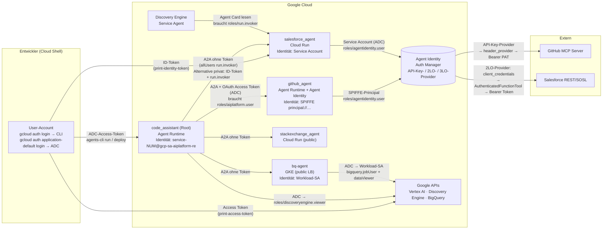
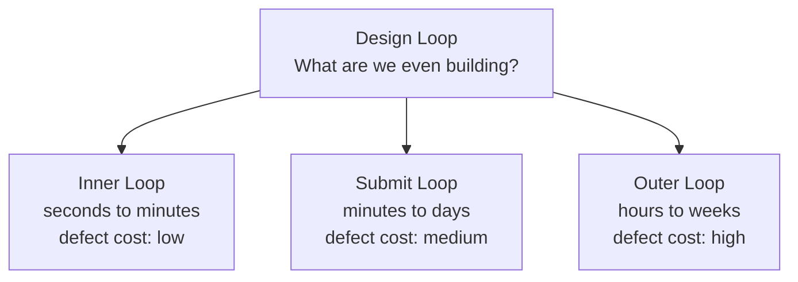
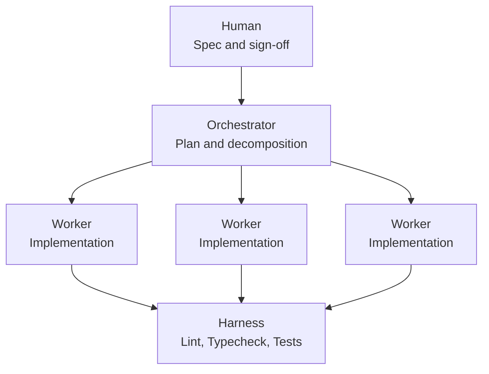

# AI for Software Engineering

**Learning agenda.** From AI engineer to AI-augmented software engineer: twelve modules from the development loop to impact measurement.

> **"Verification beats model size."**
> It is not the model that guarantees good code, but the harness around it: linters, type checkers, tests, hooks, CI, review gates, feature flags, monitoring. That harness is classic software engineering. The gap this agenda closes is not "AI"; it is "engineering."

*Compiled with Claude, August 2026. Converted to Markdown and annotated September 2026. Passages marked `> **Update**` were added during conversion and are not part of the original document.*

---

## Security: Authorization and Authentification

- [0. Das mentale Modell: drei Fragen, immer dieselben](#0.-Das-mentale-Modell:-drei-Fragen,-immer-dieselben)

## AI for Software Engineering (SDLC)

**Phase 0: The map**
- [Module 0 · The development loop as a mental frame](#module-0--the-development-loop-as-a-mental-frame)

**Phase 1: The craft**
- [Module 1 · Version control as a thinking tool](#module-1--version-control-as-a-thinking-tool)
- [Module 2 · The inner loop: static analysis & hooks](#module-2--the-inner-loop-static-analysis--hooks)
- [Module 3 · Testing: the language in which you talk to agents about "done"](#module-3--testing-the-language-in-which-you-talk-to-agents-about-done)
- [Module 4 · Code design & architecture](#module-4--code-design--architecture)

**Phase 2: From repo to production**
- [Module 5 · CI/CD & quality gates](#module-5--cicd--quality-gates)
- [Module 6 · Release engineering](#module-6--release-engineering)
- [Module 7 · Observability & operations](#module-7--observability--operations)

**Phase 3: Building AI in, systematically**
- [Module 8 · Context engineering & spec-driven development](#module-8--context-engineering--spec-driven-development)
- [Module 9 · Building the agent harness](#module-9--building-the-agent-harness)
- [Module 10 · Reviewing AI code critically: security & verification debt](#module-10--reviewing-ai-code-critically-security--verification-debt)
- [Module 11 · Scaling in the team & measuring impact](#module-11--scaling-in-the-team--measuring-impact)

**Closing**
- [Capstone · One feature from spec to production](#capstone--one-feature-from-spec-to-production)
- [Editor's notes: corrections and additions](#editors-notes-corrections-and-additions)

---

<br>

# Security: Authorization and Authentification

*Lernmodul auf Basis der L400-Labs „Build Enterprise Agents“ (APEX012), „Agent Identity Foundations“ (APEX013) und „Observe and Secure a Multi-Agent System“ (APEX014) sowie der Gemini-Chats dazu.*

---

## 0. Das mentale Modell: drei Fragen, immer dieselben

Jede Auth-Situation im Kurs – egal ob Entwickler → GCP, Agent → Agent, Agent → MCP-Server oder Agent → Salesforce – lässt sich auf drei Fragen reduzieren:

| Frage | Fachbegriff | Beispiele aus dem Kurs |
|---|---|---|
| **Wer bin ich?** | *Principal / Identität* | dein User-Account, ein Service Account, ein Google-verwalteter *Service Agent*, eine SPIFFE-Agent-Identity |
| **Wie beweise ich das?** | *Credential / Token* | OAuth-Access-Token, OIDC-ID-Token, API-Key/PAT, OAuth-Client-Credentials |
| **Was darf ich?** | *Autorisierung (IAM)* | `roles/aiplatform.user`, `roles/run.invoker`, `roles/agentidentity.user`, `roles/bigquery.dataViewer` |

Zwei Sätze, die du dir merken solltest:

> **Authentifizierung beweist, wer du bist. Autorisierung entscheidet, was du aufrufen darfst.**
> Fehlt das Token → **401 Unauthorized**. Token gültig, aber keine IAM-Berechtigung → **403 Permission Denied**.

Diese 401/403-Unterscheidung taucht im Kurs mehrfach auf (Root-Agent → GitHub-Agent, Datastore-Import, Auth-Manager) und ist ein sehr zuverlässiges Diagnosewerkzeug.



---

## 1. Die Credential-Typen im Überblick

### 1.1 Tabelle

| Typ | Aussehen | Beweist… | Für wen ausgestellt / Empfänger | Lebensdauer | Im Kurs verwendet für |
|---|---|---|---|---|---|
| **OAuth 2.0 Access Token** | `ya29.a0Af…` (opak, kein JWT) | „Der Inhaber darf in *diesen Scopes* handeln“ | Google APIs (`aiplatform`, `discoveryengine`, `apphub`, …) | ~1 h | curl gegen Google APIs, A2A-Aufruf eines Agent-Runtime-Agents |
| **OIDC Identity Token (ID-Token)** | `eyJhbGciOi…` (signiertes JWT mit `iss`, `sub`, `aud`, `exp`) | „Ich bin Identität X, und dieses Token ist für Empfänger `aud` gedacht“ | *ein bestimmter* Empfänger (Audience = Service-URL) | ~1 h | private Cloud-Run-Dienste, IAP, Agent-Card-Abruf beim Registrieren |
| **API-Key / Personal Access Token** | `ghp_…` (GitHub), beliebiger String | nichts über *wen* – nur „wer den Key hat, darf“ | ein Dienst (GitHub MCP) | bis zur Rotation | GitHub MCP Server |
| **OAuth Client Credentials (2LO)** | `client_id` + `client_secret` → Token-Endpoint → Access Token | „Diese *App* handelt als sie selbst“ (kein Endnutzer) | Salesforce REST/SOSL | Token ~ Stunden, Secret bis Rotation | Salesforce-Agent |
| **OAuth Authorization Code (3LO)** | User-Consent im Browser → `code` → Access + Refresh Token | „Diese App handelt *im Namen eines Nutzers*“ | z. B. Jira, GitHub-User-Repos | Refresh Token lange | `gcloud auth login`, Antigravity-CLI-Login, 3LO-Auth-Provider |
| **SPIFFE-Identität** | `principal://agents.global.org-ORG.system.id.goog/resources/aiplatform/…/reasoningEngines/ID` | „Ich bin *dieser* deployte Agent“ (X.509/SVID, mTLS) | Agent Identity Auth Manager, Agent Gateway | verwaltet | GitHub-Agent auf Agent Runtime mit Agent Identity |

### 1.2 Was „Bearer“ eigentlich bedeutet

`Authorization: Bearer <token>` heißt wörtlich: *„Der Überbringer dieses Tokens ist berechtigt.“* Das Token ist wie ein Konzertticket – niemand prüft, ob **du** es gekauft hast. Deshalb:

- Access Tokens sind **kurzlebig** (~1 h) und werden nur über TLS übertragen.
- ID-Tokens haben eine **Audience** – ein Token für `https://salesforce-agent-xyz.run.app` kann nicht bei einem anderen Dienst „wiederverwendet“ werden.
- Für die härteste Stufe gibt es **DPoP** (Demonstrating Proof of Possession, RFC 9449): Der Client signiert jede Anfrage zusätzlich mit einem privaten Schlüssel, sodass ein gestohlenes Token allein wertlos ist. Genau das nutzt Agent Gateway („mutual TLS and DPoP for end-to-end proof“).

### 1.3 Access Token vs. ID Token – der häufigste Verwechslungsfehler

```bash
# OAuth2 ACCESS Token: für Google-APIs (Autorisierung über Scopes)
gcloud auth print-access-token
# → ya29.a0AfB_...

# OIDC IDENTITY Token: für Dienste, die *deine Identität* prüfen (Cloud Run private, IAP)
gcloud auth print-identity-token
# → eyJhbGciOiJSUzI1NiIs...   (JWT; dekodierbar auf jwt.io: iss, sub, email, aud, exp)
```

Im Lab „Observe and Secure“ siehst du beide direkt nebeneinander:

```bash
# Google-API (Vertex AI) → ACCESS Token
curl -s -H "Authorization: Bearer $(gcloud auth print-access-token)" \
  "https://${LOCATION}-aiplatform.googleapis.com/v1/projects/${PROJECT_ID}/locations/${LOCATION}/reasoningEngines"

# Cloud-Run-Dienst (Agent Card abrufen) → IDENTITY Token
export TOKEN=$(gcloud auth print-identity-token)
curl -s -H "Authorization: Bearer ${TOKEN}" \
  "${SF_URL}/a2a/app/.well-known/agent-card.json" -o salesforce_card.json
```

Merkregel: **Google-API → Access Token. Cloud Run / IAP → ID-Token.** Ein Access Token an einen privaten Cloud-Run-Dienst ergibt 401, ein ID-Token an eine Google-API ergibt 401.

---

## 2. Entwickler → GCP: `gcloud auth login` vs. Application Default Credentials (ADC)

### 2.1 Zwei getrennte Credential-Speicher

Das ist die Stolperfalle Nr. 1 in allen Labs („Deploy failing with an auth error?“):

| Befehl | Wofür | Wo gespeichert |
|---|---|---|
| `gcloud auth login` | **nur die CLI** (`gcloud`, `gsutil`, `bq`) | gcloud-Credential-Store (`~/.config/gcloud/credentials.db`) |
| `gcloud auth application-default login` | **Client-Bibliotheken** (google-auth in Python, agents-cli, ADK, Vertex-SDK) | `~/.config/gcloud/application_default_credentials.json` |

Der Lab-Text sagt es wörtlich: *„`gcloud auth login` only authenticates the CLI, but the agents-cli deploys use Python client libraries, which need ADC.“* Fehlermeldung, wenn ADC fehlt/abgelaufen ist: **`service account info is missing 'email' field`** → `gcloud auth application-default login`. Fehlermeldung, wenn die CLI-Creds fehlen: *„no active account“* / reauthentication → `gcloud auth login`.

### 2.2 Die ADC-Auflösungskette (warum derselbe Code lokal *und* deployed läuft)

`google.auth.default()` sucht in dieser Reihenfolge:

1. Umgebungsvariable `GOOGLE_APPLICATION_CREDENTIALS` (Pfad zu einer Service-Account-Keydatei – im Kurs bewusst **nicht** verwendet: „no key files“)
2. Die ADC-Datei aus `gcloud auth application-default login` → **deine User-Identität** (lokal, Cloud Shell)
3. Der **Metadata-Server** der Laufzeitumgebung → die **angehängte Service-Account-Identität** (Cloud Run, GKE, Compute Engine, Agent Runtime)

Deshalb steht im Lab: *„Inside a deployed agent, ADC provides that token as the agent's runtime service account automatically. Locally, ADC resolves to your user credentials. The same code works in both places.“* – und deshalb funktioniert im Playground (Task 5) alles mit deinen Rechten, während nach dem Deploy (Task 6) plötzlich 403 kommt: **die Identität hat gewechselt, die IAM-Grants nicht.**

```python
import google.auth
from google.auth.transport.requests import Request

# Gibt lokal deine User-Creds zurück, in Cloud Run die des Service Accounts.
creds, project_id = google.auth.default(
    scopes=["https://www.googleapis.com/auth/cloud-platform"]
)
creds.refresh(Request())        # holt bzw. erneuert ein Access Token
print(creds.token[:12], "…", project_id)   # ya29.… qwiklabs-gcp-…
```

### 2.3 Quota-Projekt: `X-Goog-User-Project`

Wenn du mit **User-Credentials** eine API aufrufst, weiß Google nicht automatisch, welchem Projekt die Quota belastet werden soll. Deshalb der Header im Lab:

```bash
curl -X POST \
  -H "Authorization: Bearer $(gcloud auth print-access-token)" \
  -H "X-Goog-User-Project: ${PROJECT_ID}" \
  "https://discoveryengine.googleapis.com/v1/projects/${PROJECT_ID}/…/dataStores?dataStoreId=code-manuals-datastore"
```

Für Client-Bibliotheken setzt man das einmalig: `gcloud auth application-default set-quota-project $PROJECT_ID`. Service Accounts brauchen das nicht – ihr Projekt ist implizit.

### 2.4 Gemini-Aufrufe: Vertex AI vs. Developer API

In jeder `.env` des Kurses steht:

```bash
GOOGLE_GENAI_USE_VERTEXAI=True     # Gemini über Vertex AI → Auth per ADC/IAM, kein API-Key
GOOGLE_CLOUD_PROJECT=…
GOOGLE_CLOUD_LOCATION=global
```

Alternative (nicht im Kurs): `GOOGLE_GENAI_USE_VERTEXAI=False` + `GOOGLE_API_KEY=…` → Gemini Developer API mit API-Key. Enterprise-Agenten laufen über Vertex AI, weil dann IAM, Audit-Logs und VPC-SC greifen.

### 2.5 Sonderfall: Antigravity-CLI-Login

`agy` → „Use a Google Cloud project“ → Link im Browser öffnen → Authorization Code kopieren und in das Terminal einfügen. Das ist der klassische **OAuth Authorization-Code-Flow für „installed apps“** (gleiches Prinzip wie `gcloud auth login --no-launch-browser`): Browser-Consent → einmaliger Code → CLI tauscht ihn gegen Access-/Refresh-Token.

---

## 3. Welche Identität hat ein Agent? – abhängig von der Runtime

Das ist laut Lab „the single most important idea“: **Die Runtime bestimmt, als wer der Agent auftritt – und damit, wem du IAM-Rechte gibst.**

| Runtime | Identität des Agents (Principal) | IAM-Member-String | Beispiel aus dem Kurs |
|---|---|---|---|
| **Lokal / Cloud Shell** (`agents-cli playground`, `adk web`) | dein User-Account via ADC | `user:student@qwiklabs.net` | Playground-Test in Task 5 |
| **Agent Runtime** (Standard) | Reasoning-Engine-*Service Agent* des Projekts | `serviceAccount:service-PROJECT_NUMBER@gcp-sa-aiplatform-re.iam.gserviceaccount.com` | Root-Agent `code_assistant`, `github_agent` in Lab 1 |
| **Agent Runtime mit Agent Identity** | dedizierter **SPIFFE-Principal** pro Agent | `principal://agents.global.org-ORG_ID.system.id.goog/resources/aiplatform/projects/PROJECT_NUMBER/locations/REGION/reasoningEngines/ENGINE_ID` | `github_agent` in Lab 2 |
| **Cloud Run** | der dem Dienst angehängte Service Account (Default: Compute-SA) | `serviceAccount:PROJECT_NUMBER-compute@developer.gserviceaccount.com` | `salesforce_agent`, `stackexchange_agent` |
| **GKE** (Workload Identity) | der dem Pod zugeordnete Kubernetes-SA ↔ Google-SA | `serviceAccount:bq-agent-app@PROJECT_ID.iam.gserviceaccount.com` | `bq-agent` |

### 3.1 Service Account vs. Service Agent

- **Service Account** (SA): legst du selbst an, hängst ihn an Cloud Run/GKE an, gibst ihm Rollen. Kein Key nötig – die Runtime liefert Tokens über den Metadata-Server.
- **Service Agent**: von Google verwaltet, wird pro Dienst und Projekt automatisch erzeugt (Muster `service-PROJECT_NUMBER@gcp-sa-<dienst>.iam.gserviceaccount.com`). Manchmal existiert er in neuen Projekten noch nicht – dann:

```bash
# Reasoning-Engine-Service-Agent (Agent Runtime) provisionieren
gcloud beta services identity create --service=aiplatform.googleapis.com --project=${PROJECT_ID}

# Discovery-Engine-Service-Agent (Agent Registry / Gemini Enterprise) provisionieren
gcloud beta services identity create --service=discoveryengine.googleapis.com --project=${PROJECT_ID}
```

### 3.2 Die Identität eines laufenden Dienstes auslesen

```bash
# Cloud Run: welcher SA hängt am Dienst?
export SF_SA=$(gcloud run services describe salesforce-agent --region ${REGION} \
  --format='value(spec.template.spec.serviceAccountName)')

# Welche Rollen hat ein Principal im Projekt?
gcloud projects get-iam-policy ${PROJECT_ID} \
  --flatten="bindings[].members" \
  --filter="bindings.members:serviceAccount:${SF_SA}" \
  --format="value(bindings.role)"
```

### 3.3 IAM-Member-Präfixe (Gemini hat dich im Chat extra darauf hingewiesen)

| Präfix | Bedeutung |
|---|---|
| `user:` | Google-Konto einer Person |
| `serviceAccount:` | Service Account **oder** Service Agent |
| `principal://` | Workload-Identity- / SPIFFE-Principal (Agent Identity) |
| `group:`, `domain:` | Gruppen / Workspace-Domain |
| `allUsers` | jeder im Internet, auch ohne Login (→ „public“) |
| `allAuthenticatedUsers` | jeder mit *irgendeinem* Google-Konto |

---

## 4. Agent → Agent über A2A: gleiches Protokoll, andere Credentials je Ziel

Jeder A2A-Aufruf hat zwei Schritte: **(1) Agent Card auflösen** (`/.well-known/agent-card.json` oder `/a2a/app/.well-known/agent-card.json`), **(2) JSON-RPC-Message senden**. Welches Credential der Aufrufer mitschicken muss, hängt vom **Ziel** ab:

| Ziel-Runtime | Auth-Anforderung | Credential des Aufrufers | Nötige Rolle für den Aufrufer |
|---|---|---|---|
| **Agent Runtime** (github_agent, root) | *immer* authentifiziert | Google OAuth **Access Token** (via ADC) | `roles/aiplatform.user` (enthält `aiplatform.reasoningEngines.query`) |
| **Cloud Run public** (stackexchange, salesforce im Kurs) | keine | keins | `allUsers` hat `roles/run.invoker` |
| **Cloud Run private** (Produktions-Alternative) | Google-Identität | **ID-Token** mit `aud = Service-URL` | `roles/run.invoker` für den Aufrufer-SA |
| **GKE public LoadBalancer** (bq-agent) | keine | keins | – |
| **Agent Gateway / Agent Identity mode** (Produktions-Fleet) | SPIFFE X.509 + mTLS + DPoP | Agent-Identität | `roles/iap.egressor` auf dem Ziel im Agent Registry, optional CEL-Bedingungen |

### 4.1 Ziel Agent Runtime: ADC-Access-Token in den httpx-Client hängen

Das ist genau die `auth.py`-TODO aus Lab 1. `before_request()` erneuert das Token bei Bedarf **und** schreibt den `Authorization`-Header:

```python
# app/auth.py – Root-Agent authentifiziert sich gegenüber Agent Runtime
import httpx
import google.auth
from google.auth.transport.requests import Request

_SCOPES = ["https://www.googleapis.com/auth/cloud-platform"]


class GoogleADCAuth(httpx.Auth):
    """httpx-Auth-Hook: hängt an jede Anfrage das ADC-OAuth2-Access-Token."""

    def __init__(self) -> None:
        self._creds, _ = google.auth.default(scopes=_SCOPES)
        self._request = Request()

    def _apply(self, headers: dict[str, str], method: str, url: str) -> None:
        # Refresht die Credentials falls abgelaufen und setzt
        # headers["Authorization"] = "Bearer ya29...."
        self._creds.before_request(self._request, method, url, headers)

    def sync_auth_flow(self, request: httpx.Request):
        headers = dict(request.headers)
        self._apply(headers, request.method, str(request.url))
        request.headers.update(headers)
        yield request

    async def async_auth_flow(self, request: httpx.Request):
        headers = dict(request.headers)
        self._apply(headers, request.method, str(request.url))
        request.headers.update(headers)
        yield request


def google_authed_client() -> httpx.AsyncClient:
    return httpx.AsyncClient(auth=GoogleADCAuth(), timeout=120.0)
```

Und die Verwendung im Root-Agent (`agent.py`):

```python
from google.adk.agents.remote_a2a_agent import RemoteA2aAgent

# Ziel läuft auf Agent Runtime → Access Token nötig, ADK-A2A-Extension erlaubt
github_agent = RemoteA2aAgent(
    name="github_agent",
    description="GitHub specialist (repos, issues, PRs) via MCP",
    agent_card=GITHUB_AGENT_URL,
    httpx_client=google_authed_client(),      # ← Credential
    use_legacy=False,                         # ← ADK-Extension (nur ADK↔ADK)
    after_agent_callback=capture_response_to_state("github_findings"),
)

# Ziel ist ein public Cloud-Run-Dienst (LangGraph, a2a-sdk) → kein Token, Standard-A2A
stackexchange_agent = CleanQueryRemoteA2aAgent(
    name="stackexchange_agent",
    description="Stack Exchange search",
    agent_card=STACKEXCHANGE_AGENT_URL,       # kein httpx_client → unauthenticated
    after_agent_callback=capture_response_to_state("stackexchange_findings"),
)
```

Dann die **Autorisierung** – nach dem Deploy ruft der Root als Service Agent auf, nicht als du:

```bash
export PROJECT_NUMBER=$(gcloud projects describe ${PROJECT_ID} --format='value(projectNumber)')
RE_SA="service-${PROJECT_NUMBER}@gcp-sa-aiplatform-re.iam.gserviceaccount.com"

gcloud projects add-iam-policy-binding ${PROJECT_ID} \
  --member="serviceAccount:${RE_SA}" --role="roles/aiplatform.user"        # GitHub-Agent aufrufen, Skill laden
gcloud projects add-iam-policy-binding ${PROJECT_ID} \
  --member="serviceAccount:${RE_SA}" --role="roles/discoveryengine.viewer" # Datastore abfragen
```

### 4.2 Ziel Cloud Run: public vs. private

```bash
# Variante "public" (im Kurs): jeder darf aufrufen → Root braucht kein Token
gcloud run deploy stackexchange-agent --image … --allow-unauthenticated
# oder nachträglich:
gcloud run services add-iam-policy-binding salesforce-agent \
  --region=${REGION} --member=allUsers --role=roles/run.invoker
# Achtung (Lab-Hinweis): ein Redeploy mit agents-cli setzt die IAM-Policy zurück → Grant wiederholen.

# Variante "private" (Produktion): nur bestimmte Principals
gcloud run services add-iam-policy-binding salesforce-agent \
  --region=${REGION} \
  --member="serviceAccount:service-${PROJECT_NUMBER}@gcp-sa-aiplatform-re.iam.gserviceaccount.com" \
  --role=roles/run.invoker
```

Bei einem privaten Dienst muss der Aufrufer ein **ID-Token mit passender Audience** senden. Auf einer Google-Runtime (SA-Identität) geht das so:

```python
import google.auth.transport.requests
import google.oauth2.id_token

audience = "https://salesforce-agent-abc123-uc.a.run.app"   # exakt die Service-URL
id_token = google.oauth2.id_token.fetch_id_token(
    google.auth.transport.requests.Request(), audience
)
headers = {"Authorization": f"Bearer {id_token}"}
```

Lokal mit User-Credentials nimmst du stattdessen `gcloud auth print-identity-token` (Cloud Run akzeptiert das gcloud-User-ID-Token für Tests). Hinweis aus Lab 2: **IAP** vor einem Cloud-Run-Dienst blockiert dieses ID-Token („puts a Google sign-in in front of the service“) → für `agents-cli run` musste IAP mit `--no-iap` abgeschaltet werden.

### 4.3 Identity Propagation ≠ Authentifizierung: die `user_id`-Weitergabe

Ein unauthentifizierter A2A-Call transportiert **keine Nutzeridentität**. Damit Memory Bank pro Nutzer funktioniert, schickt der Root die `user_id` explizit als A2A-Metadaten mit, und der Spezialist liest sie aus:

```python
# Root (code-assistant/app/app_utils/a2a.py)
def user_id_meta_provider(ctx) -> dict:
    return {"user_id": ctx.user_id}     # wird in die A2A-Message-Metadaten geschrieben

# Spezialist (salesforce-agent/app/app_utils/a2a.py)
def _user_scoped_request_converter(request, part_converter):
    run_request = convert_a2a_request_to_agent_run_request(request, part_converter)
    # user_id aus den Metadaten übernehmen, sonst Fallback A2A_USER_{context_id}
    …
    return run_request
```

Wichtig für dein Verständnis: Das ist **Vertrauen, kein Beweis**. Der Spezialist glaubt dem Root die `user_id`. In einer echten Zero-Trust-Architektur würdest du das über ein signiertes ID-Token / Agent Gateway absichern.

### 4.4 Agent Gateway: die „schwere“ Produktionsvariante

Das Lab beschreibt sie nur konzeptionell:

- Jeder Agent erhält eine **SPIFFE-X.509-Identität**; Verbindungen laufen über **mutual TLS**, Anfragen tragen **DPoP**-Beweise.
- **Source-Agents sind Principals, Target-Services sind Agent-Registry-Ressourcen.**
- Eine Allow-Policy gibt `roles/iap.egressor` auf dem Ziel, optional eingeschränkt mit **CEL-Bedingungen** (z. B. nur bestimmte Skills, nur bestimmte Zeiten).
- Das Gateway prüft *vor* dem Ziel: „Darf Agent A überhaupt mit Agent B reden?“ – das ist die Fleet-Governance-Ebene, die das einfache Service-Account-Modell nicht hat.

---

## 5. Agent → externe Tools, Variante A: Secrets im Agent (Lab 1, „so nicht in Produktion“)

### 5.1 GitHub: Personal Access Token als Bearer-Header an den MCP-Server

Der GitHub-MCP-Server (`https://api.githubcopilot.com/mcp/`) erwartet auf **jedem** Tool-Call einen Bearer-Header. Ein *classic* PAT mit den Scopes `repo` und `read:org` reicht, weil nur Lese-Tools genutzt werden.

```python
# github-agent/app/agent.py (Lab 1)
from google.adk.tools.mcp_tool import McpToolset, StreamableHTTPConnectionParams

GITHUB_TOKEN = os.environ["GITHUB_PERSONAL_ACCESS_TOKEN"]   # ← Secret in .env
GITHUB_TOOL_FILTER = ["search_repositories", "search_issues", "list_issues"]

github_mcp_toolset = McpToolset(
    connection_params=StreamableHTTPConnectionParams(
        url=GITHUB_MCP_URL,
        headers={"Authorization": f"Bearer {GITHUB_TOKEN}"},   # ← hart verdrahtet
    ),
    tool_filter=GITHUB_TOOL_FILTER,   # Least Privilege auch auf Tool-Ebene
)
```

Der Lab-Text weist selbst darauf hin: GitHub Apps oder OAuth 2.0 wären sicherer als ein PAT.

### 5.2 Salesforce: OAuth 2.0 Client-Credentials-Flow (2-legged, app-only)

**Setup auf Salesforce-Seite** (External Client App – ersetzt die klassische Connected App):

1. App Manager → *New External Client App* → **Enable OAuth**
2. Callback URL `https://login.salesforce.com/services/oauth2/callback` (wird bei 2LO nicht benutzt, ist aber Pflichtfeld)
3. Scopes: *Manage user data via APIs (api)* und *Perform requests at any time (refresh_token, offline_access)*
4. Flow Enablement: **Enable Client Credentials Flow**
5. In den *Policies*: erneut Client Credentials aktivieren, **Run-As User** setzen (die App handelt mit *dessen* Rechten!), IP Relaxation
6. Consumer Key (= `client_id`) und Consumer Secret (= `client_secret`) auslesen, dazu die **My Domain**-Host-URL

**Der Flow selbst** ist ein einziger POST:

```python
# salesforce-agent/app/salesforce_client.py (Lab 1) – authenticate()
def authenticate(self) -> tuple[str, str]:
    """Client-Credentials-Grant: App-Token ohne Endnutzer."""
    resp = requests.post(
        f"https://{self.domain}/services/oauth2/token",
        data={
            "grant_type": "client_credentials",
            "client_id": self.client_id,
            "client_secret": self.client_secret,
        },
        timeout=_TIMEOUT_SECONDS,
    )
    resp.raise_for_status()
    body = resp.json()
    # Salesforce liefert zusätzlich instance_url (REST-Basis) mit
    return body["access_token"], body["instance_url"]
```

Danach jede API-Anfrage mit `Authorization: Bearer <access_token>`. In `tools.py` wurde das Token im Session-State gecacht, bei Ablauf erneuert und bei `401` neu geholt – **alles Auth-Logik, die im Agent lebt**.

### 5.3 Warum Variante A ein Problem ist

- Das Secret reist mit dem Deployment (`--update-env-vars` liest die `.env` ein) → sichtbar für jeden, der die Konfiguration lesen darf.
- Rotation = jede `.env` editieren **und** jeden Agent neu deployen.
- Keine zentrale Kontrolle, *welcher* Agent *welches* Secret nutzen darf.

---

## 6. Agent → externe Tools, Variante B: Agent Identity Auth Manager (Lab 2)

### 6.1 Zwei Konzepte sauber trennen

| Konzept | Frage | Was es ist |
|---|---|---|
| **Agent Identity** | *Wer ist der Agent?* | Google-verwaltete Identität nach dem **SPIFFE**-Standard. Auf Agent Runtime ein dedizierter SPIFFE-Principal, auf Cloud Run der Service Account. Der Agent authentifiziert sich **als er selbst**, nicht mit einem geteilten Secret. |
| **Auth Manager** | *Was darf der Agent lesen?* | Ein Google-verwalteter Credential-Tresor. Du legst pro externem Dienst einen **Auth Provider** an (API-Key, 2LO, 3LO). Zugriff auf jeden Provider ist per **IAM** geregelt. |

Zur Laufzeit treffen sich beide im ADK: Der Agent ruft ein Tool → ADK fragt den Auth Manager (mit der Agent-Identität) nach dem Credential → Auth Manager liefert es (und erneuert OAuth-Tokens selbst) → ADK hängt es an die Anfrage. **Dein Code sieht das Roh-Secret nie.**

### 6.2 Benötigte APIs und Rollen

```bash
gcloud services enable \
  iam.googleapis.com \
  agentidentity.googleapis.com \              # der Auth Manager
  agentidentitycredentials.googleapis.com \   # Credential-Ausgabe an Agent-Identitäten
  iamcredentials.googleapis.com \             # Token-Erzeugung
  sts.googleapis.com \                        # Security Token Service: SPIFFE → Google-Token-Exchange (Workload Identity Federation)
  aiplatform.googleapis.com
```

Rollen: **Admin** braucht `roles/agentidentity.admin` (Provider anlegen) + Project IAM Admin; **Agent** braucht `roles/agentidentity.user` **auf dem Auth Provider** und `roles/serviceusage.serviceUsageConsumer` im Projekt (um die API überhaupt aufrufen zu dürfen).

### 6.3 Die drei Provider-Typen anlegen

```bash
# (a) API-Key-Provider – statisches Token, kein Endnutzer (GitHub MCP)
read -rs GITHUB_PAT && echo        # Token nicht in der Shell-History
gcloud alpha agent-identity auth-providers create github-mcp-auth-provider \
  --project=${PROJECT_ID} --location=${LOCATION} \
  --api-key="${GITHUB_PAT}"

# (b) 2-legged-OAuth-Provider – Client-Credentials-Grant (Salesforce)
read -rs SF_CLIENT_SECRET && echo
gcloud alpha agent-identity auth-providers create salesforce-2lo-auth-provider \
  --project=${PROJECT_ID} --location=${LOCATION} \
  --two-legged-oauth-client-id="${SF_CLIENT_ID}" \
  --two-legged-oauth-client-secret="${SF_CLIENT_SECRET}" \
  --two-legged-oauth-token-url="https://${SF_DOMAIN}/services/oauth2/token"
  # (ältere `connectors create`-Variante hieß --two-legged-oauth-token-endpoint)

# (c) 3-legged-OAuth-Provider – user-delegiert, mit Consent (nicht im Lab, zur Vollständigkeit)
gcloud alpha agent-identity auth-providers create jira-3lo-auth-provider \
  --project=${PROJECT_ID} --location=${LOCATION} \
  --three-legged-oauth-client-id="…" \
  --three-legged-oauth-client-secret="…" \
  --three-legged-oauth-authorization-url="https://auth.atlassian.com/authorize" \
  --three-legged-oauth-token-url="https://auth.atlassian.com/oauth/token" \
  --three-legged-oauth-enable-pkce

gcloud alpha agent-identity auth-providers list --project=${PROJECT_ID} --location=${LOCATION}
# → state: ENABLED

export GITHUB_AUTH_PROVIDER_URI="projects/${PROJECT_ID}/locations/${LOCATION}/authProviders/github-mcp-auth-provider"
```

Entscheidungsregel: **API-Key**, wenn der Dienst nur ein statisches Token kennt. **2LO**, wenn die App als sie selbst handelt (kein Nutzer). **3LO**, wenn der Agent *im Namen eines Nutzers* handeln soll (dessen Jira-Tickets, dessen Repos).

### 6.4 Zugriff gewähren – je Runtime ein anderer Member-String

```bash
# Agent Runtime mit Agent Identity → SPIFFE-Principal
export GITHUB_AGENT_IDENTITY="principal://agents.global.org-${ORGANIZATION_ID}.system.id.goog/resources/aiplatform/projects/${PROJECT_NUMBER}/locations/${REGION}/reasoningEngines/${GITHUB_ENGINE_ID}"
gcloud alpha agent-identity auth-providers add-iam-policy-binding github-mcp-auth-provider \
  --project=${PROJECT_ID} --location=${LOCATION} \
  --role="roles/agentidentity.user" \
  --member="${GITHUB_AGENT_IDENTITY}"

# Cloud Run → Service Account
gcloud alpha agent-identity auth-providers add-iam-policy-binding salesforce-2lo-auth-provider \
  --project=${PROJECT_ID} --location=${LOCATION} \
  --role="roles/agentidentity.user" \
  --member="serviceAccount:${SF_SA}"

# Lokale Entwicklung → dein User
gcloud alpha agent-identity auth-providers add-iam-policy-binding salesforce-2lo-auth-provider \
  --project=${PROJECT_ID} --location=${LOCATION} \
  --role="roles/agentidentity.user" \
  --member="user:${EMAIL_ADDRESS}"
```

Gleiche Rolle, drei Member-Formen – das ist die Kernaussage von Lab 2.

### 6.5 ADK-Code, Zustellweg 1: **MCP-Tool → Header** (GitHub)

Bei einem entfernten MCP-Server bekommt dein Code das Credential *nicht* als Funktionsargument – du musst die ausgehende Anfrage abfangen und den Header selbst setzen. Drei Bausteine:

```python
# github-agent/agent/agent.py (Lab 2, TODOs gelöst)
from google.adk.auth.credential_manager import CredentialManager
from google.adk.integrations.agent_identity import GcpAuthProvider, GcpAuthProviderScheme
from google.adk.tools.mcp_tool import McpToolset, StreamableHTTPConnectionParams

GITHUB_AUTH_PROVIDER_URI = os.environ["GITHUB_AUTH_PROVIDER_URI"]
GITHUB_TOOL_FILTER = ["search_repositories", "search_issues", "list_issues"]

# TODO 1 – einmalig beim Import: ADK lernt, wie es mit dem Auth Manager spricht
CredentialManager.register_auth_provider(GcpAuthProvider())

# TODO 2 – *welcher* Provider soll vor dem Tool-Call aufgelöst werden?
github_auth_scheme = GcpAuthProviderScheme(name=GITHUB_AUTH_PROVIDER_URI)


def github_mcp_toolset() -> McpToolset:
    toolset = None

    def github_header_provider(readonly_ctx) -> dict[str, str]:
        """Brücke: aufgelöstes Credential → Authorization-Header (kurz vor jedem MCP-Request)."""
        if not toolset or not toolset.get_auth_config():
            return {}
        auth_config = toolset.get_auth_config()
        cred = None
        if readonly_ctx and hasattr(readonly_ctx, "get_credential"):
            cred = readonly_ctx.get_credential(auth_config.credential_key)
        if not cred:
            cred = auth_config.exchanged_auth_credential
        if not cred or not cred.http:
            return {}
        token = None
        if cred.http.credentials and cred.http.credentials.token:
            token = cred.http.credentials.token
        elif cred.http.additional_headers:
            token = (cred.http.additional_headers.get("X-API-Key")
                     or cred.http.additional_headers.get("X-GOOG-API-KEY"))
        return {"Authorization": f"Bearer {token}"} if token else {}

    # TODO 3 – Toolset ohne PAT, ohne hart verdrahteten Header
    toolset = McpToolset(
        connection_params=StreamableHTTPConnectionParams(url=GITHUB_MCP_URL),
        auth_scheme=github_auth_scheme,
        tool_filter=GITHUB_TOOL_FILTER,
        header_provider=github_header_provider,
    )
    return toolset
```

Ablauf pro Tool-Call: ADK sieht `auth_scheme` → tauscht die Agent-Identität beim Auth Manager gegen den API-Key → legt ihn in `toolset.auth_config` → ruft `header_provider` → MCP-Server erhält einen ganz normalen Bearer-Header.

### 6.6 ADK-Code, Zustellweg 2: **Function-Tool → injiziertes Argument** (Salesforce)

Bei einer eigenen Python-Funktion kann das ADK das Credential **direkt als Parameter** übergeben – keine Header-Klempnerei:

```python
# salesforce-agent/app/tools.py (Lab 2, TODOs gelöst)
from google.adk.auth.auth_credential import AuthCredential
from google.adk.auth.auth_tool import AuthConfig
from google.adk.auth.credential_manager import CredentialManager
from google.adk.integrations.agent_identity import GcpAuthProvider, GcpAuthProviderScheme
from google.adk.tools.authenticated_function_tool import AuthenticatedFunctionTool

SALESFORCE_AUTH_PROVIDER_URI = os.environ["SALESFORCE_AUTH_PROVIDER_URI"]

# TODO 1 – Provider registrieren + AuthConfig, die den 2LO-Provider benennt (kein Scope bei Salesforce)
CredentialManager.register_auth_provider(GcpAuthProvider())
salesforce_auth_config = AuthConfig(
    auth_scheme=GcpAuthProviderScheme(name=SALESFORCE_AUTH_PROVIDER_URI)
)


def _extract_token(credential: AuthCredential) -> str | None:
    """Holt das Access Token aus dem vom Auth Manager aufgelösten Credential."""
    if not credential:
        return None
    if credential.oauth2 and credential.oauth2.access_token:        # ← 2LO-Fall
        return credential.oauth2.access_token
    if credential.http and credential.http.credentials and credential.http.credentials.token:
        return credential.http.credentials.token
    if credential.http and credential.http.additional_headers:
        h = credential.http.additional_headers
        return (h.get("X-API-Key") or h.get("X-GOOG-API-KEY")
                or h.get("Authorization", "").replace("Bearer ", "") or None)
    return None


def build_search_salesforce(client: SalesforceClient):
    # TODO 2 – `credential` als Parameter: das Modell sieht nur `query`, ADK injiziert `credential`
    def search_salesforce(query: str, credential: AuthCredential) -> dict:
        """Searches the company's Salesforce document library (Files)."""
        access_token = _extract_token(credential)
        if not access_token:
            return {"status": "error",
                    "error_message": "Salesforce auth failed: no token from Auth Manager."}
        try:
            documents = client.search_files(access_token, query)
        except Exception as e:
            return {"status": "error", "error_message": f"Salesforce search failed: {e}"}
        return {"status": "success", "query": query, "data": documents}

    # TODO 3 – Wrapper, der vor jedem Call den Provider auflöst und das Credential injiziert
    return AuthenticatedFunctionTool(func=search_salesforce, auth_config=salesforce_auth_config)
```

Und der Client verliert seine Auth-Logik komplett:

```python
class SalesforceClient:
    def __init__(self, domain: str, api_version: str | None = None):
        self.domain = domain.replace("https://", "").replace("http://", "").strip("/")
        self.api_version = api_version or _DEFAULT_API_VERSION
        # Auth Manager liefert nur das Token, nicht Salesforce' instance_url →
        # REST-Basis aus der My Domain ableiten
        self.instance_url = f"https://{self.domain}"

    def search_files(self, access_token: str, query: str) -> list:
        resp = requests.get(
            f"{self.instance_url}/services/data/{self.api_version}/search",
            headers={"Authorization": f"Bearer {access_token}"},
            params={"q": _build_sosl(query)},
            timeout=_TIMEOUT_SECONDS,
        )
        …
```

`.env` danach: `SALESFORCE_CLIENT_ID` und `SALESFORCE_CLIENT_SECRET` **gelöscht**, `SALESFORCE_DOMAIN` bleibt, `SALESFORCE_AUTH_PROVIDER_URI` kommt dazu. Dependencies: `google-adk[gcp,agent-identity]`.

### 6.7 Der vollständige Ablauf eines Salesforce-Tool-Calls (aus dem Lab, als Sequenz)

1. Import: `register_auth_provider(GcpAuthProvider())` + `salesforce_auth_config`
2. Modell ruft `search_salesforce(query="…")` – nur `query`
3. `AuthenticatedFunctionTool` fängt ab → ADK fragt Auth Manager, **authentifiziert als Cloud-Run-SA** (ADC → Metadata-Server)
4. Auth Manager führt den Client-Credentials-Grant gegen `https://<SF_DOMAIN>/services/oauth2/token` aus (bzw. liefert das gecachte, noch gültige Token) → `AuthCredential` mit `oauth2.access_token`
5. ADK injiziert `credential` in deine Funktion – **das Modell sieht das Token nie**
6. Deine Funktion ruft Salesforce mit `Authorization: Bearer …`

Vergleich der beiden Zustellwege: **Header für MCP-Tools, Argument für Function-Tools** – derselbe Provider-Mechanismus dahinter.

### 6.8 Deploy-Unterschiede

| | GitHub-Agent (Agent Runtime) | Salesforce-Agent (Cloud Run) |
|---|---|---|
| Identität aktivieren | `deploy_with_identity.sh` (zwei API-Calls: Engine mit Identität anlegen → SPIFFE-Principal provisionieren → dann Code deployen) | nichts extra – Cloud Run hat immer einen SA |
| Was das Deploy ausgibt | *Effective identity* (bare, ohne `principal://`) + Reasoning Engine ID | Service-URL + Service Account |
| IAM-Member | `principal://…` | `serviceAccount:…` |
| Test | `agents-cli run --url $GITHUB_AGENT_URL --mode a2a --app-name agent "…"` | `agents-cli run --url $SF_URL --mode a2a "…"` (IAP vorher aus) |

Hinweis aus dem Lab: `agents-cli deploy --agent-identity` scheiterte zum Lab-Zeitpunkt, weil Identitäts-Provisionierung und Code-Deploy in einem Request kombiniert wurden („failed to start and cannot serve traffic“) – daher das Skript mit zwei getrennten Requests.

### 6.9 Troubleshooting

| Symptom | Ursache | Fix |
|---|---|---|
| Agent antwortet leer, Log zeigt `CONNECTOR_AUTH_TOKEN_EXCHANGE_ERROR` | Auth Manager konnte den Grant gegen Salesforce nicht ausführen | Client-ID/Secret/Token-URL im Provider prüfen; Run-As-User darf die Files lesen? |
| 403 kurz nach dem IAM-Grant | IAM-Propagation (1–2 min) | warten, erneut |
| Agent kann Auth Manager gar nicht erreichen | SA fehlt `roles/serviceusage.serviceUsageConsumer` | Rolle im Projekt vergeben |
| Nach Entfernen des Bindings: Permission Error statt Daten | erwartet – beweist, dass das Secret nicht mehr im Agent liegt | – |

---

## 7. Plattform-Dienste, die *deine* Agenten aufrufen (Service Agents als Aufrufer)

Auth geht nicht nur *vom* Agent aus – auch Google-Dienste müssen sich bei deinen Agenten authentifizieren:

| Google-Dienst | Will was tun | Braucht |
|---|---|---|
| **Discovery Engine** (Agent Registry, Gemini Enterprise) | Agent Card des Cloud-Run-Agents lesen, um ihn zu registrieren | `roles/run.invoker` auf dem Cloud-Run-Dienst für `service-PROJECT_NUMBER@gcp-sa-discoveryengine.iam.gserviceaccount.com` |
| **Telemetry / Cloud Trace** | Traces *vom* Agent annehmen | der Cloud-Run-SA braucht `roles/telemetry.tracesWriter`; Agent-Runtime-Agents exportieren über eingebaute Telemetrie – kein Grant nötig |
| **Gemini Enterprise** | Endnutzer zum Agent lassen | Identity Provider konfigurieren (Google Identity), Nutzer erhält Rolle *Agent User* auf dem Agent |

```bash
gcloud run services add-iam-policy-binding salesforce-agent \
  --project=${PROJECT_ID} --region=${LOCATION} \
  --member="serviceAccount:service-${PROJECT_NUMBER}@gcp-sa-discoveryengine.iam.gserviceaccount.com" \
  --role="roles/run.invoker"

gcloud projects add-iam-policy-binding ${PROJECT_ID} \
  --member="serviceAccount:${PROJECT_NUMBER}-compute@developer.gserviceaccount.com" \
  --role="roles/telemetry.tracesWriter"
```

### 7.1 Least Privilege prüfen und reparieren (Lab 3)

```bash
# Über-Berechtigung simulieren
gcloud projects add-iam-policy-binding ${PROJECT_ID} --member="serviceAccount:${SF_SA}" --role="roles/editor" --condition=None
# Finden: SCC AI Protection → "Agents with excessive permissions"; Policy Analyzer (IAM & Admin) → Principal = SF_SA
# Reparieren
gcloud projects remove-iam-policy-binding ${PROJECT_ID} --member="serviceAccount:${SF_SA}" --role="roles/editor"
```

Was ein Cloud-Run-Agent im Kurs *wirklich* braucht: `roles/aiplatform.user`, `roles/telemetry.tracesWriter`, `roles/logging.logWriter`, `roles/cloudtrace.agent`. IAM Recommender schlägt in Produktion nach ~90 Tagen Nutzung engere Rollen vor; Policy Analyzer liest aus Cloud Asset Inventory (bis zu 1 min Verzögerung).

---

## 8. Fehlerbilder-Spickzettel

| Fehlermeldung / Symptom | Bedeutet | Fix |
|---|---|---|
| `service account info is missing 'email' field` | ADC fehlt oder abgelaufen | `gcloud auth application-default login` |
| „no active account“ / reauth prompt | gcloud-CLI-Creds fehlen | `gcloud auth login` |
| **401 Unauthorized** | kein/falsches Token (Access statt ID oder umgekehrt) | richtigen Token-Typ für das Ziel |
| **403 Permission Denied** | Token gültig, IAM-Grant fehlt (oft: lokal ging es, deployed nicht) | Rolle für die *Runtime-Identität* vergeben |
| 403 beim Datastore-Import direkt nach Anlage | Ressource noch nicht provisioniert | 10 s warten |
| `Service account service-…@gcp-sa-aiplatform-re… does not exist` | Service Agent noch nicht erzeugt | `gcloud beta services identity create --service=aiplatform.googleapis.com` |
| Cloud Run nach Redeploy wieder 403/401 | IAM-Policy wurde zurückgesetzt | `allUsers`/`run.invoker` erneut binden |
| `agents-cli run` erreicht Cloud Run nicht | IAP davor | `gcloud run services update … --no-iap` |
| `CONNECTOR_AUTH_TOKEN_EXCHANGE_ERROR` | 2LO-Grant beim Auth Manager fehlgeschlagen | Provider-Werte / Run-As-User prüfen |
| `Regional Access Boundary … Gaia id not found` (Cloud Shell) | kosmetisch bei Qwiklabs-Konten | ggf. ADC neu |

---

## 9. Glossar (kurz)

- **ADC** – Application Default Credentials; Auflösungskette, mit der Google-Client-Bibliotheken ohne Codeänderung lokal (User) und deployed (SA) Credentials finden.
- **Access Token** – opakes OAuth-2.0-Token mit Scopes für Google-APIs, ~1 h gültig.
- **ID-Token** – OIDC-JWT, beweist Identität gegenüber genau einer Audience.
- **Service Account / Service Agent** – von dir angelegte bzw. Google-verwaltete nicht-menschliche Identität.
- **SPIFFE / SVID** – Standard für Workload-Identitäten (X.509- oder JWT-SVIDs); Basis von Agent Identity.
- **STS / Workload Identity Federation** – Token-Exchange, mit dem eine externe/Workload-Identität gegen ein Google-Token getauscht wird (`sts.googleapis.com`).
- **2LO / 3LO** – 2-legged (Client Credentials, app-only) vs. 3-legged (Authorization Code, im Namen eines Nutzers) OAuth.
- **PAT** – Personal Access Token (GitHub); technisch ein statisches Bearer-Secret.
- **Auth Provider** – Ressource im Agent Identity Auth Manager, die ein API-Key-/2LO-/3LO-Credential kapselt; Zugriff per `roles/agentidentity.user`.
- **A2A** – Agent2Agent-Protokoll (Agent Card + JSON-RPC); Auth ist nicht Teil des Protokolls, sondern der Transportebene/des Ziels.
- **IAP** – Identity-Aware Proxy; setzt Google-Login vor einen Dienst.
- **DPoP** – Demonstrating Proof of Possession; bindet ein Token an einen Client-Schlüssel.


---

<br>

# AI for Software Engineering (SDLC)


# Phase 0 · The map

## Module 0 · The development loop as a mental frame

The shortest module of the agenda, but everything else hangs on it. Without this map, all the terms that follow are disconnected vocabulary.

### The four loops

Software development does not run linearly, but in four nested loops. Important: nested, not sequential. You go through the inner loop 30–50 times before you go through the submit loop once.

**Design loop** (Observe → Analyze → Design → Deliberate → Plan)
This is where it is decided *what* gets built at all. Observe means: collecting signals (bug reports, metrics, support tickets, user feedback). Analyze means: separating the real problem from the symptom. Design means: solution options with trade-offs. Deliberate means: validating the decision against other people (design review, RFC). Plan means: breaking it down into actionable pieces. Artifacts are design docs, RFCs, ADRs, tickets. Cycle time: hours to weeks.

**Inner loop** (Think → Code → Build → Test)
The loop where you feel you spend most of your time. Cycle time: seconds to minutes. The decisive quality attribute here is not correctness but **latency**. A build that takes 4 minutes destroys the loop, not because 4 minutes is a lot of time, but because you lose context during the wait and open Slack. (As an aside: "build" exists in Python too: resolving dependencies, building containers, compiling assets.)

**Submit loop** (Lint → PreSubmit → Code Review → Submit)
The transition from *my* code to *our* code. PreSubmit means the automated checks that must pass before the merge; in GitHub terms: required status checks on the PR. Cycle time: minutes to days, with review latency almost always being the bottleneck, not the machine.

A point that almost all career changers get wrong: the primary purpose of code review is **not** finding defects. Machines are better at that by now. It is about knowledge distribution in the team, design feedback, and shared ownership. Anyone who treats review as bug hunting conducts it badly.

**Outer loop** (Postsubmit → Staging → Canary → Production → Measure)
Postsubmit is the tests that run after the merge to `main`: too slow for the PR, but necessary. Then the deployment chain. Cycle time: hours to weeks. And **Measure closes the circle** back to Observe in the design loop. That is the actual reason this is drawn as loops and not as a pipeline.



*The four development loops and the cost of a defect depending on where it is caught. Every practice pulls one class of defects one stage to the left.*

### The fundamental law

The cost of a defect grows roughly exponentially with the distance between where it is introduced and where it is discovered. The old rule of thumb from the literature is "factor 10 per stage". Don't take it as a measurement, the empirical basis for it is thin. But as a mental model, the direction is undisputed:

- Type error in the editor: 2 seconds
- The same error in the PR: 20 minutes of rework plus a review round
- The same error in production: an incident, a rollback, a postmortem, lost trust

> **Update.** The "factor 10 per stage" figure is usually traced to Barry Boehm's 1981 work and to an IBM Systems Sciences Institute table that has never been located as a primary source. Laurent Bossavit's *The Leprechauns of Software Engineering* (2015) documents how thin the evidence is. The direction is robust, the multiplier is folklore.

From this follows the term you will encounter everywhere: **shift left**. Practically every engineering practice you will learn in the coming modules is an attempt to pull one class of defects one stage to the left. A type checker pulls runtime errors into the editor. A pre-commit hook pulls CI failures onto your machine. A canary pulls a production outage down to 1% of users. A feature flag decouples deployment from release so that a defect does not become visible at the same time.

The design loop sits above the diagram and not in the cost row because its defects work differently: they do not get more expensive over time; they **devalue everything below them from the start**. If you build the wrong thing, 100% of the implementation is waste, no matter how clean it was. ("Mistakes in planning are extremely expensive in hindsight.")

### Where AI plugs in

This makes the overlay from Addy Osmani's diagram readable. It marks, per loop, where AI reduces toil:

| Loop | AI entry points |
|---|---|
| Design | Chatbot for developers, AI auto-triage |
| Inner | Code completion & intent-to-code, AI refactorings, automated testing, AI-assisted debug |
| Submit | AI-assisted code review |
| Outer | Resource efficiency, AI performance refactorings |

### The point almost everyone misses

AI massively accelerates the **inner loop**. It barely accelerates the submit and outer loops. Review still needs human attention, test suites still take just as long to run, deployments still carry the same risk.

Consequence: **the bottleneck moves to the right.** A team that produces 5× as many changes but has the same review capacity, the same test runtime, and the same deployment frequency does not get 5× faster. It piles up in front of the submit loop. That is the structural reason for verification debt (Module 10) and the actual answer to the question "why does AI bring our team less than promised?" Usually the bottleneck simply wasn't the typing.

And this is exactly why the harness concept exists: it automates the right-hand loops as well, so they can keep pace with the inner loop.

### Core terms for your glossary

Inner/Submit/Outer/Design loop · Cycle time · Shift left · Toil · PreSubmit vs. Postsubmit · Design doc · RFC · ADR · Rework · Review latency

### Hands-on (~30 minutes)

Take a real task you did in recent weeks and map it onto the loops. Roughly estimated, how much time went where? Almost everyone dramatically underestimates the design loop.

Then note four numbers for your project: build time, test runtime, review latency, deploy time. That is your baseline. We come back to it in Module 11 when it's about measuring impact, and you will see these four numbers change measurably over the course of the agenda.

### Checkpoint

1. A pre-commit hook that runs `mypy`: which loop does it sit in, which class of defects does it pull left, and where would the defect otherwise have surfaced?
2. Why is a test suite that takes 25 minutes a *design* problem and not merely an inconvenience?
3. A team introduces AI coding tools. The number of PRs per week doubles; the average time from PR creation to merge rises from 6 to 30 hours. What happened, and in which loop is the problem?
4. Why does the design loop sit above the other three in the diagram instead of to their left?

---

# Phase 1 · The craft

## Module 1 · Version control as a thinking tool

This module comes first because Git is the foundation for everything that follows: without a clean history, code review, bisect, rollback, and agent checkpointing don't work. Most people learn Git as a collection of commands they know by heart. That is why they panic as soon as something unfamiliar happens. We take the other route: first the data model, then the commands follow on their own.

### 1. What Git really is

Git is not a backup system and does not store diffs. Git is a **directed acyclic graph of snapshots**.

A commit contains three things: a complete snapshot of the file tree, a pointer to its parent commit (for merges: two), and metadata (author, time, message). The diff you see in `git diff` is computed at runtime; it is not stored.

Two things follow from this that explain Git's behavior:

**A branch is just a pointer to a commit.** Literally a file with a 40-character hash in it. That is why branching in Git is free and instantaneous, unlike older systems such as SVN, where a branch was a copy. This cheapness is the reason the entire modern PR culture developed at all.

**The history is a graph, not a list.** `git log` shows you a linearized view, but underneath lies a graph. That is the reason merge and rebase are two different operations in the first place.

`HEAD` is the pointer to the branch you are currently on. "Detached HEAD" simply means: HEAD points directly at a commit instead of at a branch. Not an error state, just a state.

### 2. The three areas

```
Working Directory  →  Staging Area (Index)  →  Repository
     (files)              (git add)             (git commit)
```

Almost all career changers perceive the staging area as superfluous bureaucracy. It is the opposite: it is the tool with which you carve clean commits out of chaotic work.

The reality of programming: you fix a bug, tidy up a function on the side, and add an error message. Three logically separate things in one tangle of changes. With `git add -p` you go through your changes hunk by hunk and decide individually what belongs in the next commit. Chaos becomes three atomic commits.

`git add -p` is the command that separates beginners from advanced users. Not because it is hard, but because its existence presupposes that you understand commits as artifacts with a purpose.

### 3. The commit as a claim

A commit is not a save operation. It is a claim:

> "Here is a self-contained, working change, with a justification."

Both parts matter.

**Self-contained and working (atomicity).** Every commit on `main` should be runnable and green on its own. That sounds like perfectionism, but it is purely practical: `git bisect`, `git revert`, and `git cherry-pick` only work under this condition. A commit "WIP" or "fixes" destroys all three tools in one stroke.

**With a justification.** The commit message does not describe *what* you changed (that is in the diff, anyone can read it). It describes **why**. That is the only piece of information that exists nowhere else and that nobody can reconstruct six months later.

Bad: `update user service`
Good: `fix: session timeout on concurrent logins — server rejected the second token because the cache key omitted the device id`

**Conventional Commits** is the most widespread convention for this: `feat:`, `fix:`, `chore:`, `refactor:`, `docs:`, `test:`, `perf:`. The benefit is not aesthetics but machine readability: changelogs can be generated from the prefix, and version numbers can be derived automatically under Semantic Versioning (`fix:` → patch, `feat:` → minor, `BREAKING CHANGE` → major).

### 4. Merge vs. rebase

The classic that teams argue about. The difference is mechanically simple.

```
Starting point
  A ── B ── C          main
        └── D ── E     feature

After merge
  A ── B ── C ──────── M    (M has two parents)
        └── D ── E ───┘

After rebase
  A ── B ── C ── D' ── E'   (new hashes)
```

*Merge creates a commit with two parents; rebase creates new commits with new hashes.*

Starting point: you branched off `main` at commit B and built two commits (D, E). Meanwhile, commit C landed on `main`. Now you want to integrate your work. **Merge** creates a new commit M with two parents. The history stays truthful (you can see that work happened in parallel) but it is branched and quickly becomes unreadable in large repos.

**Rebase** takes your commits D and E, throws them away, and recreates them on top of C. Note the primes: D' and E' are **new commits with new hashes**. The content is the same, the identity is not. The history is linear and pretty, but it tells a story that never happened that way.

From this follows the only hard rule:

> **Never rebase commits that someone else already has.**

If you rewrite commits your colleague has already pulled, they hold commits that no longer exist, and the next pull produces a twin of the entire history. Rebase on your own, not-yet-shared branch: unproblematic and useful. Rebase on `main`: never.

In practice, most teams solve this with **squash merge**: the entire PR is collapsed into a single commit on `main` at merge time. You get a linear `main` history in which one commit corresponds to exactly one PR, and you may commit as chaotically as you like on your branch. That is the pragmatic standard for GitHub-based teams. The price: the fine-grained structure inside the PR is lost, and a 2,000-line PR becomes a 2,000-line commit, which blunts `git bisect` again. So: small PRs.

### 5. Branching strategies

**GitFlow**: `develop`, `release/*`, `hotfix/*`, `feature/*`, `main`. Created in 2010 for software with explicit versioned releases: desktop applications, on-prem installations, things of which several versions are maintained simultaneously. For a web service that deploys twenty times a day, it is overkill through and through. The author himself has since added a note up front saying it is not the right model for continuous delivery.

**Trunk-based development**: everyone works against `main`. Branches live for hours, at most one to two days. Unfinished features sit behind feature flags in the code on `main` instead of waiting on a branch.

The core conflict behind this is **integration pain**: the probability of a merge conflict grows with the lifetime of a branch *and* with the number of parallel branches. Two-week-old feature branches in a team of eight produce a merge day.

Here is a terminology trap that would instantly expose you as an outsider: **continuous integration is originally a practice, not a tool.** It literally means "integrating continuously": merging into the main branch at least daily. The sentence "we have CI" in the sense of "we have a pipeline" is a shorthand that has become established. A team can have a perfect pipeline and still not practice continuous integration if its branches grow three weeks old. If you know this distinction, you are already above average on this question.

### 6. The pull request

The PR is a social artifact, not a technical one. Git knows no PRs; that is a GitHub invention.

What makes a good PR:

**Small.** The defect-finding rate in reviews drops noticeably beyond roughly 200–400 changed lines, and review latency rises disproportionately: big PRs sit around because nobody has the headspace for them. A 1,000-line PR gets an "LGTM" and no real review.

**One thing.** Refactoring and feature in the same PR are inseparable for the reviewer. Split them into two PRs.

**With context.** The PR description should answer: What is the problem? Why this solution and not another? What should the reviewer look at in particular? How did you verify it?

**Self-read.** Read your own diff before you send it. You will find a third of the review comments yourself, and with AI-generated code, this is the single most important work step of all.

### 7. The tools that make your history usable

These commands are the reason the discipline from section 3 pays off.

**`git bisect`**: binary search over the history. You say "it was broken here, it was fine there," Git jumps to the middle, you say good/bad, and after log₂(n) steps you have the commit that introduced the bug. For 1,000 commits, that is ten steps. With `git bisect run ./test.sh` it runs fully automatically. The price: it only works if every commit is runnable. Hence atomicity.

**`git blame`**: shows, line by line, which commit last changed it. The value lies in the chain: line → commit → commit message → PR → discussion. That is why good commit messages are not an end in themselves but the entry point into the archived why.

**`git revert` vs. `git reset`**: the most important distinction in daily work. `revert` creates a *new* commit that undoes a change; the history stays intact. That is the safe variant and the only one allowed on shared branches. `reset` moves the branch pointer and rewrites history: local only, unshared commits only.

**`git reflog`**: your lifeline. Git logs every movement of HEAD, even when commits seem to have vanished. A "lost" commit after a wrong `reset` is almost always recoverable via the reflog (default: 90 days). Mnemonic: Git practically never loses anything that was committed once.

**`git stash`**: park changes without committing. Useful, but a sign that you commit too rarely.

### 8. Worktrees: the building block for parallel agents

`git worktree add ../feature-x feature-x` creates a **second working directory** for the same repository, with its own checked-out branch.

The difference from a second `git clone`: both worktrees share the same object database. No duplicated storage, no synchronization between clones, all branches immediately visible in both.

Classically this was a niche feature, handy when you have to build a hotfix in the middle of a feature without stashing. With agentic development it has become central: you want three agents working on three tasks at the same time without pulling files out from under each other. Three worktrees, three branches, three agents, no collision.

> **Update.** Coding agents have started to build this in. Claude Code can run a sub-agent in its own automatically created worktree (removed again if it made no changes), so the isolation described here no longer has to be set up by hand for every parallel task. The Git mechanics underneath are unchanged.

### 9. What never belongs in the repo

**Secrets.** And here is the trap many people understand too late: a secret committed once is **in the history forever**, even if you delete it in the next commit. The history is immutable. Even if you rewrite it with `git filter-repo`, everyone who pulled before still has it, and in a public repo a scraper has it within minutes. The only real answer to a leaked secret is **rotation**: invalidate the key and issue a new one. Deleting is cosmetics.

Preventively: `.gitignore`, plus automated secret scanning as a pre-commit hook (`gitleaks`, `detect-secrets`). We wire that up in Module 2.

Also not in the repo: build artifacts, `node_modules`, virtual environments, large binaries (that is what Git LFS is for), IDE configuration.

### 10. The AI connection

Now the part that matters for you professionally.

**Git is the undo button for agents.** An agent that touches twenty files is only manageable if you can return to a defined state at any time. The checkpointing features of the coding tools are, at their core, Git operations with a prettier surface.

**Clean working tree before starting an agent.** This is the single non-negotiable rule. If you start an agent with your own uncommitted changes, you can no longer tell in the diff afterwards what you changed and what it changed. That makes review impossible and rollback risky. Commit or stash, then start.

**`git diff` is your review surface for AI output.** This is a genuine behavioral difference. The reflex is to look at the finished files: they look plausible, the agent writes clean code. The diff, by contrast, shows you what *changed*, and that is exactly where the problems sit: a silently removed error handler, a changed default setting, a weakened test. Read the diff, not the file.

**Trunk-based fits agents, GitFlow does not.** Agents produce many small changes in a short time. Long-lived branches would multiply the integration pain. The flip side: more changes on `main` mean more need for feature flags so that unfinished work can be deployed but not active (Module 6).

**The concrete dangers.** An agent with shell access that runs `git add -A && git commit` will reliably commit everything that does not belong in the repo, including the `.env` you forgot to ignore. And `git push --force` on a shared branch is one of the few Git operations that actually destroys work. Both belong on the deny list in your agent configuration and in branch protection rules (Module 5).

**AI-generated commit messages** are good for the *what* (a model can derive that from the diff). They are systematically bad for the *why*, because the why is not in the diff. It lives in your head, in the ticket, in the discussion. Use the generation as a rough draft and add the reason yourself.

### 11. Anti-patterns

- `git commit -m "fix"`: destroys the value of blame and bisect
- The end-of-day catch-all commit containing eight unrelated changes
- Branches that grow older than a week
- `git push --force` on shared branches (instead of `--force-with-lease`, which checks whether someone else pushed)
- Committing without reading your own diff first
- Generated files in the repo: the merge conflict in them is always pointless work

### 12. Glossary

Commit · Snapshot vs. diff · Branch as pointer · HEAD · Detached HEAD · Working directory / staging area (index) / repository · Atomic commit · Conventional Commits · Semantic Versioning · Merge commit · Rebase · Squash merge · Fast-forward · Trunk-based development · GitFlow · Integration pain · Pull request · `git bisect` · `git blame` · `revert` vs. `reset` · reflog · `git stash` · Worktree · `.gitignore` · Git LFS · Secret rotation · `--force-with-lease`

### 13. Exercises

Six tasks, ascending. About 90 minutes total; an empty test repo is enough.

**E1: Making the data model visible.** New repo, three commits. Then `git log --graph --oneline --all` and `git cat-file -p HEAD`. Look at what is really inside a commit object: tree hash, parent hash, author, message.

**E2: Cutting chaos into atomic commits.** Change three logically independent things in one file at the same time. Then split them with `git add -p` into three separate commits with proper messages. This is the core exercise of the module.

**E3: Merge and rebase compared.** Rebuild the starting point from the diagram (branch at B, two commits, meanwhile one commit on `main`). Merge them in one branch, rebase them in a duplicate. Compare `git log --graph --oneline` and look at the hashes.

**E4: Bisect.** Create fifteen commits, one of them with a bug (e.g., a function that calculates wrongly from then on). Write a script that answers with exit code 0/1 and let `git bisect run ./check.sh` find the culprit. The aha moment is how few steps it takes.

**E5: Break it and rescue it.** Do a `git reset --hard HEAD~3` and recover the commits via `git reflog`. After that you will never be afraid of Git again, which is the actual purpose of the exercise.

**E6: Agent scenario.** Commit your current state. Let Claude Code or Antigravity make a small, multi-file change. Read *only* `git diff`, not the files. Note what you notice in the diff that you would have missed reading the finished files. Then: `git worktree add` for a second branch, start a second agent in parallel, and observe that they do not interfere with each other.

---

## Module 2 · The inner loop: static analysis & hooks

Here we fully unpack the quote from your notes. By the end you will not only know what distinguishes a linter from a type checker, but also why this chain is the reason agents can work reliably at all.

### 1. The fundamental distinction: static vs. dynamic

Everything in this module is **static analysis**: tools that *read* your code without executing it. Tests (Module 3) are the opposite, **dynamic analysis**; they execute and observe.

This is not hair-splitting; it determines which classes of defects you can find at all. Static analysis finds defects that follow from the *structure* of the code, and finds them in every code path, including the one that only runs every three months. Tests find defects in *behavior*, but only in the paths the test actually enters. The two complement each other; they do not replace each other.

A technical detail that explains why these tools are so precise: they do not work on text but on the **AST** (abstract syntax tree), the tree representation into which a parser transforms your code. A linter does not search for the character sequence `except:`; it searches for a try node with a handler that has no type annotation. That is why it cannot be fooled by formatting, comments, or line breaks, and why home-made "linting" with regex is always junk.

### 2. The tool family, cleanly separated

In your notes these categories blur. They do entirely different things.

**Formatter**: changes exclusively the layout, never the meaning. Indentation, line breaks, quotation marks, bracket placement. `black`, `ruff format`, `prettier`, `gofmt`.

The decisive design trait of good formatters is that they are **barely configurable**. `black` calls itself "uncompromising"; `gofmt` has no options at all. That is deliberate: the value is not that one formatting is better, but that the discussion about it stops. Second, practical benefit: diffs no longer contain formatting noise. When only the lines whose meaning changed appear in the diff, review becomes many times faster, and that goes double for AI-generated code.

**Linter**: searches for suspicious patterns. `ruff`, `eslint`, `pylint`, `clippy`.

Linter rules fall into two groups worth keeping apart:
- *Correctness*: an unused variable (often a typo), unreachable code, `except:` without a type (which also swallows `KeyboardInterrupt`), mutable default arguments in Python (`def f(x=[])`, the famous footgun), `==` instead of `===` in JavaScript.
- *Convention*: naming schemes, import order, complexity limits.

The first group finds real bugs; the second creates uniformity. Together they create the impression that linting is style policing; it is predominantly defect prevention.

Worth mentioning: `ruff` has consolidated Python tooling in recent years. It replaces `flake8`, `isort`, `pyupgrade`, and `black` in a single tool written in Rust that typically runs two orders of magnitude faster than its predecessors. That speed is not a luxury but the precondition for being able to run the thing after *every* file change. In the JS ecosystem, `biome` pursues the same approach.

**Type checker**: checks the consistency of data types across function, file, and module boundaries. `mypy`, `pyright`, `tsc`. More on this in a moment, because it is the biggest gap.

**Security linter / SAST**: a linter with security rules. `bandit` (Python), `semgrep` (cross-language), `CodeQL` (GitHub). Finds hard-coded passwords, SQL strings built by concatenation, insecure deserialization, weak crypto. The more sophisticated ones do **taint analysis**: they trace whether data from an untrusted source (an HTTP parameter) flows into a dangerous sink (an SQL query, `eval`) without sanitization.

**Secret scanner**: `gitleaks`, `detect-secrets`, `trufflehog`. Searches for API keys, tokens, private keys. Remember Module 1: committed once means in the history forever. That is why this check belongs *before* the commit, not after.

**Dependency scanner (SCA)**: `pip-audit`, `npm audit`, Dependabot, Renovate. Strictly speaking not code analysis but software composition analysis: it checks your dependencies against vulnerability databases. It belongs here because in modern projects, by far most of the code is other people's code.

### 3. Type checking: the part that helps you most

Two axes that are constantly confused:

- **statically vs. dynamically typed**: When is checking done, before execution or during it?
- **strongly vs. weakly typed**: How readily does the language convert types silently?

Python is *dynamically and strongly* typed (`"1" + 1` is an error at runtime). JavaScript is *dynamically and weakly* typed (`"1" + 1` yields `"11"`, and is thereby the source of endless bugs).

**How Python type checking really works.** This is the point that surprises most people: type hints are **inert at runtime**. The interpreter reads `def add(a: int, b: int) -> int:` and ignores the annotations completely. You can call `add("a", "b")` and Python will not complain. The annotation exists exclusively for tools: for `mypy`, for your IDE, for other humans.

This is called **gradual typing**: you can introduce types step by step, module by module, function by function. Unannotated code simply remains unchecked. That is what makes adoption feasible in existing projects at all.

TypeScript works on the same principle: `tsc` checks and then throws the types away; what falls out is plain JavaScript. The escape hatch there is called `any` and completely disables checking for the affected value; `unknown` is the safe alternative because it forces an explicit check before you may use the value.

**What a type checker does not find:** logic. This is fully type-correct and fully wrong:

```python
def add(a: int, b: int) -> int:
    return a - b
```

That is why you still need tests. Types guarantee the *shape*, not the *meaning*.

**Why it is worth it in a dynamic language anyway.** Three reasons, the third being the most important for you:

1. An entire class of defects disappears before runtime: `None` where an object is expected; a dict where a list is expected; a renamed field that still carries the old name in four places.
2. Types are documentation that cannot go stale, because it is checked. A docstring that lies is never noticed; a signature that lies breaks the build.
3. **Types are machine-readable context for agents.** A model that sees a function's signature does not have to guess what `config` contains. A model that only sees `def process(data):` hallucinates the structure, and is often wrong. Type hints are, if you like, context engineering before the term existed. This is one of the few cases where an investment in classic engineering translates directly and measurably into better AI output.

For adoption in existing code: tighten module by module, do not switch on `--strict` globally. In `mypy`, for instance, enable `disallow_untyped_defs` for new modules first, then extend gradually. A `# type: ignore` is allowed, but only with an error code and a justification: `# type: ignore[arg-type]  # lib stubs are wrong, see issue #412`.

### 4. Configuration belongs in the repo

A principle that sounds banal and is frequently violated: **all tool configuration lives version-controlled in the repository**, not in your IDE's settings.

In Python, `pyproject.toml` now bundles almost everything: project metadata, dependencies, ruff, mypy, and pytest configuration in one file. In JavaScript, it is `eslint.config.js`, `tsconfig.json`, and `package.json`.

The reason is reproducibility: if your IDE applies different rules than the CI, you systematically produce changes that are green locally and red in the pipeline. And an agent that touches a file must find the same rules you do. The same holds for versions: `ruff` at version 0.4 locally and 0.9 in the CI produces exactly the "works on my machine" problem the whole exercise is supposed to abolish.

### 5. Git hooks: the mechanics

A Git hook is simply an executable script in `.git/hooks/` with a fixed name. Git calls it at specific points. If it exits with a non-zero exit code, Git aborts the operation.

The naive implementation fails on one detail: **`.git/hooks/` is not versioned and not cloned along.** Your hook exists only on your machine. That is why nobody uses raw Git hooks; instead you use a framework that installs the hooks from a versioned configuration file:

- `pre-commit` (Python ecosystem, but language-agnostic): configuration in `.pre-commit-config.yaml`; every developer runs `pre-commit install` once
- `husky` plus `lint-staged` (JavaScript): the same pattern

The relevant hooks:
- **pre-commit**: runs before the commit. Formatter, linter, and secret scan belong here.
- **commit-msg**: receives the commit message and can reject it. This is how Conventional Commits can be enforced (`commitlint`).
- **pre-push**: runs before the push. Slower checks fit here: type check, fast unit tests.

**The latency budget is the decisive design question.** A pre-commit hook that takes 40 seconds will not lead to people writing better code. It leads to everyone learning `git commit --no-verify`. That is why good hooks check **only the changed files**, not the whole repo, exactly what `lint-staged` does, and what `pre-commit` does by default.

And a point that is often misunderstood: **hooks are a convenience, not a security mechanism.** They run on the developer's machine and can be switched off with a flag. Binding enforcement happens exclusively in the CI with branch protection (Module 5). The hook exists to show you the error in five seconds instead of five minutes, not to force you.

### 6. Agent hooks: the new category

Here your quote becomes concrete. An agent hook works on the same principle as a Git hook, but the trigger is not a Git event; it is an *agent* event: after every file change, before a tool call, at the end of a response.

```
Agent edits a file → Hook fires immediately → ruff, mypy check instantly → Exit ≠ 0 with error text
        ↑                                                                          │
        └──────────────── the agent reads the error and fixes it itself ───────────┘
```

*The verification loop: the error text flows back to the agent, which corrects itself.*

Claude Code knows, among others, `PreToolUse`, `PostToolUse`, and `Stop` for this, configured in `settings.json`. A `PostToolUse` hook on the edit tool is exactly the construction from your notes: the agent writes a file, `ruff check --fix` and `mypy` immediately run on it, and the output goes back into its context.

*(The concrete path `.agy/hooks` from your document is something the original author could not confirm. Such details change quickly, and AI-generated notes are not always reliable there. When you build the harness in Module 9, check it against the current Antigravity documentation.)*

> **Update.** For Claude Code the mechanics can be stated precisely. Hook events include `PreToolUse`, `PostToolUse`, `UserPromptSubmit`, `Stop`, `SubagentStop`, `SessionStart`, and `PreCompact`. They live under a `hooks` key in `.claude/settings.json` (project, versioned), `.claude/settings.local.json` (project, unversioned), or `~/.claude/settings.json` (user). A hook receives the tool call as JSON on stdin (for edits, `tool_input.file_path` names the changed file) and signals via exit code: **0** means silence, **2** means a blocking error whose stderr is fed back to the model, and any other non-zero code is shown to the user only. Exit code 2 is the channel the diagram above describes. A minimal example is in Module 9.

The mechanism at stake: with exit code 0, simply nothing happens and the agent keeps working; the interesting branch is the other one.

Why this has such a large effect: the return channel is the **terminal output**. An agent is a system that reads text and writes text. An error message from `mypy` is precise, machine-readable, and contains file, line, and cause; for a model, that is a better signal than almost any human description. Without this channel, the agent claims "done" because it has no reason to claim anything else.

And the economics: the same typo costs 20 seconds of model time in the agent loop. In the CI pipeline, it costs five minutes of waiting *plus* a context switch for you, and the context switch is the expensive part. That is shift left from Module 0, just on the seconds scale.

### 7. Exit codes: the shared language

This entire architecture hangs on an ancient Unix convention that nobody explains because everyone takes it for granted: **a process signals success with exit code 0 and failure with anything else.**

That is the language in which hooks, pipelines, and agents talk to each other. `ruff check` returns 0 when there is nothing to complain about. `pytest` returns 0 when all tests are green. `mypy` returns 0 when the types are correct.

That is why the example rule from your notes, `make lint && make test`, works mechanically: `&&` in the shell only runs the second command if the first returned 0, and the whole expression itself returns 0 if both did. A single expression carrying the overall statement "everything is fine." (With `;` instead of `&&`, both would always run and the exit code of the last command would win, a classic silent bug in scripts.)

When you see the phrase "the task only counts as DONE when exit code 0 comes back" again in Module 3, you now know it is not a metaphor.

### 8. The friction ladder: which check runs where?

This is the practical design decision. Every station has a different latency budget and a different bindingness:

| Station | Budget | What runs there | Enforcement |
|---|---|---|---|
| Editor (LSP) | milliseconds | formatter on save, linter and type checker incrementally | none |
| Agent hook | 1–10 s | formatter, linter, type check on the changed files | none |
| Pre-commit | under 5 s | formatter, linter, secret scan; staged files only | bypassable |
| Pre-push | under 30 s | type check across the project, fast unit tests | bypassable |
| CI | minutes | everything, whole repo, multiple versions, security scans | binding |

A check belongs at the earliest station whose budget it fits. A type check across 500 files takes too long for the pre-commit hook but fits well in pre-push. A full E2E test run belongs exclusively in the CI.

### 9. One entry point for everyone

A pattern that delivers more than it looks like: **define exactly one command per check, and everyone calls the same one.**

```makefile
lint:
    ruff format --check .
    ruff check .
    mypy src/

test:
    pytest -q
```

You type `make lint`. The pre-commit hook calls `make lint`. The CI calls `make lint`. And your `AGENTS.md` says: "Before finishing any task, always run `make lint && make test`."

The reason is drift avoidance. As soon as the agent calls a different command than the pipeline, the two truths diverge, and you get red builds for things that were green locally. One command, one truth. That is also the core of what will later stand in your agent configuration: not prose about code quality, but the exact command.

### 10. Adoption in existing code

The first time you let a linter loose on a grown project, you get 3,000 errors and nobody touches them. Four strategies:

- **Commit formatting separately.** A single large commit that only formats, with the Conventional Commit prefix `style:`. Enter its hash into `.git-blame-ignore-revs`, then `git blame` skips it. Otherwise every line in the project points at this one commit and Module 1 was for nothing.
- **Ratchet / baseline.** The existing error count is frozen; new violations are rejected. The counter may only go down.
- **Check only changed lines.** Tools such as `darker` or `lint-staged` restrict checking to the diff. The code then improves exactly where work is happening anyway.
- **Arm the rules in stages.** First the correctness rules, then the conventions, then strictness in the type checker.

### 11. AI-specific points

**AI code passes linters effortlessly; that is a trap.** Models write stylistically clean code: consistent naming, tidy docstrings, well-organized structure. A green linter thereby creates a feeling of quality that says nothing about correctness. Be aware that this signal is weaker for AI code than for human code, where sloppiness in style often correlates with sloppiness in thinking.

**Type checkers are disproportionately valuable for AI code.** The characteristic mistakes of models are exactly the ones a type checker finds: a method that does not exist on the object; a library function with the previous version's signature; a return value that is sometimes a dict and sometimes an object. That is the most direct weapon against hallucination in code.

**Hallucinated dependencies.** Models occasionally invent package names. A `pip install` on an invented package normally fails, unless someone has preemptively registered the name and planted malicious code. This attack pattern has acquired a name ("slopsquatting"), and the countermeasure is banal: dependencies belong pinned in a lock file, and new packages get looked at before they come in.

> **Update.** The scale is documented: a 2025 USENIX Security study ("We Have a Package for You!", Spracklen et al.) found that roughly one fifth of packages recommended by code-generating models in its samples did not exist, and that the same phantom names recurred across runs, which is what makes them registrable. Treat the pattern as an attack class, not an anecdote.

**The cardinal rule.** The agent must never loosen rules to get green: no disabling a rule, no scattering `# noqa`, no sprinkling `# type: ignore`, no inserting `any`. Structurally this is the same failure as adapting tests, which your notes already forbid, and it is more insidious because it looks more harmless. A harness whose rules the examinee may change measures nothing. These prohibitions belong explicitly in the agent instructions.

### 12. Anti-patterns

- Disabling a rule instead of fixing the code
- `# type: ignore` or `# noqa` without an error code and without a justification
- Formatter and linter with contradictory rules that overwrite each other
- A pre-commit hook so slow that everyone uses `--no-verify`
- Tool versions differing between local and CI
- Linter configuration in IDE settings instead of in the repo
- Relying on hooks as the enforcement mechanism instead of on CI

### 13. Glossary

Static vs. dynamic analysis · AST · Formatter · Linter · Type checker · SAST · Taint analysis · SCA · Secret scanner · Gradual typing · statically/dynamically vs. strongly/weakly typed · Type hint · `any` vs. `unknown` · Strictness · Git hook · `pre-commit` / `commit-msg` / `pre-push` · `lint-staged` · `--no-verify` · Agent hook (`PostToolUse`) · Exit code · `&&` chaining · Ratchet/baseline · `.git-blame-ignore-revs` · Lock file · Slopsquatting

### 14. Exercises

**E1: Telling the three tools apart.** Write a Python file containing exactly three defects: one pure formatting violation, one only the linter finds (e.g., a mutable default argument), and one only the type checker finds. Let all three tools loose on it and observe which reports what, and what none of them reports.

**E2: Setting up the basics.** In your project: configure `ruff` and `mypy` via `pyproject.toml`, create a `Makefile` with `lint` and `test`. Check the exit codes by hand with `echo $?`.

**E3: Installing pre-commit.** `.pre-commit-config.yaml` with ruff, mypy, and `gitleaks`. Then deliberately try to commit a file with a fake API key. Afterwards, measure how long your hook takes; over five seconds is a design flaw.

**E4: Types as context.** Take an untyped function of medium complexity. Have an agent extend it. Then annotate it completely, reset, and have the same agent do the same extension again. Compare the results; that is the most convincing evidence for point 3 from section 3.

**E5: Building an agent hook.** Set up a `PostToolUse` hook in Claude Code that runs `ruff check` on the changed file after every file change. Then give the agent a task where it will foreseeably produce a lint violation and observe whether it fixes it without your intervention.

**E6: Provoking the failure pattern.** Give an agent a task that produces a genuine type error, and deliberately phrase the assignment as "make mypy green." See whether it fixes the error or plants a `# type: ignore`. This is the most important exercise of the module, because it shows you what your harness must be hardened against.

---
## Module 3 · Testing: the language in which you talk to agents about "done"

This is the most important module of the agenda. Everything in your notes under "harness" stands or falls with it. An agent can only iterate autonomously if there is a machine-checkable statement about whether it is done, and the only statement of this kind that exists is a green test suite.

A note on terminology first: you had mentioned "unit / root tests." "Root test" is not an established term; what is almost certainly meant is unit tests and smoke or E2E tests. After this module you will have the complete map.

### 1. What a test really is

A test is not a quality check. A test is an **executable specification**.

It does not say "the code is good." It says: "This concrete behavior is guaranteed and must not break." From this follows the most important yardstick: **the value of a test is measured by what it prevents, not by what it covers.** A test that will never fail has a value of zero and maintenance costs greater than zero. It is a net loss.

The anatomy is always the same, under two names:

```
Arrange  →  Act   →  Assert        (classic)
Given    →  When  →  Then          (BDD language)
```

Establish the starting state, do exactly one thing, check the expectation. If your test has three "act" steps, it is three tests.

And here is the one rule most test suites die on: **a test checks behavior, not implementation.**

```python
# bad: checks HOW it is done
def test_discount():
    calc = PriceCalculator()
    calc.apply_discount(100, 0.2)
    assert calc._discount_strategy.was_called   # couples to internals

# good: checks WHAT comes out
def test_applies_twenty_percent_discount():
    assert PriceCalculator().apply_discount(100, 0.2) == 80
```

The first test breaks on every refactoring even though the behavior is unchanged. It has thereby inverted the whole point: instead of safeguarding refactoring, it punishes it. A suite full of such tests is the reason teams say "we can't touch the code anymore," not *although* they have tests, but *because*.

### 2. The test pyramid, and why "unit" is a fuzzy term

The three levels in substance:

| Level | Count | Runtime | Character |
|---|---|---|---|
| E2E | few | minutes | fragile |
| Integration | moderate number | seconds | |
| Unit | very many | milliseconds | |

*Upward: more system confidence. Downward: more diagnostic precision.*

**E2E** runs a complete user path through the real, deployed system: a browser clicking, a real database, real neighboring systems. **Integration** checks the interplay of several components: your code plus database, your code plus external API. **Unit** checks one unit in isolation.

Now the part hardly anyone says out loud: **"unit" is one of the worst-defined terms in software engineering.** Is a unit a function? A class? A module? A coherent behavior? There are two schools, and they have been arguing for twenty years:

- **London School** (mockist): a unit is a class. All collaborators are replaced with test doubles. Result: maximum isolation, but the tests know the structure of the code, and break on refactoring.
- **Detroit School** (classicist): a unit is a unit of behavior. Real collaborators are allowed as long as they are fast and deterministic. Only what is slow or uncontrollable is replaced.

The Detroit position has largely won out in practice, and it matches the rule from section 1: whoever tests behavior instead of implementation mocks sparingly.

Google elegantly sidesteps the definition question by classifying not by scope but by **resource usage**, an operationalizable taxonomy I recommend to you:

- **Small**: runs in one process. No network, no file system, no `sleep`, no concurrency. Milliseconds, guaranteed deterministic.
- **Medium**: may access `localhost`: database in a container, local test server. Seconds.
- **Large**: everything else. Real external services, network, whole environments.

The advantage: "no network" is verifiable, "is this a unit?" is not.

> **Update.** The small/medium/large taxonomy is described in *Software Engineering at Google* (Winters, Manshreck, Wright, 2020), chapter 11, which is freely readable online. It also documents the company-internal rule of thumb of roughly 80% small, 15% medium, 5% large tests.

**And is the pyramid still current?** Conditionally. Two developments have qualified it. First, the Testing Trophy (Kent C. Dodds) entered the field with the argument that the integration level delivers the best ratio of effort to confidence. Second, and this weighs more heavily, Docker-based tooling such as Testcontainers has drastically cheapened integration tests: spinning up a real Postgres instance for the test suite today costs seconds instead of an afternoon of setup.

So the pyramid is not a law but an **economic argument**: build a lot of what is cheap, fast, and precise, and little of what is expensive, slow, and fragile. When the costs shift, the shape shifts.

### 3. The types beyond the pyramid

**Smoke test**: the term comes from electronics: switch on the new circuit board and see whether it smokes. In software: the minimal check after a deployment. Does the health endpoint respond? Is the DB connection up? Does the home page load? Five tests, five seconds. It proves nothing about correctness; it proves that it makes sense to look further at all. In Module 6 it is the first gate in the canary.

**Regression test**: not a distinct type but a *role*. Every test written because a bug occurred is a regression test. The accompanying discipline: for every production defect, first write a failing test that reproduces it, then fix. Your suite thereby grows along the places where your system is actually brittle, a far better selection criterion than any coverage metric.

**Contract test**: between services. Instead of testing both systems together end-to-end, each side checks individually against an agreed contract: the consumer tests against a mock that conforms to the contract; the provider tests that it fulfills the contract. This lets you verify integration without spinning everything up at once.

**Property-based testing**: the most underrated approach of all. Instead of giving examples, you formulate **invariants**, and the framework generates hundreds of inputs to refute them:

```python
@given(st.lists(st.integers()))
def test_sort_is_idempotent(xs):
    assert sorted(sorted(xs)) == sorted(xs)
```

Libraries: `hypothesis` (Python), `fast-check` (JS). On a failure, they automatically *shrink* the counterexample to the minimal case. This is exactly the kind of test that finds edge cases neither you nor a model would have thought of: empty list, Unicode corner case, integer overflow.

**Snapshot and approval tests**: the test stores the output on the first run and compares against it from then on. Practical for UI and complex structures, but with a built-in trap: when the test goes red, the convenient path is "update snapshot." After updating three times without looking, the test is worthless. Particularly dangerous for AI-generated code, because the output always looks plausible.

**Characterization test** (also golden test): for legacy code whose behavior nobody knows anymore: first pin down *what* the system does today (including the bugs), then refactor. The test does not guarantee correctness but unchangedness.

### 4. Test doubles, cleanly separated

Everyone calls everything a "mock." The actual taxonomy (after Gerard Meszaros) has five entries, and the distinction is practically relevant:

| Type | Behavior |
|---|---|
| **Dummy** | Only passed to satisfy a signature. Never used. |
| **Stub** | Returns canned answers. Checks nothing. |
| **Spy** | A stub that additionally records how it was called. |
| **Mock** | Expects certain calls in advance and fails if they do not occur. |
| **Fake** | A working but simplified implementation, e.g., an in-memory database. |

Why the distinction matters: a **mock** couples the test to the interaction structure of the code. It checks "function X was called with these arguments," that is, *implementation*, not behavior. That puts you right back at the problem from section 1. A **fake**, by contrast, couples to nothing.

The rule of thumb that carries you through almost all cases:

> **Replace what you do not control. Do not replace what is yours.**

Not controllable: external APIs, the system clock, random numbers, the network, payment providers. Yours: your own classes. If you have to mock your own modules against each other, that is usually a signal of too-tight coupling, and thus really a design problem (Module 4), not a testing problem.

Time and randomness deserve a special note, because they are the most common cause of unreliable tests. Inject them as dependencies (`clock`, `rng`) instead of calling `datetime.now()` and `random.random()` directly. Then they are easily controllable in the test, and your code gets better as a side effect.

### 5. What makes a good test

- **Deterministic.** Same result on every run, in every environment, in every timezone.
- **Isolated.** Order irrelevant, no shared state between tests. A test that only passes if another ran before it is broken.
- **Fast.** See the friction ladder from Module 2: speed is not comfort; it determines how often the test runs at all.
- **Diagnostic on failure.** The failure text should say *what* was wrong, not just *that* something was wrong. `assert result == expected` with expressive values beats `assert is_valid` by a wide margin.
- **One reason to fail.** A test with eight assertions across five different things does not tell you what is broken when it goes red.
- **The name is the guarantee.** `test_rejects_login_after_three_failed_attempts`, not `test_login_2`.

### 6. Flaky tests: the biggest practical problem

A **flaky test** is a test that is sometimes green and sometimes red on unchanged code. Typical causes: dependence on timing or `sleep`, order dependence, shared state between tests, real network calls, unseeded randomness, timezones and daylight saving time, concurrency.

The damage is bigger than it looks, and it is **social, not technical**. As soon as it is normal that builds "just need to run again," a red build has no meaning anymore. And then it is not one test that is broken, but the entire suite as a signal, including all the tests that would find real defects. The retry feature in CI systems is one of the most dangerous conveniences of all.

The right way to handle it: quarantine the flaky test immediately (take it out of the blocking run, but with a ticket and a deadline), fix the cause, bring it back. Not: retry and forget.

For agents this is critical. An agent that hits a flaky test sees a red test on correct code, and will "repair" it. That is: weaken the assertion, lengthen a `sleep`, skip the test. From its point of view, it has solved the task.

### 7. Coverage, and why 100% is an anti-goal

**Line coverage** measures which lines were executed. **Branch coverage** measures which branches were taken in both directions, the more informative measure.

The decisive point: **coverage measures execution, not verification.** This test produces 100% coverage and guarantees nothing:

```python
def test_process():
    process(sample_input)   # no assertion
```

That makes coverage useful in exactly one direction: it reliably tells you what is **not** tested. It tells you nothing about whether what is tested is tested well. As soon as it becomes a target, Goodhart's Law kicks in: teams with a 90% mandate reliably produce assertion-free tests for getters and setters.

The more honest measure is called **mutation testing**. The tool systematically alters your production code (flips a `>` into a `>=`, replaces `+` with `-`, removes a function call) and checks whether your tests notice. A surviving mutant is a code location for which you have coverage but no guarantee. Tools: `mutmut` and `cosmic-ray` (Python), `Stryker` (JS).

Mutation testing is slow and does not belong in the inner loop, but it has become considerably more relevant in the AI era. Because generated tests are exactly the kind of test that produces a lot of coverage and little guarantee: structurally correct, well named, plausible, and the assertion checks what the code does anyway.

### 8. TDD, considered honestly

The cycle: **Red** (write a test that fails) → **Green** (implement minimally until it passes) → **Refactor** (clean up, tests stay green).

The real benefit of TDD is not test coverage. It is **design pressure**: you have to fix the interface before you have an implementation. And hard-to-test code is almost always badly cut code: TDD makes design problems tangible early instead of letting them become visible only after two months. Whoever sells TDD as a testing technique sells it short.

Where it does not fit: exploration, prototyping, UI fine-tuning, everything where you do not yet know the desired behavior.

**And now the twist that matters for you:** TDD has become *more* useful in the agent era, not less. The test is the specification the agent cannot negotiate away. The task "make this failing test pass" is incomparably more precise than any prose description: it has an unambiguous termination criterion and no room for interpretation.

### 9. The core: tests as the definition of done for agents

Your notes put it this way: *The task only counts as "DONE" for the agent once exit code 0 comes back. On failures, the model reads the stack trace and independently makes the next fix attempt.*

For this to work, your suite must satisfy three conditions, and all three are consequences of the previous sections:

1. **Fast enough for many iterations.** A suite that runs 20 minutes cannot sustain 30 agent passes. Hence the split: `pytest -m "not slow"` in the agent loop, everything in the CI.
2. **Meaningful enough that green really means correct.** Otherwise you are optimizing against a broken signal, and an agent optimizes against broken signals *very* efficiently.
3. **Diagnostic on failure.** The stack trace is the only channel through which the agent understands what went wrong.

**The four evasive maneuvers** you must harden against, in ascending insidiousness:

- Adapting the test to the implementation instead of fixing the code
- Weakening the assertion (`assert x == 42` becomes `assert x is not None`)
- Skipping the test or marking it `xfail`
- Mocking until the test no longer exercises anything real

All four lead to exit code 0. All four are, from the agent's point of view, solutions. That is why your notes contain the rule "*Do not ignore warnings and do not adapt any test just to make it pass*", and that is why this rule alone is not enough.

**The circular reasoning is the deeper problem.** If the same agent writes both test *and* implementation, both stem from the same understanding of the task. If that understanding is wrong, the test is wrong, and confirms the bug instead of finding it. A green test then only proves self-consistency. Structurally, this is the same weakness as a model grading its own answer.

Four practical countermeasures follow:

- **In the PR, read the test diff first.** Not the code. Changes to existing tests are the single most important warning signal in AI-assisted development.
- **Specification outside the agent.** The most valuable workflow is: you (or a second, separately tasked model) write the failing test, the agent makes it pass. That breaks the circle.
- **Tests in separate commits.** Then the diff immediately shows whether tests "migrated along" with the implementation.
- **Mutation testing periodically**, not constantly, as a spot check on whether your tests still guarantee anything.

### 10. Practical pytest

Compact, because you will touch this in the exercises anyway: **fixtures** provide preconditions and clean up afterwards, with `scope` from `function` to `session`; shared fixtures live in `conftest.py` and are found automatically. **`@pytest.mark.parametrize`** generates many test cases from a table, the best way to cover edge cases systematically without copying. **Markers** (`@pytest.mark.slow`) allow the split between the fast and the complete suite. For test data, factories (`factory_boy`) scale better than a growing collection of fixtures. And for databases: each test runs inside a transaction that is rolled back at the end, orders of magnitude faster than a fresh database per test.

### 11. Anti-patterns

- Tests that check implementation details
- Assertion-free tests that only generate coverage
- Retry as the way of dealing with flakiness
- Coverage as a target
- A test that depends on another test having run
- `sleep()` as a synchronization mechanism
- Mocking everything until only the mocks are being tested
- Updating a snapshot without reading the diff
- Test and implementation in the same commit from the same agent

### 12. Glossary

Executable specification · Arrange-Act-Assert / Given-When-Then · Unit / integration / E2E · Small / Medium / Large · London vs. Detroit School · Testing Trophy · Testcontainers · Smoke test · Regression test · Contract test · Property-based testing · Shrinking · Invariant · Snapshot/approval test · Characterization test · Dummy / stub / spy / mock / fake · Flaky test · Quarantine · Line vs. branch coverage · Goodhart's Law · Mutation testing · Red-Green-Refactor · Fixture · Scope · `conftest.py` · `parametrize` · Marker · `xfail`

### 13. Exercises

**E1: Behavior vs. implementation.** Write two tests for the same function: one that checks internals and one that checks only the output. Then refactor the function without changing its behavior. Observe which test breaks.

**E2: Playing through the pyramid.** For your project, one test per level: unit for a pure function, integration against a real database (Testcontainers), E2E via the HTTP endpoint. Measure the runtimes and compare them with the table in the diagram.

**E3: Creating and eliminating flakiness.** Deliberately write three flaky tests: one time-dependent, one order-dependent, one with unseeded randomness. Run the suite twenty times. Then fix all three through injection instead of retry.

**E4: Demystifying coverage.** Write an assertion-free test suite that achieves 100% line coverage. Then run `mutmut` on it and look at how many mutants survive.

**E5: Property-based testing.** Take a function with interesting edge cases (parser, sorting, rounding, currency calculation) and formulate two invariants in `hypothesis`. Expect a defect to be found that you would not have anticipated.

**E6: The circular reasoning.** Have an agent write test *and* implementation for a function with a subtle requirement (e.g., commercial rounding rules for negative amounts). Check yourself whether the test even understood the requirement correctly. Then repeat with the reversed flow: you write the test, the agent implements.

**E7: Provoking the evasive maneuver.** Give an agent a real bug and the assignment "make the test suite green", deliberately badly phrased. Observe which of the four maneuvers it chooses. Then reformulate the rule that would have prevented it, and test again.

---

## Module 4 · Code design & architecture

This module works differently from the three before it. With Git, linters, and tests there were mostly right answers. Here there are almost only trade-offs. That is exactly why it is the part that is least automatable, and thus the part in which your work will still be needed in five years.

### 1. What architecture is actually about

Software is called "soft" because you can change it. That is its actual value over hardware. A piece of software that does exactly the right thing but can no longer be changed is a throwaway product, because the requirements will change. Always.

From this follows the guiding question. It is never "is this pretty?" and rarely "is this fast?". It is:

> **What does it cost to change this in six months, and how sure am I that this is exactly what will change?**

The second half of the sentence is the more important one and is almost always forgotten. Every design decision is a **bet on the future**. You make one thing easy to change by making something else harder to change. Whoever does not understand this as a bet, but as a question of quality, builds systems that are flexible in every direction and usable in none.

### 2. Coupling and cohesion: the foundation

Almost every design principle you will ever hear is a derivation from this pair of terms.

**Cohesion**: how strongly do the things *inside* a unit belong together? High is good. A module `user.py` that contains password hashing, invoicing, and PDF export has low cohesion.

**Coupling**: how strongly do units depend *on each other*? Low is good.

The practical test for coupling is remarkably simple and beats every architecture diagram:

> **If I change A, do I have to touch B?**

If yes, A and B are coupled, no matter what the documentation says, no matter whether they live in different repos, no matter whether an interface sits between them.

Coupling has degrees, and the order is worth knowing (from harmless to bad):

- **Data coupling**: B receives from A exactly the values it needs. That is the normal case and fine.
- **Stamp coupling**: B receives a whole object although it needs two fields. Now B depends on the object's structure.
- **Control coupling**: A passes a flag that switches B's behavior. `render(data, is_pdf=True)`. The caller has to know the internals; usually these are in truth two functions.
- **Common coupling**: both access global state. Now they depend on each other without it being visible anywhere.
- **Content coupling**: A reaches into B's internals. The hard case.

If you want to score in a discussion with a term that makes coupling truly precise: **connascence**. The model names *what* two places are connected by: a name, a type, a meaning, an order, a timing. The accompanying rule: the further apart two places in the code are, the weaker the form of their connection must be. Two lines in the same function may be connected by execution order. Two services across two continents may not.

### 3. The core conflict: coupling versus duplication

Here sits the most misunderstood principle in software engineering.

**DRY does not mean "no code may appear twice."** The original reads: *Every piece of knowledge must have a single, unambiguous, authoritative representation within a system.* The key term is **knowledge**, not text.

Two code locations that happen to look the same but encode different knowledge must not be merged. The calculation of value-added tax and the calculation of a commission may both be `amount * rate` today. Merge them and you couple two things that will change independently of each other, and in half a year there is a flag parameter in the shared function, then two, then a branch.

Sandi Metz coined the sentence that makes this memorable forever:

> **Duplication is far cheaper than the wrong abstraction.**

The reason: duplication costs linearly and is easy to undo. A wrong abstraction costs twice (the abstraction itself, plus the constant effort of working around it), and it is hard to undo, because by now seven places hang off it.

The practical rule is called the **Rule of Three**: the first time, you write it. The second time, you duplicate it and wince. Only the third time do you see the pattern clearly enough to know *which* abstraction is the right one.

Precisely this judgment question (are these two things the same, or do they merely look the same?) is something an agent cannot answer. It sees the syntactic similarity. It does not know the business domain.

### 4. Abstraction and its costs

Every abstraction shifts complexity; it does not eliminate it. It makes the one case easier and all others harder.

**YAGNI** (You Aren't Gonna Need It) is the counterforce: do not build flexibility for cases you are merely imagining. The vast majority of extension points built in anticipation are never used, and the change that actually comes does not fit the point you had provided for.

And a concept that will spare you disappointments: **the law of leaky abstractions** (Joel Spolsky). Every non-trivial abstraction leaks. An ORM hides SQL, until the query is slow and you have to understand SQL. TCP hides unreliable networks, until the network is so unreliable that it bleeds through. The practical consequence: you still have to understand the layer beneath your abstraction. Abstractions save typing, not knowledge.

### 5. Layers and the direction of dependencies

This is the central structural idea, and it is at the same time the least intuitive one. The left arrow is intuitive: the HTTP controller calls the business logic, so it depends on it.

```
Inbound adapters  ──▶  Domain  ◀──  Outbound adapters
 HTTP, CLI, Events     Business logic     DB, external APIs
```

*Ports and adapters: both sides depend on the domain, never the other way around.*

The right arrow is the actual punchline. Naively one would say: "My code uses Postgres, so my code depends on Postgres." Exactly that gets inverted. This is called **dependency inversion**, and the mechanism is:

> **The interface belongs to the caller, not to the implementer.**

The domain defines what it needs (`UserRepository` with `get(id)` and `save(user)`). The infrastructure implements it. Thereby Postgres depends on your domain, not the other way around.

```python
# domain/ports.py — the domain defines its needs
class UserRepository(Protocol):
    def get(self, user_id: UserId) -> User | None: ...
    def save(self, user: User) -> None: ...

# domain/service.py — knows neither SQL nor HTTP
class Registration:
    def __init__(self, users: UserRepository) -> None:
        self._users = users

# infrastructure/postgres.py — depends on the domain
class PostgresUserRepository:
    def get(self, user_id: UserId) -> User | None: ...
```

Depending on the author, this structure is called hexagonal architecture, ports and adapters, or clean architecture. The names differ; the principle is the same.

Two check questions with which you can assess any codebase in five minutes:

1. **Can I test the business logic without starting an HTTP server or a database?**
2. **If I `grep` for `import psycopg`: does it show up in files containing business logic?**

And here the circle closes back to Module 3: **hard-to-test code is almost always badly cut code.** If you have to mock six things for one unit test, the test is not telling you that testing is tedious. It is telling you that your unit has six dependencies. Test pain is a design signal, not a testing problem. That is the reason I described TDD as a design tool.

### 6. Dependency injection, demystified

Sounds like a framework; it is not one. Dependency injection merely means: **pass dependencies in instead of creating them yourself.**

```python
# without DI — the dependency is set in concrete
class Registration:
    def __init__(self):
        self._users = PostgresUserRepository()   # not swappable

# with DI — a constructor parameter, nothing more
class Registration:
    def __init__(self, users: UserRepository):
        self._users = users
```

That is all. In Python you need no container framework for this; a constructor parameter and one central place that plugs everything together (the "composition root," usually `main.py`) are entirely sufficient. The win: in the test you pass a fake instead of a database, without patching magic glued to module paths.

### 7. SOLID, honestly assessed

You will hear this term, so you should know it. But not as a catechism.

**S: Single Responsibility.** The widespread reading "a class does only one thing" is the wrong one. The original reads: *a class should have only one reason to change*, and a reason is an **actor**, a stakeholder group. If accounting and HR can both trigger changes to the same class, that is the violation. At its core this is a statement about cohesion.

**O: Open/Closed.** Extensible without modification. Solved via inheritance in the 90s; today almost always via composition and strategies. In practice more an ideal than a rule.

**L: Liskov Substitution.** The only one with a hard criterion: wherever the supertype is expected, every subtype must work without the caller noticing anything. The classic violation is the square inheriting from rectangle, and then no longer being able to support `setWidth` and `setHeight` independently.

**I: Interface Segregation.** Many narrow interfaces instead of one wide one. Far less relevant in dynamic languages with duck typing.

**D: Dependency Inversion.** Section 5. The most important of the five.

The honest assessment: SOLID emerged in the object-oriented context around 2000. LSP and DIP are timeless; the rest has partly been overtaken by language evolution. Useful as a checklist when reading code, harmful as doctrine: SOLID fetishism produces codebases with fifteen interfaces that each have one implementation. In everyday work, coupling, cohesion, good names, and explicit data flow carry you considerably further.

### 8. State, side effects, idempotency

A **pure function** returns the same output for the same input and changes nothing outside itself. A **side effect** is everything else: writing, reading, logging, network, time, randomness.

Pure functions are cheaper, in every dimension: trivially testable (no fixtures, no mocks), trivially comprehensible (no hidden state), trivially parallelizable, trivially cacheable.

From this follows the most useful structural pattern I know: **functional core, imperative shell**: decisions and computations in pure functions, I/O at the edge. Read, then compute, then write, instead of interleaving reading and computing. Testability improves dramatically as a result, without needing any framework.

**Idempotency** deserves its own paragraph because it returns in Module 6. An operation is idempotent if executing it multiple times yields the same result as executing it once. `set_status("paid")` is idempotent; `increment_counter()` is not.

Why this is existential: in distributed systems you never know whether a request arrived or only the response was lost. So it gets retried. If the operation is not idempotent, the customer is charged twice. The standard solution is an idempotency key that the caller sends along and that lets the server deduplicate. Every retry logic, every message queue, every "at least once" delivery promise presupposes idempotency.

### 9. Error handling is a design decision

The principle: **catch an error where you can do something meaningful about it**, not where it arises. In most layers, "meaningful" simply means: let it through.

What shows up in AI-generated code with above-average frequency, and what you should recognize instantly:

```python
try:
    result = risky_operation()
except Exception:
    pass          # the error is now invisible
```

This is the worst line of code in existence. The error does not disappear; it only becomes invisible, and resurfaces three layers further on as an inexplicable `None`. Related, and almost as bad: `except Exception:` with a generic fallback value.

The alternative to the exception model is **result types**: the return value is explicitly either success or failure, and the caller *must* handle both (Rust, Go, and rebuilt via custom types in Python/TS). The advantage is visibility in the signature: you can see from the type that something can go wrong. The disadvantage is noise. Both models are defensible; what matters is that you pick one within a system.

And the fundamental stance: **fail fast.** Invalid state should fail immediately and loudly, at the place where it arises: validation at the system boundary, and then the domain may assume that its data is correct.

### 10. Names

A name is the densest available form of documentation. It is read a thousand times and written once.

The yardstick I recommend comes from domain-driven design and is called **ubiquitous language**: the code uses exactly the terms of the business domain. If the business side speaks of a "policy" and your code speaks of `Contract`, you pay a translation fee in every conversation, every ticket, and every onboarding, and at some point somebody translates wrongly.

For agents this has an additional dimension: a model infers meaning from names. `data`, `result`, `handle`, `process`, `manager` are close to information-free for a model; it has to read the rest of the file to guess what is meant. Precise names are, like the type annotations from Module 2, immediately effective context engineering.

### 11. Refactoring as its own discipline

The definition (Fowler) is narrow, and the narrowness is the point: **refactoring is changing the internal structure without changing the external behavior.** If the behavior changes, it is not a refactoring but a change.

The most important rule about it, Kent Beck calls it the **two hats**:

> You wear either the refactoring hat or the feature hat. Never both at once.

The reason is practical and hard: a diff that mixes renames and new logic is not reviewable. The reviewer cannot find the two lines of real change in 400 lines of movement; they will wave it through. And if it is broken afterwards, you do not know whether it was the refactoring or the feature. So: separate commits, ideally separate PRs, refactoring first.

As vocabulary for diagnosis there are the **code smells**. Two of them are particularly instructive because they form the exact counterpart pair to section 2:

- **Shotgun surgery**: one business change forces you to make small adjustments in twelve places. Diagnosis: coupling too high, the knowledge is scattered.
- **Divergent change**: one module has to be changed for five completely different reasons. Diagnosis: cohesion too low, the module contains unrelated things.

Others you should have in your vocabulary: long method, feature envy (a method is more interested in another object's data than in its own), primitive obsession (everything is `str` and `dict` instead of there being a type `EmailAddress`), data clumps (the same three parameters always travel together, usually an unborn object).

### 12. Technical debt, more precisely than usual

The metaphor comes from Ward Cunningham and originally meant something narrow: you deliberately ship an unfinished structure to learn earlier, and clean up afterwards. Like a loan: legitimate if you take it on deliberately and pay it back.

Martin Fowler's quadrant turns this into a usable diagnostic tool, two axes: *deliberate/inadvertent* and *prudent/reckless*.

- Deliberate and prudent: "We ship without a cache now, the ticket is filed, the deadline is set." That is real debt and completely legitimate.
- Inadvertent and reckless: "What is a layered architecture?" That is not debt, that is a knowledge deficit.
- Inadvertent and prudent: "Now that it is finished, we see how it should have looked." That is the normal case of good learning.

The interest is real and measurable: every future change in that area costs more. That is why debt should be visible, as a ticket, not as a gut feeling.

**And the AI twist:** taking on technical debt has become dramatically cheaper; paying it off has not. Today you can produce, in one afternoon, quantities of code that take weeks to clean up. That shifts the equilibrium, and in an uncomfortable direction.

### 13. Design docs and ADRs

Writing is the thinking tool of the design loop. The sentence I would give you to keep: *if you cannot write it down, you have not understood it.* Half of all bad architecture decisions fall apart at the attempt to justify them in three paragraphs.

An **ADR** (architecture decision record) is deliberately small: one page, four sections:

- **Context**: What situation, what constraints?
- **Decision**: What is being done?
- **Consequences**: What becomes easier, what becomes harder? (Both. Listing only advantages is a sign of unfinished thinking.)
- **Alternatives and why rejected**

The actual value lies in the last point. In two years somebody asks (perhaps you yourself) "why didn't we do X, actually?", and the answer is already there, together with the constraint that may since have disappeared. ADRs live version-controlled in the repo under `docs/adr/`, because they age with the code.

For larger undertakings, a **design doc** or **RFC** precedes the implementation: problem, goals and non-goals, approaches considered, approach chosen, risks, open questions. That is the "Deliberate" step from Module 0, and the place where mistakes are ten times cheaper than in the implementation.

### 14. The AI connection

Now the part that is professionally decisive for you.

**An agent optimizes locally.** It solves the task in front of it with the context it currently has. What it structurally does not see:

- that the third similar function is a signal for a missing abstraction
- that two similar functions do *not* belong together in business terms and must therefore stay separate
- that the helper function it needs already exists; it just was not in the context window
- that its approach violates the same convention established three modules over

From this emerges a recognizable profile of AI code: locally clean, globally inconsistent. Duplication, because every session is isolated. At the same time over-abstraction as soon as you ask for it: a factory for two cases, a strategy pattern for an `if` branch. Defensive `try/except` in places where nothing can go wrong. And a slow convention drift across the codebase, because every session brings its own preferences.

**The lever against this is the most important sentence of this module: architecture is context.**

An agent that finds a clear layered structure in which domain code imports no infrastructure automatically produces better code, not because it knows the rule, but because the pattern in what it reads is consistent. Precise types, expressive names, consistent structure, and explicit design rules in `AGENTS.md` act directly on the quality of the output. The investment in structure thereby pays off twice: once for humans, once for models. This is one of the few points where classic engineering and AI productivity do not contradict but reinforce each other.

**And the division of labor.** Your notes describe an orchestrator-worker pattern in which a large model plans and a fast one implements. That is economically correct, but the decisive addition is missing from it: the actual orchestrator is you. The design-loop decisions (is this abstraction the right bet, do these two things belong together, what price are we paying for this flexibility) are exactly the judgment questions for which no model can take responsibility, because it does not know the future of your business domain.

On refactoring by AI: mechanically excellent. Renaming, extracting, changing signatures, carrying a pattern through forty files: for that it is an outstanding tool, and Module 3 gave you the safety net for it. The decision of *whether* and *where to* refactor is the actual work, and that stays with you.

### 15. Anti-patterns

- Abstracting at the second occurrence instead of the third
- Flag parameters that switch a function's behavior
- Business logic that knows SQL, HTTP, or file paths
- Interfaces with exactly one implementation that will never get a second
- Silently swallowing errors
- Refactoring and feature in the same commit
- Design decisions whose justification exists only in one person's head
- Anemic domain: classes without behavior, mere data holders, with all the logic in "service" classes
- An agent being allowed to restructure at scale without a human having fixed the target structure

### 16. Glossary

Coupling (data, stamp, control, common, content) · Cohesion · Connascence · DRY · Rule of Three · The wrong abstraction · YAGNI · Leaky abstraction · Layered architecture · Ports and adapters / hexagonal / clean architecture · Dependency inversion · Dependency injection · Composition root · SOLID (SRP, OCP, LSP, ISP, DIP) · Pure function · Side effect · Functional core, imperative shell · Idempotency · Idempotency key · Fail fast · Result type · Ubiquitous language · Refactoring · Two hats · Code smell (shotgun surgery, divergent change, feature envy, primitive obsession, data clumps) · Technical debt · Fowler quadrant · ADR · Design doc / RFC

### 17. Exercises

**E1: Measuring coupling.** Take one module from your project and answer for each of its dependencies: if that changes, do I have to touch things here? Note the coupling form from section 2 for each. Find at least one flag parameter and dissolve it into two functions.

**E2: Unwinding the wrong abstraction.** Find, in your own or someone else's code, a shared function with more than two flag or mode parameters. Split it into separate functions and observe whether the code becomes longer overall but more understandable.

**E3: Checking dependency direction.** Run the two check questions from section 5 on your project. If question 2 yields hits: pull exactly one of them behind a Protocol and inject it. Then write a test of the business logic that runs without a database.

**E4: Functional core.** Take a function that mixes reading, computing, and writing. Split it into a pure computation function and a thin shell. Compare how many lines of test code you need before and after for the same coverage.

**E5: Writing an ADR.** For a real decision in your project, one page, with at least two rejected alternatives and honest disadvantages of the chosen option. If you cannot think of any disadvantages, you have not understood the decision.

**E6: Recognizing the AI profile.** Have an agent build three related features in three separate sessions, without giving it conventions. Afterwards, analyze the result for the patterns from section 14: duplication, ignored existing helper functions, convention drift, superfluous defensive layers. From this, write the first design rules for your later `AGENTS.md`.

**E7: Demonstrating architecture as context.** Repeat E6, but this time with a clear layered structure, complete type annotations, and three explicit design rules in the context. Compare the results. That is the empirical evidence for the central sentence of section 14, and a rather good argument when somebody asks you why you put time into structure.

---
# Phase 2 · From repo to production

## Module 5 · CI/CD & quality gates

Phase 2 begins with this module. Up to here, everything ran on your machine and was bypassable: hooks can be switched off with a flag, tests skipped locally. From now on, it is about mechanisms that are **binding**, because they no longer belong to you.

### 1. The three terms everyone confuses

"CI/CD" is an abbreviation that hides three different things, and the second "C" is systematically ambiguous. **Continuous integration** is, as touched on in Module 1, first of all a *practice*: integrate into the main branch at least daily, and verify each integration automatically. The goal is a main branch that is green at all times. The pipeline is the tool for this, not the thing itself.

```
Continuous Integration:   Commit → Build & Test → green main
Continuous Delivery:      Commit → Build & Test → Approval by a human → Production
Continuous Deployment:    Commit → Build & Test → Production
```

**Continuous delivery** means: every green commit on `main` is *deployable*. Everything up to the production gate is automated, but somebody presses the button. The decision of *whether* to ship thereby becomes a business decision and no longer a technical one.

**Continuous deployment** means: every green commit goes to production automatically. No human in between.

And here is the framing that distinguishes you from someone who just parrots the terms: **continuous deployment is not "better" than continuous delivery.** It is a different maturity level with hard prerequisites. Whoever switches to continuous deployment without feature flags, canary rollout, robust monitoring, and automatic rollback (all Module 6 and 7) has not reached maturity; they have merely removed the safety net. For many regulated domains, the manual approval step is moreover a compliance requirement.

If somebody asks you "do you have CD?", the correct counter-question is: *which one*.

### 2. Anatomy of a pipeline

The vocabulary, using GitHub Actions as the example, but conceptually identical everywhere:

- **Workflow / pipeline**: the entire definition, version-controlled in the repo (`.github/workflows/*.yml`)
- **Trigger / event**: what starts it: `push`, `pull_request`, `schedule` (at night), `workflow_dispatch` (manual), tags
- **Job**: runs on a runner in a fresh, isolated environment. Jobs run in parallel by default; `needs` creates dependencies.
- **Step**: a single command or a reusable action within a job
- **Runner**: the machine. Hosted (by the provider, billed per minute) or self-hosted (own hardware, more control, more responsibility)
- **Artifact**: files that survive a job and are handed to later jobs or to you
- **Cache**: reused intermediate state between runs, usually dependencies
- **Matrix**: the same job across several dimensions: Python 3.11/3.12/3.13 × Linux/macOS
- **Environment**: a named target context with its own secrets and optional approval rules
- **Concurrency**: prevents five runs of the same PR from working simultaneously; typically with "cancel the running predecessor"

Important for the mental model: **every job starts in a fresh environment.** What one job writes to disk is gone for the next unless it is explicitly handed over as an artifact. Precisely this freshness is the value: it is the reason the pipeline rules out "works on my machine."

### 3. Designing the pipeline

Two principles that partly contradict each other and therefore have to be weighed.

**Cheap first, fail fast.** Lint takes ten seconds, E2E takes eight minutes. It would be absurd to wait eight minutes only to fail on a formatting error. So: format check and linting first, then type check, then unit tests, then integration, then E2E.

**Parallelize where possible.** The relevant metric is the human's waiting time, not the compute time consumed. Lint, type check, and security scan do not depend on each other; they may run simultaneously.

The target figure for the PR pipeline: **under ten minutes.** From about a quarter of an hour, people start working on something else during the wait, and then the context is gone: the same mechanism as the slow build from Module 0, just one stage further right.

From this follows a tiering you should design deliberately:

| When | What | Budget |
|---|---|---|
| On every PR | lint, type check, unit, fast integration, security scan | under 10 min |
| After the merge to `main` (postsubmit) | full integration, E2E, building the artifact | up to 30 min |
| At night (nightly) | matrix across all versions, load and performance tests, mutation testing | unbounded |

The postsubmit run is the reason this term from the Module 0 diagram exists at all: some checks are too slow for the PR but too important to drop.

### 4. Build once, deploy many

A principle that is violated surprisingly often and then becomes surprisingly expensive:

> **The artifact is built exactly once and then pushed unchanged through all environments.**

Not: build for staging, then build again for production. Because then you are testing something in staging other than what you roll out to production, and precisely that difference is the defect that slips through.

From this follows necessarily: **configuration comes from outside**, not into the build. Database URL, API keys, feature switches come at runtime from environment variables or a secret store. That is one of the twelve factors ("strict separation of config from code") and the prerequisite for the same image being able to run everywhere.

Practically: the artifact is tagged with the commit SHA and is immutable. `myapp:a3f9c21`, not `myapp:latest`. That makes it answerable at any time which code is currently running in production, and a rollback is switching to an older, existing image instead of a rebuild.

### 5. Reproducibility

The ideal: the same commit yields the same artifact, today, next month, and after a staff change. Fully deterministic builds are laborious, but the 90% costs little:

- **Lock files** for all dependencies (`uv.lock`, `poetry.lock`, `package-lock.json`), in the repo, and the CI installs strictly from them (`npm ci`, not `npm install`).
- **Nail down tool versions**: the same `ruff` and `mypy` version locally as in the CI, otherwise you have exactly the drift problem from Module 2.
- **Base images by digest**, not by tag. `python:3.12-slim` points at a different image today than three months ago.
- **`latest` is always a mistake.** In every context.

### 6. Quality gates: this is where it becomes binding

Now we carry the point from Module 2 to its conclusion. Hooks are a convenience; **branch protection is the mechanism**, because it is enforced on the server and not on the developer's machine.

The usual rules on `main`:

- **Required status checks**: certain jobs must be green, otherwise the merge button is disabled
- **Required reviews**: at least one approval, frequently with "dismiss stale reviews when new commits arrive"
- **CODEOWNERS**: certain paths require approval from certain people or teams
- **No direct push, no force push** to `main`
- **Linear history**, if you rely on squash merge

**Merge queue** is the concept that is least known at this point and worth the most. The problem is called the **semantic merge conflict**: two PRs are individually green. PR A renames a function, PR B adds a new call to the old function. Git reports no conflict (the lines do not overlap). Both get merged, and `main` is red.

A merge queue solves this by testing PRs serially, in the anticipated merge order, *against the combined state* before they actually land. Overkill for a team of three. From about ten active developers, or from the moment agents produce many PRs in parallel, it is the difference between a green and a chronically red main branch.

> **Update.** GitHub's built-in merge queue has been generally available since mid-2023 and is configured as part of a branch protection rule or ruleset; GitLab's equivalent is "merge trains." Neither requires third-party tooling anymore.

### 7. Security in and around the pipeline

Two levels, and the second one is usually forgotten.

**Security *through* the pipeline**: the tools from Module 2, now binding: SAST (`semgrep`, CodeQL), dependency scanning (`pip-audit`, Dependabot), secret scanning with push protection, container image scanning (`trivy`). Plus the **SBOM** (software bill of materials), a machine-readable parts list of all included components. Since the big supply chain attacks, increasingly a requirement, because it makes the question "are we affected by this vulnerability?" answerable in minutes instead of weeks.

**Security *of* the pipeline**: the underrated part. Your CI has access to production credentials and is allowed to deploy. That makes it a high-value target, and the attack path leads through third-party code:

- **Pin actions to commit SHAs**, not to tags. `actions/checkout@v4` is a moving target; whoever controls the tag controls your pipeline. Exactly this route has been exploited in the past.
- **Minimal permissions.** By default `permissions: contents: read`, and more only where it is needed.
- **No secrets in workflows that run on fork PRs.** The trigger `pull_request_target` runs with write rights and secrets in the context of the target repo; combine it with checking out the PR code, and you are executing foreign code with your own keys. That is one of the best-known misconfigurations of all.
- **OIDC instead of long-lived credentials.** The pipeline fetches a short-lived token from the cloud provider per run instead of a permanent key sitting in the secrets.

> **Update.** The "exploited in the past" above has a concrete reference: in March 2025 the widely used `tj-actions/changed-files` action was compromised (CVE-2025-30066). Its version tags were retroactively repointed to a malicious commit that dumped runner secrets into build logs, affecting tens of thousands of repositories that referenced the action by tag. Repositories pinned to a commit SHA were unaffected. In September 2025 the npm ecosystem saw the same pattern on the package side: a phished maintainer account pushed malicious versions of `chalk`, `debug`, and other packages with billions of weekly downloads, followed by the self-propagating "Shai-Hulud" worm that harvested tokens from CI environments. Lock files plus a delay before adopting new versions (Renovate's `minimumReleaseAge` or equivalent) is the cheap defense against both.

If you want to show with one point in a conversation that you are beyond surface knowledge: this is it.

### 8. The pipeline as a reviewer gate for agents

Your notes describe it this way: *if the pipeline fails, the log is automatically fed back as a new prompt to the worker model, without a human developer having to debug manually.*

Mechanically, this is the same mechanism as the agent hook from Module 2 (exit code plus error text as the return channel), just on the next friction level: slower, but more complete and binding. Technically it can be built with a workflow that, on `failure()`, kicks off an agent with the job log.

And now the four conditions under which this is a good idea and without which it becomes expensive:

1. **The pipeline must be reliable.** A flaky test in this construction leads to an agent "repairing" correct code until it is actually broken. Module 3, section 6, is the prerequisite, not the accessory.
2. **A hard iteration limit.** Without a termination condition you have a loop that burns tokens and CI minutes and accumulates more random changes with each pass. Three attempts, then a human takes over.
3. **The agent must not be allowed to change the pipeline definition.** Otherwise the easiest path to green is deleting the job. That is exactly the same evasive maneuver as with the test from Module 3, just one level higher, and it looks completely inconspicuous in a large diff. `.github/` belongs in CODEOWNERS and on the deny list.
4. **The agent must not bypass branch protection.** Its token needs the same restrictions as a human. A bot with admin rights makes the whole construction pointless.

### 9. AI code review as a gate

PR bots (CodeRabbit is named in your notes; there are several) are strong at what is mechanically checkable: consistency with the rest of the codebase, obvious mistakes, forgotten error handling, missing tests for new behavior, known security patterns. They are also tireless, which is a real advantage over humans at 5 p.m.

They are weak at exactly what Module 4 covered: whether the abstraction is the right bet, whether the business logic matches what the business side meant, whether this feature should be built at all.

And the danger has a name you should know: **review theater**. A PR with fourteen AI comments *feels* thoroughly checked. The human reviewer sees the activity, infers diligence, and reads more superficially. The result is less real verification with more visible verification effort, a particularly unpleasant pattern because it feels like progress.

The rule: AI review supplements, it does not replace. And the order from Module 3 still applies: the human reads the test diff first.

### 10. Cost and scaling

CI minutes are real money, and here the effect from Module 0 hits you financially for the first time: if AI-assisted development quintuples the number of PRs, the CI load initially quintuples as well. The bottleneck moves right and shows up first on the bill.

The levers against it:

- **Caching** of dependencies and build intermediates: usually the biggest single win
- **Test impact analysis**: run only the tests that can even be affected by the change (in monorepos, tools such as Nx or Bazel do this; `pytest-testmon` is the small variant)
- **Concurrency with cancellation**, so that five outdated runs of the same PR do not keep going
- **Tiering** per section 3 instead of everything on every PR
- **Merge queue**, so that not every PR is retested individually against a constantly changing `main`

### 11. Anti-patterns

- Manual steps inside the pipeline ("then somebody copies the file over")
- Rebuilding per environment instead of passing one artifact along
- `latest` as a tag, unpinned actions, no lockfile
- Papering over flaky tests with automatic retry
- Secrets that end up in the log (every `echo` line is a potential leak)
- One single giant job instead of sensibly split, parallelizable jobs
- Branch protection that does not include administrators
- A bot token with more rights than a human
- Treating the pipeline as a pure formality while red builds are tolerated

### 12. Glossary

Continuous integration / delivery / deployment · Workflow · Trigger · Job · Step · Runner (hosted/self-hosted) · `needs` · Artifact · Cache · Matrix build · Environment · Concurrency · Postsubmit · Nightly · Build once, deploy many · Twelve-factor configuration · Immutable artifact · SHA tagging · Lock file · Digest pinning · Branch protection · Required status check · CODEOWNERS · Semantic merge conflict · Merge queue · SAST · SCA · Push protection · SBOM · OIDC · `pull_request_target` · Test impact analysis · Review theater

### 13. Exercises

**E1: Building the base pipeline.** GitHub Actions workflow for your project: lint, type check, and security scan in parallel, then unit tests, then integration. Measure the total runtime and the waiting time until the first failure.

**E2: Demonstrating fail fast.** Deliberately introduce a formatting error and measure how long the pipeline takes until it aborts. Then reverse the order (tests first) and measure again. The difference is the argument for section 3.

**E3: Adding a cache.** Measure the runtime without and with a dependency cache. Expect a factor between two and five on the pure installation step.

**E4: Arming the gate.** Branch protection on `main`: required checks, no direct pushes, at least one approval. Then try to push directly to `main` and read the error message carefully.

**E5: Creating a semantic merge conflict.** Two branches: one renames a function, the other adds a call to the old name. Both individually green. Merge both and observe `main` going red without Git ever having reported a conflict.

**E6: Build once, deploy many.** Build a container image, tag it with the commit SHA, and run the same application with two different configurations from environment variables. Verify with `docker inspect` that it really is the same image.

**E7: Hardening the pipeline.** Pin all actions to commit SHAs, set an explicit `permissions` block to minimal rights, and check whether `pull_request_target` is used anywhere. Note what you changed; that is your entry into Module 10.

**E8: Reviewer gate with an agent.** Build a workflow that hands the job log to an agent on failure, with a limit of three iterations. Then deliberately provoke a case in which the easiest solution would be to remove the test or the job, and check whether your safeguards from section 8 hold.

---

## Module 6 · Release engineering

Here we clear out your explicitly named blind spot. And we start with the sentence that carries the whole module.

### 1. Deployment is not release

> **Deployment** means: the code runs on the infrastructure. **Release** means: users see the new behavior.

Most teams treat these as the same event. Then every deployment is a risk, deployments become rare, rare deployments become large, large deployments become dangerous, and the fear of deployment becomes a self-fulfilling prophecy.

Decouple the two and the economics change completely. Code can sit in production unnoticed. The deployment becomes a technical procedure without an audience, and the release becomes a decision that can be taken back in seconds. The goal of release engineering is not perfection but **boredom**: a deployment should be a non-event.

Everything else in this module (canary, feature flags, progressive delivery) are techniques for establishing this decoupling.

### 2. Environments, and why staging always lies

The usual chain: **Local → Dev/Test → Staging → Production.**

Staging is supposed to replicate production. It never fully succeeds, and the reasons are structural, not fixable: different data volume, different data distribution (real customer data has edge cases no test dataset has), different load, different neighboring systems, different scaling, different network topology, no real user behavior.

From this follows the sentence that surprises many: **"it worked on staging" is not proof.** Staging rules out a class of gross errors. It does not rule out a query timing out at 40 million rows even though it was snappy at 40,000.

And from exactly this follows the rest of this module. Because the only environment that is production is production, you move part of the verification there: controlled, with a net, and with limited blast radius. "Testing in production" is therefore not cynicism but a mature practice. Without a net it is recklessness; with a net it is the only thing that is honest.

Two complementary concepts: **environment parity** (the twelve-factor demand to actively keep differences between environments small: same database version, same backing services, not SQLite locally and Postgres in production) and **ephemeral environments**: per pull request a complete, short-lived environment that disappears on merge. The latter has evolved from a luxury into a realistic option with container orchestration, and is particularly valuable when agents produce many PRs in parallel.

### 3. The four deployment strategies

**Recreate**: stop the old version, start the new one. There is a window without service. Perfectly fine for internal tools and night windows, and it has the advantage that two versions never run simultaneously (which, as you will see in section 6, greatly simplifies the migration problem).

**Rolling**: instances are replaced one after another, usually in small groups. No downtime, no additional resource demand. The standard in Kubernetes. Two properties you must know: during the process, **both versions run simultaneously**, and a rollback is just as slow as the rollout, because it is the same process in reverse.

**Blue-green**: two complete, parallel environments. Green is running, blue is loaded with the new version and verified, then the load balancer switches over. The advantage is the rollback: switch back, seconds. The price: temporarily doubled infrastructure, and everything that holds state (database, sessions, caches) is shared and must therefore fit both versions.

**Canary**: the rest of this section.

Three mechanical details that must be considered in all stateful variants: **connection draining** (an instance being shut down receives `SIGTERM`, accepts no new requests, finishes the running ones, and then exits), **session affinity** (if users are pinned to an instance, a rollout behaves quite differently), and **warm-up** (fresh instances have cold caches, empty connection pools, and, in JVM languages, unoptimized code; they are measurably slower for a few minutes).

### 4. Canary in practice

The name comes from mining: the canary in the cage indicates poisonous air before it kills the miners. The idea is the same: a small set of real users hits the new version first, and their experience is the signal. The procedure concretely:

```
1 %  ──▶  5 %  ──▶  25 %  ──▶  100 %
errors,    errors,    business    release
latency    latency    KPIs       done

◀── if any metric deviates from the baseline, it rolls back automatically
```

**Step 1: routing.** The new version is deployed and receives a small share of traffic. The split happens in the load balancer, the ingress, or the service mesh: by percentage, by header, by user cohort, or by region.

**Step 2: automated canary analysis.** This is where the actual intelligence sits, and where most people make the first mistake.

You compare **not against absolute thresholds** but against a **baseline**. A rule like "error rate below 0.5%" is worthless, because the error rate depends on the time of day, load spikes, a stuttering neighboring system, and the weather. You want to isolate the effect *of your change*, so you compare the canary against the old version running in parallel, in the same time window, under the same load.

And the subtlety by which you can tell the professionals: **the baseline should also be freshly deployed.** If you compare your new instance against the production that has been running for three weeks, you are largely measuring the difference between cold and warmed-up: empty caches, cold connection pools, unoptimized code. The clean setup therefore deploys *both* versions fresh side by side and compares the two. Netflix's Kayenta popularized this.

**Step 3: the metrics.** In the order in which they become relevant:

- **Error rate**: HTTP 5xx, exception rate, failed jobs. Reacts fastest.
- **Latency as percentiles**, not as a mean. This matters: if 1% of your requests take ten seconds and the rest 50 milliseconds, the mean looks harmless, but 1% of your users are gone. Hence p50, p95, p99. At high volume, the p99 is the most honest indicator.
- **Saturation**: CPU, memory, connections in the pool, queue depth. Catches resource leaks that do not yet show up in errors.
- **Business metrics**: conversion, completed orders, sign-ups. The only category that catches the case where everything is technically green and the buy button is nevertheless no longer visible. They need more traffic for statistical meaning, so they only come into play at higher stages.

**Step 4: the observation window.** Here sits the second mistake many make. At 1% traffic you have little data. If you decide after two minutes, your result is noise, in both directions: you roll back for no reason, or you approve although you have seen nothing at all. Every stage needs a window long enough for statistical meaning. The rule of thumb goes by event counts, not by minutes: with a normal error rate of 0.1%, you need a substantial number of requests to be able to detect a doubling at all.

**Step 5: approval or rollback.** Within the thresholds: increase the share. Outside: automatically back to zero. The point of automatic rollback is that no human has to react; reaction time is exactly what is missing at 3 a.m.

**And when canary does not work**; this is part of the expertise:

- **Batch jobs and asynchronous processing.** There is no traffic to split.
- **Rare code paths.** A bug in the year-end report will not be hit by 1% of traffic over twenty minutes.
- **Slowly emerging failures.** A memory leak shows up after four hours, not after twenty minutes. Canary protects against acute regressions, not against creeping ones.
- **Database changes.** See section 6; that is the hard part.
- **Small systems.** At 200 requests per hour, 1% yields no statement. Then blue-green with fast rollback is the more honest choice.

### 5. Feature flags: the tool of decoupling

A feature flag is a branch in the code whose state is controlled from outside. This makes section 1 mechanically implementable: the code is deployed, the behavior is off.

The types differ in lifetime and dynamics, and confusing them is the most common cause of flag chaos:

| Type | Purpose | Lifetime |
|---|---|---|
| **Release toggle** | gradual rollout of a new feature | days to weeks, then gone |
| **Experiment toggle** | A/B test, measuring variants against each other | duration of the experiment |
| **Ops toggle** | emergency switch, load shedding, circuit breaker | permanent |
| **Permission toggle** | feature only for certain customers or plans | permanent, business-driven |

Only the first two are temporary. The last two are permanent parts of your system and are allowed to be.

**The price is real.** Every flag doubles the state space. Ten simultaneously active flags yield 1,024 possible combinations, of which you test a handful. Flags are technical debt with a built-in expiry date, in the sense of Module 4: deliberate, prudent, and with a repayment plan.

*(The original text says "Module 12" here; there is no Module 12. Technical debt and the Fowler quadrant are in Module 4, section 12.)*

Practical flag hygiene: every flag with an owner and an expiry date, a cleanup ticket filed right away, and a regular review. A release toggle that has been fixed at "on" for eight months is dead code plus a switch somebody can flip by accident. The test question remains answerable if you concentrate on the state that will be production next, not on all combinations.

Two related techniques:

**Progressive delivery**: flags plus cohorts instead of percentages: internal staff → beta users → 5% → everyone. The advantage over random percentages is that the early cohorts give feedback instead of only metrics.

**Dark launch / shadow traffic**: the new code path runs alongside, its output is discarded or compared against the old one, but never delivered. This is by far the best tool for risky migrations: you get real production load onto the new path without a single user ever being affected. If you want to replace a recommendation model, a new search implementation, or a new calculation core, this is the way.

### 6. Database migrations: the actually hard part

Most overviews leave this section out, and it is the one that hurts the most in practice.

The reason: **code you can roll back. Data you cannot.**

And from this follows the core problem: with rolling and canary deployments, **the old and new code versions run simultaneously against the same database**. So the schema must fit both. A migration that breaks the old version makes your rollback impossible, at exactly the moment you need it.

The solution is called **expand–migrate–contract** (also: parallel change), and it consists of decomposing every schema-changing operation into several deployments, each backward-compatible.

Example: you want to rename the column `name` to `full_name`. The naive way would be an `ALTER TABLE ... RENAME COLUMN`, and at that moment every still-running old instance is broken.

Correct are five separate deployments:

1. **Expand**: add the new column `full_name`, nullable. Old code ignores it, nothing breaks.
2. **Double-write**: new code writes to both columns but continues reading from `name`.
3. **Backfill**: fill existing rows, in batches, not in one transaction across ten million rows.
4. **Switch**: code reads from `full_name`, continues writing to both.
5. **Contract**: stop writing to `name`, then remove the column. Only once it is certain that no running code needs it anymore.

Cumbersome? Yes. But every single step is safely rollbackable, and that is the point.

Two further rules that follow: **never create a new column directly as `NOT NULL`** (that breaks every old `INSERT`): first nullable, fill it, then tighten the constraint afterwards. And **beware of locks**: an `ALTER TABLE` on a large table can, depending on database and operation, lock for minutes and thereby halt the entire service. In Postgres, some operations therefore need `CONCURRENTLY`, and index creation belongs in this category as a matter of principle.

The same principle applies, by the way, to everything versioned at system boundaries: API responses, message formats in queues, event schemas. First extend additively, then switch over, then remove old fields. Never in one step.

### 7. Rollback or roll-forward

**Rollback**: back to the previous version. Fast and predictable, but only possible if no irreversible state change has happened. Which is exactly why the effort in section 6.

**Roll-forward**: fix the defect forward and redeploy. Necessary when rollback is not possible. Presupposes a fast pipeline, otherwise it takes too long.

Reality is usually a mixture, and the actual work lies beforehand: **designing for reversibility**. With every change, ask the question: can I take this back, and how long does it take?

A point from practice that is often overlooked: **rollback is a capability, not a configuration.** A rollback that has never been practiced does not work in an emergency: because the artifact no longer exists, because the migration is not backward-compatible, because nobody has the permission, because it is documented nowhere. Practice it on a Tuesday morning, not at 3 a.m.

### 8. Health checks: a detail with a large effect

Two different questions that are frequently confused:

- **Liveness**: "Is the process still alive?" On failure: **restart**.
- **Readiness**: "Can it accept requests right now?" On failure: **remove from the load balancer**, but do not restart.

The difference is practically significant. An instance that is currently warming its cache or waiting on an overloaded database is *not ready* but perfectly *alive*. If your liveness check also probes the database connection, the orchestrator restarts all instances simultaneously during a database problem, and turns an incident into a total outage. This misconfiguration is astonishingly widespread.

With this, the outer loop from Module 0 is complete: postsubmit → staging → canary → production, there experiment, flag flip, release → measure. And measure leads back to observe in the design loop.

### 9. The AI connection

**The question has shifted.** With AI-assisted development, the bottleneck is no longer "can we build fast" but "can we roll out fast and safely." The safety net from this module is what makes a high rate of change usable in the first place; without it, more throughput is just more risk per week. In Module 11 this gets a number: looking at deployment frequency without change failure rate is meaningless.

**Feature flags go from an option to a necessity.** Trunk-based development plus agents that bring many changes to `main` quickly only works if unfinished work can be deployed but inactive. The two practices are linked; you cannot have one without the other.

**Migrations are the most dangerous category of AI-generated code.** An agent writing a migration does not, as a rule, know expand–migrate–contract, at least not unprompted. It writes the direct `RENAME COLUMN`, because that is the obvious answer to "rename the column." In review it looks harmless: one line, clearly phrased, correct syntax. In production it means downtime and an impossible rollback. This is a case where the rule belongs explicitly in the agent instructions and where migrations need a mandatory human review via CODEOWNERS.

**Flag sprawl.** Agents readily create flags and never clean them up; cleanup is not a task anybody assigns. Without expiry dates and regular review, the state space from section 5 keeps growing silently.

**Where AI actually helps here:** anomaly detection in the canary analysis, summarizing deployment diffs for the approval decision, spotting risky migration patterns in the PR. The thresholds and the approval criteria stay with you: a model that decides when a rollout is waved through is a model that controls the blast radius.

### 10. Anti-patterns

- Treating deployment and release as the same event
- Checking the canary against absolute thresholds instead of a baseline
- Comparing the canary against a long warmed-up baseline
- Watching latency as a mean instead of as percentiles
- Observation windows too short for statistical meaning
- Schema changes that break the previous code version
- `NOT NULL` on a new column in one step
- Release toggles without expiry dates
- Rollback never practiced
- A liveness check that also probes external dependencies
- Deploying on Friday at 5 p.m. without anyone watching the metrics

### 11. Glossary

Deployment vs. release · Environment parity · Ephemeral / preview environment · Recreate / rolling / blue-green / canary · Connection draining · Graceful shutdown · Session affinity · Warm-up · Automated canary analysis · Baseline · Percentiles (p50/p95/p99) · Saturation · Observation window · Blast radius · Feature flag · Release / experiment / ops / permission toggle · Kill switch · Circuit breaker · Progressive delivery · Cohort · Dark launch · Shadow traffic · Expand–migrate–contract / parallel change · Backfill · Backward compatibility · `CONCURRENTLY` · Rollback vs. roll-forward · Liveness vs. readiness

### 12. Exercises

**E1: Establishing the decoupling.** Build a feature flag into your project controlled by an environment variable. Deploy a feature in the off state, verify that users see nothing, and then switch it on without a new deployment.

**E2: Tracing a rolling deployment.** Start three instances of your service and replace them one by one with a new version while a script sends requests every second. Log which responses came from which version, and observe that both are live simultaneously.

**E3: Understanding percentiles.** Generate a dataset of 1,000 latency values, ten of them at ten seconds. Compute mean, p50, p95, and p99. The comparison is the argument from section 4 in a single line.

**E4: Defining the canary gate.** Write down the approval criteria for your project: which metrics, which thresholds relative to the baseline, which observation window per stage, what triggers the automatic rollback. One page. That is a real artifact you could present to a team.

**E5: Playing through expand–migrate–contract.** Rename a column in five separate deployments, as in section 6. After every step, verify that the *previous* code version would still work. This is the most instructive exercise of the module.

**E6: Practicing rollback.** Deploy a deliberately broken version and roll back. Time it from detection to the restored state. Note where it snagged; for most people it snags the first time.

**E7: Separating health checks.** Implement `/healthz` (liveness, checks only the process) and `/readyz` (readiness, checks dependencies). Then simulate a database outage and observe that the instance drops out of the load balancer but is not restarted.

**E8: The migration test for agents.** Ask an agent to rename a column, with no further guidance. Look at what it produces. Then formulate the rule that would have prevented it, give it to the agent, and repeat. Note the wording; it goes into your `AGENTS.md` later.

---

## Module 7 · Observability & operations

Module 6 ended with a promise: canary without robust monitoring is theater. We redeem that here. At the same time, this is the change of perspective that closes Phase 2: from *building software* to *operating software*.

One point up front that should ease your entry: operations means working with signals from a system you do not fully see through, under time pressure, on the basis of incomplete evidence. This way of thinking is more familiar to you from the AI field than to many classic developers.

### 1. Monitoring vs. observability

**Monitoring** answers questions you knew beforehand. You build a dashboard, define a threshold, get a warning. That presupposes you foresaw the problem.

**Observability** lets you ask questions you had not thought of beforehand. "Why have requests from Android users in Frankfurt been slow since 2:20 p.m., but only with feature flag X enabled?"

The technical difference lies in **cardinality and richness of context**. Monitoring aggregates in advance: a million requests become one number, and the dimensions along which you can later break things down have to be fixed beforehand. Observability keeps events with many attributes and allows arbitrary breakdowns after the fact.

In the classic formulation: monitoring covers *known unknowns*, observability *unknown unknowns*. And the practical test is:

> **Can you answer a new question about your system without changing code and redeploying?**

If not, you have monitoring. That is nothing bad; for many systems it is entirely sufficient. But the difference decides whether you understand an unexpected incident in five minutes or in five hours.

### 2. The three pillars, and why the metaphor misleads

**Logs** are discrete events with context. Highest level of detail, most expensive storage. **Metrics** are numerical aggregates over time. Very cheap, very context-poor. **Traces** show the path of a single request through a distributed system.

The widespread "three pillars" metaphor has a construction flaw: it suggests three separate systems with three separate tools and three separate bills. That is exactly how many companies built it, and that is exactly the problem. The actual value arises in the **correlation**: from the alert to the metric, from the metric to the affected trace, from the trace to the log lines of that one request. Without shared identifiers you make this journey by hand across three interfaces, and that costs you the decisive minutes.

**OpenTelemetry** exists for exactly this reason: a vendor-neutral standard for instrumentation that produces logs, metrics, and traces with shared context. You instrument once and can switch backends without touching the code. If you remember one technology name from this module, make it this one.

### 3. Logs done right

**Structured, not free text.** The difference:

```python
# bad: only searchable with regex
logger.info(f"Login failed for {email} from {ip}")

# good: queryable as fields
logger.info("login_failed", extra={"user_id": uid, "reason": "bad_password", "ip": ip})
```

The reason is simply scaling: `grep` works at a thousand lines and fails at millions. Fields can be filtered, grouped, and aggregated.

**Log levels mean something**, and the most common failure is that in a codebase everything is either `INFO` or everything is `ERROR`. If everything is ERROR, ERROR means nothing. The convention that holds:

- `DEBUG`: for development only, off in production
- `INFO`: normal business events you will want to trace later
- `WARNING`: something unusual that was nevertheless handled (a retry was needed, a fallback kicked in)
- `ERROR`: an operation failed, a user is affected
- `CRITICAL`: the system as a whole is in danger

**Correlation IDs are the single most important measure.** Every incoming request gets an ID that is passed along through all services, all log lines, and all queue messages. Without it, you cannot reconstruct in a distributed system which log lines belong together. With it, it is a filter query.

**What never belongs in a log:** passwords, tokens, session keys, full card numbers, and personal data without a legal basis. In your context the last point is not a formality: logs are data processing in the sense of the GDPR, they are typically sent to a third-party provider, often into a third country, and they have a retention period somebody has to define. Logging user IDs instead of email addresses is the simple standard answer.

**Cost** is the underestimated factor. Logging is, at many companies, the largest item on the observability bill, and the reflex "let's log everything just in case" is expensive. Sampling of high-frequency, low-information events is normal and correct.

### 4. Metrics done right

The types you must know: **counter** (only increasing: requests, errors), **gauge** (up and down: active connections, memory usage), **histogram** (distribution in buckets: latencies).

Why latency has to be a histogram and not a gauge: you want percentiles, and percentiles need the distribution. A gauge "current latency" is information-free.

And the mistake almost everyone makes once: **percentiles cannot be averaged.** You cannot take the p99 of ten instances and compute the average; the result is meaningless. That is why you aggregate histogram buckets and compute the percentile from those.

**Cardinality** is the term by which experience shows. Every combination of label values creates its own time series. `http_requests{method, status, endpoint}` yields perhaps 200 time series. Add `user_id` as a label, and it is millions: your metrics system buckles and the bill explodes. High cardinality belongs in logs and traces, not in metrics. That is the division of labor among the three.

**What do you measure?** There are three established answers to this question:

- **RED** for services: Rate (requests per second), Errors (error rate), Duration (latency distribution)
- **USE** for resources: Utilization, Saturation, Errors
- **Four Golden Signals** (Google SRE): Latency, Traffic, Errors, Saturation

The three overlap heavily. For an HTTP service, RED is the most pragmatic entry point: three metrics per endpoint, and you have 80% of what you need in an emergency.

> **Update.** Attributions, for looking things up: RED comes from Tom Wilkie (Weaveworks, 2015), USE from Brendan Gregg (2012), and the Four Golden Signals from chapter 6 of the Google SRE book (2016), which is freely readable online.

### 5. Tracing

A **trace** is the complete path of a request. A **span** is a section within it: a service call, a database query, a computation. Spans are nested inside each other, and the context is passed along via HTTP headers (the standard is called `traceparent`).

```
POST /checkout      ████████████████████████████████████████████  420 ms
  auth.verify        ██
  db.get_cart          ██
  pricing.calc            ██████████████████████████████  315 ms
    db.get_discount        ████  ████  ████  ████  ████     ← five identical queries
  db.save_order                                          ██
```

*Trace waterfall: five identical queries. The N+1 pattern becomes visible.*

Why this makes the difference: without a trace you have the information "the checkout endpoint takes 420 milliseconds," and you can do nothing with that. With a trace you immediately see that five identical queries run one after another instead of one batched query. That is the **N+1 problem**, the most common performance defect in applications with an ORM, and a nice example of how Module 4 and Module 7 connect: the trace shows you an operational symptom whose cause is a design decision.

**Sampling** is unavoidable for traces, because complete capture at high volume is unaffordable. Two methods: **head-based** decides at the start of the request (cheap, simple, but you lose exactly the interesting cases with the same probability as the boring ones) and **tail-based** decides after the trace completes (keep everything that was erroneous or slow; considerably more valuable, but more laborious, because you have to buffer the trace until the decision).

### 6. SLI, SLO, SLA, and the error budget

This is the conceptual core of the module.

**SLI**: service level indicator. A measured quantity, defined from the user's perspective. Example: *the share of requests answered in under 300 ms with a status below 500.*

**SLO**: service level objective. A target value for the SLI over a time window. *99.9% over 30 rolling days.* An internal promise.

**SLA**: service level agreement. A contract with customers to which consequences are attached (credits, contractual penalties). Always set more laxly than the SLO, so that you have a buffer before it costs money.

**Error budget**: the remainder to 100%. With an SLO of 99.9% over 30 days, that is **43 minutes** outside the target. And now comes the idea that turns the whole thing from bookkeeping into a steering instrument:

> These 43 minutes are not failure. They are a **budget** you are allowed to spend.

With this, the eternal conflict between "ship fast" and "stay stable" dissolves into a shared number. Budget left? Then rolling out faster and riskier is allowed: the canary may have shorter windows, continuous deployment is defensible. Budget used up? Then a feature stop until reliability is right again. The decision is no longer a negotiation between two departments with different incentives, but follows from a measurement both agreed on beforehand.

**Why 100% availability is a wrong target**, three independent reasons:

1. **The costs are exponential.** Every additional nine costs a multiple of the previous one. Getting from 99.9% to 99.99% means multi-region, elaborate failover mechanics, and everything attached to that.
2. **The user does not notice.** Their mobile network, their Wi-Fi, and their browser together are considerably less reliable than your service. Beyond a certain point you are investing in reliability nobody perceives.
3. **100% means: never change.** And a system that is no longer changed is a dying system.

A bit of unreliability is the **currency with which you buy speed**. The error budget makes this trade explicit instead of implicit.

Two rules for good SLOs: they are formulated from the **user's perspective** ("CPU below 80%" is not an SLO, because no user cares). And they are **achievable**: an SLO that has been breached for four months is ignored and thereby worthless.

### 7. Alerting

The most important sentence:

> **Alert on symptoms, not on causes.**

"Error rate for users elevated" is an alert. "CPU at 91%" is not; maybe that is completely normal, maybe a batch job is running. Cause alerts create noise without user relevance, while real outages with unexpected causes slip through.

Every alert must meet three criteria: **urgent** (cannot wait until tomorrow), **actionable** (there is something to do), and **for a human** (not automatically fixable). If one is missing, it belongs on a dashboard or in a ticket, not on a phone at 3 a.m.

**Alert fatigue** is the real problem in operations. If five alerts arrive at night and four mean nothing, the fifth is ignored, and the fifth was the real one. Alert hygiene is therefore not a one-time setup but a standing order: every alert that fired and led to no action belongs under scrutiny.

Modern practice ties alerts to the **burn rate** of the error budget: how fast is it being consumed? With very fast consumption (the monthly budget would be gone in an hour), somebody gets woken up. With slow consumption, a ticket is created for the next business day. That separates "right now" from "important, but not at night" automatically, and it alarms on what actually endangers the promise.

And: every alert should include a link to a **runbook**: what does this mean, what do I check first, what are the usual causes, how do I mitigate. At 3 a.m. nobody thinks well.

### 8. Incident response

**Separating roles** is the most important organizational trick. The **incident commander** coordinates, decides, and does *not debug themselves*; as soon as they dive into the code, nobody is left keeping the overview. Alongside: somebody for communication (status page, stakeholders) and somebody for the technical work.

**Mitigation before root-causing.** This is the lesson that is hardest, because the reflex of every technically minded person runs exactly the other way. First stop the bleeding: roll back, switch off the flag, redirect traffic, shed load. Understanding comes afterwards. A rollback whose cause was never clarified is a successful incident.

**The metrics:** MTTD (time to detection), MTTR (time to recovery), MTBF (time between failures). The interesting point: in complex systems, MTTR is usually the more rewarding lever than MTBF. Preventing outages entirely is unaffordable; fixing them in three minutes instead of thirty is achievable.

**Blameless postmortem.** The basic assumption reads: every participant acted reasonably with the information they had at the time. This is not a politeness formula but a functional prerequisite: as soon as blame is in the room, you stop learning the truth, and with that you lose the ability to learn. That is exactly why the culture here is a technical question, not a social one.

Practically, this means: **"human error" is never a cause but a starting point.** Why was the wrong action possible? Why was it the obvious one? Why did nothing catch it? If somebody deleted the production system, the insight is not "be more careful" but that a single command could do that.

A warning about the popular **Five Whys**: they suggest a single linear chain of causes. Complex systems almost never fail that way, but through the confluence of several factors, each of which was harmless on its own. Look for several contributing factors, not the one root.

And: **actions with an owner and a deadline.** A postmortem without implemented actions is documentation theater, and the same incident comes back.

On **on-call**, only the one point that counts conceptually: *you build it, you run it.* Whoever gets woken at night by their own code builds differently. That is the strongest quality feedback loop that exists in software development, and the reason why separating development and operations works in the wrong direction.

### 9. The AI connection

**Production signals are debug context for agents.** "The endpoint is slow" is as useless for a model as it is for you. A trace with a span breakdown is a solvable problem: the information that five identical queries run one after another leads practically straight to the right change. That is the "Measure" node from Module 0 and what Addy Osmani marks as *resource efficiency* and *AI performance refactorings* at the outer edge of the diagram.

**AI in the incident**: useful for correlation across many signals, for summarizing the chronology, for hypothesis generation. Dangerous as a decision-maker: a model that convincingly names the wrong cause costs you the decisive minutes in which mitigation would otherwise have happened. And the order from section 8 still applies: mitigation needs no root-cause analysis. Automatically generated postmortems are good for the timeline and worthless for the insight, because the insight arises from the conversation among the participants.

**And the point where you have a head start:** everything in this module applies just as much to AI systems themselves, only with different signals. LLM applications need traces across agent steps and tool calls, token consumption and cost per request, latency per model call, hit rates in retrieval, eval results against production traffic. That is LLM observability, and it is the same toolbox: OpenTelemetry has conventions for it by now.

> **Update.** The conventions referred to are the OpenTelemetry *Generative AI semantic conventions* (`gen_ai.*` attributes for model, token counts, tool calls, and agent spans). They are still marked as in development and change between releases, so pin the semantic-conventions version you emit and check the changelog before upgrading.

One peculiarity you should keep in mind: **agents in production are not deterministic.** A retry delivers a different result, not the same one. That breaks a tacit assumption of classic operational practice ("same input, same output") and it means that error rates for AI components are distributions rather than yes/no. Your SLIs must reflect that, and your alerts must not fire on every single deviating answer.

### 10. Anti-patterns

- Alerting on causes instead of user symptoms
- Alerts nobody takes seriously anymore because they fire too often without action
- Free-text logs without structure and without a correlation ID
- High-cardinality labels in metrics
- Latency as a mean
- Dashboards nobody looks at, instead of SLOs somebody holds to
- SLOs that have been breached for months and still stand unchanged
- Root-causing during the ongoing incident instead of mitigation
- Postmortems without actions carrying an owner and a deadline
- Personal data in logs at a third-party provider
- An incident commander who debugs personally

### 11. Glossary

Monitoring vs. observability · Known/unknown unknowns · Cardinality · OpenTelemetry · Structured logging · Log level · Correlation ID · Sampling · Counter / gauge / histogram · RED · USE · Four Golden Signals · Trace · Span · Context propagation · `traceparent` · Head- vs. tail-based sampling · N+1 problem · SLI · SLO · SLA · Error budget · Burn rate · Runbook · Alert fatigue · Incident commander · Severity · Mitigation · MTTD / MTTR / MTBF · Blameless postmortem · Contributing factors · On-call · You build it, you run it · LLM observability

### 12. Exercises

**E1: Structured logging.** Convert your project to JSON logs and introduce a correlation ID that is passed from the incoming request through all function calls. Then ask a question you could not answer before, say, all log lines of one particular failed request.

**E2: RED metrics.** Instrument one endpoint with rate, error rate, and a latency histogram. Generate load and read off p50, p95, and p99. Compare them with the mean; that is E3 from Module 6, now with real data.

**E3: Blowing up cardinality.** Deliberately add a high-cardinality label to a metric (say, a request ID) and observe how many time series arise. Remove it again. This is a lesson worth seeing for yourself once.

**E4: Adding tracing.** Instrument your project with OpenTelemetry and deliberately build in an N+1 problem. Look at it in the waterfall and fix it. Measure before and after.

**E5: Formulating an SLO.** Define for your project an SLI from the user's perspective, an SLO over 30 days, and the resulting error budget in minutes. Add what happens when the budget is 50%, 90%, and 100% consumed. Half a page, and an artifact that would work in a real team.

**E6: Writing an alert.** Formulate a burn-rate alert on your SLO and an accompanying runbook. Check your alert against the three criteria from section 7.

**E7: Simulating an incident.** Create an artificial outage (stop the database, artificially raise latency, deploy a faulty version). Time it to detection and to recovery. Afterwards write a postmortem with a timeline, at least three contributing factors, and actions with owners.

**E8: Your own head start.** Instrument an agent run with traces across the individual steps and tool calls, plus cost and tokens per step. Then think about what an SLI for a non-deterministic component would have to look like. That is an open question in the industry, and you are well positioned to say something of your own about it.

---
# Phase 3 · Building AI in, systematically

## Module 8 · Context engineering & spec-driven development

Phase 3 begins with this module, and here you already bring prior knowledge. I therefore skip the basics and concentrate on two things: the mechanics behind the practices, and the interlocking with everything from Phases 1 and 2, because that is the part you rarely hear in AI circles.

### 1. Why the term changed

The shift from "prompt engineering" to "context engineering" is not marketing. It describes a real shift of the subject matter.

**Prompt engineering** means: finding the right wording. It is a skill at the level of a single request.

**Context engineering** means: establishing the right *information environment* in which a model works. That is a system design task, and for agentic systems running across hundreds of steps, it is the decisive one.

The most useful mental model: the model is the CPU, the context window is the working memory. You are doing **memory management**. What do you load when? What do you keep for how long? What do you page out? Anyone who has ever worked with limited RAM knows this way of thinking.

### 2. The physics of the context window

Four properties from which almost all practical rules derive.

```
Reliability with which information in the context is used

 high ▐█▌                                     ▐█▌
      ▐█▌ ▐█▌                             ▐█▌ ▐█▌
      ▐█▌ ▐█▌ ▐█▌                     ▐█▌ ▐█▌ ▐█▌
      ▐█▌ ▐█▌ ▐█▌ ▐█▌ ▐█▌ ▐█▌ ▐█▌ ▐█▌ ▐█▌ ▐█▌ ▐█▌
 low  ─────────────────────────────────────────────
      Start              Middle                End
                 what sits here is most likely to be missed
```

*Lost in the Middle: information in the middle of the context is most likely to be missed.*

**Context is finite and shared.** System instructions, tool definitions, project context, conversation history, files read, tool outputs, and the answer itself compete for the same space.

**Attention across the context is unevenly distributed.** This is the most important empirical finding, well studied under the name *Lost in the Middle*. The practical consequence: the most important things belong at the beginning or the end, not in the middle of a long dump.

**More context is not better.** This is the most counterintuitive point and the most frequently violated. Irrelevant context measurably degrades performance: it dilutes the signal, creates competing patterns, and invites distraction. An agent into whose context you dump half the repository works worse than one that gets the three relevant files. The question is not "what could be useful" but "what is necessary."

**Context has a cost structure you can exploit.** Prefix caching makes stable leading portions drastically cheaper and faster, but only as long as they remain *unchanged*. From this follows a concrete design rule: static things to the front (system instructions, tool definitions, project context), variable things to the back. Whoever writes a timestamp or a changing ID into the system prompt invalidates the entire cache on every request. This is a mistake that breaks nothing and only costs money, which is why it stays undiscovered for a long time.

### 3. What actually fills the context

| Component | Control | Typical size |
|---|---|---|
| System instructions | complete | small, stable |
| Tool definitions | complete | grows with the number of tools |
| Project context (`AGENTS.md`) | complete | small to medium |
| Conversation history | indirect | grows monotonically |
| Files read | indirect | medium to large |
| **Tool outputs** | **hardly any** | **unbounded** |

The last row is the point. A `cat` on a 4,000-line file, a test run with a full forest of stack traces, a `grep` with 800 hits: tool outputs are by far the largest uncurated source and the most common reason an agent starts forgetting obvious things after twenty minutes.

Practical consequence: tools should be built to deliver *terse* outputs. `pytest -q --tb=short` instead of full output. `ruff check --output-format=concise`. A script that reduces search results to the relevant lines instead of returning whole files. That is tool design as context design.

A second, less known point: **too many tools degrade tool selection.** Every tool costs context, and the hit rate in selection drops when thirty similar-sounding options are available. Fewer, more clearly delineated tools beat more.

### 4. Techniques of context management

**Progressive disclosure / just-in-time.** The most important architectural shift: do not load everything up front, but give the agent tools with which it loads specifically what it needs. A directory tree plus a search tool is better context than the embedded repository, because then the agent reads what it needs, not what you guessed.

**Compaction.** When the history gets too long, it is summarized and replaced. Lossy, and *what* is preserved is a design decision: decisions and their justifications yes, tool outputs no.

**Externalization.** State belongs in files, not in the context. A plan in `PLAN.md`, intermediate results in files, open items in a list. The file system is the long-term memory, with the pleasant side effect that a context loss does not destroy the work.

**Sub-agents.** A sub-agent with its own window handles a delimited task and returns only the result. The 40,000 tokens of research never land in the main context. More on this in Module 9.

**Context hygiene.** The cheapest and most overlooked measure: start a new session when the topic changes. A context that still contains the remnants of a failed debugging session pulls the next task in the same direction.

### 5. The bridge: engineering is context

This is the section that makes the difference in Phase 3, and I have announced it several times in the previous modules.

> **Well-structured code is compressed context.**

Concretely, with back-references to the modules:

- **Type annotations (Module 2)**: a signature replaces guessing about data structures. `def process(data)` forces reading the whole file; `def process(orders: list[Order]) -> Invoice` answers the question in one line.
- **Precise names and ubiquitous language (Module 4)**: a model infers meaning from names. `manager`, `handle`, `result` are close to information-free.
- **Layered structure (Module 4)**: consistent patterns in what is read produce consistent patterns in what is written, without a rule having to be formulated.
- **Tests (Module 3)**: the only form of specification that checks itself.
- **Small, cohesive modules**: fit into the window. A 3,000-line module forces either completeness or guessing.
- **Conventions and a clean `AGENTS.md`**: reduce the degrees of freedom in which a model can drift.

The converse is the really interesting part: a codebase that is hard for humans to read is also hard for models to work on, and the degradation is more pronounced for models, because they lack the experiential context with which a seasoned developer fills gaps. So if somebody asks you why you put time into structure even though AI writes the code: **because the structure is the condition for AI writing the code well.**

### 6. Spec-driven development

The idea: **the specification is the primary artifact; the code is a derivation.**

This was attempted for decades (MDA, UML code generation) and failed every time because the translation specification → code was expensive and the back-translation impossible. What has changed is exactly that: the translation has become cheap. With that, the valuable artifact moves up one level.

The chain: **Intent → Spec → Plan → Tasks → Implementation → Verification.** Tools such as GitHub Spec Kit formalize this; but the method matters more than the tool, and you can run it with three Markdown files.

**What belongs in a good spec:**

- **Problem and context**: why at all, which constraints
- **Non-goals**: at least as important as the goals. They are what keeps the agent from turning an endpoint into a framework.
- **Acceptance criteria, phrased testably**: "returns 422 with field names on invalid input," not "handles errors cleanly"
- **Constraints**: existing patterns, libraries to use, performance requirements, what must *not* be touched
- **Open questions**: explicit, so they get answered rather than guessed

What does *not* belong in it: implementation details you deliberately leave to the agent. A spec that describes the code in prose has given away the advantage.

And the back-reference: **this is a design doc from Module 4, addressed to a machine instead of humans.** It is the same design loop from Module 0, except that the recipient does not complain when the spec is unclear, but simply invents something plausible.

### 7. The working cycle: Explore → Plan → Implement → Verify

The one rule that makes the biggest difference:

> **Plan first, code second.**

The reason is the economics from Module 0, applied to working with an agent. A misunderstanding in the planning phase costs you 200 tokens if you correct it there, and 2,000 lines of code plus a review round if you discover it afterwards.

**Explore**: have it read first, not write. "Read these four files and explain to me how the order process currently works." Before any code comes into being. What you are checking here is not the code but the *understanding*, and misunderstandings are correctable here for the price of a paragraph.

**Plan**: the plan as its own, visible artifact. Most tools have an explicit mode for this. Your task here is the most interesting one: in most cases a model proposes an approach that is too complicated: one abstraction layer too many, a pattern where a function would have sufficed, a configuration mechanism for one case. That is Module 4 in action, and simplifying is your most valuable intervention here.

**Implement**: in small steps, each with verification. The harness from Modules 2 and 3 runs alongside the whole time.

**Verify**: not just "tests green," but checking against the acceptance criteria from the spec. That is a different question from "does it run."

> **Update.** In Claude Code the explicit mode referred to is *plan mode* (toggled with Shift+Tab, or started with `claude --permission-mode plan`): the agent can read and search but not edit until you approve the plan. Sub-agents can be told to plan only, and the plan can be written to a file for the externalization from section 4.

### 8. Task sizing

The right size for an agent task is: **what you as a human can still seriously review in one pull request.** Not what the agent can manage; it can manage more, and that is exactly the trap.

Larger tasks get disproportionately worse, for three mutually reinforcing reasons: the error probability multiplies across the steps, the context fills up during the work, and beyond a certain diff size the review factually no longer happens (Module 1, section 6).

And one sizing principle that pays off: **cut vertically, not horizontally.** A thin but end-to-end feature (from the API to the database, with a test) is better than "first all the data models, then all the services." The vertical slice is runnable, testable, and individually rollbackable. The horizontal one is only verifiable at the end.

### 9. What context does not solve

To close, the honesty that is often missing in this field.

No context turns a model into an expert on *your* business domain: on the rules that exist only in the heads of three people, on the special case a major customer pushed through four years ago.

No context replaces verification. Better context raises the hit rate; it does not make the output verification-free.

And the most common mistake in practice: when the result is bad, more context gets shoveled in. Usually, though, the problem is not the quantity but the **clarity of the task**. A badly defined problem is merely answered wrongly at greater length with more context. The right reaction is almost always to sharpen the spec, not to fill the window.

### 10. Anti-patterns

- Dumping the whole repository into the context
- Placing important things in the middle of a long dump
- Variable content in the system prompt that invalidates the cache on every request
- Tools that return unfiltered raw output
- Thirty tools of which five are needed
- Continuing the same session for hours although the topic has changed three times
- Letting it implement without having seen the plan
- A spec that describes the code in prose
- Acceptance criteria without testability ("should be robust")
- Sizing tasks by agent capacity instead of review capacity
- Shoveling in context on a bad result instead of sharpening the task

### 11. Glossary

Context engineering vs. prompt engineering · Context window as working memory · Lost in the Middle · Context rot · Signal dilution · Prefix caching · Tool definitions as context cost · Progressive disclosure / just-in-time context · Compaction · Externalization · Sub-agent · Context hygiene · Spec-driven development · Non-goals · Acceptance criteria · Constraints · Plan mode · Explore–Plan–Implement–Verify · Vertical vs. horizontal slicing

### 12. Exercises

**E1: Measuring signal dilution.** Give an agent the same task twice: once with the three relevant files, once with fifteen files of which twelve are irrelevant. Compare the results. That is the empirical evidence for section 2.

**E2: Testing the position effect.** Place a specific, unusual rule ("amounts are always rounded commercially") once at the beginning, once in the middle, and once at the end of a long context. Check each time whether it was respected in the output.

**E3: Taming tool outputs.** Measure the context length of an agent run with full test output and with `-q --tb=short`. Then build a small wrapper script that returns only the failed tests and their core lines.

**E4: Externalization.** Have an agent work on a multi-step task in which it maintains the plan and the progress in `PLAN.md`. End the session in the middle and start a new one that only reads the file. Check whether it can continue seamlessly.

**E5: Writing a real spec.** For a feature of your project: problem, non-goals, testable acceptance criteria, constraints, open questions. One page. Give it to an agent without further explanation and observe where it asks questions or guesses; every such spot is a gap in your spec.

**E6: Demonstrating plan first.** Build the same feature twice: once via a direct prompt, once via Explore → Plan (with your correction) → Implement. Compare diff size, number of touch-ups, and your own review effort.

**E7: Simplifying the plan.** Have a plan produced for a medium-sized task and strike out everything in it that is not needed. Note what you struck. After five rounds you have a list of the typical overcomplications, and it goes straight into your `AGENTS.md` as rules.

**E8: Slicing.** Take a feature you would have phrased as one task and decompose it into three vertical slices, each runnable and individually rollbackable. Work through them one after another and compare the review effort with what a single large PR would have cost.

---

## Module 9 · Building the agent harness

This is the synthesis module. Everything from Phases 1 and 2 comes together here, and the thesis from your notes ("*verification beats model size*") can now be justified precisely.

### 1. What a harness is

The term comes from testing: a *test harness* is the environment in which a subject under test runs, is driven, and is observed. An **agent harness** is accordingly the totality of instructions, tools, checks, boundaries, and gates within which an agent works.

The technically cleanest description is that of a **control loop**. An agent without feedback is open-loop control: it acts to the best of its knowledge and never learns whether it worked. An agent with feedback is closed-loop control: every action produces a measurable signal that corrects the next action.

With this, the thesis from your notes can be made precise. A harness determines the **strength and speed of the coupling between action and consequence**. A strong model in an open loop guesses well. A weaker model in a closed loop iterates, and iteration with feedback beats one-shot guessing, even if the guessing is better. That is why verification beats model size. Not because model quality does not matter, but because it optimizes the wrong degree of freedom as long as the feedback is missing.

### 2. The five layers

| Layer | Answers | Building blocks | From module |
|---|---|---|---|
| **Instructions** | What applies here? | `AGENTS.md`, conventions | new |
| **Tools** | What can it do? | MCP, Makefile, scripts | 2, 8 |
| **Verification** | What gets checked? | hooks, lint, type check, tests | 2, 3 |
| **Boundaries** | What may it not do? | permissions, sandbox, deny list | 1, 5, 6 |
| **Gates** | What is binding? | CI, branch protection, review | 5 |

The decisive distinction lies between layer 1 and layers 4/5. Instructions act **probabilistically**: they are mostly followed. Boundaries and gates act **deterministically**: they cannot be bypassed. This difference is the connecting thread of this module.

### 3. Writing `AGENTS.md` properly

The file that is read at the start of every session. `AGENTS.md` has established itself as a cross-tool open standard; `CLAUDE.md` and `GEMINI.md` are tool-specific variants of the same idea, and most tools by now read both.

> **Update.** "Most tools read both" is worth verifying per tool rather than assuming. Claude Code reads `CLAUDE.md` natively at three levels (user-wide in `~/.claude/`, project root, and per subdirectory, plus an unversioned `CLAUDE.local.md`) and supports `@path` imports inside it. The robust cross-tool pattern is therefore a one-line `CLAUDE.md` containing `@AGENTS.md`, so a single source of truth serves every tool. The `/init` command generates a starting `CLAUDE.md` from the repository; treat its output as a draft to prune, not a finished file.

**The golden rule: commands, not prose.** The value of a line is measured by whether it unambiguously determines an action.

```markdown
## Verification
Before finishing any task: `make lint && make test`
Both must return exit code 0. No exceptions.

## Forbidden
- Changing tests or marking them @skip/@xfail to make them pass
- `# noqa` or `# type: ignore` without an error code and justification
- Changes to `.github/`, `Makefile`, `.pre-commit-config.yaml`
- `git add -A`, `git commit --no-verify`, `git push --force`
- Schema migrations without expand-migrate-contract (see docs/adr/0012)

## Structure
src/domain/    pure business logic, imports nothing from infra/
src/infra/     adapters for DB, HTTP, external APIs
tests/unit/    no I/O, run in milliseconds
```

**What does not belong in it:**

- Anything the agent can see in the code. Describing the folder structure it can list costs context and delivers nothing.
- Generic quality prose. "Write clean, maintainable code" does not measurably change behavior.
- Knowledge that goes stale. Every line that is not maintained eventually becomes a false statement that actively harms.

**And the point almost nobody says out loud: `AGENTS.md` is expensive.** It sits in *every* context, in *every* session. A 400-line file permanently competes with the actual working context and directly hits the effect from Module 8: signal dilution. Keep it small. If it grows, that is a signal that rules should become checks (section 9).

Two practical additions: in monorepos, a **hierarchy** works: one root file with what is shared, per package a small one with the specifics. And: **`AGENTS.md` is code.** Versioned, in review, in the CODEOWNERS. A rule that an agent may add itself is not a rule.

**The most important heuristic:** every rule should have arisen from an *observed* failure, not from an idea of what could go wrong. Invented rules fill context and protect against nothing.

### 4. Tools

**MCP** (Model Context Protocol) has established itself as the standard for connecting tools and data sources: an adapter protocol that plays the same role as ports and adapters in Module 4: the agent knows the interface, not the implementation.

Three design rules that follow from Module 8:

- **Terse outputs.** A tool that returns 3,000 lines is a context destroyer.
- **Few, clearly delineated tools.** Selection quality drops with the number of similar-sounding options.
- **A script often beats a server.** A `make check-migrations` is deterministic, versioned, locally executable, and identical for human and agent. The reflexive reach for an MCP server is frequently the more elaborate solution for a problem a Makefile target solves.

On security, only the note that Module 10 deepens: an MCP server is foreign code with access to your data and your tools. The selection is a supply chain decision.

### 5. Verification

The friction ladder from Module 2, now complete, with the decisive column on the far right:

| Station | Budget | What runs | Effect |
|---|---|---|---|
| Agent hook | 1–10 s | format, lint, type check on changed files | probabilistic |
| Agent test run | 10–60 s | fast unit tests | probabilistic |
| Pre-commit | under 5 s | format, lint, secret scan | bypassable |
| CI pipeline | minutes | everything, complete | **binding** |
| Review | hours | design, business logic, test diff | **binding** |

The one command from Module 2 applies here with extra force: `make lint && make test`, called by you, by the hook, by the agent, and by the CI. One truth, no drift.

And speed counts harder here than with humans. A human runs the test suite five times a day. An agent runs it thirty times in one session. Two minutes of test runtime are a coffee break for you and an hour for the agent.

### 6. Boundaries: the underrated layer

The deny list is the harvest from all the previous modules. Every entry stands for an evasive maneuver that, from the agent's point of view, is a solution:

| Prohibition | Why | Module |
|---|---|---|
| Adapting tests to make them pass | destroys the termination criterion | 3 |
| Loosening lint rules, scattering `noqa` | destroys the signal | 2 |
| Changing `.github/` or `Makefile` | deletes the gate itself | 5 |
| `git add -A`, `--no-verify`, `--force` | commits secrets, bypasses checks | 1 |
| Migration without expand-migrate-contract | prevents rollback, creates downtime | 6 |
| Creating flags without expiry dates | state space grows silently | 6 |

And now the point that counts: **these prohibitions belong not only in `AGENTS.md`, but in mechanisms.**

An instruction competes with the agent's goal. If the task reads "make the tests green" and the honest path is difficult, adapting the test is the obvious path, not out of malice, but because the stated goal rewards it. An agent under sufficient pressure bypasses every rule that is only a rule.

Enforcement therefore looks like this: CODEOWNERS on `tests/`, `.github/`, and migration directories. Branch protection that also applies to bot tokens. Tool permissions that do not even offer certain commands. And, for autonomous runs, **sandboxing**: containers with limited file system access, a dedicated worktree (Module 1), restricted network access. The rule of thumb: *the more autonomy you grant, the more isolation you must build.*

> **Update.** In Claude Code the tool-permission layer and the hook layer live in the same file, so the table above can be written down almost literally. A minimal project `.claude/settings.json` (check the current documentation for exact rule syntax before copying):
>
> ```json
> {
>   "permissions": {
>     "deny": [
>       "Bash(git push --force*)",
>       "Bash(git add -A*)",
>       "Bash(git commit --no-verify*)",
>       "Edit(.github/**)",
>       "Edit(Makefile)",
>       "Read(./.env)"
>     ]
>   },
>   "hooks": {
>     "PostToolUse": [
>       {
>         "matcher": "Edit|Write",
>         "hooks": [
>           {
>             "type": "command",
>             "command": "f=$(jq -r .tool_input.file_path); case \"$f\" in *.py) ruff check \"$f\" && mypy \"$f\" || exit 2;; esac"
>           }
>         ]
>       }
>     ]
>   }
> }
> ```
>
> The `deny` entries are deterministic (layer 4): the tool call is refused before it runs. The hook is the verification loop from Module 2 (layer 3): exit code 2 feeds the linter output back to the model. Note what this does *not* cover: a deny rule on `Edit(tests/**)` would make the agent useless for writing tests, so protecting tests stays with CODEOWNERS and review (layer 5), exactly as the table says.

### 7. Sub-agents and the orchestrator-worker pattern

Your notes describe the pattern; here it is with an addition that is missing there. **The addition missing from your notes:** the topmost box. The orchestrator model plans *within* a frame set by a human: specification, non-goals, constraints (Module 8), sign-off. The design-loop decisions from Module 4 are exactly the ones no model can take responsibility for, because it does not know the future of your business domain. An orchestrator model without this frame plans plausibly and in the wrong direction.



*Orchestrator-worker with the human at the top and the harness as the verification stage. Failures go back to the responsible worker, not to the human.*

Three practical points on sub-agents:

**The benefit is primarily context isolation.** A sub-agent that does 40,000 tokens of research and returns three paragraphs keeps the main context clean. That is the mechanism from Module 8, in system form.

**The handover is lossy.** The sub-agent does not know what the main agent knows. "Continue from there" does not work; the task description must be complete and written, as if you were writing it for a new colleague. That is the same standard as for a spec.

**Parallelism has follow-on costs.** Three agents in three worktrees (Module 1) do not collide at the file level, but semantic merge conflicts (Module 5) become more frequent, not rarer. From here on, a merge queue is no longer a luxury.

> **Update.** Claude Code's sub-agents are defined as Markdown files with frontmatter in `.claude/agents/` (project) or `~/.claude/agents/` (user), each with its own tool allowlist, model, and system prompt, so a "reviewer" sub-agent can be given read-only tools and a "security" sub-agent a fresh context without the implementation history, which is exactly the separation Module 10, section 6, asks for.

### 8. Multi-model routing and tokenomics

Your notes argue: large model for planning and architecture, fast model for the ongoing implementation. That is economically correct, and for a reason worth making explicit.

**The right metric is cost per successfully completed task, not cost per token.** A cheap model that needs five iterations and then still fails review is more expensive than an expensive one that delivers in one pass. The token price list is the most seductive wrong metric in this field.

From this, the division:

- **A large model pays off** for planning, architecture decisions, difficult bugs with unclear causes, and code review. Common trait: few tokens, high consequence of an error. That is Module 0: on the left of the loop, an error is most expensive.
- **A small model suffices** for mechanical implementation against a clear spec, boilerplate, test writing from a template, formatting and migration work across many files. Common trait: many tokens, immediately verifiable.

**In the inner loop, latency counts more than cost.** A model that takes 40 seconds for a small change destroys the loop for the same reasons as a slow build: the context switch is the expensive part, not the compute time.

**Provisioned throughput** is reserved capacity at a fixed price instead of billing per token. The logic of your notes is plausible: the steady, high volume arises in the implementation, test, and debugging loop, that is, with the worker model; there, reserved capacity delivers cost control and stable latency. The planning model is called selectively; normal billing suffices there. The concrete model names and version numbers in your document are something the original author could not verify; the argument stands independently of them.

The cheapest lever, however, remains **prefix caching** (Module 8): static things to the front, variable things to the back. That costs one afternoon and works permanently.

### 9. The feedback loop on the harness itself

Your notes call it "learning from the workflows." This is the point that turns a setup into a living system.

The practice: regularly (after every sprint, every week) ask which failures occurred *repeatedly*. For every repeated failure, then the decisive question: is this a rule, a check, or a boundary?

And with it the ranking that is rarely spoken aloud:

1. **Best: an automatic check** that makes the failure impossible. A lint rule, a test, a script in the pipeline.
2. **Second best: a boundary** that prevents it. Permission, CODEOWNERS, sandbox.
3. **Worst: a rule** in `AGENTS.md`.

The reason follows from section 2: rules act probabilistically, checks deterministically. And rules permanently cost context, while a check only costs something when it fires.

From this follows a sentence that should guide your harness design:

> **Every rule in `AGENTS.md` is an admission that you could not build a check.**

Sometimes that is true: not everything is checkable, and for design conventions the rule remains the only option. But the reflex should run in the opposite direction from usual: if a rule has been violated three times, the right reaction is not to write it in bolder letters, but to ask how to make it automatically checkable.

### 10. When the harness is too much

A harness has costs: maintenance, latency in every loop, context consumption, cognitive load in onboarding. For a prototype, a throwaway script, or an exploratory analysis, the full setup is overkill and slows you down.

The decision question is the same as in Module 0: **how often does this loop run, and what does a failure cost?** A script that runs once and whose output you check yourself needs no gate. A service with users needs everything from section 2.

A pragmatic on-ramp in this order, if you start from zero: formatter and linter in the hook → fast test suite with one entry command → `AGENTS.md` with check commands and a deny list → CI with branch protection → the rest as needed. The first three steps deliver most of the effect.

### 11. Anti-patterns

- `AGENTS.md` as an essay on code quality instead of a command list
- An `AGENTS.md` that grows to 500 lines over time instead of rules becoming checks
- Prohibitions only as instruction, without a mechanism behind them
- A bot token with more rights than a human
- The agent being allowed to change its own verification infrastructure
- Rules born from imagination instead of observed failures
- Optimizing cost per token instead of cost per completed task
- Sub-agents with vague task descriptions ("continue")
- Parallel agents without worktrees and without a merge queue
- Autonomy without corresponding isolation
- A harness that is never revised although the same failures recur

### 12. Glossary

Agent harness · Open vs. closed control loop · `AGENTS.md` / `CLAUDE.md` / `GEMINI.md` · Hierarchical instruction files · MCP · Tool output discipline · Probabilistic rule vs. deterministic check · Deny list · Sandboxing · Worktree isolation · Sub-agent · Context handover · Orchestrator-worker · Multi-model routing · Cost per completed task · Provisioned throughput · Prefix caching · Harness retrospective

### 13. Exercises

**E1: The minimal `AGENTS.md`.** Write a version with at most 40 lines: check commands, structure in three lines, deny list. Nothing the agent can see in the code. Measure the token count.

**E2: Deriving rules from observation.** Take the notes from E6 and E7 of Module 4 and E7 from Module 3. From them, formulate three rules, each going back to a failure you actually observed. For each, check: could this also be a check?

**E3: From rule to check.** Take one of your rules and build it as an automatic check: a lint plugin, a test, a script in the Makefile. Then remove the rule from `AGENTS.md` and verify that the failure is still caught.

**E4: Arming the boundaries.** Set up CODEOWNERS on `tests/`, `.github/`, and your migration directory. Then have an agent work on a task where the easiest solution would be to change a test, and observe what the PR process does with it.

**E5: Trimming tool outputs.** Build a `make test-agent` that outputs only failed tests with a shortened traceback. Compare the context length across a complete agent run with and without it.

**E6: Setting up orchestrator-worker.** Decompose a feature via a planning model into three tasks, have a fast model implement them in three worktrees in parallel, and merge them. Note where it snags, especially at the merge.

**E7: Measuring cost per task.** The same task once with a large and once with a small model. Record token consumption, number of iterations, wall-clock time, and whether the result would have passed review. Convert to cost per *successful* task.

**E8: Harness retrospective.** For one week, keep a list of the failures agents made in your project. At the end, map every entry to the ranking from section 9 and implement the three most frequent. This is the exercise that turns your harness from a setup into a system.

---

## Module 10 · Reviewing AI code critically: security & verification debt

Module 9 built a control loop. But a control loop can only react to signals it measures. This module is about the classes of defects that **produce no red signal**, which is why it comes after the harness and not before.

### 1. Why these defects are invisible

The central finding up front: a missing authorization check throws no exception. It has no wrong type. It breaks no test, because the test checks that the authorized user gets access, and they do. All the signals your harness delivers check **presences**: is the code syntactically clean, type-consistent, does it behave as specified. The most dangerous defects in AI-generated code, however, are **absences**.

```
 Linter green   Type check green   Tests green   CI green
┌──────────────────────────────────────────────────────────┐
│  Not checked: authorization, rate limiting, insecure     │
│  defaults. These defects are absences, which is why      │
│  they never produce a red signal.                        │
└──────────────────────────────────────────────────────────┘
```

*Green signals only check what is there, not what is missing.*

### 2. The mental model

Treat AI output like code from a very fast, very self-confident developer who has three traits: they do not know your business domain, they have no sense of responsibility for the overall system, and, the most important point, they learned from a corpus that consists predominantly of public code.

This last point is rarely spoken aloud and explains a lot. Public code contains very many tutorials, examples, and forum answers that are optimized for *comprehensibility*, not for security. A FastAPI tutorial leaves out authorization because it distracts from the topic. A database query example uses string formatting because it looks shorter. The distribution being generated from is not the distribution of production-grade code.

From this follows the characteristic profile: **AI code is stylistically above average and security-wise at best average.**

### 3. The review bias: why you must read differently

Here sits the actually difficult part, and it is psychological, not technical.

With human code, style signals are **correlates of care**. If somebody names consistently, writes docstrings, and structures cleanly, they have as a rule also thought things through. This heuristic is learned over years and works well.

With AI code, this correlation decouples completely. Consistent naming, tidy docstrings, and clean structure are free; they say exactly nothing about the care of the reasoning. So your learned heuristic not only no longer guides you; it actively misleads you.

On top of this comes **automation bias**: humans systematically overestimate the correctness of machine outputs, and the more fluently they are presented, the more strongly.

The practical consequence is a change of the guiding question while reading:

> Not: "Does this look right?" But: **"What would have to be true for this to be wrong, and is it?"**

### 4. The defect classes

#### a) Missing access control

This is number one in the OWASP Top 10 and at the same time the most frequent gap in AI-generated code. The reason lies in a confusion that is almost invisible in the code:

- **Authentication**: who are you?
- **Authorization**: are you allowed to access *this* resource?

A generated endpoint checks, as a rule, the first and skips the second. `GET /orders/{id}` loads the order by ID and returns it if a valid token is present, without checking whether this order belongs to the requesting user. That is an **insecure direct object reference**, and it works flawlessly in the test, because the test tests with the user's own order.

The countermeasure is a test category nobody writes unprompted, neither humans nor models:

> **For every "the authorized user can do X" there belongs an "the unauthorized user cannot do X."**

These **negative tests** are the most effective single remedy of this module. They turn an absence into a presence, and thereby into something your harness can check. If you take one thing from this module, make it this.

#### b) The remaining classic gaps

- **Injection**: database queries via string concatenation instead of parameter binding, shell calls with interpolated user data, template rendering with unsanitized input. The linter sees nothing; the type checker sees a `str`.
- **Secrets in the wrong place**: API keys that end up in the client, or hard-coded credentials "for now."
- **Insecure defaults**: CORS on wildcard, debug mode active, permissive file permissions, certificate verification switched off. Frequently born because something did not work locally and the permissive setting "solved" the problem.
- **Missing rate limiting**: practically never gets generated unless you ask for it.
- **Cryptography**: outdated hash functions for passwords, home-built encryption, insecure modes of operation. Here models reliably reproduce what tutorials said ten years ago.
- **Server-side request forgery**: a service that fetches a user-supplied URL without restricting where to.

All share the same trait from section 1. That is why SAST (Module 5) belongs in the pipeline as a binding step: a security linter checks exactly the patterns for which no functional tests exist.

#### c) Supply chain

The characteristic risks when agents add dependencies:

- **Hallucinated package names.** A model occasionally invents a package. Normally the installation fails, unless somebody has preemptively registered the invented name and planted malicious code. This pattern has been given the name *slopsquatting*, because models' hallucinations are astonishingly reproducible and can therefore be targeted.
- **Typosquatting**: the classic variant with swapped letters.
- **Transitive dependencies.** You vet one package that pulls in twelve more, which in turn pull in forty. The actual attack surface is the entire tree.
- **Install scripts** that execute at installation time.

The practical rule that follows: **a new dependency is a decision, not an implementation detail.** It belongs on the deny list from Module 9 and, via CODEOWNERS on `pyproject.toml` and `package.json`, behind a human approval. Plus lock files, dependency review as a gate in the PR, and an SBOM (Module 5).

#### d) Prompt injection in agentic workflows

The new defect class, and the only one for which there is no clean solution.

The fundamental problem: **a model does not reliably distinguish between instructions and data.** Both are text in the same context. If your agent reads the text of a GitHub issue, fetches a web page, processes an error message from a third-party system, or receives the output of an MCP server, then all of that is potentially text that can act like an instruction.

A useful framing for this (Simon Willison calls it the *lethal trifecta*): it becomes truly dangerous when **three conditions are met simultaneously**:

1. The agent has access to **private data** (your repository, your secrets, your internal systems)
2. It processes **untrusted content** (issues from outside, web pages, third-party dependencies)
3. It can **act outward** (commit, push, send HTTP requests, write messages)

If one of the three is missing, the possible damage is substantially limited. And exactly that is the point of leverage, because:

> **Prompt injection cannot be prompted away.** The countermeasures are architectural, not linguistic.

Concretely for you: a CI workflow that starts an agent based on an externally created issue text, gives it repository access, and grants it commit rights combines all three factors. That is not a hypothetical construction; it is a pattern teams actually build, because it is convenient.

The practical consequences:

- **Separate the factors.** An agent that processes untrusted content gets no write rights. An agent with write rights reads only curated inputs.
- **Human confirmation at the points with outward effect**: on push, on network access, on irreversible operations.
- **Minimal permissions** (Module 5) and sandboxing (Module 9).
- **MCP servers are a trust decision.** Their output lands unfiltered in the context.

> **Update.** Two anchors for this section. The OWASP *Top 10 for LLM Applications* (2025 edition) lists prompt injection as LLM01, with the related "excessive agency" and "supply chain" entries covering the rest of this module; it is the reference to cite when somebody asks whether this is a recognized risk class. And the lethal trifecta has a fourth, often-forgotten variant of the third factor: the agent does not need to push code to exfiltrate data. Rendering a Markdown image whose URL contains the secret, or fetching a URL the attacker controls, is already "acting outward." Any tool that can make an outbound request counts.

#### e) Verification debt

The structural point, and the one that affects you most in the long run.

**Definition:** the growing gap between code produced and code actually verified.

The cause is the effect from Module 0: producing code has become dramatically cheaper; verifying it has not. Review still needs human attention in human time.

What makes it dangerous is the same as with the security gaps: **it produces no signal**. A red build is visible. A PR waved through with "LGTM" looks identical in every statistic to one that was thoroughly examined.

The symptoms by which you recognize it:

- PRs get larger on average
- Time per reviewed line of code drops
- Approvals without a single comment accumulate
- Defects found in production increase while test coverage stays constant

And the amplifier from Module 3: if the tests are generated too, the verification checks itself. The circular reasoning is then complete, and the numbers continue to look good.

The countermeasures are uncomfortable because they all throttle the pace, which is precisely why they often are not taken:

- **Cap PR size**, hard. That is the most effective single measure.
- **Plan review capacity as the bottleneck**; do not treat it as an unbounded resource.
- **Mutation testing** as a periodic spot check on whether the tests still guarantee anything.
- **Separate test writer and implementer** (Module 3, section 9).

The honest sentence about it that you will need in a discussion:

> A team's throughput is bounded by its **verification capacity**, not by its generation capacity. Whoever ignores this does not increase speed but merely shifts defects into production.

#### f) Licensing and intellectual property

Briefly, because the legal situation is in flux and I am not a lawyer: training corpora contain code under different licenses, and with larger adopted blocks, especially very specific algorithms, a residual risk exists. The operational answer is a license scanner in the pipeline, a documented policy, and, in doubt, a question to the legal department. For regulated or product-adjacent codebases this is not a formality.

### 5. The review procedure for AI code

An order you should make a habit; it follows from everything above:

1. **Test diff first.** Were existing tests changed, weakened, or skipped? That is the most important warning signal of all (Module 3).
2. **Search for absences.** Is there an authorization check? Rate limiting? Negative tests? Input validation? What is *missing* is the actual question.
3. **Read the diff, not the files** (Module 1). The finished file looks plausible; the diff shows the silently removed error handling.
4. **Vet new dependencies.** Does the package really exist? Is it maintained? Do we need it?
5. **Check the business logic against the spec.** Not "does it do something" but "does it do the right thing" (Module 8).
6. **Migrations and configuration separately.** Both look harmless and have the largest consequences (Module 6).

### 6. AI as a defender

The other direction is real and underrated: models are good at recognizing known security patterns, *if you ask for them specifically*.

The effective trick: a **separate review pass with an explicit security role**, in its own session, without the context of the implementation. The prompt is not "take a look at this," but something like: *Check this diff for missing authorization, missing input validation, missing rate limiting, and insecure defaults. List what is missing, not what is there.* The missing implementation context is a feature here: it breaks the circular reasoning at least partially.

The limit: this finds known patterns. It does not find that, in your business logic, a case worker of the North region must not see cases of the South region. That kind of authorization rule exists only in your head and in the spec.

### 7. Anti-patterns

- Reading style quality as an indication of care
- Writing only positive test cases
- New dependencies without human approval
- An agent that reads untrusted inputs *and* has write rights
- Trying to "solve" prompt injection through wording in the system prompt
- Assuming review capacity is unbounded
- Leaving PR size uncapped because agents deliver fast
- Counting generated tests as evidence of verified code
- Security review in the same context as the implementation
- "Fixing" a leaked secret by deletion instead of rotation (Module 1)

### 8. Glossary

Absence defect · Automation bias · OWASP Top 10 · Authentication vs. authorization · Insecure direct object reference · Negative test · Injection · SSRF · Insecure default · SAST · Slopsquatting · Typosquatting · Transitive dependency · SBOM · Dependency review · Prompt injection · Lethal trifecta · Instruction-data mixing · Verification debt · Circular reasoning with generated tests · Mutation testing · License scan

### 9. Exercises

**E1: Finding the absence.** Have an agent build an endpoint that returns a resource by ID, with authentication. Then check whether an authorization check is present. Afterwards, write the negative test yourself, and observe whether it fails.

**E2: Negative tests systematically.** Take three existing endpoints of your project and add a negative test to each positive one. Note how many of them expose a real gap on the first run.

**E3: Adding SAST.** Add `bandit` or `semgrep` to your pipeline and run it on AI-generated code from earlier exercises. Categorize the hits into real and false alarms.

**E4: Testing the style bias.** Have an agent write the same function twice, once with explicit instructions for extensive docstrings and clean structure. Give both variants to a colleague for review without saying what it is about, and compare the thoroughness of the feedback.

**E5: Supply chain.** Have an agent solve a task that suggests an external library. For every proposed package, check: does it exist? When was the last commit? How many transitive dependencies does it pull? Then set up CODEOWNERS on your dependency files.

**E6: Applying the trifecta to your setup.** For every agent workflow in your project, chart which of the three conditions are met. Where all three apply: which factor can you remove most cheaply?

**E7: Security review in a separate context.** Take one of your earlier AI-generated PRs and have it reviewed in a fresh session with an explicit security assignment. Compare the findings with what your normal review had found.

**E8: Measuring verification debt.** For the last twenty PRs in a repo you have access to, collect: average diff size, time from creation to approval, number of review comments. If diff size rises and comments per line fall, you have found the curve.

---

## Module 11 · Scaling in the team & measuring impact

The first ten modules were about your repo and your work. This one is about the organization, and about the question you will sooner or later be asked: **"Is AI actually getting us anywhere?"** This question is almost always answered badly, in both directions: the enthusiasts show adoption numbers, the skeptics show anecdotes. Both are worthless. After this module you can answer it with numbers that cannot be gamed.

### 1. DORA: the four metrics

From the long-running DORA research (now at Google) come the four indicators that have established themselves as the industry standard:

| Metric | What it measures | Dimension |
|---|---|---|
| **Deployment frequency** | How often does code go to production? | Throughput |
| **Lead time for changes** | How long from commit to production? | Throughput |
| **Change failure rate** | What share of deployments causes an incident? | Stability |
| **Failed deployment recovery time** | How quickly is the state restored? | Stability |

The structure is the point: **two throughput and two stability metrics.** Only as a foursome do they say anything.

And the most important empirical finding of the DORA work is counterintuitive: **throughput and stability correlate positively, not negatively.** Teams that deploy more often do not have more outages, but fewer. The mechanism is the one from Phase 2: frequent deploying forces small changes, small changes carry less risk, and the ability to deploy frequently at all is a by-product of exactly the practices that also produce stability: automated tests, trunk-based development, fast rollback, observability.

The usual trade-off idea ("fast or stable, pick one") is thus empirically wrong. What actually exists is a trade-off between *both* and the effort of establishing the practices.

All four can be collected from Git and your CI without asking anybody, another advantage over most alternatives.

> **Update.** DORA's own reports have measured the AI question directly. The 2024 report found that higher AI adoption was associated with *lower* delivery throughput and stability (roughly −1.5% throughput and −7% stability per 25% increase in adoption), while improving individual flow and documentation quality. The 2025 report ("State of AI-assisted Software Development") reframed AI as an amplifier: it improves outcomes in organizations that already have strong version control, small batches, fast feedback, and platform capabilities, and worsens them where those are missing. It introduced a seven-item "AI Capabilities Model" that reads like a summary of Modules 1, 5, 8, and 11. Both findings are consistent with the bottleneck argument from Module 0 and section 2 below, and they are the citation to reach for when somebody presents adoption rate as a success metric.

### 2. What AI actually shifts

Here is the measurement that is worth more than any other in this module: the **decomposition of lead time**.

```
Lead time: from commit to production

before    [ Coding ][   waiting for review   ][ Review ][ CI ][ Deploy ]

with AI   [Cod][   waiting for review   ][ Review ][ CI ][ Deploy ]

          only the coding segment shrinks; the total barely moves
```

This is the answer to "why aren't we actually noticing anything." If coding makes up 20% of the lead time and gets halved, that is a 10% overall improvement, inside the noise of weekly variation. The biggest block at most teams is the **waiting time for review**, and AI-assisted coding does not touch it at all.

That is Module 0 in numbers: the bottleneck moves to the right. And from this follows the actually actionable insight: **if you want to improve lead time, the lever is not the coding but the review latency**: smaller PRs, clearer ownership, fixed review slots, a merge queue. A team that introduces AI without touching the review process will see little in the numbers.

And the sentence that should come up in every discussion:

> **Rising deployment frequency with simultaneously rising change failure rate is not a success.** That is more scrap per week.

### 3. Metrics you should not use

- **Lines of code.** Always wrong, and absurd in the AI era: the quantity that used to be at least laborious to produce is now free.
- **Number of commits or PRs.** Measures decomposition, not value.
- **Story points and velocity.** Measure estimation behavior. They reliably rise as soon as you make them a target.
- **"Share of code written by AI."** The most seductive of all, because it is so easy to collect and looks so good on board slides. It measures **adoption, not value**, and creates an incentive to have more generated instead of working better.
- **Acceptance rate of autocomplete suggestions.** Measures convenience. A suggestion accepted and rewritten two minutes later counts positively.
- **Self-assessed time savings.** The weakest data point of all.

On the last point, a finding you should know: in 2025, METR published a randomized study with experienced open-source developers working on large repositories very familiar to them. With AI tools, they were on average **slower**, while both expecting a substantial speedup beforehand and believing afterwards that they had been faster.

The study is small and its context very specific; it does *not* prove that AI tools slow people down in general; in other contexts, the gains are well documented. What it shows robustly is the **perception gap**: the subjective assessment of one's own speed is unusable as a measuring instrument. If somebody in your organization wants to prove the impact of AI with a survey, this is the finding you can point to.

> **Update.** The numbers, for citing: METR, *Measuring the Impact of Early-2025 AI on Experienced Open-Source Developer Productivity* (July 2025). 16 developers, 246 real issues on their own mature repositories, randomized per task. Result: 19% *longer* task time with AI allowed. Forecast before the study: 24% faster. Belief after the study: 20% faster. The 40-point gap between belief and measurement is the perception-gap figure.

### 4. What you should measure instead

**The SPACE framework** is the established answer to the question of why a single number never suffices. Five dimensions: **S**atisfaction (satisfaction and well-being), **P**erformance (quality of outcomes), **A**ctivity (amount of output), **C**ommunication (collaboration), **E**fficiency (flow and freedom from interruption). The core rule: **always measure from at least three dimensions.** Whoever measures only activity measures the wrong thing.

Concretely, complementing DORA:

- **The four numbers from Module 0**: build time, test runtime, review latency, deploy time. You collected them as a baseline. They are the most direct measurement of friction in the loop.
- **Rework rate / code churn**: the share of code changed again within two to three weeks. In the AI era, this is one of the most informative metrics of all, because it captures exactly the case in which quickly produced code turns out to be wrong. If the churn rate rises in parallel with output volume, you have traded speed for rework.
- **Review thoroughness**: comments per changed line, share of approvals without a comment. That is the measurement for verification debt from Module 10.
- **Onboarding time**: how long does a newcomer need until their first productive PR? An indirect but honest metric for the quality of codebase and documentation. And, as shown in Module 8: the same quantity that counts for models.

### 5. How to build a measurement design that cannot be gamed

**Always pairs.** Every throughput metric gets a quality metric as a counterweight. Deployment frequency against change failure rate. Output volume against rework rate. That is the only reliable safeguard against Goodhart's Law (Module 3).

**Team level, never individual level.** As soon as a metric is attributed to a person, it gets optimized instead of used. DORA explicitly measures the *delivery system*, not people; the most common abuse of these indicators consists precisely in carrying them into performance reviews.

**Baseline before the rollout.** By far the most common mistake in practice: a tool is introduced and three months later people ask whether it helped, without a before. Then only self-report remains, and per section 3 that is worthless.

**Outcome over activity.** "How much was generated" is activity. "How quickly does value reach the user, at what failure rate, with what share of rework" is outcome.

**Collect qualitative data in a structured way; do not ignore it.** It replaces no numbers, but it explains them. The difference between "feels like it's going better" and a regular, consistent survey with the same questions is considerable.

### 6. Golden paths and platform engineering

The scaling problem reads: what works for you must be reproducible in the team, without you sitting next to every new project.

A **golden path** is the maintained, supported, documented way of doing something. Not the only permitted one, but the easiest. The guiding sentence:

> **Make the right way the easiest way.**

That is governance through a friction gradient instead of through prohibitions, and it demonstrably works better, because it needs no enforcement.

For your topic, this concretely means: a template repository with a ready-made harness (hooks, `make lint`, `make test`, pipeline, branch protection), shared `AGENTS.md` building blocks for the conventions that apply everywhere, and uniform check commands across all projects. Whoever starts a new project gets Modules 2, 3, 5, and 9 for free.

**Platform engineering** is the discipline behind it: an internal platform as a *product*, with developers as customers. The typical mistake is building it as coercion instead of as an offer. If the golden path is more inconvenient than the detour, it gets bypassed, and then you have governance theater plus a team that considers you a brake.

### 7. Standards and responsibility

The **definition of done** should be extended and made explicit in the AI context: tests green, including negative tests for new endpoints (Module 10); test diff read in review; no new dependencies without approval; migrations per expand–migrate–contract; flags with expiry dates.

And a point that must be said out loud, because otherwise a diffuse lack of responsibility creeps in:

> **Responsible for AI-generated code is the human who opens the pull request.**

Not the model, not the tool, not "the AI did it that way." If this sentence does not explicitly hold, a zone emerges in which nobody feels responsible, and that is exactly where verification debt accumulates.

### 8. The adoption curve: what actually happens

So that you can answer in a differentiated way rather than evangelically:

The typical trajectory is enthusiasm, then disillusionment, then differentiated use. In the first weeks the gains are real and large: boilerplate, unfamiliar APIs, tests from a template. Afterwards it turns out that the hard parts stay hard, because they never hinged on the typing.

**Where the benefit is empirically most robust:** new projects without legacy, unfamiliar languages and frameworks, boilerplate and glue code, mechanical migrations across many files, understanding foreign codebases, tests following an established pattern.

**Where it is small or negative:** very large, very familiar codebases with high implicit quality requirements (exactly the context of the METR study). Highly specialized business domains. And all tasks where the *specification* is the actual work and the implementation is the trivial part.

Being able to present this differentiation cleanly is, by the way, exactly what makes you credible in a room full of software engineers, considerably more than any tool knowledge.

### 9. Answering the question

An answer skeleton that works in a leadership meeting:

1. **What we measured**: the DORA foursome plus rework rate, baseline from before the rollout
2. **Where it worked**: with a number and context, which kind of work
3. **Where it did not**: honestly, with the lead-time decomposition as the explanation
4. **What the bottleneck is now**: usually review capacity, and what that costs
5. **What we do next**: the next lever, not more tool licenses

Point 3 is the one that earns you credibility. Whoever reports only successes is not believed.

### 10. Anti-patterns

- Making a single metric the target
- Applying DORA indicators to individuals
- Measuring after the rollout, without a baseline before
- "Share of AI-generated code" as a success measure
- Self-assessed time savings as evidence
- Celebrating deployment frequency without putting change failure rate next to it
- Golden path as coercion instead of as an offer
- Introducing AI without touching the review process
- Not explicitly assigning responsibility for generated code
- Reporting only successes

### 11. Glossary

DORA metrics · Deployment frequency · Lead time for changes · Change failure rate · Recovery time · Throughput vs. stability · Lead-time decomposition · Review latency · SPACE framework · Rework rate / code churn · Vanity metric · Goodhart's Law · Perception gap · Baseline · Golden path · Platform engineering · Internal platform as a product · Definition of done · CODEOWNERS · Adoption curve

### 12. Exercises

**E1: Collecting DORA.** For a repository you have access to, compute all four indicators from Git and CI data. If change failure rate is hard to determine: define it as the share of deployments followed within 24 hours by a hotfix or rollback.

**E2: Decomposing lead time.** Take the last thirty PRs and measure the five segments from the diagram individually. The biggest block is your actual bottleneck, and with high probability not the one you would have expected.

**E3: Rework rate.** For the last two months, determine what share of changed lines was changed again within three weeks. If possible, compare periods with differing intensity of AI use.

**E4: Undermining a vanity metric.** Take "share of AI-generated code" and describe three concrete ways to raise it without any value being created. That is the exercise that protects you in discussions.

**E5: Designing a measurement concept.** Design a measurement concept for a team of eight developers following the five principles from section 5. Two pages: what, how collected, at what cadence, which pair against which. That is an artifact you could show around.

**E6: Building a golden path.** Create a template repository that fully contains your harness from Module 9. Have somebody start a new project with it without your help and measure how long it takes until the first green PR.

**E7: Definition of done.** Formulate an extended definition of done for AI-assisted development in which every line traces back to a module of this agenda. For every line, check: is this a rule, a check, or a boundary (Module 9, section 9)?

**E8: Rehearsing the answer.** Write out the answer to "is AI actually getting us anywhere?" following the skeleton from section 9, for a context you know, with real or plausibly estimated numbers. Five minutes of speaking time.

---

# Closing

## Capstone · One feature from spec to production

With this, the agenda is complete in substance. What remains is the capstone: carrying one feature all the way through on your own, with the full harness. If you can do that independently, the original question is answered.

The chain, step by step; each arrow corresponds to a module of this agenda:

```
SPEC.md → Plan → Agent implements → Hooks + tests green
   → PR with AI review → CI gates → Staging → Canary with metric gate
   → Feature flag → Measure → Retro on AGENTS.md
```

1. **Write the SPEC.md** (Module 8): intent, behavior, non-goals, testable acceptance criteria.
2. **Demand the plan and simplify it** (Module 8): plan first, code second. The most valuable intervention is almost always deleting.
3. **Agent implements inside the harness** (Modules 2, 3, 9): clean worktree, hooks active, `make lint && make test` as the definition of done.
4. **Open the PR, keep the review order** (Modules 1, 10): test diff first, search for absences, vet dependencies.
5. **Pass the CI gates** (Module 5): branch protection, no bypassing.
6. **Staging, then canary with a metric gate** (Modules 6, 7): error rate and latency percentiles against the baseline, automatic rollback defined.
7. **Feature flag with an expiry date** (Module 6): deployment and release decoupled.
8. **Measure** (Modules 7, 11): actually look at the metrics defined beforehand.
9. **Retro on `AGENTS.md`** (Module 9): every rule that arises from an observed failure of this run goes in, and every rule that can become a check becomes one.

*Recommendation on order: work through the module exercises before the capstone; they are deliberately placed at the end and build on each other. The three modules with the biggest immediate effect are 2 (hooks & static analysis), 3 (testing), and 6 (release & canary); Module 3 is the actual lever of the entire agenda.*

---

## Editor's notes: corrections and additions

Changes made during the conversion from the PDF (September 2026). Everything not listed here is a faithful transcription; diagrams were redrawn as text, Mermaid, or tables.

**Corrections to the original**

- Module 6, section 5 referred to "Module 12" for technical debt. There is no Module 12; the reference is to Module 4, section 12 (Fowler quadrant). Corrected inline with a note.
- The Module 10 glossary was split across a page break in the PDF and has been merged.
- Two passages where the original author flagged unverifiable details (the `.agy/hooks` path for Antigravity in Module 2; concrete model names for provisioned throughput in Module 9) have been kept as caveats rather than resolved, since they depend on the user's own source notes.

**Additions (all marked `> **Update**` inline)**

| Module | Addition |
|---|---|
| 0 | Provenance of the "factor 10 per stage" figure (Boehm 1981; Bossavit's critique) |
| 1 | Agents now create worktrees automatically for parallel sub-agents |
| 2 | Precise Claude Code hook mechanics: event names, settings file locations, exit-code semantics (2 = blocking, fed back to the model) |
| 2 | Scale of hallucinated packages: ~20% in Spracklen et al., USENIX Security 2025 |
| 3 | Source for small/medium/large test sizes and the 80/15/5 rule of thumb |
| 5 | Merge queue is built into GitHub (GA 2023) and GitLab (merge trains) |
| 5 | Concrete supply-chain incidents behind "exploited in the past": `tj-actions/changed-files` (March 2025, CVE-2025-30066); npm `chalk`/`debug` compromise and Shai-Hulud worm (September 2025); `minimumReleaseAge` as the cheap defense |
| 7 | Attributions for RED, USE, Four Golden Signals; OpenTelemetry GenAI semantic conventions are still in development, pin the version |
| 8 | Plan mode in Claude Code as the "explicit mode" referred to |
| 9 | `CLAUDE.md` hierarchy and `@AGENTS.md` import as the cross-tool pattern; `/init` output is a draft |
| 9 | Worked `.claude/settings.json` example mapping the deny-list table to `permissions.deny` and the verification loop to a `PostToolUse` hook |
| 9 | Sub-agent definitions in `.claude/agents/` with per-agent tool allowlists, enabling the separate security-review context from Module 10 |
| 10 | OWASP Top 10 for LLM Applications (2025) as the citable reference; outbound requests and rendered image URLs count as "acting outward" in the lethal trifecta |
| 11 | DORA 2024 (AI adoption associated with lower throughput and stability) and DORA 2025 (AI as amplifier, AI Capabilities Model) |
| 11 | METR study figures: 16 developers, 246 tasks, 19% slower, 24% forecast, 20% post-hoc belief |

**Things to verify yourself before relying on them**

- Exact Claude Code permission-rule syntax and hook JSON schema change between releases; the example in Module 9 follows the documented shape as of writing but should be checked against the current docs before use.
- The DORA 2025 percentages are quoted from memory of the report's headline findings; pull the report for exact figures before citing them in a meeting.
