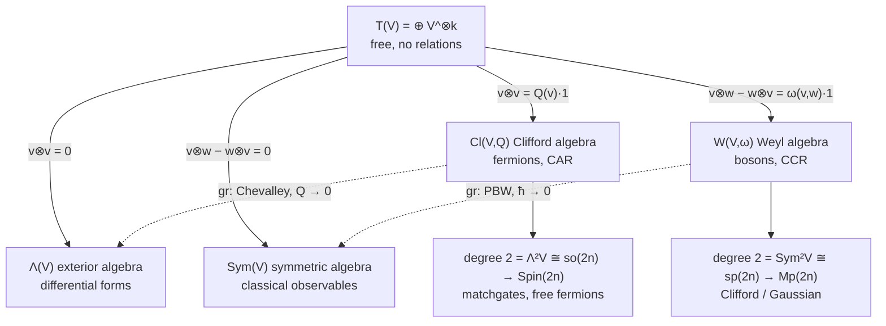

# Heisenberg-Weyl & Tensor Algebra

Alexander Del Toro Barba, PhD. [Google Scholar](https://scholar.google.com/citations?hl=en&user=fddyK-wAAAAJ) $\cdot$ [LinkedIn](https://www.linkedin.com/in/deltorobarba/)

> **Core message.** Every quantum gate is a time evolution $U = e^{-i\hat Ht}$. The physical and information-theoretic complexity of the gate is determined by the **polynomial degree of the generator $\hat H$ in the phase-space operators $\hat Q, \hat P$**, and the criterion behind the ladder is whether that degree still **closes under the commutator**. Degree 1: displacements (Pauli / Heisenberg-Weyl). Degree 2: Gaussian / Clifford, classically simulable. Degree $\geq 3$: non-Gaussian / non-Clifford, universal, quantum advantage.

## 1. Physics: the Quantum Harmonic Oscillator as Source of All Operators

$$\hat H \propto \hat P^2 + \hat Q^2 = \hbar\omega\left(\hat a^\dagger\hat a + \tfrac12\right) = \hbar\omega(\hat n + \tfrac12)$$

**Why the QHO is *the* starting point.** Analytically, every smooth potential near a minimum is quadratic (Taylor), so the QHO is the universal local model of any bound system. Algebraically, $\hat Q^2 + \hat P^2$ is *the* canonical degree-2 element of the Weyl algebra ($\mathrm{Sym}^2 V \cong \mathfrak{sp}$), the bosonic counterpart of the Dirac operator. Everything below is this one generator, read at different degrees.

* **Time evolution = swap kinetic $\leftrightarrow$ potential.** At $t=0$ the state sits in $Q$; after $t = \frac{\pi}{2\omega}$ it has rotated $90°$ into $P$. **That quarter turn is the QFT.**
* **Why complex numbers.** $\hat a \propto \hat Q + i\hat P$: real axis = position, imaginary axis = momentum, rotation $e^{i\omega t}$ = time. Two real numbers become one complex amplitude $\alpha = x + ip$; rotation preserves magnitude (unitary).
* ⚠️ **Position basis = computational basis.** $|k\rangle$ are eigenstates of $\hat Q$. Hence $Z$ (diagonal) is a function of position, $X$ (permutation) a function of momentum.
* **Time is an angle.** In $\hat U(t) = e^{-i\hat Ht/\hbar}$ the exponent is dimensionless. States do not move along trajectories; their phase rotates, in an eigenstate at $\omega = E/\hbar$.
* ⚠️ **Two families of *states*, not gates:** coherent states $|\alpha\rangle = \hat D(\alpha)|0\rangle$ (eigenstates of $\hat a$, overcomplete, degree-1 output) vs. Fock states $|n\rangle$ (eigenstates of $\hat n$, orthonormal, eigenbasis of the degree-2 generator).

### Exponentiation produces the gates

$$\hat U = e^{-i\hat G\theta}$$

$e^{i\theta}$ keeps it unitary, $\hat G$ is the transformation, $\theta$ scales it. If $\hat G = \hat H$, then $\theta = t/\hbar$: $\hat H$ *is* time evolution. The generator is built from $\hat Q, \hat P$ for CV, or from $X, Z$ mod $d$ for qudits, on top of the CCR $[\hat x,\hat p] = i\hbar$.

* **Gaussian (linear)**: generator of degree $\leq 2$. ⚠️ "Linear" refers to the *Heisenberg action* $U^\dagger \hat r U = S\hat r + d$, not to the generator. Symplectic structure preserved.
* **Non-Gaussian (non-linear)**: degree $\geq 3$. The Heisenberg action itself becomes nonlinear ($\hat p \to \hat p - 3\gamma t \hat q^2$), the Wigner function goes negative.

### The conjugate relation

An operator generates the translation of its conjugate variable. This is what allows the basis change $X \leftrightarrow Z$ via Fourier transform, and underlies $D_{q,p} = \tau^{qp} X^q Z^p$. Continuous: $[\hat x, \hat p] = i\hbar$. Discrete: Weyl relation $ZX = \zeta_d XZ$.

**Notation.** $\zeta_d = e^{2\pi i/d}$ is the primitive $d$-th root of unity; $\tau = e^{i\pi/d}$ is the half-phase, $\tau^2 = \zeta_d$. ⚠️ Many texts write $\omega$ for $\zeta_d$, but $\omega$ is already the oscillator frequency and the symplectic form here.

### Dictionary: from energy term to gate

The energy terms are quadratic, but the **gates** exponentiate the *linear* parts $\hat P$ and $\hat Q$.

| | **Kinetic energy $\hat P^2$** | **Potential energy $\hat Q^2$** |
| --- | --- | --- |
| **CV observable** | $\hat P = \frac{i}{\sqrt2}(\hat a^\dagger - \hat a)$, derivative $\approx i(X^\dagger - X)$ | $\hat Q = \frac{1}{\sqrt2}(\hat a + \hat a^\dagger)$, real eigenvalues (location $k$) |
| **Lattice term** | Hopping / Laplacian $\approx X + X^\dagger$ (Google OTOC) | On-site potential (diagonal) |
| **Qudit gate** | **Shift** $X^a\vert{}j\rangle = \vert{}j+a \bmod d\rangle$, eigenvalues powers of $\zeta_d$ | **Clock** $Z^b\vert{}k\rangle = \zeta_d^{bk}\vert{}k\rangle$, phase gradient on the unit circle |
| **Qubit gate** | **Pauli $X$**, bit flip, $\zeta_2 = -1$ | **Pauli $Z$**, phase flip, $(-1)^j$. Unitary *and* Hermitian, so directly observable |
| **Matrix** | Real, off-diagonal permutation of 0s and 1s | Diagonal, complex phases; for $d>2$ unitary but not Hermitian |
| **Gate as exponential** | $X \approx e^{-i\hat P\delta}$ | $Z \approx e^{i\hat Q\delta}$ |
| **Conjugation twist** | $X$ *represents* momentum but *generates* a position shift: $D_{q,0} \sim X^q$ | $Z$ *represents* position but *generates* a momentum kick: $D_{0,p} \sim Z^p$ |

$X = \mathrm{DFT}^\dagger\, Z\, \mathrm{DFT}$: in the momentum basis the shift is diagonal and looks like the clock.

## 2. Groups: the Degree Ladder from Heisenberg-Weyl Algebra to Quantum Gates

| | **Degree 1: Displacements** | **Degree 2: Gaussian / Clifford** | **Degree $\geq 3$: Non-Gaussian / Non-Clifford** |
| --- | --- | --- | --- |
| **Generator** | $\hat H = q\hat P - p\hat Q$ | $\hat Q^2 + \hat P^2$, $\hat Q^2 - \hat P^2$, $\hat Q_1\hat P_2$ | $\hat Q^3$, $\hat n^2 \sim (\hat Q^2 + \hat P^2)^2$, many-body |
| **Lie algebra** | ✅ Heisenberg $\mathfrak{h}_n$, $\dim 2n+1$, $[\hat Q,\hat P]$ central | ✅ Symplectic $\mathfrak{sp}(2n,\mathbb{R})$, with degree 1: $\mathfrak{sp}(2n) \ltimes \mathfrak{h}_n$ | ❌ Does not close: cubic $\to$ quartic $\to$ quintic $\to \dots$, infinite-dimensional |
| **Action on phase space** | *Slide* to $(q,p)$, no rotation, no shape change | *Linear* map $U^\dagger \hat r U = S\hat r$, $S \in \mathrm{Sp}(2n)$: rotations, shears, entanglement | *Curved* nonlinearly, falls out of $\mathrm{Sp}(2n)$ |
| **CV** | $\hat D(\alpha) = e^{\alpha\hat a^\dagger - \alpha^*\hat a}$ | Metaplectic $\mathrm{Mp}(2n)$: rotator, squeezer, beam splitter, shear | Cubic phase $e^{i\gamma\hat Q^3}$, Kerr $e^{i\chi\hat n^2}$ |
| **Discrete** | HW group: $D_{q,p} = \tau^{qp}X^qZ^p$; $d=2$: Pauli group $\mathcal{P}$ | Clifford $\mathcal{C} = \{U : U\mathcal{P}U^\dagger = \mathcal{P}\}$, $\mathcal{C}/\mathcal{P} \cong \mathrm{Sp}(2n,\mathbb{Z}_d)$: QFT, Hadamard, $S$, C-SUM/CNOT | $T$, qudit $T_d$, Toffoli, CS. In $M_d(\mathbb{C})$ but in neither HW nor Clifford |
| **Hierarchy** | $\mathcal{C}_1$, orthogonal basis of operator space | $\mathcal{C}_2$, **Gottesman–Knill**: track $2n\times 2n$ symplectic $S$ instead of $2^n$ amplitudes | $\mathcal{C}_k$ for $k\geq 3$ no longer groups; Clifford $+T$ dense in $U(2^n)$: **universal, magic starts here** |
| **Fermionic mirror** | **None.** Degree 1 closes only under the *anti*commutator; parity superselection forbids odd Hamiltonians | **Free fermions / matchgates** (Valiant): $\mathfrak{so}(2n) \to \mathrm{Spin}(2n)$, same theorem as Gottesman–Knill with $SO$/Spin instead of $Sp$/Mp | **Degree 3 missing** (parity). Non-simulability starts at **degree 4**, e.g. Hubbard $n_\uparrow n_\downarrow$ |

### Degree 1 notes

* The phase factor $\tau^{qp}$ in $D_{q,p}$ is required because $X$ and $Z$ do not commute (Aharonov–Bohm effect in phase space).
* ⚠️ **Pauli $Y$ is not independent**: $\sigma_y = i\sigma_x\sigma_z$, the $(1,1)$ point on the grid. For $d=3$ none of $XZ, XZ^2, X^2Z, \dots$ is uniquely "$Y$"; they are just the $D_{q,p}$ with $q,p \neq 0$.

### Degree 2 notes

| CV (Gaussian) | Generator | Action | Discrete (Clifford) |
| --- | --- | --- | --- |
| **Rotator** $R(\theta) = e^{-i\theta\hat n}$ | $\hat Q^2 + \hat P^2$ | Rotation; at $\theta = \pi/2$ **is** the Fourier transform | **QFT** $\vert{}j\rangle \to \frac{1}{\sqrt d}\sum_k \zeta_d^{jk}\vert{}k\rangle$, $WXW^\dagger = Z$; **Hadamard** for $d=2$ |
| **Squeezer** $\hat S(r)$ | $\hat Q^2 - \hat P^2$ | $Q \to e^{-r}Q$, $P \to e^{r}P$ | |
| **Shear** | $\hat Q^2$ | $P \to P + Q$ | **Phase gate $S$** $= \mathrm{diag}(1,i,\dots)$: $X \to Y \sim XZ$, quadratic phase $k^2$ |
| **Beam splitter** $\hat B(\theta)$ | $\hat Q_1\hat P_2 - \hat Q_2\hat P_1$ | Passive rotation between modes; $\pi/4$ = 50:50 | |
| **Squeezer + beam splitter** | | Ellipse rotated $45°$: noise correlated between axes = **entanglement** | **C-SUM / CNOT** $= e^{-i\hat Q_1\hat P_2}$: $\vert{}c\rangle\vert{}t\rangle \to \vert{}c\rangle\vert{}t\oplus c\rangle$ |

**➕ Gottesman–Knill, quantitatively.** A stabilizer state on $n$ qubits is fixed by $n$ independent commuting Paulis, stored as an $n\times 2n$ binary tableau plus phases. The CHP simulator (Aaronson, Gottesman, PRA 2004) updates it in $O(n)$ per Clifford gate and $O(n^2)$ per measurement. The group being tracked is finite: $|\mathcal{C}_n/\mathcal{P}_n| = |\mathrm{Sp}(2n,\mathbb{Z}_2)| = 2^{n^2}\prod_{j=1}^n(4^j-1) \approx 2^{2n^2+n}$, against an $\epsilon$-net of $U(2^n)$ of size $\exp(\Theta(4^n\log(1/\epsilon)))$. That ratio *is* the simulability statement: polynomially many bits describe the reachable set.

### Degree $\geq 3$ notes

* **Cubic phase** turns a coherent-state circle into a "banana" with negative Wigner regions, the signature of non-classicality. **Kerr** (quartic) builds cat states, the basis of bosonic codes.
* **$T$ gate** $= e^{-i\frac{\pi}{8}\hat Z}$ is the cubic phase mod 2. Qudit analogue $T_d|k\rangle = \zeta_d^{k^3}|k\rangle$, exactly like $V(\gamma) = e^{i\gamma\hat x^3}$.
* ⚠️ The HW language stays formally valid (one *can* write $T$ as a Pauli sum), but the number of terms grows under nesting. That is precisely where classical simulation breaks down.
* **➕ The Clifford hierarchy, defined.** $\mathcal{C}_1 = \mathcal{P}$, $\mathcal{C}_k = \{U : U P U^\dagger \in \mathcal{C}_{k-1}\ \forall P\in\mathcal{P}\}$ (Gottesman, Chuang, Nature 1999). $T \in \mathcal{C}_3$, and a gate in $\mathcal{C}_k$ can be teleported using a resource state plus Clifford corrections from level $k-1$, which is the operational reason $T$ is the canonical "one step beyond". For $k\geq 3$ the sets are not groups (closure under products fails), matching the non-closing Lie bracket in the table above.
* **➕ How expensive is a $T$ gate, classically?** The **stabilizer rank** $\chi$ of $|T\rangle^{\otimes t}$ is the minimal number of stabilizer states in a decomposition; Bravyi–Gosset (PRL 2016) gave $\chi \lesssim 2^{0.47t}$, improved to $\approx 2^{0.396t}$ by Bravyi, Browne, Calpin, Campbell, Gosset, Howard (Quantum 2019). Simulation cost is polynomial in $n$ and in $\chi$, so exponential only in the *count of magic gates*, not in the qubit number. The CV mirror: Gaussian circuits are simulable (Bartlett, Sanders, Braunstein, Nemoto, PRL 2002), and quasiprobability sampling (Pashayan, Wallman, Bartlett, PRL 2015) costs exponential in the total Wigner negativity, i.e. in the non-Gaussian budget. **Magic state distillation** (Bravyi, Kitaev, PRA 2005) is the fault-tolerant inverse: many noisy $|T\rangle$ states plus Clifford operations yield a cleaner one, which is why $T$-count is the resource accounting unit of fault-tolerant compilers.

## 3. Tensor Algebra $T(V)$: One Recipe, Four Algebras

*The recipe: quotient the tensor algebra by a two-sided ideal generated in degree 2. The knob: the **parity of the bilinear form** in that ideal (symmetric $Q$ or antisymmetric $\omega$), plus whether you switch its value on at all.*

*Solid arrows: quotient by the ideal on the label (upper two homogeneous, lower two inhomogeneous, i.e. quantized). Dashed arrows: the associated-graded functor, dequantization. Note the parity crossing: the symmetric form lands in the exterior square, the antisymmetric form in the symmetric square.*

| | **Symmetric form $Q$** | **Antisymmetric form $\omega$** |
| :--- | :--- | :--- |
| **Form off** (classical) | $\Lambda(V)$, exterior | $\mathrm{Sym}(V)$, symmetric |
| **Form on** (quantized) | $\mathrm{Cl}(V,Q)$, **fermions**, CAR | $W(V,\omega)$, **bosons**, CCR |

**Step 0, the source.** $T(V) = \bigoplus_k V^{\otimes k}$, associative, non-commutative, no relations. Every relation below is introduced by hand as the generator of an ideal; all four algebras are $T(V)/I$ and differ only in $I$.

**Step 1, homogeneous ideal (degree 2 $= 0$).**
* $\Lambda(V) = T(V)/\langle v\otimes v\rangle \Rightarrow v\wedge w = -w\wedge v$: differential forms, cohomology.
* $\mathrm{Sym}(V) = T(V)/\langle v\otimes w - w\otimes v\rangle \Rightarrow vw = wv$: polynomials, classical observables on phase space.
* The $\mathbb{Z}$-grading survives; these are $\mathrm{Cl}$ with $Q=0$ and $W$ with $\omega = 0$.

**Step 2, switch the form on (right-hand side becomes a number: this is quantization).**
* $\mathrm{Cl}(V,Q) = T(V)/\langle v\otimes v - Q(v)\mathbf{1}\rangle \Rightarrow vw + wv = 2Q(v,w)$: a vector squares to its length.
* $W(V,\omega) = T(V)/\langle v\otimes w - w\otimes v - \omega(v,w)\mathbf{1}\rangle \Rightarrow [v,w] = \omega(v,w)$: the commutator is a number, $[\hat q,\hat p] = i\hbar\mathbf{1}$.
* ⚠️ The ideal is now **inhomogeneous** (degree 2 mixed with degree 0), so the $\mathbb{Z}$-grading collapses to a **filtration**. *Grading $\to$ filtration is what quantization means algebraically.*
* ⚠️ The deformation changes the product, not the space: $\Lambda(\mathbb{R}^2)$ and $\mathrm{Cl}(\mathbb{R}^2,Q)$ share the basis $\{1, e_1, e_2, e_1e_2\}$ with different multiplication tables; PBW monomials $\hat q^a\hat p^b$ are a basis of both $\mathrm{Sym}$ and $W$.

**⚠️ The twist: parity flips between input and output.**
* Symmetric input $g$ builds $\mathrm{Cl}(V,g)$, whose degree-2 part is the **exterior** square $\mathfrak{so} \cong \Lambda^2 V$ (via $\frac14[e_i,e_j]$) $\to$ Spin $\to$ **fermions**.
* Antisymmetric input $\omega$ builds $W(V,\omega)$, whose degree-2 part is the **symmetric** square $\mathfrak{sp} \cong \mathrm{Sym}^2 V$ (via $\frac12\{\hat r_i,\hat r_j\}$) $\to$ metaplectic $\to$ **bosons**.
* The labels cross. In supersymmetry both are one construction on $\mathbb{Z}_2$-graded spaces.

**Step 3, the way back ($\mathrm{gr}$): dequantization keeps only the top-degree part of each relation.** $\mathrm{gr}\,\mathrm{Cl}(V,Q) \cong \Lambda(V)$ (**Chevalley**, $Q \to 0$) and $\mathrm{gr}\,W(V,\omega) \cong \mathrm{Sym}(V)$ (**PBW**, $\hbar \to 0$). ⚠️ These are **one theorem**: super-PBW on $\mathbb{Z}_2$-graded spaces *is* Chevalley.

**Second road, the Lie route.** $U(\mathfrak{g}) = T(\mathfrak{g})/\langle x\otimes y - y\otimes x - [x,y]\rangle$ has the same shape of ideal (hence "PBW deformation"). Bosonic: $A_n = U(\mathfrak{h}_n)/(Z-1)$, where $U(\mathfrak{h}_n)$ supplies the products that the Lie algebra $\mathfrak{h}_n$ alone lacks. Fermionic: $\mathrm{Cl}(V,Q) = U(\mathfrak{h}^{\mathrm{super}})/(Z-1)$ with anticommutator bracket.

### What each side becomes

| | **Fermions: $\mathrm{Cl}(V,Q)$** | **Bosons: $W(V,\omega)$** |
| --- | --- | --- |
| **Statistics** | CAR $\{a_i,a_j^\dagger\} = \delta_{ij}$, $\{\gamma_\mu,\gamma_\nu\} = 2g_{\mu\nu}$ | CCR $[a_i,a_j^\dagger] = \delta_{ij}$, $[\hat x,\hat p] = i\hbar$ |
| **Size** | $\dim = 2^n$, the relation truncates powers | $\dim = \infty$, nothing truncates. **No finite-dimensional rep**: $\mathrm{tr}[A,B] = 0$ but $\mathrm{tr}(i\hbar\mathbf{1}) \neq 0$ |
| **Uniqueness** | Unique spinor module | **Stone–von Neumann** |
| **Canonical degree-2 square** | Dirac $\nabla = d + \delta$, $\nabla^2 = \Delta$ | Oscillator $H = \frac12(\hat p^2 + \hat q^2)$; Moyal star product |
| **Symmetry tower** | $\mathrm{O}(V,g) \supset \mathfrak{so}(n)$, $\dim \frac{n(n-1)}{2}$, $B_n/D_n$, cover $\mathrm{Spin}(n)$ | $\mathrm{Sp}(2n) \supset \mathfrak{sp}(2n)$, $\dim n(2n+1)$, $C_n$, cover $\mathrm{Mp}(2n)$ |
| **QC bridge** | Matchgates / free fermions = rotor in $\mathrm{Spin}(2n)$; non-free from **degree 4** | Clifford / Gaussian = symplectic action; magic from **degree 3** |

⚠️ The QC bridge is **structurally one theorem**, once for $SO$/Spin, once for $Sp$/Mp. The size asymmetry is the sharpest difference: bosons need unbounded operators on infinite-dimensional space, fermions act on a finite spinor space.

## 4. From Weyl Algebra to Heisenberg-Weyl: How Bosons Reach Actual Qubits

| | **Continuous** | **Discrete** |
| --- | --- | --- |
| **Additive** (Lie bracket) | Weyl algebra $A_n = W(V,\omega)$: all polynomials in $\hat q,\hat p$, home of Hamiltonians and the degree filter | ⚠️ **Does not exist.** Trace argument: $\mathrm{Tr}([\hat q,\hat p]) = 0$ but $\mathrm{Tr}(i\hbar\mathbf{1}) = i\hbar d \neq 0$ |
| **Multiplicative** (operator product) | Heisenberg group $H_n$ / CCR $C^*$-algebra: $W(z)W(z') = e^{-\frac{i}{2}\omega(z,z')}W(z+z')$, linked to $A_n$ by Stone–von Neumann | HW algebra $M_d(\mathbb{C}) \cong \mathbb{C}_\omega[\mathbb{Z}_d \times \mathbb{Z}_d]$, spanned by the $d^2$ matrices $X^qZ^p$ |

**Why exponentiating rescues what the additive box forbids: trace vs. determinant.** At group level the test uses $\det$: $\det(ZXZ^{-1}X^{-1}) = 1$ must equal $\det(\zeta_d\mathbf{1}) = \zeta_d^d = 1$ ✓. The additive constraint is *unsatisfiable*, the multiplicative one *automatically satisfied*. That is why $ZX = \zeta_d XZ$ exists in exact $d\times d$ matrices, and that is the whole route from Weyl algebra to Heisenberg-Weyl.

**Moving between the boxes.** Up: $\mathfrak{h}_n \xrightarrow{\exp} H_n$ (BCH terminates because $[\hat Q,\hat P]$ is central; the additive bracket becomes a multiplicative phase). Down: differentiate at the identity. Sideways: $G \xrightarrow{\mathrm{span}} M_d(\mathbb{C})$ (group algebra, *not* $\exp$; ⚠️ algebras are not exponentiated). Limit $d \to \infty$ turns $ZX = \zeta_d XZ$ back into $[\hat Q,\hat P] = i\hbar\mathbf{1}$.

**➕ Stone–von Neumann, stated.** Every irreducible, strongly continuous unitary representation of the Weyl relations $W(z)W(z') = e^{-\frac i2\omega(z,z')}W(z+z')$ for *finitely many* degrees of freedom is unitarily equivalent to the Schrödinger representation on $L^2(\mathbb{R}^n)$. Consequences: (i) position and momentum representations are the same physics in different coordinates, and the Fourier transform is the intertwiner; (ii) the discrete analogue is unique in the same way: $M_d(\mathbb{C})$ has, up to equivalence, one irreducible representation of $ZX = \zeta_d XZ$, which is why "the" qudit clock and shift are canonical. ⚠️ The theorem **fails** for infinitely many degrees of freedom (quantum field theory, thermodynamic limit): inequivalent representations exist, which is Haag's theorem and the origin of superselection sectors. The finite-$n$ uniqueness is what makes phase-space methods and the degree ladder unambiguous.

## 5. The Symplectic Form

A **form** evaluates to a scalar: $0$-form = function, $1$-form = covector, $2$-form = bilinear form. Differential forms $\Omega^k(M) = \Gamma(\Lambda^k T^*M)$ integrate over oriented submanifolds without coordinates ($1$-forms over curves: work; $2$-forms over surfaces: flux).

The **symplectic form $\omega$** is a $2$-form with three properties. **Alternating**: pointwise antisymmetric. **Closed** ($d\omega = 0$): no local curvature invariants (Darboux). **Non-degenerate**: forces **even dimension** $2n$ (positions paired with momenta) and yields the non-vanishing **Liouville volume form** $\omega^n$.

**➕ Two consequences used elsewhere in this document.** *Darboux:* locally every symplectic manifold looks like $(\mathbb{R}^{2n},\sum_i dq_i\wedge dp_i)$, so there are no local invariants and the only structure a Gaussian/Clifford operation can preserve is $\omega$ itself; that is why $\mathrm{Sp}(2n)$ (continuous) and $\mathrm{Sp}(2n,\mathbb{Z}_d)$ (discrete, $\omega(z,z') = qp' - q'p \bmod d$) are the structure groups of degree 2. *Liouville:* $\omega^n$ is preserved by Hamiltonian flow, and its quantum shadow is unitarity; the Wigner function of the Quantum Learning part is exactly a density on this volume form, and Hudson's theorem says that degree $\leq 2$ dynamics keep it a probability density.
