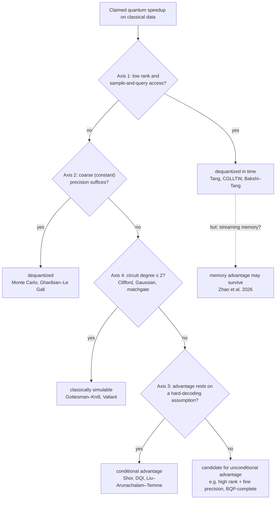

## QML on Classical Data: Dequantization vs. Genuine Quantum Advantage

### Separation: Classical vs. Quantum Data

|  | Classical Learners | Quantum-Enhanced Learners |
| --- | --- | --- |
| **Classical Data** | Classical ML (deep learning, classical kernels, boosting) | **"QML on classical data":** feature maps, variational quantum classifiers (VQCs), quantum kernels |
| **Quantum Data**<br>

<br>(copies of unknown $\rho$ / quantum channels) | **Measurement protocol + classical statistics:** classical shadows, randomized benchmarking, Bell sampling + classical decoders | **Quantum-memory protocols:** coherent multi-copy / two-copy joint measurements, quantum principal component analysis |

* **Fragility of the Top Row (Classical Data):** Advantage claims are fragile. Classical ML equipped with sufficient training data catches up with quantum-enhanced models on classical tasks, even when the underlying label-generating process is not classically simulable in polynomial time (Huang et al., *Power of Data*, Nat. Commun. 2021).
* **Proven Separations in the Bottom Row (Quantum Data):** Proven, unconditional exponential separations reside exclusively in the bottom row (Huang et al., *Science* 2022), complete with direct experimental hardware demonstrations.

#### Three Litmus Tests Separating the Rows

1. **Locus of the Unknown:** Does the target entity live as a discrete classical dataset (CSV file, bitstring table) or as a physical density operator $\rho$ in an unobserved Hilbert space?
2. **Copy Complexity as Physical Cost:** Can the data be duplicated freely at zero marginal cost, or does nature charge an explicit physical budget for every copy consumed?
3. **Binding Information-Theoretic Bounds:**
* **No-Cloning Theorem:** No completely positive trace-preserving (CPTP) map can perform the transformation $\rho \mapsto \rho \otimes \rho$. Available copies act as a consumable, non-renewable resource budget.
* **Holevo's Theorem:** An $n$-qubit state can convey at most $n$ classical bits of accessible information to any measurement apparatus, strictly bounding what a single measurement shot can extract.
* **Gentle Measurement Lemma** (Winter 1999; Aaronson 2004): An operation that accepts a quantum state with probability $\geq 1 - \epsilon$ perturbs the underlying state by at most $O(\sqrt{\epsilon})$ in trace distance. This allows an ensemble of near-deterministic questions to be evaluated sequentially on the same physical copies.

None of these physical constraints bind classical datasets. Classical measurement theory addresses the single-shot physical perturbation of a measurement on a state; quantum learning theory solves the inverse statistical problem: the Born rule turns the quantum state into a sampling oracle, and learning is the reconstruction of the generator from measurement statistics.

---

### Dequantization vs. Genuine Advantage: A Decision Framework

> **Guiding Principle:** Quantum advantage survives exactly when no efficient classical representation captures the underlying computation. Classical shortcuts can emerge along four mutually independent axes: input access, numerical precision, cryptographic problem hardness, or circuit algebraic structure. "Dequantization" denotes finding that exact shortcut.

**Scope and Boundary:** This framework governs the *top row* of the data-versus-learner matrix (classical data processed by classical or quantum-enhanced learners). Learning from quantum data (copies of $\rho$, black-box unitaries, unknown dynamics) is governed by separate information-theoretic bounds. The defining boundary is the **access model**, not the algorithmic technique: an investigation belongs to the top row if the underlying ground truth is classical, data replication is free, and No-Cloning/Holevo bounds do not limit learning. Performing classical shadows or Bell-basis measurements on a *self-prepared* state represents the readout of one's own model and does not elevate a problem into the bottom row.



*Every "yes" constitutes a theorem-grade dequantization, except on Axis 3, where a "yes" downgrades the claim from unconditional to conditional. The dashed branch highlights that an algorithm dequantized in time can retain an exponential quantum advantage in streaming memory.*

---

### Tang's Finding: Speedups Rooted in the Input Model

Whenever a quantum algorithm achieves exponential speedup over classical algorithms by exploiting low-rank matrix structure under quantum RAM (QRAM) state preparation, an equivalent classical algorithm with **sample-and-query (SQ) access** (the classical analogue of QRAM data loading) can solve the problem in polynomial time. QRAM-based QML speedups (recommendation systems, PCA, SVMs, semidefinite programming, low-rank matrix inversion) were artifacts of the input loading model rather than quantum propagation:

* **Tang (STOC 2019):** Dequantized the Kerenidis–Prakash recommendation algorithm, establishing the $\ell^2$-norm randomized sampling technique.
* **Tang (PRL 2021):** Demonstrated that quantum PCA and low-rank clustering owe their apparent exponential speedups entirely to state-preparation assumptions.
* **Chia, Gilyén, Li, Lin, Tang, Wang / CGLLTW (STOC 2020 / JACM 2022):** Formulated a classical analogue of the Quantum Singular Value Transformation (QSVT) using randomized sublinear matrix arithmetic, dequantizing the entire low-rank QSVT class simultaneously.
* **Bakshi & Tang (SODA 2024):** Derived the quantitatively optimal classical singular value transformation, reducing classical query and runtime bounds down to small polynomial overheads.
* **Precursors and Structural Roots:** The primary algorithm dequantized along this track is HHL (Harrow, Hassidim, Lloyd, PRL 2009) and its low-rank variant by Kerenidis & Prakash (ITCS 2017). Tang formalized the caveats identified in Aaronson's "Read the fine print" (Nat. Phys. 2015): state preparation, state readout, matrix condition number $\kappa$, and precision $\epsilon$ represent four loci where exponential speedups evaporate. Tang’s Axes 1 and 2 turn two of Aaronson’s four caveats into rigorous no-go theorems.

---

### The Four Axes: Where the Shortcut Lurks

| Axis | Dequantizable / Simulable Regime | Resistant / Genuine Advantage Regime | Primary Analytical Tool or Limit | Status of Resistance |
| --- | --- | --- | --- | --- |
| **1: Access Model** (QSVT family) | Low rank + Sample-and-Query (SQ) access | High effective matrix rank (sparse HHL framework) | $\ell^2$-norm matrix sampling (Tang, CGLLTW, Bakshi–Tang) | **Unconditional** (theorem) |
| **2: Precision** (QSVT family) | Coarse relative precision ($\epsilon = O(1)$) | Inverse-polynomial fine precision; BQP-complete instances | Classical Monte Carlo methods (Gharibian & Le Gall) | **Unconditional** (BQP-completeness) |
| **3: Hardness Assumption** (Fourier family) | Classically decodable structures or featureless random landscapes | Hidden algebraic structure coupled with classically hard decoding (Shor, DQI) | Algebraic coding theory, lattice cryptography, Pontryagin duality | **Conditional** (conjectured cryptographic hardness) |
| **4: Circuit Structure** (Operator ladder) | Degree $\leq 2$ generators: Clifford, Gaussian, free fermions | Degree $\geq 3$ generators: magic gates, non-Gaussianity, $T$-count | Stabilizer tableau, matchgate Pfaffians (Gottesman–Knill, Valiant) | **Unconditional** (theorem) |

Axes 1 and 2 govern linear-algebraic workflows (the QSVT family); Axis 3 governs representation theory (the Fourier family); Axis 4 governs the intrinsic algebraic generator degree of the quantum circuit.

#### Necessary and Sufficient Conditions (Axes 1 & 2)

* High rank is necessary but insufficient on its own (sparse matrices with coarse precision remain classically simulable via Monte Carlo sampling).
* Fine precision is necessary but insufficient on its own (low-rank systems with fine precision are solvable via classical randomized SVD sketches).
* Only the **conjunction of high effective rank and fine numerical precision** is sufficient to resist classical dequantization, reaching full BQP-completeness in the **guided local Hamiltonian problem** (Gharibian & Le Gall, STOC 2022). This quantum hardness holds even for 2-local Hamiltonians and with guiding state overlaps up to $1 - 1/\mathrm{poly}(n)$. Thus, even a nearly perfect guiding state cannot rescue classical simulators; the speedup resides in fine spectral transformations rather than state preparation alone.

#### Distinct Logic of Axis 3

Shor's algorithm and Decoded Quantum Interferometry (DQI; Jordan et al., Nature 2025) share an underlying mathematical skeleton: a representation-theoretic transformation (the Quantum Fourier Transform, QFT) maps a globally hidden algebraic invariant onto a dual support that can be sampled (hidden subgroup and Pontryagin duality for Shor; linear codes for DQI). The computational advantage rests on the classical intractability of decoding that algebraic structure.

Unlike Circuit Magic (Axis 4), Axis 3 exhibits two distinguishing properties:

1. **Non-Monotonicity (The Goldilocks Dilemma):** Too little algebraic structure yields unlearnable, featureless landscapes; excessive algebraic structure renders the problem classically decodable (Anschuetz, Gamarnik, Lu, *DQI requires structure*, 2025).
2. **Conditional Hardness:** Advantage rests on computational complexity conjectures (e.g., hardness of discrete logarithms, Shortest Vector Problem) rather than unconditional structural theorems. Hence, while a Clifford circuit remains classically simulable under all circumstances, DQI's advantage fluctuates with classical decoding advances.

* **The QML Archetype of Axis 3:** Liu, Arunachalam, and Temme (Nat. Phys. 2021) constructed a supervised classification task based on the discrete logarithm problem. They designed an efficiently computable quantum kernel that classifies data provably faster than any classical learner (operating on data, without an oracle), unless the classical learner can efficiently compute discrete logs. This provides an existence proof for a top-row quantum learning advantage while illustrating the Goldilocks limitation: the algebraic symmetry is synthetically planted, and no natural dataset is known to exhibit this structure. Lewis, Gilboa, and McClean (Nat. Commun. 2026) initiated the transition from planted algebraic constructions to natural data distributions.

---

### Two Levels of Analysis: Circuit vs. Problem Interface

* **Level 1: Circuit-Internal (Simulation-Based Dequantization):** Direct simulation of the unitary dynamics using structural representations (stabilizer binary tableaus, Gaussian covariance matrices, matchgate fermionic Pfaffians).
*Three Pillars of Quantumness:*
* **Entanglement:** Quantified by Schmidt rank and matrix product state (MPS) bond dimension (Schrödinger picture).
* **Magic:** Quantified by stabilizer rank $\chi$ and extent (Heisenberg picture).
* **Fermionic Magic:** Quantified by non-Gaussian parity-violating operations.


Magic and fermionic magic follow the same algebraic generator degree ladder: quadratic generators are free; degree $\geq 3$ constitutes the non-simulable resource. Entanglement is an exception governed by tensor product factorization rather than polynomial degree, which explains why no single scalar parameter characterizes quantum complexity.
* **Level 2: Problem Interface (Algorithmic Dequantization):** Re-architecting the mathematical solution from the outside without simulating circuit trajectories (e.g., Tang’s $\ell^2$-sampling constructs low-rank matrix approximations without tracking quantum state vectors).

The levels are **complementary rather than nested:** QRAM-based QML algorithms often feature high entanglement and high magic, yet Tang dequantized the underlying *problems*. Being low on any pillar renders a model classically simulable; being high on all pillars still does not guarantee quantum advantage.

```
       Circuit Level (Level 1)               Problem Interface (Level 2)
  [Entanglement + Magic + Non-Gaussian]   ≠   [High Rank + Fine Precision + Hard Decoding]
       (Circuit-Simulable if Low)                    (Algorithmic Dequantization if Low)

```

#### Results Constraining Level 1 Variational Models

* **Classical Surrogates** (Schreiber, Eisert, Meyer, PRL 2023): For standard data-re-uploading variational models, the expressible function class is a trigonometric polynomial whose frequency spectrum is fixed by the data encoding. Consequently, once trained, a classical surrogate model can reproduce the quantum model's predictions; the quantum processor serves at most as a training heuristic, never as an indispensable inference engine.
* **Barren Plateaus Imply Classical Simulability** (Cerezo, Larocca et al., 2023): The structural architectural traits that provably prevent barren plateaus (e.g., small dynamical Lie algebras, shallow circuit depth, strictly local cost observables) simultaneously enable polynomial-time classical simulation of the loss landscape, provided classical training data is acquired from the processor.

Trainable variational quantum models on classical data are generally classically surrogatable. This aligns Axis 4 with optimization landscapes and directs surviving quantum advantage avenues away from standard variational frameworks.

---

### Unified Theory: Tractability as Low Rank

| Theoretical Framework | Rank Metric | Low Rank $\implies$ Efficient Simulation (Theorem) |
| --- | --- | --- |
| **Axis 1 / Algorithmic (Tang)** | Matrix rank (Singular Value Decomposition) | $\ell^2$-norm subspace sampling (CGLLTW, Bakshi–Tang) |
| **Magic / Axis 4 (Qubits)** | Stabilizer rank $\chi$ | Stabilizer decompositions (Bravyi–Gosset, Bravyi et al. 2019) |
| **Entanglement / Tensor Networks** | Schmidt rank / Tensor bond dimension $D$ | Matrix Product States & Tree Tensor Networks (Vidal, Jozsa) |
| **Fermionic Magic (Fermions)** | Fermionic Gaussian rank | Pfaffian matchgate contractions (Valiant) |

These obstructions operate independently because they quantify low rank in distinct mathematical bases. For instance, QRAM-based algorithms are low in matrix rank but can be high in stabilizer rank; all configurations in the "Magic $\times$ Matrix Sketchability" parameter space can be realized.

$$\text{Low Rank in Any Decomposition} \implies \text{Classically Tractable (Proven Theorem)}$$

$$\text{High Rank Across Known Decompositions} \implies \text{Quantum Advantage (Open Conjecture)}$$

The reverse direction is not a theorem because an unknown, efficiently contractible classical basis decomposition may exist.

---

### Three Physical Resources, Three Control Knobs

Advantage is relative to the constrained resource:

| Resource Constraint | Mathematical Discriminator | Regime of Genuine Advantage | Formal Status | Landmark Reference |
| --- | --- | --- | --- | --- |
| **Time** | Matrix rank | High rank combined with fine precision (batch, queryable input) | **Theorem** (unconditional) | Tang; CGLLTW; Gharibian & Le Gall |
| **Memory** | Output dimension | Streaming data model; high-dimensional coherent state | **Theorem** (unconditional) | Zhao, Zlokapa, Neven, Babbush, Preskill, McClean, Huang (2026) |
| **Samples / Prediction** | Geometric difference $g_{CQ}$, effective dimension $d$ | High geometric distance $g$, small sample size $N$; advantage diminishes as $N \to \infty$ | Empirical / Kernel theory | Huang et al., *Power of Data* (2021) |

#### Reconciling Time and Memory: Tang vs. Preskill

Tang dequantizes computational *time* in the queryable input model, whereas Zhao et al. (2026) establish an exponential quantum advantage in *memory* within the streaming data model. Both analyze low-rank tasks like PCA, but under different resource constraints:

* In memory, quantum processors hold an advantage even in low-rank regimes because amplitude encoding stores an $N$-dimensional vector across $\log N$ qubits—a property of state space dimension rather than matrix rank.
* In time complexity, the governing question is: *"Does an $\ell^2$ sample suffice?"* In space complexity, the governing question is: *"Can a classical linear sketch (Johnson–Lindenstrauss) compress the stream?"*
* Zhao et al. prove that every super-quadratic quantum query separation implies an exponential quantum memory advantage in streaming. As a result, algorithms dequantized in time remain viable targets for exponential memory advantages.

#### Dual Origins of Quantum Memory Advantage

1. **State Complexity:** Classically exponential memory is required to store highly entangled or high-magic quantum states (quantum dynamical simulation; Axis 4; Feynman 1981).
2. **Coherent Data Compression:** Coherently sketching incoming classical data streams directly into an $n$-qubit register (oracle sketching) eliminates QRAM. Because the processor never stores the raw classical dataset, Holevo's bound does not restrict the intermediate computational state.

*Note on Axis 3:* Cryptographic hidden subgroup algorithms provide no memory advantage; Shor's algorithm requires only $O(n)$ qubits, which is already polynomial.

#### Samples vs. Memory: Resolving Top-Row Fragility

* **Batch Sample Perspective** (*Power of Data*, 2021): Given a sufficiently large classical training set $N$, classical learners catch up to quantum learners on classical data, even when class labels are generated by classically intractable circuits. The quantum advantage had to be engineered and decayed as $N \to \infty$.
* **Streaming Memory Perspective** (*Massive Classical Data*, 2026): This classical convergence implicitly assumes unbounded classical memory. Classical learners restricted to realistic memory bounds require *superpolynomially* more samples and time on real-world datasets (e.g., IMDb sentiment, PBMC single-cell RNA sequencing), and the advantage persists as $N \to \infty$.

$$\text{Top-Row Fragility Holds for Time and Sample Budgets} \quad \centernot\implies \quad \text{Holds Under Memory Constraints}$$

| Feature | *Power of Data* (Huang et al. 2021) | *Massive Classical Data* (Zhao et al. 2026) |
| --- | --- | --- |
| **Primary Metric** | Generalization prediction error at fixed sample size $N$ | Classical machine memory footprint at fixed task performance |
| **Input Architecture** | Batch access model | Streaming data model |
| **Separation Type** | Empirical; demonstrated on synthetically engineered labels | **Theorem-grade, unconditional; demonstrated on natural data** |
| **Asymptotic Limit ($N \to \infty$)** | Advantage narrows and vanishes | **Quantum memory advantage persists unconditionally** |

---

### Viable Pathways for QML on Classical Data

| Proposed Direction | Current Theoretical Status |
| --- | --- |
| **Exponential Time Speedup for Low-Rank ML via QRAM** | **Closed.** Dequantized by Tang, CGLLTW, and Bakshi–Tang. Even fault-tolerant physical QRAM hardware does not reopen this door, as classical $\ell^2$-sampling matches quantum runtimes within the idealized QRAM model. |
| **Hidden Algebraic Structures (Axis 3)** | **Open.** Provable time advantages exist in the Quantum Statistical Query (QSQ) model for specific structured function classes (Lewis, Gilboa, McClean 2026); applies to specialized algebraic tasks rather than generic tabular data. |
| **Memory Advantages in Streaming Regimes** | **Open.** Provable, unconditional exponential memory advantage on real data distributions (Zhao et al. 2026); streaming runtime remains classical $\tilde{O}(N)$. |
| **Learning from Quantum Data** | **Open.** Unconditional exponential separations in sample and time complexity (Huang et al., *Science* 2022); operates outside the top-row classical data constraint. |

#### Structural Bottlenecks for Large Language Models (LLMs) on Quantum Hardware

1. **I/O and State Preparation Bottleneck:** Loading billions of classical token parameters into quantum amplitudes requires polynomial or linear circuit depth, dissipating prospective speedups before computation begins.
2. **Nonlinear Activation Functions:** Unitary gates are strictly linear transformations. Implementing nonlinear activations (e.g., Softmax, GELU, SwiGLU) requires complex multi-ancilla block encodings or measurement-driven non-unitary subroutines that introduce significant sampling overheads.
3. **High Effective Matrix Rank:** Attention matrices and dense weight transformations in trained foundation models are generically full-rank, which prevents low-rank tensor decompositions and QSP optimizations.

Every proposed quantum advantage on classical data must pass three formal checks:

* **The Input Check:** Is input data preparation resistant to efficient classical sampling sketches?
* **The Readout Check:** Can target properties be extracted without an exponential number of projective measurement shots?
* **The Complexity Check:** Is the feature space or kernel structure classically intractable to approximate?

The readout check constrains computational time speedups, but does not eliminate coherent memory advantages in streaming environments.

---

### Summary of Core Principles

1. **Computational Incompressibility:** Quantum advantage survives if and only if no efficient classical representation (tensor network, stabilizer tableau, or low-rank sketch) can model the system.
2. **Tractability Equals Low Rank:** Efficient classical simulation is guaranteed by low rank in some representation (matrix rank, stabilizer rank, or Schmidt rank). Advantage requires irreducibly high rank across all compatible representations.
3. **Status of Resistance:** Resistance to dequantization along Axes 1, 2, and 4 is unconditional (theorems). Resistance along Axis 3 is conditional (cryptographic conjectures).
4. **Separation of Resource Knobs:** Time advantage is governed by matrix rank, memory advantage is governed by state-space dimension, and sample advantage is governed by geometric kernel difference.
5. **Status of Classical QML:** Exponential time speedups for low-rank problems via QRAM are ruled out. Provable advantages survive in structured algebraic learning (time) and streaming data compression (memory).
6. **Domain-Specific Fragility:** The classical catch-up phenomenon applies to sample and time complexity, but does not apply under strict memory bounds.
7. **Model-Centric Definition:** The operational boundary of this framework is set by the data access model, not the quantum algorithms employed.

---

### Open Research Frontiers

* **Matrix Rank vs. Stabilizer Rank Unified Algebra:** A unified mathematical framework connecting SVD matrix sketchability (Level 2) and stabilizer rank decompositions (Level 1).
* **Guided Local Hamiltonian Phase Diagram:** Mapping the complexity boundaries of the guided local Hamiltonian problem across the parameter space of relative precision, guiding state overlap, and interaction locality, specifically targeting constant additive error (chemical accuracy) in high-rank domains.
* **Space-Complexity Audit of Dequantized Algorithms:** Systematically determining which time-dequantized algorithms (e.g., SVMs, recommendation engines) maintain an exponential memory advantage in streaming environments, and which can be matched by classical linear sketches (e.g., Johnson–Lindenstrauss).
* **Memory-Bounded Generalization Theory:** Formulating a mathematical framework that bridges kernel geometric difference metrics (Huang et al. 2021) and streaming communication complexity (Zhao et al. 2026).

---

### Key Literature

* E. Tang, *"A quantum-inspired classical algorithm for recommendation systems"*, STOC 2019. [arXiv:1807.04271](https://arxiv.org/abs/1807.04271?utm_source=gemini).
* E. Tang, *"Quantum PCA only achieves an exponential speedup because of its state preparation assumptions"*, PRL 127, 060503 (2021). [arXiv:1811.00414](https://arxiv.org/abs/1811.00414?utm_source=gemini).
* N.-H. Chia, A. Gilyén, T. Li, H.-H. Lin, E. Tang, C. Wang, *"Sampling-based sublinear low-rank matrix arithmetic framework for dequantizing QML"*, STOC 2020 / JACM 2022. [arXiv:1910.06151](https://arxiv.org/abs/1910.06151?utm_source=gemini).
* A. Bakshi, E. Tang, *"An improved classical singular value transformation for QML"*, SODA 2024. [arXiv:2303.01492](https://arxiv.org/abs/2303.01492?utm_source=gemini).
* S. Gharibian, F. Le Gall, *"Dequantizing the QSVT: hardness and applications to quantum chemistry and the quantum PCP conjecture"*, STOC 2022. [arXiv:2111.09079](https://arxiv.org/abs/2111.09079?utm_source=gemini).
* S. Jordan et al., *"Optimization by Decoded Quantum Interferometry"*, Nature (2025). [arXiv:2408.08292](https://arxiv.org/abs/2408.08292?utm_source=gemini). Critique: Anschuetz, Gamarnik, Lu, *"DQI requires structure"*, [arXiv:2509.14509](https://arxiv.org/abs/2509.14509?utm_source=gemini).
* S. Bravyi, D. Gosset, *"Improved classical simulation of quantum circuits dominated by Clifford gates"*, PRL 116, 250501 (2016).
* L. G. Valiant, *"Quantum circuits that can be simulated classically in polynomial time"*, SIAM J. Comput. 31(4), 1229–1254 (2002).
* S. Aaronson, A. Ambainis, *"Forrelation: a new push towards quantum advantage"*, STOC 2015.
* H.-Y. Huang, M. Broughton, M. Mohseni, R. Babbush, S. Boixo, H. Neven, J. R. McClean, *"Power of data in quantum machine learning"*, Nat. Commun. 12, 2631 (2021). [arXiv:2011.01938](https://arxiv.org/abs/2011.01938?utm_source=gemini).
* H. Zhao, A. Zlokapa, H. Neven, R. Babbush, J. Preskill, J. R. McClean, H.-Y. Huang, *"Exponential quantum advantage in processing massive classical data"*, [arXiv:2604.07639](https://arxiv.org/abs/2604.07639?utm_source=gemini) (2026).
* L. Lewis, D. Gilboa, J. R. McClean, *"Quantum advantage for learning shallow neural networks with natural data distributions"*, Nat. Commun. 17, 1341 (2026). [arXiv:2503.20879](https://arxiv.org/abs/2503.20879?utm_source=gemini).
* J. Cotler, H.-Y. Huang, J. R. McClean, *"Revisiting dequantization and quantum advantage in learning tasks"*, [arXiv:2112.00811](https://arxiv.org/abs/2112.00811?utm_source=gemini) (2021).
* A. W. Harrow, A. Hassidim, S. Lloyd, *"Quantum algorithm for linear systems of equations"*, PRL 103, 150502 (2009).
* S. Aaronson, *"Read the fine print"*, Nat. Phys. 11, 291–293 (2015).
* Y. Liu, S. Arunachalam, K. Temme, *"A rigorous and robust quantum speed-up in supervised machine learning"*, Nat. Phys. 17, 1013–1017 (2021). [arXiv:2010.02174](https://arxiv.org/abs/2010.02174?utm_source=gemini).
* H.-Y. Huang, R. Kueng, J. Preskill, *"Information-theoretic bounds on quantum advantage in machine learning"*, PRL 126, 190505 (2021). [arXiv:2101.02464](https://arxiv.org/abs/2101.02464?utm_source=gemini).
* H.-Y. Huang et al., *"Quantum advantage in learning from experiments"*, Science 376, 1182–1186 (2022).
* F. J. Schreiber, J. Eisert, J. J. Meyer, *"Classical surrogates for quantum learning models"*, PRL 131, 100803 (2023). [arXiv:2206.11740](https://arxiv.org/abs/2206.11740?utm_source=gemini).
* M. Cerezo, M. Larocca, D. García-Martín et al., *"Does provable absence of barren plateaus imply classical simulability?"*, [arXiv:2312.09121](https://arxiv.org/abs/2312.09121?utm_source=gemini) (2023).
* S. Bravyi, D. Browne, P. Calpin, E. Campbell, D. Gosset, M. Howard, *"Simulation of quantum circuits by low-rank stabilizer decompositions"*, Quantum 3, 181 (2019).