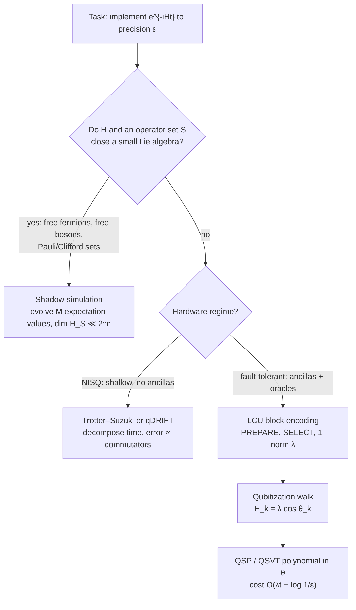
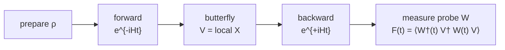

# Quantum Dynamics

Alexander Del Toro Barba, PhD. [Google Scholar](https://scholar.google.com/citations?hl=en&user=fddyK-wAAAAJ) $\cdot$ [LinkedIn](https://www.linkedin.com/in/deltorobarba/)

> **Core message.** Every simulation technique in chemistry and physics sits on three axes: **Model** (classical vs. quantum), **Type** (static vs. dynamic), **Computing** (classical vs. quantum). *Quantum dynamics* is the cell "quantum model, dynamic type", and its hard core is propagating $|\psi(t)\rangle = e^{-iHt}|\psi(0)\rangle$ in a $2^n$-dimensional Hilbert space. Static problems are **optimized** (variational principle); dynamic problems must be **propagated** (no forward theorem). On a quantum computer, propagation follows one of three structural strategies: decompose *time* (Trotter), transform the *spectrum* (Qubitization / QSVT), or shrink the *space* (Shadow Simulation).

## 1. The Map: Three Axes

* **Model:** Classical models ignore electrons and treat atoms as spheres connected by springs (force fields). Quantum models bring electrons, orbitals, and correlation into play.
* **Type:** Static (ground state, eigenvalue problem $\hat H|\psi\rangle = E|\psi\rangle$) vs. dynamic (time evolution $i\hbar\,\partial_t\Psi = \hat H\Psi$).
* **Computing:** Classical hardware vs. quantum hardware.

| Model / Computing | **Static** (state, ground state) | **Dynamic** (time evolution) |
| --- | --- | --- |
| **Classical / Classical** | **Docking, energy minimization:** geometric fitting (AutoDock, Rosetta) | **Molecular dynamics:** $F = ma$, atoms as mass points with force fields (GROMACS, NAMD, AMBER) |
| **Quantum / Classical** | **HF, DFT, Post-HF:** $\hat H\vert{}\psi\rangle = E\vert{}\psi\rangle$. HF ignores correlation, DFT approximates it via density $\rho$, Post-HF (CC, CI) is exact but exponential in $N$ | **TD-DFT:** excitations, spectra, fluorescence. Exact $e^{-i\hat Ht/\hbar}\vert{}\Psi(0)\rangle$ scales exponentially in $N$ |
| **Quantum / Quantum** | **VQE (NISQ):** correlation energy via entanglement, $\delta\langle H\rangle = 0$ | **Hamiltonian simulation:** exponentiation in $2^n$-dim Hilbert space via Trotter, Qubitization/QSVT, or Shadow Simulation |

*Perspective, not part of quantum dynamics:* quantum computers for *classical* dynamics, e.g. Navier–Stokes via HHL for linear systems, weather on a 100 m grid. Same hardware, different application.

### Static vs. dynamic: the core difference

* **Static = energy optimization.** If $\psi$ is an eigenstate of $\hat H$, time evolution is trivial, $\Psi(t) = \psi e^{-iEt/\hbar}$, and $|\Psi(t)|^2$ is constant. Finding binding energies is a search for global minima in an energy landscape (Rayleigh–Ritz, VQE).
* **Dynamic = propagation.** No variational principle, no forward theorem. Required for reaction dynamics, bond breaking during collisions, excitations, quantum chaos. One cannot optimize, one must propagate $e^{-iHt}$.
* **Fundamental axiom.** In static problems the quantum computer *stores* information. In full dynamical evolution it stores nothing: **it *is* the Hilbert space.**

## 2. Static Quantum Chemistry: the Approximation Stack

**Why only tiny systems are solvable analytically.** The Schrödinger equation is exactly solvable only for the one-electron hydrogen atom. A second electron adds Coulomb repulsion, a non-integrable three-body problem. Everything else is an approximation stack:

1. **Born–Oppenheimer:** nuclei fixed on electronic timescales, giving the potential energy surface.
2. **Rayleigh–Ritz:** minimize $\langle\psi|H|\psi\rangle$ for the ground-state energy.
3. **Correlation energy**, the actual difficulty:

| Method | Correlation | Cost |
| --- | --- | --- |
| **Hartree–Fock** | Mean field, ignores correlation | Cheap |
| **DFT** | Approximated via functionals of the electron density $\rho$ (correct functional must be assumed) | Cheap |
| **Post-HF** (Coupled Cluster, CI) | Exact | Exponential in $N$, small systems only |
| **VQE** (quantum, NISQ) | Found directly through entanglement | Central role for larger molecules where classical cost explodes |

**Chemical model frameworks.** Valence Bond (hybridization, localized pair bonds) vs. Molecular Orbital theory (delocalization, HOMO/LUMO, LCAO). Spin $m_s = \pm\frac12$ does not come from the Schrödinger equation (only $n, l, m_l$) but from combining QM with special relativity (Dirac, 1928).

**➕ Numbers and the fault-tolerant counterpart.** *Chemical accuracy* is 1 kcal/mol $\approx 1.6$ mHa $\approx 43$ meV, the precision at which room-temperature reaction rates come out right to within an order of magnitude; it fixes the $\epsilon$ in every resource estimate. *Full CI* is exact within a basis but scales as $\binom{M}{N}$ in orbitals $M$ and electrons $N$; coupled cluster CCSD(T) at $O(N^7)$ is the classical "gold standard" and fails for strongly correlated (multi-reference) systems, which is the regime the quantum case is built on. The fault-tolerant analogue of VQE is **quantum phase estimation** on a block-encoded $H$: prepare a state with non-negligible ground-state overlap, read $E_0$ off as a phase, Heisenberg-limited in oracle calls. The reference resource estimates are for FeMoco (the nitrogenase cofactor): Reiher et al. (PNAS 2017) and, with tensor hypercontraction, Lee et al. (PRX Quantum 2021), on the order of $10^6$ physical qubits and days of runtime; the estimates have fallen by orders of magnitude since 2017 mainly through better Hamiltonian representations (lower 1-norm $\lambda$), not through better hardware assumptions. ⚠️ The overlap requirement is the catch: with exponentially small overlap between guiding state and ground state, QPE is no better than classical methods, which is the *guided local Hamiltonian* thread picked up in the Dequantization part.

## 3. Dynamic Quantum Simulation on a Quantum Computer

**The problem.** The physical system evolves under all its forces (kinetic + potential) simultaneously, but hardware applies a discrete set of gates sequentially. Since $[A,B] \neq 0$, $e^{-i(A+B)t} \neq e^{-iAt}e^{-iBt}$.

| Strategy | Method | What is decomposed | Regime |
| --- | --- | --- | --- |
| **Decompose time** | Trotter–Suzuki | $t$ into $r$ slices | NISQ |
| **Transform spectrum** | Qubitization / QSVT | Energy into angle, $E_k = \lambda\cos\theta_k$ | Fault-tolerant |
| **Shrink space** | Shadow Simulation | $2^n$ amplitudes into $M$ expectation values | Both |

*The three strategies as a decision: shrink the space if the algebra allows it, otherwise choose between slicing time and transforming the spectrum according to the hardware regime.*

### 3.1 Trotterization: walk through time

$$e^{-iHt} \approx \Big(\prod_j e^{-iH_j t/r}\Big)^r$$

* Split $H = \sum_j H_j$ into easily exponentiable terms, interleave in $r$ small slices.
* **Error is a commutator.** First order leaves $\mathcal{O}(t^2/r)$, bounded by $\sum_{j<k}\|[H_j,H_k]\|$. Non-commutativity literally defines the error budget. Higher-order Suzuki formulas suppress it at the price of deeper circuits.
* **Profile.** Hardware-native, no ancillas, no oracles. Weakness: polynomial scaling in $1/\epsilon$.
* **➕ Sharper theory and a randomized cousin.** Childs, Su, Tran, Wiebe, Zhu, "Theory of Trotter error with commutator scaling" (PRX 2021): the $p$-th order error is bounded by nested commutators $\sum\|[H_{j_{p+1}},\dots[H_{j_2},H_{j_1}]]\|$, which for local Hamiltonians scales as $O(n)$ rather than the naive power of the number of terms $L$; this is why product formulas were competitive in the first realistic gate-count studies (Childs, Maslov, Nam, Ross, Su, PNAS 2018). **qDRIFT** (Campbell, PRL 2019) replaces the ordered product by sampling terms with probability $\alpha_j/\lambda$: gate count $O(\lambda^2 t^2/\epsilon)$, independent of $L$ and of commutators, at the price of a worse $\epsilon$ dependence. Rule of thumb: many small terms and modest precision favor qDRIFT; few large terms or high precision favor high-order Suzuki.

### 3.2 Qubitization: walk through the eigenvalues

* **LCU → Block Encoding.** Write $H = \sum_l \alpha_l U_l$ with 1-norm $\lambda = \sum_l|\alpha_l|$, embed $H/\lambda$ as the top-left block of a unitary $U_H$ via PREPARE and SELECT oracles.
* **Quantum walk, energy → angle.** Adding a reflection $R$ turns $W = R\cdot U_H$ into a 2D rotation on invariant subspaces with eigenvalues $e^{\pm i\arccos(E_k/\lambda)}$:

$$E_k = \lambda\cos\theta_k$$

  Scalar energy becomes phase information. Time evolution is then a polynomial in these angles via **QSP / QSVT** (Chebyshev, Jacobi–Anger), not a slicing of time.
* **Profile.** Optimal $\mathcal{O}(\lambda t + \log(1/\epsilon))$. Price: ancilla registers, controlled oracle calls, normalization $\lambda$ in the gate count.
* **OTOC.** Reversing the walk (invert reflections and oracles) measures scrambling directly via phase shifts.
* **➕ References and the lower bound.** Quantum signal processing: Low, Chuang, PRL 2017; qubitization: Low, Chuang, Quantum 2019; QSVT as the unifying framework: Gilyén, Su, Low, Wiebe, STOC 2019. The $O(\lambda t + \log(1/\epsilon))$ query count is optimal: the linear-in-$t$ part is the no-fast-forwarding theorem (Berry, Ahokas, Cleve, Sanders 2007; Atia, Aharonov, Nat. Commun. 2017 for the generic case), the additive $\log(1/\epsilon)$ is the polynomial approximation degree. ⚠️ Fast-forwarding *is* possible for special $H$ (commuting terms, quadratic fermionic, i.e. degree $\leq 2$ again), which is the same exception that makes shadow simulation work.

### 3.3 Shadow Simulation: shrink the space (Somma et al. 2024/25)

Instead of evolving $|\psi(t)\rangle$ in $2^n$ dimensions, evolve a compressed **shadow state** whose amplitudes are the expectation values of an operator set $S = \{O_1,\dots,O_M\}$ (1-RDM, 2-RDM, Pauli strings):

$$|\rho(t);S\rangle = \frac{1}{\sqrt A}\sum_{m=1}^M \langle O_m(t)\rangle\,|m\rangle$$

* **Invariance property (Theorem 1).** If $H$ and $S$ satisfy the closed Lie-algebra condition $[H, O_m] = -\sum_{m'} h_{mm'}O_{m'}$, the shadow state **itself obeys a Schrödinger equation** with an effective matrix $H_S$: $\frac{d}{dt}|\rho(t);S\rangle = -iH_S|\rho(t);S\rangle$.
* **Where the condition holds** (the same degree-2 algebras as in the operator ladder):

| System | Algebra | Operator set $S$ | Gain |
| --- | --- | --- | --- |
| Free fermions | $\mathfrak{so}(2n)$ | Majorana pairs $c_jc_k$ | $N = 2^r$ modes on $\mathcal{O}(\log N)$ qubits |
| Free bosons | $\mathfrak{sp}(2n)$ | $P_j, Q_j$ | $2^n$ coupled oscillators (generalizes Babbush et al., BQP-complete) |
| Qubits | Pauli strings, Clifford hierarchy | All $P_{ij}$ | $\vert{}\rho;S\rangle = V_S(\vert{}\psi\rangle\otimes\vert{}\bar\psi\rangle)$ via Bell-basis rotation |

* **Efficiency.** $H_S$ is evolved with QSP / block encoding. Since $\dim H_S \ll 2^n$ and $H_S$ is often very sparse, its block encoding is exponentially more compact than for $H$.
* **Heisenberg picture for free.** Two-time correlators $\langle O_1(t)O_2(t')\rangle$ encode as amplitude tensors (Theorem 2). An operator $Z(t) = \sum_m z_m(t)O_m$ becomes a state $|Z(t)\rangle \propto \sum_m z_m(t)|m\rangle$, and Hamming weights $\langle Z(t)|W|Z(t)\rangle$ give **operator spreading / OTOCs** without ever instantiating the $2^n$ space.

### 3.4 Open systems: non-unitary dynamics

Coupling to a bath or measurement apparatus dissipates energy and destroys phase coherence (**decoherence**). Evolution on $\mathcal{H}_S$ is no longer unitary but a **CPTP channel** ($\mathcal{E}\otimes\mathcal{I}_n \geq 0$). Under Born–Markov:

$$\frac{d\rho}{dt} = -i[H,\rho] + \sum_k \gamma_k\Big(L_k\rho L_k^\dagger - \tfrac12\{L_k^\dagger L_k,\rho\}\Big)$$

The first term is coherent dynamics, the dissipator carries **jump operators** $L_k$ for spin flips, photon loss, dephasing ($T_1$ amplitude damping, $T_2$ phase damping). On hardware: NISQ via Monte-Carlo wavefunction / quantum trajectories (stochastic collapses, mid-circuit resets); fault-tolerant via non-unitary block encoding, LCU, or Stinespring dilation ($U$ on system + environment).

**➕ Origins and cost.** The equation is the Gorini–Kossakowski–Sudarshan–Lindblad master equation (both 1976); it is the most general generator of a *Markovian* CPTP semigroup, and every CPTP map itself has a **Kraus form** $\mathcal{E}(\rho) = \sum_k K_k\rho K_k^\dagger$, $\sum_k K_k^\dagger K_k = \mathbb{1}$, which is what the Stinespring dilation makes unitary. Fault-tolerant simulation of Lindblad evolution is efficient: Cleve, Wang (ICALP 2017) achieve $O(t\,\mathrm{polylog}(t/\epsilon))$, matching the Hamiltonian case up to logarithms, by block-encoding the dissipator. ⚠️ Non-Markovian baths (structured spectral densities, strong coupling) fall outside this equation entirely and are an active target for quantum simulation in their own right.

## 4. Chaos, Scrambling and OTOCs

> A local operator under chaotic dynamics in the Heisenberg picture, $W(t) = e^{iHt}We^{-iHt}$, grows in three directions, each with its own metric and its own bound: **rate** $\lambda_L$ (time), **reach** $v_B$ (space), **depth** $K(t)$ (operator space). Without the Schrödinger solution $e^{-iHt}$ there is no $W(t)$ and no OTOC: chaos diagnostics *are* quantum dynamics.

**Model system.** Mixed-field Ising $H = \sum Z_iZ_{i+1} + h_x\sum X_i + h_z\sum Z_i$. The longitudinal field $h_z$ breaks integrability: $h_z = 0$ gives Poincaré recurrence and ballistic echoes, $h_z \neq 0$ gives scrambling.

### 4.1 The object: OTOC as four-point function

$$C(t) = \big\langle[W(t),V(0)]^\dagger[W(t),V(0)]\big\rangle = 2\big(1 - \mathrm{Re}\,F(t)\big), \qquad F(t) = \langle W^\dagger(t)V^\dagger W(t)V\rangle$$

* Measures how strongly two initially commuting operators **fail to commute** after time $t$. Scrambling means $F(t) \to 0$.
* **Mechanism.** $W(t)$ starts local, grows into a non-local Pauli string, reaches the site of $V$, and the commutator lifts off zero.
* **Why out-of-time-order.** The contour runs $t \to 0 \to t \to 0$. Ordinary two-point functions decay at $t_{\text{therm}}$ and are blind to scrambling.
* **Measurement (Loschmidt echo).** Forward $e^{-iHt}$, butterfly perturbation $V$ (an $X$ gate), backward $e^{+iHt}$, overlap with probe $W$. On fault-tolerant hardware: forward walk, $X$, inverse walk, since time is an angle. Verified in NMR, ion traps, superconducting chips; **Google "Quantum Echoes" (2025)** measured a second-order OTOC on Willow as verifiable quantum advantage.

*The Loschmidt-echo protocol for an OTOC: only the non-commutativity of $W(t)$ and $V$ survives the forward-backward cancellation. On fault-tolerant hardware "backward" is literally the inverse walk, since time is an angle.*

**➕ The 2025 hardware result, in numbers.** Google's "Quantum Echoes" (Abanin et al., Nature, October 2025) measured a second-order OTOC on a 65-qubit Willow processor and reported a $\sim\!13{,}000\times$ speedup over the best classical simulation on Frontier, framed as the first *verifiable* quantum advantage: unlike random circuit sampling, the OTOC value is a physical quantity that a second quantum device can reproduce, and the companion experiment ties it to an NMR molecular-structure observable. The error-mitigation strategy is the one §4.5 calls for: the constructive-interference signal is extracted against a decoherence baseline, because a bare $F(t)\to 0$ cannot distinguish scrambling from damping.

### 4.2 Three directions of growth

| Direction | Metric | Growth law | Bound / universality |
| --- | --- | --- | --- |
| **Rate** (time) | Lyapunov exponent $\lambda_L$ | $C(t) \sim \frac{1}{N}e^{\lambda_L t}$; operator size $n(t) \sim e^{\lambda_L t}$ | **MSS:** $\lambda_L \leq 2\pi/\beta$ |
| **Reach** (space) | Butterfly velocity $v_B$ | Light cone $C(t,x) \sim \frac1N\exp[\lambda_L(t - x/v_B)]$ | **Lieb–Robinson:** $\|[A(t),B]\| \leq Ce^{-\mu(d - v_{LR}t)}$, $v_B \leq v_{LR}$ |
| **Depth** (operator space) | Krylov complexity $K(t)$ | Free: $K \sim t$; integrable: $K \sim t^2$; chaotic: $K \sim e^{2\alpha t}$ | **UOGH:** $b_n \sim \alpha n$, $\alpha \leq \pi/\beta$ |

**Rate.** Semiclassical origin (Larkin–Ovchinnikov): commutator → Poisson bracket, $-\langle[x(t),p]^2\rangle \to \hbar^2 e^{2\lambda_{cl}t}$, so $\lambda_L$ is the quantum descendant of the classical Lyapunov exponent. Time scales: $t_{\text{therm}} \sim \mathcal{O}(1) < t_* \sim \lambda_L^{-1}\ln N$ (fast scrambling) $< t_K \sim e^S$ (recurrence). ⚠️ A clean exponential window needs $N \gg 1$; in short qubit chains $v_B$ is far more reliably extracted than $\lambda_L$.

**Reach.** $v_{LR}$ is a state-independent operator-norm bound; $v_B$ is state- and temperature-dependent. The speed limit shows up as the OTOC light-cone slope, as minimal circuit depth for global entanglement ($d \sim n$ in 1D, $\sqrt n$ in 2D, $\log n$ all-to-all), and in random circuits (Nahum–Vijay–Haah): ballistic front with KPZ broadening $\sigma(t) \sim t^{1/3}$, entanglement $S(t) = v_E t$ with $v_E \leq v_B$ (Mezei–Stanford).

**Depth.** Liouville–Lanczos tridiagonalizes $\mathcal{L} = [H,\cdot]$ on the Krylov chain $\mathrm{span}\{W, [H,W], [H,[H,W]],\dots\}$, $\mathcal{L}|O_n) = b_{n+1}|O_{n+1}) + b_n|O_{n-1})$; $K(t) = \sum_n n|\varphi_n(t)|^2$ is the mean position on the chain.

### 4.3 The logical stack of bounds: KMS ⇒ UOGH ⇒ MSS

$$\text{KMS analyticity in } 0 \leq \mathrm{Im}(t) \leq \beta \;\implies\; \alpha \leq \frac{\pi}{\beta} \;\implies\; \lambda_L \leq \frac{2\pi k_BT}{\hbar}$$

The **SYK model** ($N$ Majorana fermions, random four-body coupling) is solvable at large $N$, dual to JT gravity, and **saturates** the MSS bound. Black holes are the fastest scramblers in nature.

**➕ Reference stack for §4.2–4.3.** Lieb–Robinson bound: Lieb, Robinson, Commun. Math. Phys. 1972. Semiclassical OTOC: Larkin, Ovchinnikov, JETP 1969. Fast scrambling conjecture: Sekino, Susskind, JHEP 2008. Chaos bound: Maldacena, Shenker, Stanford, JHEP 2016. SYK: Kitaev, KITP talks 2015; Maldacena, Stanford, PRD 2016. Universal operator growth hypothesis and Krylov complexity: Parker, Cao, Avdoshkin, Scaffidi, Altman, PRX 2019. Random-circuit operator spreading with KPZ front: Nahum, Vijay, Haah, PRX 2018; von Keyserlingk, Rakovszky, Pollmann, Sondhi, PRX 2018. Entanglement velocity bound: Mezei, Stanford, JHEP 2017. Decoding: Hayden, Preskill, JHEP 2007; Yoshida, Kitaev, arXiv:1710.03363. Barren plateaus: McClean, Boixo, Smelyanskiy, Babbush, Neven, Nat. Commun. 2018; review Larocca et al., Nat. Rev. Phys. 2025.

### 4.4 Static fingerprints: ETH and spectral statistics

* **ETH (Srednicki):** $A_{mn} = \mathcal{A}(\bar E)\delta_{mn} + e^{-S(\bar E)/2}f_A(\bar E,\omega)R_{mn}$. A *single* chaotic eigenstate looks locally thermal; the system thermalizes locally while staying globally pure. Classification: chaotic → ETH, integrable → GGE, many-body localized → no thermalization.
* **Random matrix theory (BGS conjecture):** chaotic spectra show Wigner–Dyson level repulsion ($\langle r\rangle \approx 0.53$), integrable ones Poisson ($\langle r\rangle \approx 0.39$). The **spectral form factor** shows dip–ramp–plateau at late times $t > t_*$, where the OTOC has already saturated.

### 4.5 Scrambling vs. decoherence

| | **Unitary scrambling** | **Lindblad decoherence** |
| --- | --- | --- |
| Information | Delocalized reversibly into non-local entanglement, globally reconstructible | Dissipated irreversibly into the environment |
| Entropy | Local entropy grows, global state pure | $S_{\text{vN}}(\rho)$ grows non-unitarily |
| OTOC | $F(t) \to 0$ from genuine chaos | $F(t)$ also decays: can fake a **false $\lambda_L$** |

Error-mitigated protocols and damping corrections are essential for quantitative diagnostics. Open front: quantifying CPTP effects on OTOC measurements, and fault-tolerant simulation of Lindblad dynamics.

### 4.6 Consequences: black holes ↔ quantum computing

* **Scrambling as resource (Hayden–Preskill).** Information thrown into a scrambler can be decoded from few early radiation qubits in time $\mathcal{O}(\ln N)$. The **Yoshida–Kitaev decoder** has fidelity $\propto$ OTOC and works optimally at maximal scrambling (supported by two-copy Bell sampling).
* **Scrambling as obstacle (barren plateaus).** Full scrambling produces $t$-designs on $U(2^n)$, flattening the gradient landscape to $\mathrm{Var}[\partial_\theta E] \sim 2^{-n}$ (McClean et al.): untrained VQAs become unoptimizable. It also bounds Hamiltonian simulation at $\mathcal{O}(nt\cdot\mathrm{polylog}(1/\epsilon))$.
* **Random circuit sampling.** The Porter–Thomas distribution $P(p) \approx Ne^{-Np}$ is the static fingerprint of Haar-random unitaries. The depth to reach it is exactly the geometric scrambling time ($d \sim n$ in 1D, $\sqrt n$ on 2D chips): the Lieb–Robinson light cone traversing the processor.
